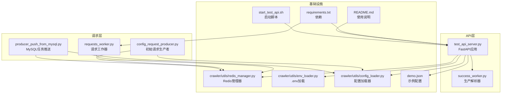
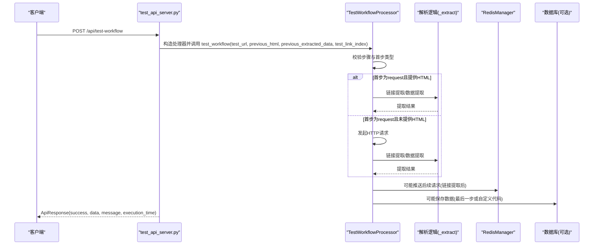
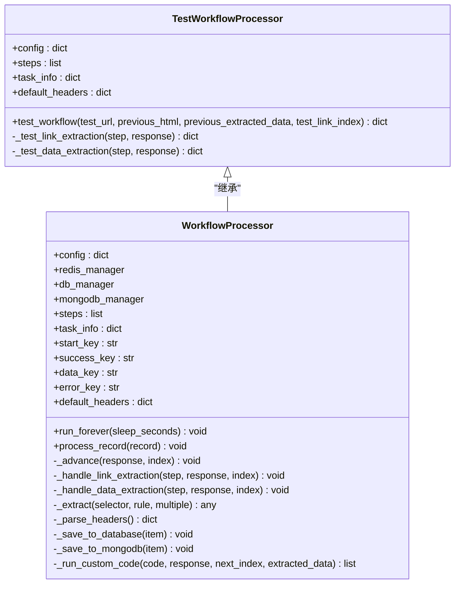
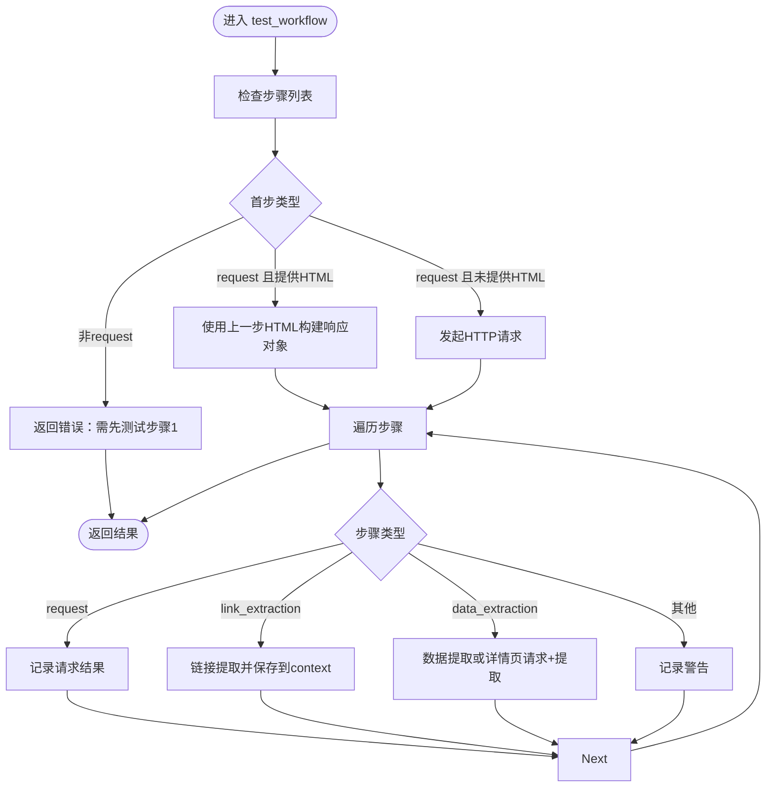
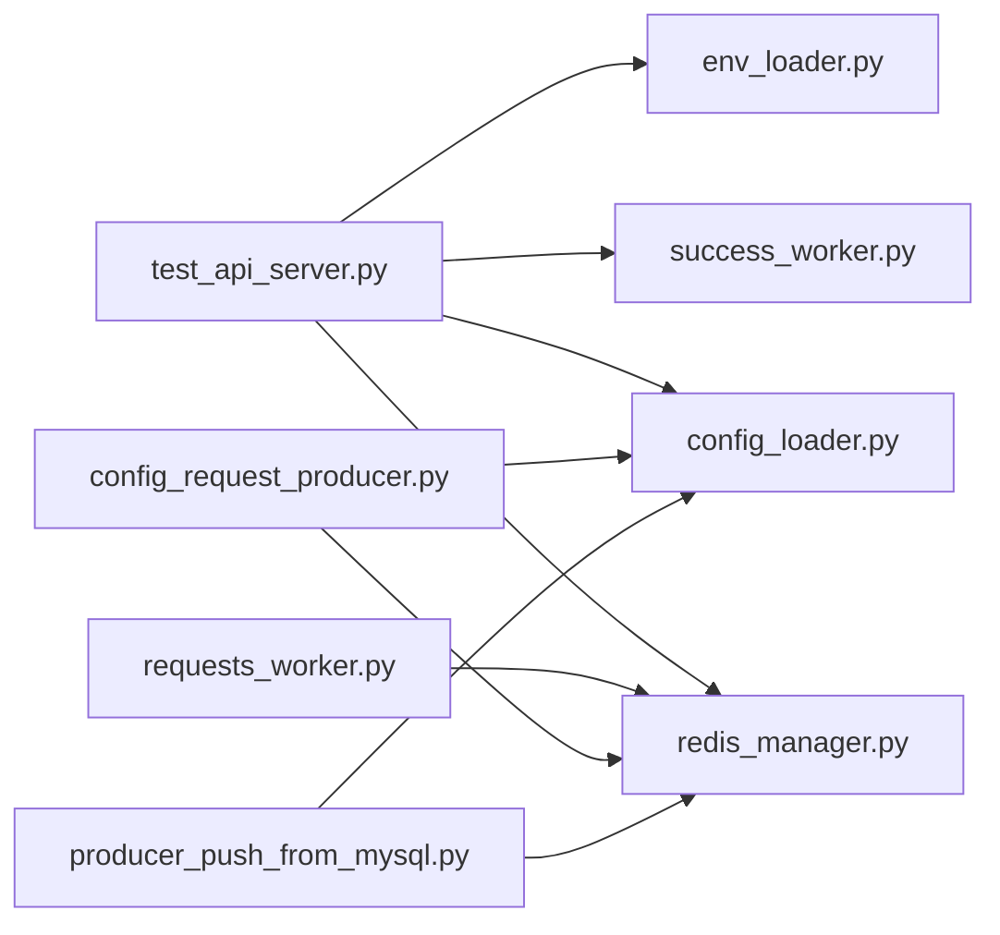

# API参考

<cite>
**本文引用的文件**
- [test_api_server.py](file://test_api_server.py)
- [success_worker.py](file://success_worker.py)
- [requests_worker.py](file://requests_worker.py)
- [config_request_producer.py](file://config_request_producer.py)
- [producer_push_from_mysql.py](file://producer_push_from_mysql.py)
- [crawler/utils/redis_manager.py](file://crawler/utils/redis_manager.py)
- [crawler/utils/env_loader.py](file://crawler/utils/env_loader.py)
- [crawler/utils/config_loader.py](file://crawler/utils/config_loader.py)
- [demo.json](file://demo.json)
- [requirements.txt](file://requirements.txt)
- [README.md](file://README.md)
- [start_test_api.sh](file://start_test_api.sh)
</cite>

## 目录
1. [简介](#简介)
2. [项目结构](#项目结构)
3. [核心组件](#核心组件)
4. [架构总览](#架构总览)
5. [详细组件分析](#详细组件分析)
6. [依赖关系分析](#依赖关系分析)
7. [性能考量](#性能考量)
8. [故障排查指南](#故障排查指南)
9. [结论](#结论)
10. [附录](#附录)

## 简介
本节聚焦“API参考”，旨在系统阐述测试接口服务（FastAPI）的目的、架构与其在整体系统中的角色，记录实现细节、配置选项与使用模式，并通过图示展示常见用例与关键流程。API参考覆盖以下方面：
- 接口目标与定位：提供独立的HTTP API，用于测试爬虫工作流配置，复用生产解析逻辑，便于前端联调与可视化调试。
- 架构与关系：与成功队列解析器（success_worker）、请求工作器（requests_worker）、配置生产者（config_request_producer）、MySQL任务推送（producer_push_from_mysql）及Redis管理器（RedisManager）的协作关系。
- 实现要点：Pydantic模型定义、请求/响应结构、错误处理、超时与重试策略、编码处理、代理支持等。
- 使用模式：单步测试与整条工作流测试，支持传入上一步HTML与提取数据，支持选择测试链接索引。
- 图表：接口序列图、类关系图、流程图，帮助快速理解。

## 项目结构
围绕API参考，涉及的关键文件与职责如下：
- test_api_server.py：FastAPI应用，提供健康检查、工作流测试、单步测试接口，内部复用解析逻辑。
- success_worker.py：生产环境的解析器，定义工作流步骤与数据落库逻辑，API测试复用其解析方法。
- requests_worker.py：请求工作器，演示与API类似的请求发送、重试、编码处理与代理支持。
- config_request_producer.py：根据配置生成初始请求并推送到Redis。
- producer_push_from_mysql.py：从MySQL读取待抓取请求并推送到Redis。
- crawler/utils/redis_manager.py：Redis统一管理器，提供连接、阻塞弹出、LPUSH/RPUSH等操作。
- crawler/utils/env_loader.py：.env文件加载工具，自动定位项目根目录并加载环境变量。
- crawler/utils/config_loader.py：配置文件加载器，校验taskInfo与workflowSteps。
- demo.json：示例工作流配置，包含请求、链接提取、数据提取三步。
- requirements.txt：运行API所需依赖（FastAPI、Uvicorn、Pydantic、requests、pyparsing等）。
- README.md：项目总体说明，包含使用方式、配置说明与测试步骤。
- start_test_api.sh：启动测试API服务的便捷脚本。

图表来源
- [test_api_server.py](file://test_api_server.py#L1-L120)
- [success_worker.py](file://success_worker.py#L1-L120)
- [requests_worker.py](file://requests_worker.py#L1-L120)
- [config_request_producer.py](file://config_request_producer.py#L1-L77)
- [producer_push_from_mysql.py](file://producer_push_from_mysql.py#L1-L90)
- [crawler/utils/redis_manager.py](file://crawler/utils/redis_manager.py#L1-L120)
- [crawler/utils/env_loader.py](file://crawler/utils/env_loader.py#L1-L63)
- [crawler/utils/config_loader.py](file://crawler/utils/config_loader.py#L1-L16)
- [demo.json](file://demo.json#L1-L181)
- [requirements.txt](file://requirements.txt#L1-L17)
- [README.md](file://README.md#L1-L120)
- [start_test_api.sh](file://start_test_api.sh#L1-L17)

章节来源
- [test_api_server.py](file://test_api_server.py#L1-L120)
- [README.md](file://README.md#L1-L120)

## 核心组件
- FastAPI应用与路由
  - 健康检查接口：返回服务状态、版本等信息。
  - 工作流测试接口：接收测试URL与配置，执行整条工作流，返回每步结果与最终HTML。
  - 单步测试接口：接收测试URL与单个步骤配置，按步骤类型执行链接提取或数据提取。
- Pydantic模型
  - TaskInfo：任务标识与基础URL。
  - WorkflowConfig：工作流配置，包含任务信息、步骤列表，以及可选的上一步HTML与提取数据、测试链接索引。
  - TestWorkflowRequest/TestStepRequest：请求体模型。
  - ApiResponse：统一响应模型，包含success、data、message、execution_time、error_trace。
  - HealthResponse：健康检查响应模型。
- 测试工作流处理器（继承生产解析器）
  - 继承WorkflowProcessor，重写构造与测试方法，移除Redis与数据库依赖，直接使用requests发起HTTP请求，复用链接提取与数据提取逻辑。
  - 支持从上一步HTML与提取数据继续测试，支持选择测试链接索引。
- 请求工作器（requests_worker）
  - 从Redis队列阻塞读取任务，使用requests发送请求，支持GET/POST/其他方法，合并默认与自定义头部，支持代理与重试，处理编码，将结果写回Redis成功队列。
- 配置生产者与MySQL推送
  - 根据demo.json生成初始请求并推送到Redis；从MySQL读取待抓取请求并推送到Redis。
- Redis管理器
  - 提供连接、阻塞弹出、LPUSH/RPUSH、PING、KEYS等常用操作，支持从环境变量或URL创建实例。
- 环境变量与配置加载
  - 自动加载.env文件；配置加载器校验配置文件结构。

章节来源
- [test_api_server.py](file://test_api_server.py#L45-L120)
- [test_api_server.py](file://test_api_server.py#L120-L360)
- [test_api_server.py](file://test_api_server.py#L360-L559)
- [success_worker.py](file://success_worker.py#L1-L200)
- [requests_worker.py](file://requests_worker.py#L1-L200)
- [config_request_producer.py](file://config_request_producer.py#L1-L77)
- [producer_push_from_mysql.py](file://producer_push_from_mysql.py#L1-L90)
- [crawler/utils/redis_manager.py](file://crawler/utils/redis_manager.py#L1-L200)
- [crawler/utils/env_loader.py](file://crawler/utils/env_loader.py#L1-L63)
- [crawler/utils/config_loader.py](file://crawler/utils/config_loader.py#L1-L16)

## 架构总览
测试API服务与生产解析器共享解析逻辑，API通过FastAPI暴露HTTP接口，内部复用链接提取与数据提取方法，同时支持从上一步HTML与提取数据继续测试，从而实现“所见即所得”的工作流调试体验。

图表来源
- [test_api_server.py](file://test_api_server.py#L413-L528)
- [success_worker.py](file://success_worker.py#L120-L220)
- [crawler/utils/redis_manager.py](file://crawler/utils/redis_manager.py#L115-L174)
- [crawler/utils/config_loader.py](file://crawler/utils/config_loader.py#L1-L16)

## 详细组件分析

### 接口定义与使用模式
- 健康检查
  - 方法与路径：GET /health
  - 返回：服务状态、服务名、版本
- 工作流测试
  - 方法与路径：POST /api/test-workflow
  - 请求体：TestWorkflowRequest
    - test_url：测试URL
    - config：WorkflowConfig
      - taskInfo：TaskInfo
      - workflowSteps：步骤列表
      - previous_html：上一步HTML（可选）
      - previous_extracted_data：上一步提取数据（可选）
      - test_link_index：测试链接索引（默认0）
  - 响应：ApiResponse
    - success：布尔
    - data：包含url、status_code、content_length、steps_results、execution_time、response_html等
    - message：描述
    - execution_time：毫秒
    - error_trace：错误堆栈（失败时）
- 单步测试
  - 方法与路径：POST /api/test-step
  - 请求体：TestStepRequest
    - test_url：测试URL
    - step：步骤配置（单个步骤）
    - html_content：HTML内容（可选，若提供则不发起请求）
  - 响应：ApiResponse
    - success：布尔
    - data：提取结果（链接提取或数据提取）
    - message：描述
- 使用模式
  - 整体工作流测试：先提供首步为request的配置，可选传入上一步HTML与提取数据，选择测试链接索引，一次性验证整条链路。
  - 单步测试：针对链接提取或数据提取步骤单独验证，可直接传入HTML内容以加速调试。
  - 前端集成：前端可将上一步的HTML与提取数据回传，API直接复用解析逻辑，减少重复请求。

章节来源
- [test_api_server.py](file://test_api_server.py#L403-L528)
- [test_api_server.py](file://test_api_server.py#L45-L120)

### 类关系与数据结构
- Pydantic模型
  - TaskInfo：id、name、baseUrl
  - WorkflowConfig：taskInfo、workflowSteps、previous_html、previous_extracted_data、test_link_index
  - TestWorkflowRequest/TestStepRequest：封装请求体
  - ApiResponse/HealthResponse：封装响应体
- 测试工作流处理器
  - 继承WorkflowProcessor，重写构造与test_workflow，移除Redis与数据库依赖，直接使用requests与parsel进行解析。
  - 提供_test_link_extraction/_test_data_extraction，复用生产解析器的_extract方法。
- 生产解析器（WorkflowProcessor）
  - run_forever：从成功队列阻塞读取，逐步骤推进
  - _advance/_handle_link_extraction/_handle_data_extraction：工作流推进与数据落库
  - _extract：统一的CSS/XPath提取逻辑
  - _parse_headers：从请求步骤解析默认头部
  - _save_to_database/_save_to_mongodb：优先MongoDB，其次MySQL，最后Redis
  - _run_custom_code：执行自定义代码生成后续请求

图表来源
- [test_api_server.py](file://test_api_server.py#L91-L200)
- [success_worker.py](file://success_worker.py#L23-L200)

章节来源
- [test_api_server.py](file://test_api_server.py#L91-L200)
- [success_worker.py](file://success_worker.py#L23-L200)

### 关键流程与算法
- 工作流测试流程
  - 校验步骤列表与首步类型
  - 若提供previous_html：直接构建响应对象并填充context
  - 若首步为request：发起HTTP请求，构建响应对象
  - 顺序执行各步骤：
    - request：记录请求结果
    - link_extraction：执行链接提取，保存链接与字段到context
    - data_extraction：若context无链接，尝试回溯前面的链接提取步骤；若有链接，按test_link_index选择链接并请求详情页，再执行数据提取
  - 返回每步结果与最终HTML

图表来源
- [test_api_server.py](file://test_api_server.py#L120-L360)

章节来源
- [test_api_server.py](file://test_api_server.py#L120-L360)

### 配置与环境
- 环境变量
  - REDIS_URL：Redis连接URL
  - MYSQL_*：MySQL连接参数
  - CONFIG_PATH：配置文件路径（默认demo.json）
  - LOG_LEVEL：日志级别
  - SCRAPY_START_KEY/SUCCESS_QUEUE_KEY/SUCCESS_ITEM_KEY/SUCCESS_ERROR_KEY：Redis键名
  - TEST_API_PORT/TEST_API_HOST/TEST_API_DEBUG：测试API服务端口、主机与调试开关
- .env文件加载
  - 自动定位项目根目录并加载.env文件，支持调试输出
- 配置文件
  - demo.json包含taskInfo与workflowSteps，示例包含request、link_extraction、data_extraction三步

章节来源
- [crawler/utils/env_loader.py](file://crawler/utils/env_loader.py#L1-L63)
- [crawler/utils/config_loader.py](file://crawler/utils/config_loader.py#L1-L16)
- [demo.json](file://demo.json#L1-L181)
- [README.md](file://README.md#L205-L233)
- [start_test_api.sh](file://start_test_api.sh#L1-L17)

## 依赖关系分析
- 组件耦合
  - test_api_server依赖success_worker的解析逻辑，通过继承与方法复用降低重复实现。
  - 所有脚本均依赖crawler/utils下的工具模块（env_loader、config_loader、redis_manager）。
  - requests_worker与config_request_producer/producer_push_from_mysql共同依赖RedisManager与数据库管理器。
- 外部依赖
  - FastAPI、Uvicorn、Pydantic用于API服务
  - requests、pyparsing、chardet用于请求与编码处理
  - redis、sqlalchemy、pymysql、pymongo用于缓存与持久化

图表来源
- [test_api_server.py](file://test_api_server.py#L1-L120)
- [success_worker.py](file://success_worker.py#L1-L120)
- [requests_worker.py](file://requests_worker.py#L1-L120)
- [config_request_producer.py](file://config_request_producer.py#L1-L77)
- [producer_push_from_mysql.py](file://producer_push_from_mysql.py#L1-L90)
- [crawler/utils/redis_manager.py](file://crawler/utils/redis_manager.py#L1-L120)
- [crawler/utils/env_loader.py](file://crawler/utils/env_loader.py#L1-L63)
- [crawler/utils/config_loader.py](file://crawler/utils/config_loader.py#L1-L16)

章节来源
- [requirements.txt](file://requirements.txt#L1-L17)
- [test_api_server.py](file://test_api_server.py#L1-L120)
- [requests_worker.py](file://requests_worker.py#L1-L120)
- [config_request_producer.py](file://config_request_producer.py#L1-L77)
- [producer_push_from_mysql.py](file://producer_push_from_mysql.py#L1-L90)

## 性能考量
- 请求超时与重试
  - requests_worker对请求设置超时与最大重试次数，避免长时间阻塞；API测试在单步场景下也采用合理超时。
- 编码处理
  - 自动检测与手动指定编码相结合，必要时重新解码，保证文本一致性。
- 代理支持
  - requests_worker支持代理管理器，API测试在复用解析逻辑时同样可配置默认头部，间接影响请求行为。
- 队列阻塞与轮询
  - Redis阻塞弹出（BRPOP）减少CPU占用；API测试在无输入时直接返回，避免无效计算。
- 建议
  - 对于长链路测试，建议分步执行，结合单步测试接口定位问题。
  - 控制链接提取上限（maxLinks）以减少后续请求压力。

[本节为通用指导，无需列出章节来源]

## 故障排查指南
- Redis连接问题
  - 检查REDIS_URL格式与密码；使用ping测试连通性；确认环境变量加载顺序。
- MySQL/MongoDB配置问题
  - 确认连接参数与权限；生产解析器优先MongoDB，其次MySQL，最后Redis。
- 配置文件问题
  - 确认taskInfo与workflowSteps存在；检查JSON格式与字段命名。
- API服务问题
  - 使用健康检查接口确认服务状态；查看启动脚本输出的服务地址与文档地址。
- 请求失败
  - requests_worker会记录错误并写入错误队列；API测试返回错误信息与堆栈。

章节来源
- [crawler/utils/redis_manager.py](file://crawler/utils/redis_manager.py#L95-L120)
- [success_worker.py](file://success_worker.py#L150-L220)
- [test_api_server.py](file://test_api_server.py#L403-L528)
- [README.md](file://README.md#L409-L433)
- [start_test_api.sh](file://start_test_api.sh#L1-L17)

## 结论
测试API服务通过FastAPI对外提供工作流与单步测试能力，内部复用生产解析器的链接提取与数据提取逻辑，支持从上一步HTML与提取数据继续测试，显著提升调试效率。配合Redis与数据库工具模块，形成清晰的请求-解析-落库闭环。建议在实际项目中结合单步测试与整条工作流测试，充分利用API的可视化与快速反馈能力。

[本节为总结性内容，无需列出章节来源]

## 附录
- 常见用例
  - 仅验证数据提取：传入HTML内容与数据提取步骤配置，直接返回提取结果。
  - 验证链接提取与后续请求：提供首步为request的配置，执行链接提取并将后续请求推送到Redis。
  - 完整工作流验证：提供首步为request的配置，可选传入上一步HTML与提取数据，选择测试链接索引，返回整条链路结果。
- 参数与返回值
  - 工作流测试接口：接收test_url与WorkflowConfig，返回ApiResponse，data包含url、status_code、content_length、steps_results、execution_time、response_html。
  - 单步测试接口：接收test_url与单个步骤配置，返回ApiResponse，data为提取结果。
- 启动与访问
  - 使用start_test_api.sh启动服务，默认端口5001，访问/doc查看OpenAPI文档。

章节来源
- [test_api_server.py](file://test_api_server.py#L413-L528)
- [start_test_api.sh](file://start_test_api.sh#L1-L17)