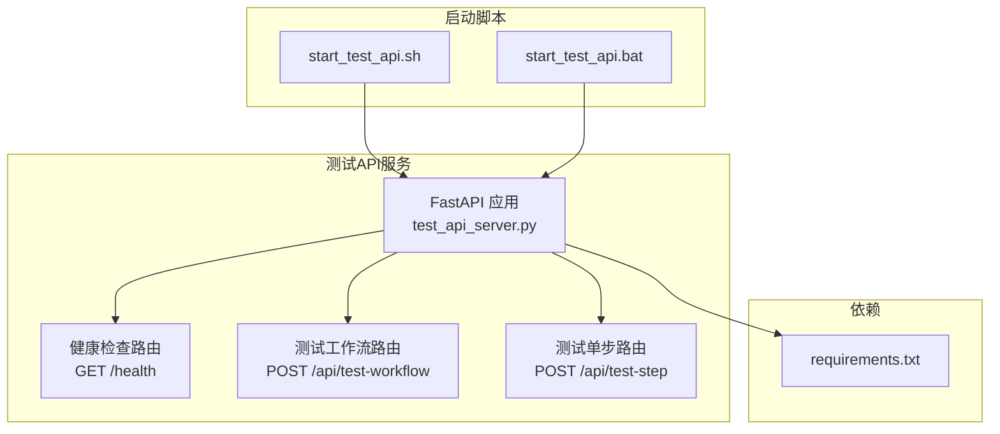
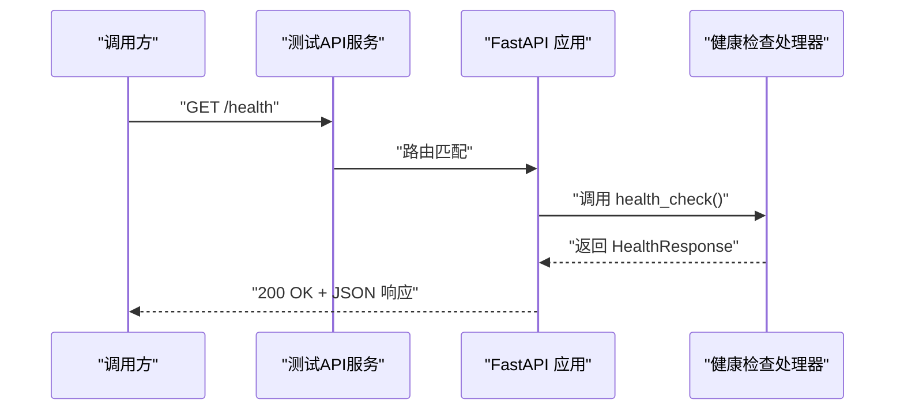
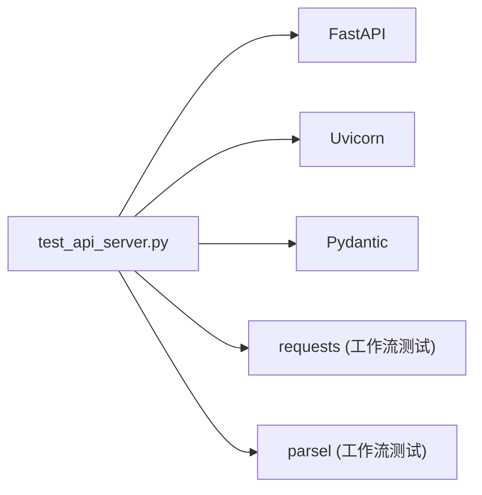

# 健康检查接口

<cite>
**本文引用的文件**
- [test_api_server.py](file://test_api_server.py)
- [TEST_API_README.md](file://TEST_API_README.md)
- [start_test_api.sh](file://start_test_api.sh)
- [start_test_api.bat](file://start_test_api.bat)
- [test_quick.py](file://test_quick.py)
- [requirements.txt](file://requirements.txt)
</cite>

## 目录
1. [简介](#简介)
2. [项目结构](#项目结构)
3. [核心组件](#核心组件)
4. [架构总览](#架构总览)
5. [详细组件分析](#详细组件分析)
6. [依赖分析](#依赖分析)
7. [性能考虑](#性能考虑)
8. [故障排查指南](#故障排查指南)
9. [结论](#结论)
10. [附录](#附录)

## 简介
本文件为“健康检查接口”的API文档，面向运维与开发人员，说明该接口的HTTP方法、URL模式、认证要求、响应结构、使用示例、错误场景与处理策略，并给出在部署、监控与CI/CD流程中的应用场景。该接口用于验证测试API服务是否正常运行，是系统监控与运维的重要组成部分。

- HTTP方法：GET
- URL模式：/health
- 认证：无需认证
- 响应：返回服务状态、服务名称与版本信息的JSON对象
- 成功响应示例：{"status":"ok","service":"test-api-server","version":"1.0.0"}

## 项目结构
该接口位于测试API服务的FastAPI应用中，服务通过脚本启动，监听本地端口并提供健康检查与测试接口。

图表来源
- [test_api_server.py](file://test_api_server.py#L403-L411)
- [start_test_api.sh](file://start_test_api.sh#L1-L17)
- [start_test_api.bat](file://start_test_api.bat#L1-L17)
- [requirements.txt](file://requirements.txt#L1-L17)

章节来源
- [test_api_server.py](file://test_api_server.py#L403-L411)
- [start_test_api.sh](file://start_test_api.sh#L1-L17)
- [start_test_api.bat](file://start_test_api.bat#L1-L17)
- [requirements.txt](file://requirements.txt#L1-L17)

## 核心组件
- 健康检查接口定义
  - 路由：GET /health
  - 响应模型：包含 status、service、version 字段
  - 实现位置：[test_api_server.py](file://test_api_server.py#L403-L411)
- 响应模型定义
  - 类型：Pydantic 模型 HealthResponse
  - 字段：status、service、version
  - 实现位置：[test_api_server.py](file://test_api_server.py#L75-L80)
- 服务启动与环境变量
  - 端口：TEST_API_PORT，默认 5001
  - 主机：TEST_API_HOST，默认 0.0.0.0
  - 调试：TEST_API_DEBUG，默认 true
  - 实现位置：[test_api_server.py](file://test_api_server.py#L530-L555)，[start_test_api.sh](file://start_test_api.sh#L1-L17)，[start_test_api.bat](file://start_test_api.bat#L1-L17)
- 依赖要求
  - FastAPI、Uvicorn、Pydantic 等
  - 实现位置：[requirements.txt](file://requirements.txt#L1-L17)

章节来源
- [test_api_server.py](file://test_api_server.py#L75-L80)
- [test_api_server.py](file://test_api_server.py#L403-L411)
- [test_api_server.py](file://test_api_server.py#L530-L555)
- [start_test_api.sh](file://start_test_api.sh#L1-L17)
- [start_test_api.bat](file://start_test_api.bat#L1-L17)
- [requirements.txt](file://requirements.txt#L1-L17)

## 架构总览
健康检查接口属于测试API服务的公开端点，无需认证即可访问，用于快速判断服务进程是否存活、可响应。

图表来源
- [test_api_server.py](file://test_api_server.py#L403-L411)

## 详细组件分析

### 健康检查接口定义与行为
- 接口定义
  - 方法：GET
  - 路径：/health
  - 认证：无需认证
  - 响应模型：HealthResponse(status, service, version)
- 实现要点
  - 响应模型在路由层声明，确保返回结构稳定
  - 该接口设计为“永不失败”，即在服务可响应的前提下返回固定结构
- 使用场景
  - 健康探针（Kubernetes readiness/liveness）、负载均衡器后端检查
  - CI/CD流水线前置检查
  - 运维巡检与自动化监控

章节来源
- [test_api_server.py](file://test_api_server.py#L403-L411)
- [test_api_server.py](file://test_api_server.py#L75-L80)

### 响应模型 HealthResponse
- 字段说明
  - status：字符串，服务状态，例如 "ok"
  - service：字符串，服务名称，例如 "test-api-server"
  - version：字符串，服务版本，例如 "1.0.0"
- 数据结构复杂度
  - 固定结构，O(1) 访问
- 依赖关系
  - 由 FastAPI 路由装饰器绑定到响应模型

章节来源
- [test_api_server.py](file://test_api_server.py#L75-L80)

### 启动与环境变量
- 环境变量
  - TEST_API_PORT：服务端口，默认 5001
  - TEST_API_HOST：监听地址，默认 0.0.0.0
  - TEST_API_DEBUG：调试模式，默认 true
- 启动方式
  - Linux/Mac：./start_test_api.sh
  - Windows：start_test_api.bat
  - 直接运行：python test_api_server.py

章节来源
- [test_api_server.py](file://test_api_server.py#L530-L555)
- [start_test_api.sh](file://start_test_api.sh#L1-L17)
- [start_test_api.bat](file://start_test_api.bat#L1-L17)

### 依赖与运行时要求
- 关键依赖
  - FastAPI、Uvicorn、Pydantic、requests、parsel 等
- 作用
  - FastAPI 提供路由与响应模型支持
  - Uvicorn 提供 ASGI 服务器
  - requests/parsel 用于工作流测试（非健康检查必需）

章节来源
- [requirements.txt](file://requirements.txt#L1-L17)

## 依赖分析
健康检查接口的依赖关系简单清晰，主要依赖于FastAPI框架与运行时环境。

图表来源
- [test_api_server.py](file://test_api_server.py#L1-L40)
- [requirements.txt](file://requirements.txt#L1-L17)

章节来源
- [test_api_server.py](file://test_api_server.py#L1-L40)
- [requirements.txt](file://requirements.txt#L1-L17)

## 性能考虑
- 健康检查接口为纯内存计算，无外部依赖，响应延迟极低
- 建议在生产环境中将其作为轻量探针使用，避免频繁高并发探测
- 若部署在容器编排平台，合理配置探针的初始延迟、探测间隔与超时时间

[本节为通用指导，不涉及具体文件分析]

## 故障排查指南
- 无法连接到服务
  - 确认服务已启动且端口未被占用
  - 检查 TEST_API_PORT/TEST_API_HOST 是否符合预期
  - 参考：[start_test_api.sh](file://start_test_api.sh#L1-L17)、[start_test_api.bat](file://start_test_api.bat#L1-L17)、[test_api_server.py](file://test_api_server.py#L530-L555)
- 健康检查返回异常
  - 若返回非 200，检查服务日志与网络连通性
  - 可使用 curl 验证：curl http://localhost:5001/health
  - 参考：[TEST_API_README.md](file://TEST_API_README.md#L63-L81)
- 依赖缺失导致启动失败
  - 安装 requirements.txt 中的依赖
  - 参考：[requirements.txt](file://requirements.txt#L1-L17)
- 自动化验证
  - 可使用 test_quick.py 中的健康检查逻辑进行自动化验证
  - 参考：[test_quick.py](file://test_quick.py#L10-L34)

章节来源
- [start_test_api.sh](file://start_test_api.sh#L1-L17)
- [start_test_api.bat](file://start_test_api.bat#L1-L17)
- [test_api_server.py](file://test_api_server.py#L530-L555)
- [TEST_API_README.md](file://TEST_API_README.md#L63-L81)
- [requirements.txt](file://requirements.txt#L1-L17)
- [test_quick.py](file://test_quick.py#L10-L34)

## 结论
健康检查接口为测试API服务提供了一个稳定、无需认证的探针端点，便于在部署、监控与CI/CD流程中进行快速验证。其设计保证了“永不失败”的特性，使运维与自动化工具能够可靠地依赖该接口进行服务可用性判断。

[本节为总结性内容，不涉及具体文件分析]

## 附录

### API 规范
- 终端：GET /health
- 认证：无需认证
- 成功响应示例：
  - {"status":"ok","service":"test-api-server","version":"1.0.0"}
- 失败场景
  - 由于接口设计为“永不失败”，通常不会出现业务错误；若返回非 200，多为网络或服务不可达问题

章节来源
- [TEST_API_README.md](file://TEST_API_README.md#L83-L99)

### 实际使用示例
- curl 命令
  - curl http://localhost:5001/health
- 前端/后端集成
  - 在前端或后端定时向 /health 发起请求，作为健康探针
- 自动化脚本
  - 可参考 test_quick.py 中的健康检查逻辑进行自动化验证
  - 参考：[test_quick.py](file://test_quick.py#L10-L34)

章节来源
- [TEST_API_README.md](file://TEST_API_README.md#L63-L81)
- [test_quick.py](file://test_quick.py#L10-L34)

### 在部署、监控与CI/CD中的应用场景
- 部署阶段
  - 容器编排平台（如 Kubernetes）的 liveness/readiness 探针指向 /health
- 监控阶段
  - Prometheus/Grafana 等监控系统定期抓取 /health，统计服务可用率
- CI/CD 阶段
  - 在流水线中加入 /health 健康检查步骤，确保服务就绪后再进行后续部署或验收测试

[本节为概念性说明，不涉及具体文件分析]