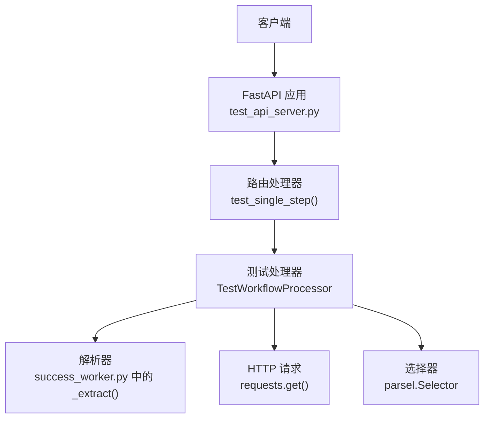
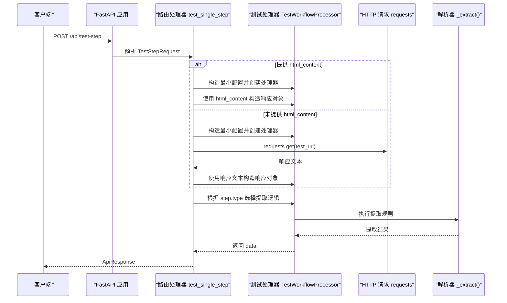
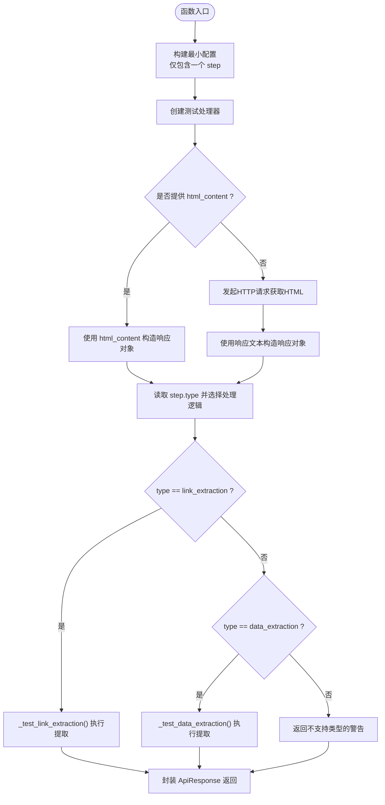
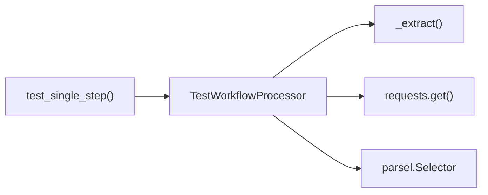

# 测试单个步骤

<cite>
**本文引用的文件**
- [test_api_server.py](file://test_api_server.py)
- [TEST_API_README.md](file://TEST_API_README.md)
- [success_worker.py](file://success_worker.py)
- [crawler/utils/workflow.py](file://crawler/utils/workflow.py)
- [demo.json](file://demo.json)
</cite>

## 目录
1. [简介](#简介)
2. [项目结构](#项目结构)
3. [核心组件](#核心组件)
4. [架构总览](#架构总览)
5. [详细组件分析](#详细组件分析)
6. [依赖关系分析](#依赖关系分析)
7. [性能考虑](#性能考虑)
8. [故障排查指南](#故障排查指南)
9. [结论](#结论)
10. [附录](#附录)

## 简介
本文件为“测试单个步骤接口”的API文档，目标是帮助开发者快速理解并正确使用该接口。该接口用于在无需完整运行工作流的情况下，对单个步骤（如链接提取或数据提取）进行精细化调试与验证。接口特性如下：
- HTTP方法：POST
- URL模式：/api/test-step
- 无需认证
- 支持两种步骤类型：link_extraction、data_extraction
- 支持直接传入HTML内容进行测试（可选）

## 项目结构
该接口位于测试API服务中，采用FastAPI框架提供HTTP接口，并复用生产环境中的解析逻辑，保证测试与生产的解析行为一致。

图表来源
- [test_api_server.py](file://test_api_server.py#L468-L527)
- [success_worker.py](file://success_worker.py#L173-L187)

章节来源
- [test_api_server.py](file://test_api_server.py#L1-L120)
- [TEST_API_README.md](file://TEST_API_README.md#L1-L120)

## 核心组件
- 接口定义与路由
  - 路由：POST /api/test-step
  - 请求体模型：TestStepRequest
  - 响应模型：ApiResponse
- 请求体字段
  - test_url：字符串，必填
  - step：对象，必填，包含步骤类型与配置
  - html_content：字符串，可选，若提供则跳过HTTP请求，直接使用该HTML内容进行测试
- 响应字段
  - success：布尔值
  - data：对象，包含提取结果或警告信息
  - message：字符串
  - execution_time：数字（毫秒），可选
  - error_trace：字符串，异常堆栈，可选

章节来源
- [test_api_server.py](file://test_api_server.py#L68-L90)
- [test_api_server.py](file://test_api_server.py#L468-L527)

## 架构总览
该接口通过构建最小工作流配置（仅包含一个步骤），调用测试处理器，根据步骤类型选择对应的提取逻辑，最终返回提取结果。若提供html_content，则直接使用该内容作为响应；否则发起HTTP请求获取页面内容。

图表来源
- [test_api_server.py](file://test_api_server.py#L468-L527)
- [success_worker.py](file://success_worker.py#L173-L187)

## 详细组件分析

### 接口定义与请求体结构
- HTTP方法：POST
- URL：/api/test-step
- 认证：无需认证
- 请求体模型：TestStepRequest
  - test_url：字符串，必填
  - step：对象，必填
    - type：字符串，必填，支持 "link_extraction" 或 "data_extraction"
    - config：对象，必填
      - linkExtractionRules：数组，当type为"link_extraction"时有效
        - fieldName：字符串，必填，通常为"link"
        - expression：字符串，必填，CSS/XPath表达式
        - extractType：字符串，"css"或"xpath"，默认"xpath"
        - multiple：布尔值，是否多值提取
        - maxLinks：整数，最大链接数量限制
        - 其他字段：如 trim、deduplicate、postProcess、defaultValue 等（按生产逻辑支持）
      - extractionRules：数组，当type为"data_extraction"时有效
        - fieldName：字符串，必填
        - expression：字符串，必填
        - extractType：字符串，"css"或"xpath"，默认"xpath"
        - multiple：布尔值，是否多值提取
        - 其他字段：如 trim、postProcess、defaultValue 等（按生产逻辑支持）
  - html_content：字符串，可选，若提供则跳过HTTP请求，直接使用该HTML内容进行测试

章节来源
- [test_api_server.py](file://test_api_server.py#L68-L90)
- [demo.json](file://demo.json#L52-L178)

### 响应格式
- 成功响应
  - success：true
  - data：对象，包含提取结果
    - 对于 link_extraction：包含一个或多个字段，典型为 "link" 数组
    - 对于 data_extraction：包含按 fieldName 命名的字段及提取值
  - message："步骤测试成功"
  - execution_time：数字（毫秒），可选
  - error_trace：null
- 失败响应
  - success：false
  - data：对象，包含错误信息或警告
  - message：错误描述
  - execution_time：数字（毫秒），可选
  - error_trace：异常堆栈，可选

章节来源
- [test_api_server.py](file://test_api_server.py#L82-L90)
- [test_api_server.py](file://test_api_server.py#L468-L527)

### 步骤类型与处理逻辑
- link_extraction
  - 逻辑：遍历 linkExtractionRules，使用 _extract() 执行表达式提取，支持 multiple 与 maxLinks 限制
  - 返回：包含 fieldName 对应的提取结果，通常包含 "link" 字段
- data_extraction
  - 逻辑：遍历 extractionRules，使用 _extract() 执行表达式提取，支持 multiple
  - 返回：包含 fieldName 对应的提取结果
- 不支持的步骤类型
  - 返回 warning，提示不支持的类型

章节来源
- [test_api_server.py](file://test_api_server.py#L507-L514)
- [success_worker.py](file://success_worker.py#L173-L187)

### 关键流程图：测试单个步骤

图表来源
- [test_api_server.py](file://test_api_server.py#L478-L520)
- [success_worker.py](file://success_worker.py#L173-L187)

### 实际使用示例与最佳实践
- 示例一：测试数据提取
  - 请求体要点
    - test_url：目标URL
    - step.type：data_extraction
    - step.config.extractionRules：包含 fieldName 与 expression
  - 响应要点
    - data：包含按 fieldName 命名的提取结果
- 示例二：提供HTML内容进行测试
  - 请求体要点
    - test_url：任意URL（不影响结果）
    - html_content：页面HTML文本
    - step.type：link_extraction 或 data_extraction
  - 响应要点
    - 不发起HTTP请求，直接使用 html_content
- 最佳实践
  - 在调试阶段优先使用 html_content，避免网络波动影响测试稳定性
  - 对于 link_extraction，建议设置 maxLinks 控制输出规模，便于快速验证
  - 对于 data_extraction，建议先用 multiple=false 验证单值提取，再切换为多值
  - 若提取结果为空，检查 expression 与 extractType 是否匹配页面结构

章节来源
- [TEST_API_README.md](file://TEST_API_README.md#L211-L245)
- [demo.json](file://demo.json#L52-L178)

## 依赖关系分析
- 组件耦合
  - test_api_server.py 中的 test_single_step 依赖 TestWorkflowProcessor
  - TestWorkflowProcessor 复用 success_worker.py 中的 _extract() 逻辑
  - 解析依赖 parsel.Selector 与 requests
- 外部依赖
  - parsel：选择器
  - requests：HTTP请求
  - fastapi：Web框架与Pydantic模型

图表来源
- [test_api_server.py](file://test_api_server.py#L468-L527)
- [success_worker.py](file://success_worker.py#L173-L187)

章节来源
- [test_api_server.py](file://test_api_server.py#L468-L527)
- [success_worker.py](file://success_worker.py#L173-L187)

## 性能考虑
- 仅在必要时发起HTTP请求：提供 html_content 可显著降低网络开销
- 控制提取规模：link_extraction 的 maxLinks 与 data_extraction 的 multiple 可减少不必要的计算
- 单步测试：避免完整工作流带来的额外步骤与上下文传递成本

## 故障排查指南
- 无法连接到测试服务
  - 确认服务已启动且端口正确
- No module named 'parsel' 或 'requests'
  - 安装依赖：pip install -r requirements.txt
- 提取结果为空
  - 检查 expression 与 extractType 是否匹配页面结构
  - 对于 link_extraction，确认存在 fieldName 为 "link" 的规则
- 不支持的步骤类型
  - 确保 step.type 为 "link_extraction" 或 "data_extraction"

章节来源
- [TEST_API_README.md](file://TEST_API_README.md#L246-L308)

## 结论
“测试单个步骤接口”为精细化调试爬虫提取规则提供了高效手段。通过直接传入HTML内容或发起HTTP请求，结合与生产一致的解析逻辑，开发者可以在不运行完整工作流的前提下快速定位问题、验证规则有效性，并形成稳定的测试流程。

## 附录

### API定义表
- 方法：POST
- 路径：/api/test-step
- 认证：无需认证
- 请求体字段
  - test_url：字符串，必填
  - step：对象，必填
    - type：字符串，"link_extraction" 或 "data_extraction"
    - config：对象
      - linkExtractionRules：数组，当type为"link_extraction"时有效
      - extractionRules：数组，当type为"data_extraction"时有效
  - html_content：字符串，可选
- 响应字段
  - success：布尔值
  - data：对象
  - message：字符串
  - execution_time：数字（毫秒），可选
  - error_trace：字符串，可选

章节来源
- [test_api_server.py](file://test_api_server.py#L68-L90)
- [test_api_server.py](file://test_api_server.py#L468-L527)