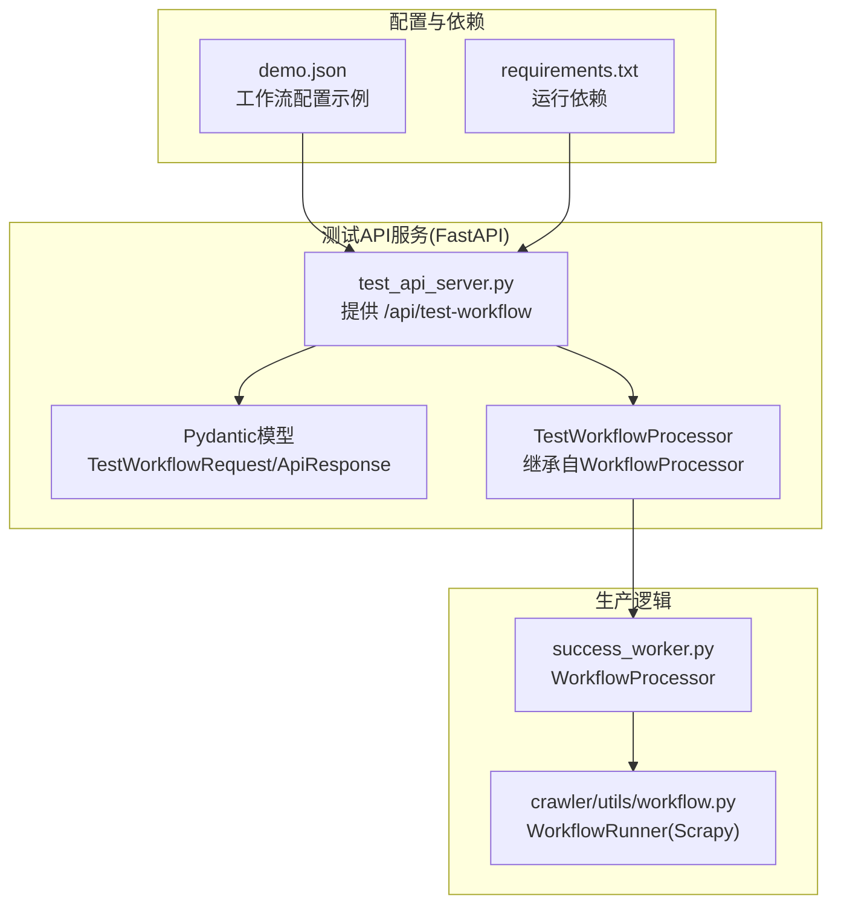
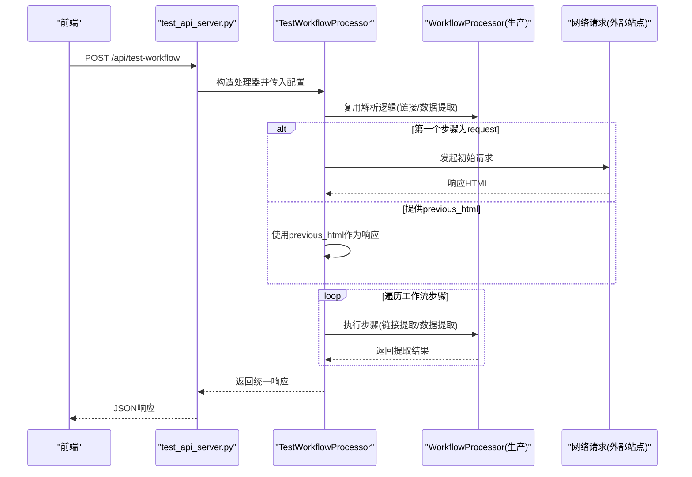
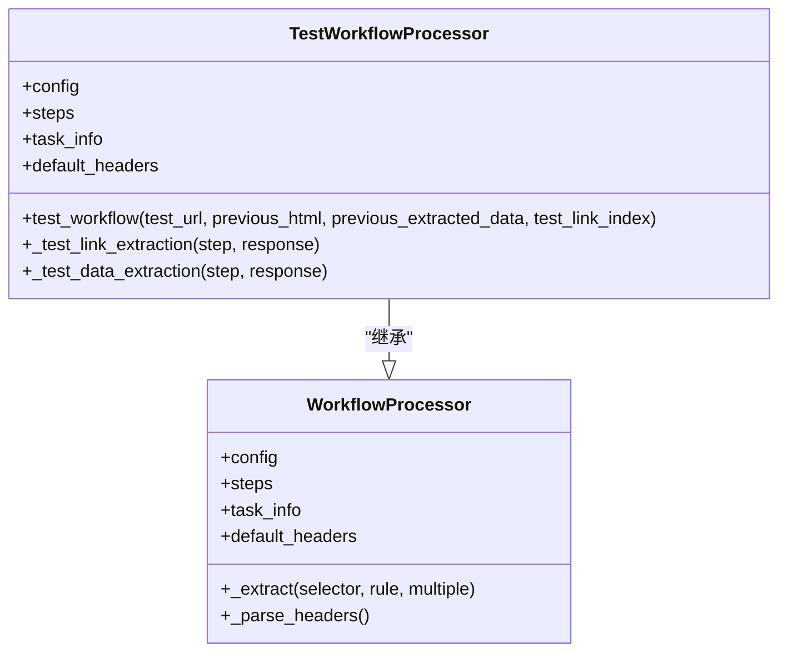
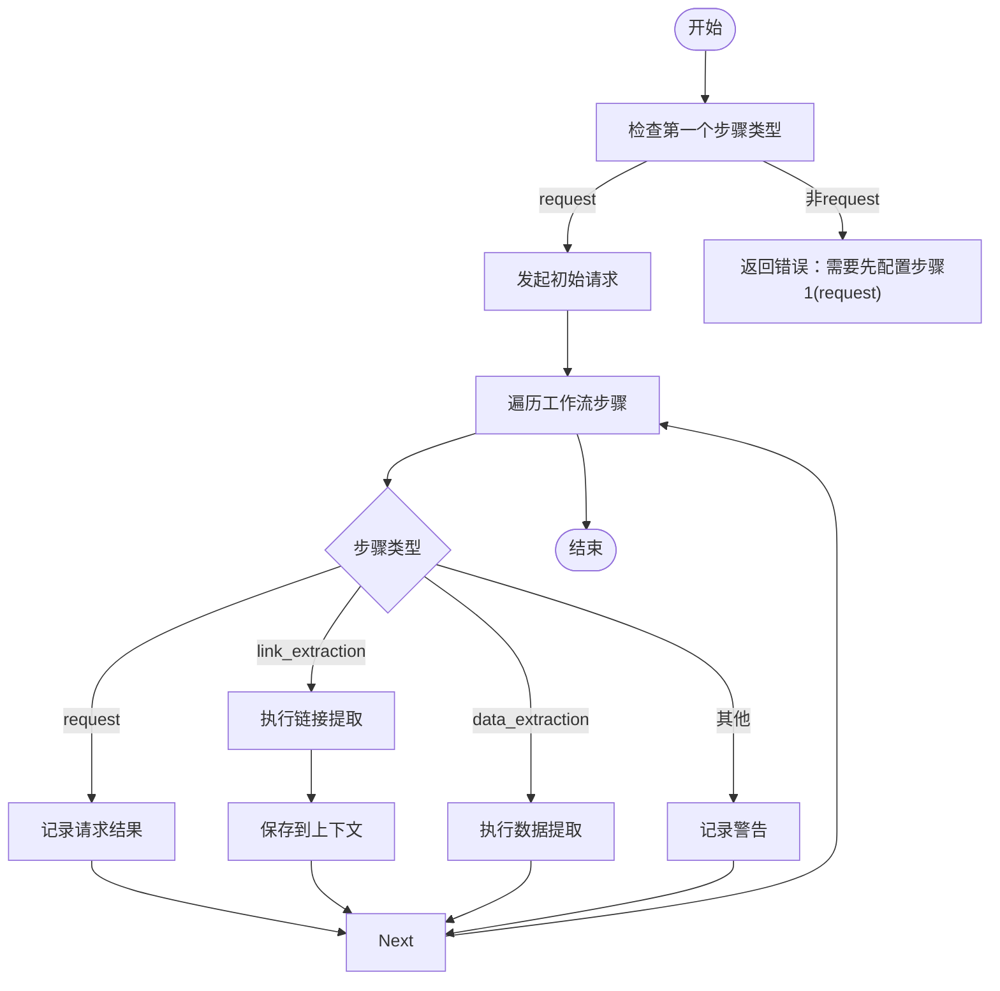

# 测试完整工作流

<cite>
**本文引用的文件**
- [test_api_server.py](file://test_api_server.py)
- [success_worker.py](file://success_worker.py)
- [crawler/utils/workflow.py](file://crawler/utils/workflow.py)
- [TEST_API_README.md](file://TEST_API_README.md)
- [demo.json](file://demo.json)
- [requirements.txt](file://requirements.txt)
- [test_quick.py](file://test_quick.py)
</cite>

## 目录
1. [简介](#简介)
2. [项目结构](#项目结构)
3. [核心组件](#核心组件)
4. [架构总览](#架构总览)
5. [详细组件分析](#详细组件分析)
6. [依赖关系分析](#依赖关系分析)
7. [性能考虑](#性能考虑)
8. [故障排查指南](#故障排查指南)
9. [结论](#结论)
10. [附录](#附录)

## 简介
本文件为“测试完整工作流”接口的API文档，目标是帮助开发者与前端工程师快速理解并正确使用该接口。该接口用于在本地或开发环境中，对爬虫工作流配置进行端到端测试，确保配置与生产逻辑一致。接口采用POST方法，URL为/api/test-workflow，无需认证，返回统一的响应模型，包含成功标志、数据、消息与执行耗时等字段。接口内部复用success_worker.py中的WorkflowProcessor逻辑，保证测试与生产的解析行为一致。

## 项目结构
该接口位于独立的FastAPI服务中，与生产Worker解耦，便于独立部署与调试。核心文件与职责如下：
- test_api_server.py：提供FastAPI服务、路由、请求/响应模型、业务处理逻辑
- success_worker.py：生产环境的WorkflowProcessor实现，提供链接提取、数据提取、自定义代码生成请求等核心逻辑
- crawler/utils/workflow.py：Scrapy侧的WorkflowRunner，展示工作流在Scrapy框架下的执行方式
- TEST_API_README.md：官方使用说明与示例
- demo.json：示例工作流配置，展示taskInfo与workflowSteps结构
- requirements.txt：运行依赖
- test_quick.py：快速验证脚本，演示如何调用测试接口

图表来源
- [test_api_server.py](file://test_api_server.py#L413-L466)
- [success_worker.py](file://success_worker.py#L23-L363)
- [crawler/utils/workflow.py](file://crawler/utils/workflow.py#L1-L157)
- [demo.json](file://demo.json#L1-L181)
- [requirements.txt](file://requirements.txt#L1-L17)

章节来源
- [test_api_server.py](file://test_api_server.py#L413-L466)
- [success_worker.py](file://success_worker.py#L23-L363)
- [crawler/utils/workflow.py](file://crawler/utils/workflow.py#L1-L157)
- [TEST_API_README.md](file://TEST_API_README.md#L1-L308)
- [demo.json](file://demo.json#L1-L181)
- [requirements.txt](file://requirements.txt#L1-L17)

## 核心组件
- 接口路径与方法
  - POST /api/test-workflow
  - 无需认证
- 请求体结构
  - test_url: string，必填，测试的目标URL
  - config: object，必填，包含以下字段：
    - taskInfo: object，任务基本信息
      - id: number，任务ID
      - name: string，任务名称
      - baseUrl: string，任务基础URL
    - workflowSteps: array，工作流步骤列表，每个步骤包含：
      - id: number，步骤ID
      - type: string，步骤类型，支持 request/link_extraction/data_extraction
      - config: object，步骤配置
    - previous_html: string，可选，上一步骤的响应HTML内容
    - previous_extracted_data: object，可选，上一步提取的数据
    - test_link_index: number，可选，要测试的链接索引，默认0
- 响应结构
  - success: boolean，是否成功
  - data: object，包含以下字段：
    - url: string，最终请求的URL
    - status_code: number，最终响应状态码
    - content_length: number，最终响应内容长度
    - steps_results: object，各步骤的执行结果
    - execution_time: number，执行耗时(毫秒)
    - response_html: string，最终响应HTML内容（用于前端展示）
  - message: string，操作消息
  - execution_time: number，执行耗时(毫秒)
  - error_trace: string，可选，异常堆栈信息

章节来源
- [test_api_server.py](file://test_api_server.py#L45-L89)
- [test_api_server.py](file://test_api_server.py#L413-L466)
- [TEST_API_README.md](file://TEST_API_README.md#L101-L210)

## 架构总览
该接口通过FastAPI接收请求，构造测试处理器，复用生产逻辑中的WorkflowProcessor实现，按顺序执行工作流步骤，并返回统一的响应模型。其核心流程如下：

图表来源
- [test_api_server.py](file://test_api_server.py#L413-L466)
- [success_worker.py](file://success_worker.py#L23-L363)

## 详细组件分析

### 接口定义与请求模型
- 路由与方法
  - POST /api/test-workflow
- 请求模型
  - TestWorkflowRequest：包含test_url与config
  - WorkflowConfig：包含taskInfo、workflowSteps及可选参数previous_html、previous_extracted_data、test_link_index
- 响应模型
  - ApiResponse：包含success、data、message、execution_time、error_trace

章节来源
- [test_api_server.py](file://test_api_server.py#L45-L89)
- [test_api_server.py](file://test_api_server.py#L413-L466)

### 工作流处理器(TestWorkflowProcessor)
- 继承关系
  - TestWorkflowProcessor继承自WorkflowProcessor，保持与生产逻辑一致
- 关键方法
  - test_workflow：执行完整工作流，支持从外部HTML或初始请求开始
  - _test_link_extraction/_test_data_extraction：复用生产逻辑中的提取方法
- 参数与行为
  - 支持从previous_html直接使用已有HTML作为响应源
  - 支持从previous_extracted_data注入上下文数据
  - 支持test_link_index选择链接索引
  - 返回steps_results，记录每一步的执行结果

图表来源
- [success_worker.py](file://success_worker.py#L23-L363)
- [test_api_server.py](file://test_api_server.py#L91-L160)
- [test_api_server.py](file://test_api_server.py#L355-L401)

章节来源
- [test_api_server.py](file://test_api_server.py#L91-L160)
- [test_api_server.py](file://test_api_server.py#L355-L401)
- [success_worker.py](file://success_worker.py#L173-L188)

### 工作流步骤类型与执行逻辑
- request：发起HTTP请求，记录URL、方法、状态码、内容长度
- link_extraction：使用规则从HTML中提取链接与其他字段，支持maxLinks限制
- data_extraction：使用规则从HTML中提取目标字段，支持多值提取
- 上下文(context)：在步骤间传递链接列表与提取字段，支持test_link_index选择目标链接

图表来源
- [test_api_server.py](file://test_api_server.py#L198-L354)

章节来源
- [test_api_server.py](file://test_api_server.py#L198-L354)

### 与Scrapy工作流的对比
- Scrapy侧的WorkflowRunner展示了相同的工作流思想：按步骤执行，链接提取后生成下一级请求，数据提取后产出条目或触发自定义代码生成请求。
- 两者均使用_parsing方法族完成XPath/CSS表达式抽取，保持一致性。

章节来源
- [crawler/utils/workflow.py](file://crawler/utils/workflow.py#L1-L157)
- [success_worker.py](file://success_worker.py#L173-L188)

## 依赖关系分析
- 运行依赖
  - FastAPI、Uvicorn、Pydantic、Requests、Parsel等
- 与生产逻辑的耦合
  - 测试服务通过继承WorkflowProcessor，确保测试与生产解析逻辑一致
- 与前端的集成
  - 前端通过POST /api/test-workflow提交配置，接收统一响应，便于在UI中展示步骤结果与错误信息

图表来源
- [test_api_server.py](file://test_api_server.py#L413-L466)
- [success_worker.py](file://success_worker.py#L23-L363)
- [requirements.txt](file://requirements.txt#L1-L17)

章节来源
- [requirements.txt](file://requirements.txt#L1-L17)
- [test_api_server.py](file://test_api_server.py#L413-L466)
- [success_worker.py](file://success_worker.py#L23-L363)

## 性能考虑
- 并发与超时
  - 初始请求与详情页请求均设置超时，避免长时间阻塞
- 结果缓存
  - 可在测试服务层增加响应缓存，减少重复请求
- 异步化
  - 可考虑异步处理提升吞吐
- 队列化
  - 对于大量测试请求，可引入任务队列

[本节为通用建议，不直接分析具体文件]

## 故障排查指南
- 服务未启动
  - 确认测试服务已启动，访问健康检查接口验证
- 依赖缺失
  - 安装requirements.txt中的依赖
- 配置不一致
  - 修改解析逻辑只需更新success_worker.py，测试服务会自动继承
- 常见错误
  - 第一个步骤必须为request类型，否则返回错误提示
  - 链接索引越界时，返回明确的错误信息
  - 详情页请求失败时，记录错误并继续后续步骤

章节来源
- [TEST_API_README.md](file://TEST_API_README.md#L246-L308)
- [test_api_server.py](file://test_api_server.py#L198-L354)

## 结论
“测试完整工作流”接口通过复用生产逻辑，为前端配置调试提供了稳定可靠的验证手段。其统一的响应模型与清晰的步骤结果输出，使得前端能够直观地定位配置问题，显著提升开发效率。建议在生产环境中谨慎暴露该接口，并结合认证与限流策略保障安全。

[本节为总结性内容，不直接分析具体文件]

## 附录

### API定义
- 方法与路径
  - POST /api/test-workflow
- 请求体
  - test_url: string，必填
  - config: object，必填
    - taskInfo: object，包含id、name、baseUrl
    - workflowSteps: array，步骤数组
    - previous_html: string，可选
    - previous_extracted_data: object，可选
    - test_link_index: number，可选，默认0
- 响应体
  - success: boolean
  - data: object，包含url、status_code、content_length、steps_results、execution_time、response_html
  - message: string
  - execution_time: number
  - error_trace: string，可选

章节来源
- [test_api_server.py](file://test_api_server.py#L45-L89)
- [test_api_server.py](file://test_api_server.py#L413-L466)

### 示例
- 成功响应示例
  - 参考官方文档中的成功响应结构
- 失败响应示例
  - 参考官方文档中的失败响应结构

章节来源
- [TEST_API_README.md](file://TEST_API_README.md#L157-L209)

### 实际调用示例
- 使用demo.json作为配置，向本地测试服务发送POST请求
- 参考快速验证脚本的调用方式

章节来源
- [test_quick.py](file://test_quick.py#L37-L112)
- [demo.json](file://demo.json#L1-L181)

### 与前端配置界面的集成
- 前端在用户点击“测试”按钮时，组装test_url与config，调用/api/test-workflow
- 服务返回统一响应后，前端展示步骤结果、错误信息与执行耗时
- 可将response_html返回给前端用于预览最终页面

章节来源
- [TEST_API_README.md](file://TEST_API_README.md#L254-L261)
- [test_api_server.py](file://test_api_server.py#L413-L466)