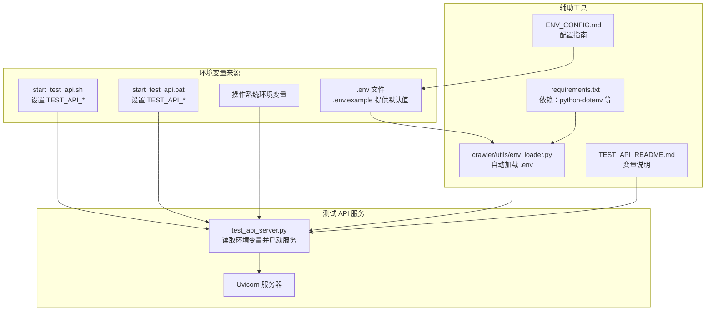
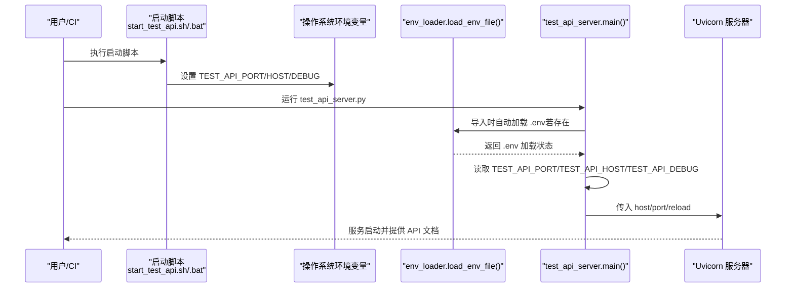
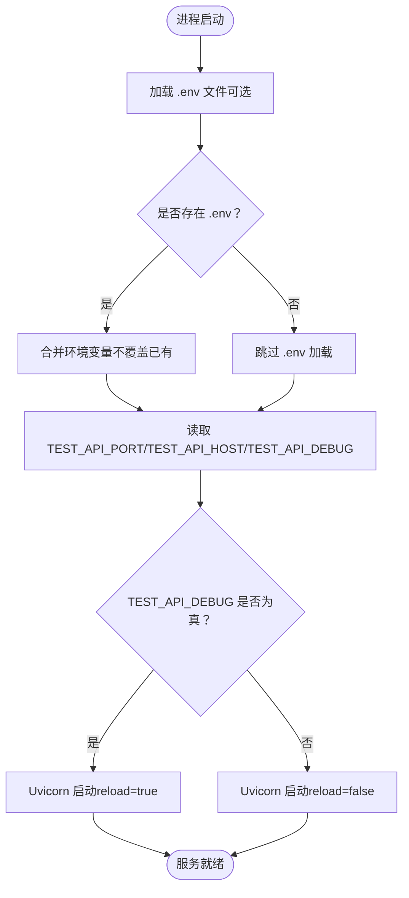
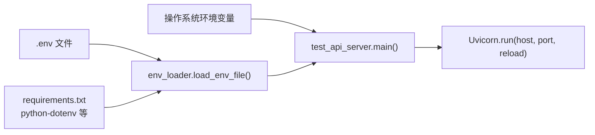

# 环境变量配置

<cite>
**本文引用的文件**
- [test_api_server.py](file://test_api_server.py)
- [.env.example](file://.env.example)
- [ENV_CONFIG.md](file://ENV_CONFIG.md)
- [TEST_API_README.md](file://TEST_API_README.md)
- [start_test_api.sh](file://start_test_api.sh)
- [start_test_api.bat](file://start_test_api.bat)
- [crawler/utils/env_loader.py](file://crawler/utils/env_loader.py)
- [requirements.txt](file://requirements.txt)
</cite>

## 目录
1. [简介](#简介)
2. [项目结构](#项目结构)
3. [核心组件](#核心组件)
4. [架构总览](#架构总览)
5. [详细组件分析](#详细组件分析)
6. [依赖关系分析](#依赖关系分析)
7. [性能考虑](#性能考虑)
8. [故障排查指南](#故障排查指南)
9. [结论](#结论)
10. [附录](#附录)

## 简介
本节聚焦于测试 API 服务的环境变量配置，系统性解释以下三个变量的作用、默认值、可选值以及对服务运行行为的影响：
- TEST_API_PORT：监听端口
- TEST_API_HOST：绑定地址
- TEST_API_DEBUG：调试模式开关

同时提供在不同环境（开发、测试、生产）中的最佳实践，说明调试模式开启时的日志行为，并给出通过命令行、.env 文件和操作系统环境变量设置这些参数的具体示例。

## 项目结构
围绕环境变量配置的关键文件与职责如下：
- test_api_server.py：测试 API 服务入口，负责读取并应用环境变量，启动 Uvicorn 服务。
- .env.example：项目示例环境变量文件，包含 TEST_API_PORT、TEST_API_HOST、TEST_API_DEBUG 的默认值。
- TEST_API_README.md：测试 API 服务使用说明，明确列出上述三个变量及其默认值。
- start_test_api.sh / start_test_api.bat：启动脚本，显式设置上述三个环境变量。
- crawler/utils/env_loader.py：加载 .env 文件的工具，支持在模块导入时自动加载。
- requirements.txt：包含 python-dotenv（用于加载 .env 文件）等依赖。

图表来源
- [test_api_server.py](file://test_api_server.py#L530-L555)
- [.env.example](file://.env.example#L54-L58)
- [TEST_API_README.md](file://TEST_API_README.md#L246-L253)
- [start_test_api.sh](file://start_test_api.sh#L4-L7)
- [start_test_api.bat](file://start_test_api.bat#L4-L7)
- [crawler/utils/env_loader.py](file://crawler/utils/env_loader.py#L14-L61)
- [requirements.txt](file://requirements.txt#L1-L17)

章节来源
- [test_api_server.py](file://test_api_server.py#L530-L555)
- [.env.example](file://.env.example#L54-L58)
- [TEST_API_README.md](file://TEST_API_README.md#L246-L253)
- [start_test_api.sh](file://start_test_api.sh#L4-L7)
- [start_test_api.bat](file://start_test_api.bat#L4-L7)
- [crawler/utils/env_loader.py](file://crawler/utils/env_loader.py#L14-L61)
- [requirements.txt](file://requirements.txt#L1-L17)

## 核心组件
本节聚焦三个环境变量的定义、默认值、可选值及对服务行为的影响。

- TEST_API_PORT
  - 作用：指定测试 API 服务监听的 TCP 端口号。
  - 默认值：5001
  - 可选值：任意可用的端口（通常为 1–65535，避开系统保留端口）
  - 影响：决定服务对外暴露的端口，影响网络可达性与防火墙策略。
  - 代码定位：[test_api_server.py](file://test_api_server.py#L531-L531)

- TEST_API_HOST
  - 作用：指定测试 API 服务绑定的网络地址（监听地址）。
  - 默认值：0.0.0.0（监听所有可用网络接口）
  - 可选值：IP 地址（如 0.0.0.0、127.0.0.1、内网 IP）、主机名（需 DNS 解析）
  - 影响：决定服务的网络可达范围（0.0.0.0 允许外网访问，127.0.0.1 仅本地访问）。
  - 代码定位：[test_api_server.py](file://test_api_server.py#L532-L532)

- TEST_API_DEBUG
  - 作用：控制服务是否启用热重载（开发调试模式）。
  - 默认值：true（字符串形式，会被转换为布尔值）
  - 可选值：true/false（大小写不敏感，'true'/'1'/'yes' 等在代码中被视为真）
  - 影响：开启时，Uvicorn 会在代码变更时自动重启，便于快速迭代；关闭时为生产模式，不自动重启。
  - 代码定位：[test_api_server.py](file://test_api_server.py#L533-L533)

章节来源
- [test_api_server.py](file://test_api_server.py#L531-L533)
- [.env.example](file://.env.example#L54-L58)
- [TEST_API_README.md](file://TEST_API_README.md#L246-L253)

## 架构总览
下图展示了环境变量在测试 API 服务启动过程中的流向与决策点。

图表来源
- [start_test_api.sh](file://start_test_api.sh#L4-L7)
- [start_test_api.bat](file://start_test_api.bat#L4-L7)
- [crawler/utils/env_loader.py](file://crawler/utils/env_loader.py#L14-L61)
- [test_api_server.py](file://test_api_server.py#L530-L555)

## 详细组件分析

### 环境变量读取与应用流程
- .env 文件加载：模块导入时调用加载函数，若存在 .env 文件则加载其中的键值对；若不存在则跳过。
- 环境变量优先级：加载函数默认不覆盖已存在的环境变量（override=False），因此操作系统环境变量优先于 .env 文件。
- 服务启动：main() 函数从环境变量读取端口、地址与调试模式，传给 Uvicorn.run()。

图表来源
- [crawler/utils/env_loader.py](file://crawler/utils/env_loader.py#L14-L61)
- [test_api_server.py](file://test_api_server.py#L530-L555)

章节来源
- [crawler/utils/env_loader.py](file://crawler/utils/env_loader.py#L14-L61)
- [test_api_server.py](file://test_api_server.py#L530-L555)

### 变量对服务行为的影响
- TEST_API_PORT：决定 Uvicorn 绑定的端口，影响客户端访问 URL 与反向代理转发规则。
- TEST_API_HOST：决定 Uvicorn 绑定的网络接口，影响服务的可见范围（内网/公网）。
- TEST_API_DEBUG：决定是否启用自动重载，影响开发效率与生产稳定性。

章节来源
- [test_api_server.py](file://test_api_server.py#L531-L554)

### 最佳实践（按环境）
- 开发环境
  - 建议保持默认值，便于快速启动与调试。
  - 若需多开发者协作，可将 TEST_API_PORT 提升至更高范围，避免冲突。
  - 保持 TEST_API_DEBUG=true 以获得热重载带来的开发体验提升。
  - 仅监听 127.0.0.1 或特定内网地址，避免暴露到公网。
- 测试环境
  - 与开发环境类似，但建议将 TEST_API_HOST 设为 0.0.0.0 以便测试系统访问。
  - 仍可保持 TEST_API_DEBUG=true，便于联调。
- 生产环境
  - 将 TEST_API_HOST 设为 127.0.0.1 或受控内网地址，避免直接暴露到公网。
  - 关闭 TEST_API_DEBUG（false），避免不必要的自动重载与资源消耗。
  - 使用反向代理（如 Nginx）暴露服务，不在容器/主机上直接暴露端口。

章节来源
- [test_api_server.py](file://test_api_server.py#L531-L554)
- [TEST_API_README.md](file://TEST_API_README.md#L303-L308)

### 调试模式的日志与帮助
- 当 TEST_API_DEBUG=true 时，Uvicorn 会启用热重载并在代码变更时自动重启，同时输出更详细的启动与变更日志。
- 对开发调试的帮助：
  - 快速反馈：代码改动后立即生效，减少手动重启成本。
  - 日志可观测：启动与重载日志有助于定位问题。
  - 与 API 文档联动：Swagger UI 与 ReDoc 可随服务一起使用，便于接口验证。

章节来源
- [test_api_server.py](file://test_api_server.py#L548-L554)
- [TEST_API_README.md](file://TEST_API_README.md#L291-L296)

### 设置方式示例（命令行、.env 文件、操作系统环境变量）
- 通过命令行设置（临时）
  - Linux/Mac：在启动前设置环境变量并运行 Python 脚本。
    - 示例路径：[start_test_api.sh](file://start_test_api.sh#L4-L16)
  - Windows：在启动前设置环境变量并运行 Python 脚本。
    - 示例路径：[start_test_api.bat](file://start_test_api.bat#L4-L16)
- 通过 .env 文件设置（持久）
  - 在项目根目录创建 .env 文件，写入变量键值对。
    - 默认值示例路径：[.env.example](file://.env.example#L54-L58)
  - 加载机制：模块导入时自动加载 .env（若存在），且不会覆盖已存在的环境变量。
    - 加载实现路径：[crawler/utils/env_loader.py](file://crawler/utils/env_loader.py#L14-L61)
- 通过操作系统环境变量设置（最高优先级）
  - 优先级高于 .env 文件，适合 CI/CD 或系统级配置。
  - 读取逻辑：main() 函数使用 os.getenv() 读取变量。
    - 读取实现路径：[test_api_server.py](file://test_api_server.py#L531-L533)

章节来源
- [start_test_api.sh](file://start_test_api.sh#L4-L16)
- [start_test_api.bat](file://start_test_api.bat#L4-L16)
- [.env.example](file://.env.example#L54-L58)
- [crawler/utils/env_loader.py](file://crawler/utils/env_loader.py#L14-L61)
- [test_api_server.py](file://test_api_server.py#L531-L533)

## 依赖关系分析
- 环境变量来源与优先级
  - 操作系统环境变量 > .env 文件（若加载） > 代码默认值。
- 依赖工具
  - python-dotenv：用于加载 .env 文件。
  - Uvicorn：实际承载 HTTP 服务并应用 host/port/reload。
- 与服务启动的关系
  - test_api_server.py 在 main() 中读取环境变量并传入 Uvicorn.run()。
  - crawler/utils/env_loader.py 在模块导入时尝试加载 .env 文件，为后续读取提供基础。

图表来源
- [test_api_server.py](file://test_api_server.py#L530-L555)
- [crawler/utils/env_loader.py](file://crawler/utils/env_loader.py#L14-L61)
- [requirements.txt](file://requirements.txt#L1-L17)

章节来源
- [test_api_server.py](file://test_api_server.py#L530-L555)
- [crawler/utils/env_loader.py](file://crawler/utils/env_loader.py#L14-L61)
- [requirements.txt](file://requirements.txt#L1-L17)

## 性能考虑
- 调试模式（reload=true）会带来额外的文件监控与进程重启开销，不适合生产环境。
- 端口与地址的选择会影响网络栈开销与安全边界，建议在生产环境限制监听地址并使用反向代理。
- .env 文件加载仅在模块导入时发生一次，对运行时性能影响可忽略。

## 故障排查指南
- 服务未启动或端口占用
  - 检查 TEST_API_PORT 是否被占用，必要时调整为其他端口。
  - 章节来源：[test_api_server.py](file://test_api_server.py#L531-L531)
- 无法访问服务
  - 检查 TEST_API_HOST 是否为 0.0.0.0 或正确的内网地址。
  - 章节来源：[test_api_server.py](file://test_api_server.py#L532-L532)
- 热重载无效
  - 确认 TEST_API_DEBUG 是否为 true，且代码确实发生了变更。
  - 章节来源：[test_api_server.py](file://test_api_server.py#L533-L533)
- .env 文件未生效
  - 确认 .env 文件位于项目根目录，且模块导入时已执行加载。
  - 章节来源：[crawler/utils/env_loader.py](file://crawler/utils/env_loader.py#L14-L61)
- 环境变量优先级问题
  - 若设置了操作系统环境变量，将覆盖 .env 文件中的同名变量。
  - 章节来源：[crawler/utils/env_loader.py](file://crawler/utils/env_loader.py#L44-L51)

## 结论
TEST_API_PORT、TEST_API_HOST、TEST_API_DEBUG 是测试 API 服务运行的核心配置项。通过合理设置这些变量，可在不同环境中平衡开发效率与安全性。建议在开发与测试环境保持默认值与热重载，而在生产环境严格限制监听地址并关闭热重载，同时通过操作系统环境变量或 .env 文件进行可控配置。

## 附录
- 变量默认值与说明（来自官方文档与示例文件）
  - TEST_API_PORT：5001（端口）
  - TEST_API_HOST：0.0.0.0（监听地址）
  - TEST_API_DEBUG：true（调试模式）
  - 章节来源：[TEST_API_README.md](file://TEST_API_README.md#L246-L253)，[.env.example](file://.env.example#L54-L58)