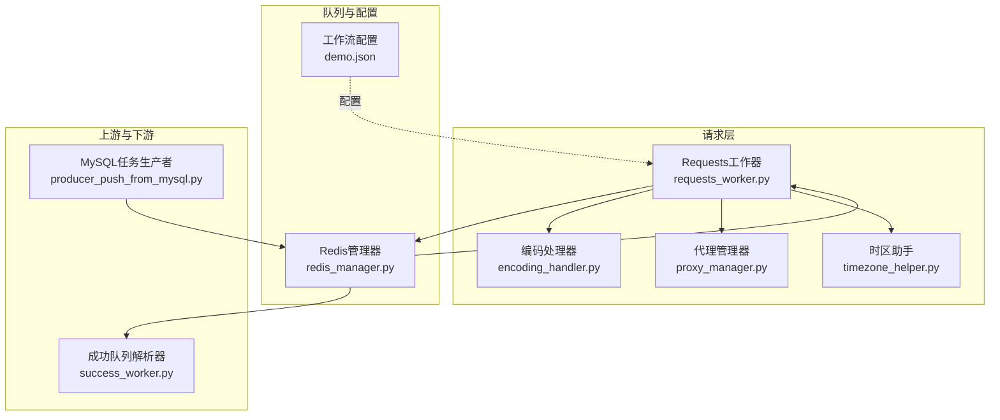
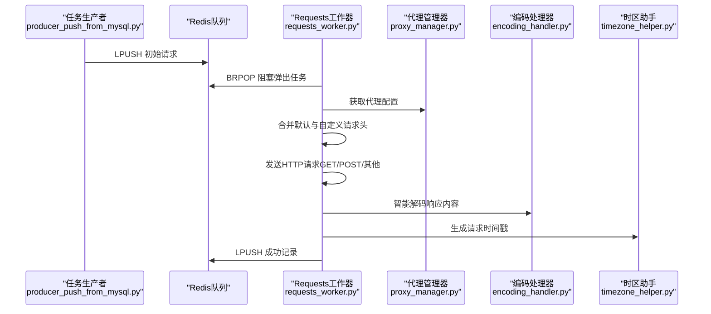
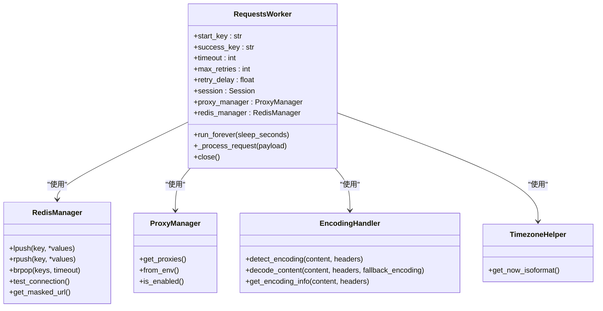
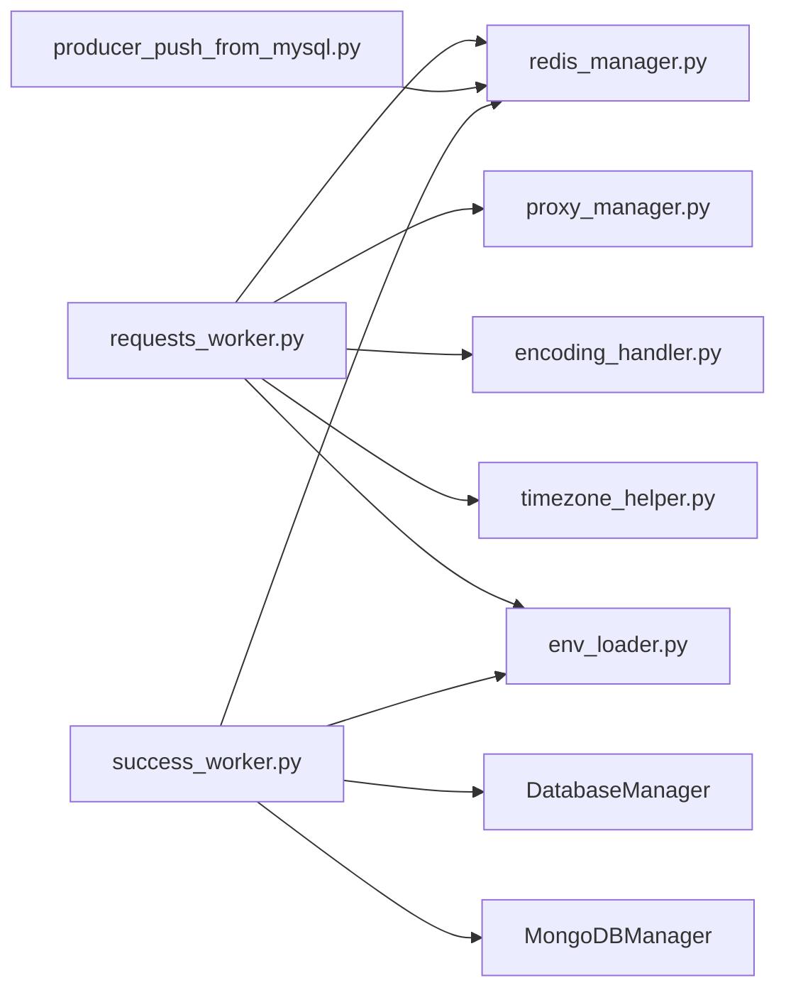

# Requests工作器

<cite>
**本文引用的文件**
- [requests_worker.py](file://requests_worker.py)
- [redis_manager.py](file://crawler/utils/redis_manager.py)
- [proxy_manager.py](file://crawler/utils/proxy_manager.py)
- [encoding_handler.py](file://crawler/utils/encoding_handler.py)
- [timezone_helper.py](file://crawler/utils/timezone_helper.py)
- [env_loader.py](file://crawler/utils/env_loader.py)
- [producer_push_from_mysql.py](file://producer_push_from_mysql.py)
- [success_worker.py](file://success_worker.py)
- [demo.json](file://demo.json)
- [README.md](file://README.md)
- [ENV_CONFIG.md](file://ENV_CONFIG.md)
</cite>

## 目录
1. [简介](#简介)
2. [项目结构](#项目结构)
3. [核心组件](#核心组件)
4. [架构总览](#架构总览)
5. [详细组件分析](#详细组件分析)
6. [依赖关系分析](#依赖关系分析)
7. [性能考量](#性能考量)
8. [故障排查指南](#故障排查指南)
9. [结论](#结论)
10. [附录](#附录)

## 简介
Requests工作器是一个独立的请求处理组件，使用Python requests库从Redis队列消费待请求任务，发送HTTP请求，处理响应编码，封装结果并写回Redis成功队列。它与Scrapy-Redis流水线配合，形成“请求层”和“解析层”的分离：请求层负责网络IO与编码处理，解析层负责按工作流推进、抽取链接与数据、持久化结果。

## 项目结构
- requests_worker.py：Requests工作器主入口，负责从Redis读取任务、发送请求、编码处理、写回结果。
- crawler/utils/redis_manager.py：Redis统一管理器，提供连接、阻塞弹出、LPUSH/RPUSH等操作。
- crawler/utils/proxy_manager.py：代理管理器，支持固定代理与动态代理（可缓存与刷新）。
- crawler/utils/encoding_handler.py：响应编码自动检测与智能解码。
- crawler/utils/timezone_helper.py：时间与时区辅助。
- crawler/utils/env_loader.py：.env文件加载器，自动定位项目根目录并加载环境变量。
- producer_push_from_mysql.py：从MySQL读取待请求，解析后推送到Redis队列。
- success_worker.py：消费成功队列，按demo.json的工作流推进，抽取链接/数据，持久化到数据库或Redis。
- demo.json：工作流配置示例，定义任务信息与步骤（请求、链接抽取、数据抽取）。
- README.md / ENV_CONFIG.md：项目使用说明与配置指南。

图表来源
- [requests_worker.py](file://requests_worker.py#L1-L327)
- [redis_manager.py](file://crawler/utils/redis_manager.py#L1-L345)
- [proxy_manager.py](file://crawler/utils/proxy_manager.py#L1-L239)
- [encoding_handler.py](file://crawler/utils/encoding_handler.py#L1-L235)
- [timezone_helper.py](file://crawler/utils/timezone_helper.py#L1-L67)
- [producer_push_from_mysql.py](file://producer_push_from_mysql.py#L1-L90)
- [success_worker.py](file://success_worker.py#L1-L363)
- [demo.json](file://demo.json#L1-L181)

章节来源
- [README.md](file://README.md#L1-L200)
- [ENV_CONFIG.md](file://ENV_CONFIG.md#L1-L120)

## 核心组件
- RequestsWorker：请求工作器主体，负责初始化Redis与代理、阻塞消费队列、发送HTTP请求、重试、编码处理、结果封装与写回。
- RedisManager：Redis客户端封装，提供连接、阻塞弹出、LPUSH/RPUSH、PING等常用操作。
- ProxyManager：代理管理器，支持静态与动态代理，支持缓存与刷新。
- EncodingHandler：响应编码自动检测与智能解码，支持从响应头、HTML meta标签、chardet检测等多源策略。
- TimezoneHelper：时间与时区辅助，生成ISO格式时间戳。
- EnvLoader：.env文件加载器，自动定位项目根目录并加载环境变量。
- ProducerPushFromMySQL：从MySQL读取待请求，解析后推送到Redis队列。
- SuccessWorker：消费成功队列，按工作流推进，抽取链接/数据，持久化到数据库或Redis。

章节来源
- [requests_worker.py](file://requests_worker.py#L23-L120)
- [redis_manager.py](file://crawler/utils/redis_manager.py#L1-L120)
- [proxy_manager.py](file://crawler/utils/proxy_manager.py#L1-L120)
- [encoding_handler.py](file://crawler/utils/encoding_handler.py#L1-L120)
- [timezone_helper.py](file://crawler/utils/timezone_helper.py#L1-L67)
- [env_loader.py](file://crawler/utils/env_loader.py#L1-L63)
- [producer_push_from_mysql.py](file://producer_push_from_mysql.py#L1-L90)
- [success_worker.py](file://success_worker.py#L1-L120)

## 架构总览
Requests工作器在流水线中的职责：
- 输入：Redis队列（默认键名来自环境变量）。
- 处理：requests会话复用、代理注入、超时与重试、响应编码处理。
- 输出：Redis成功队列（包含URL、状态码、响应头、正文、编码信息、错误等）。

图表来源
- [producer_push_from_mysql.py](file://producer_push_from_mysql.py#L60-L90)
- [requests_worker.py](file://requests_worker.py#L112-L295)
- [proxy_manager.py](file://crawler/utils/proxy_manager.py#L87-L120)
- [encoding_handler.py](file://crawler/utils/encoding_handler.py#L148-L235)
- [timezone_helper.py](file://crawler/utils/timezone_helper.py#L45-L54)

## 详细组件分析

### RequestsWorker 类
- 初始化参数与环境变量
  - start_key/success_key：队列键名，默认从环境变量读取；若未提供则使用默认值。
  - timeout/max_retries/retry_delay：请求超时、最大重试次数、重试延迟。
  - proxy_manager：代理管理器，支持静态/动态模式。
  - redis_manager：Redis管理器，支持从环境变量创建并测试连接。
- 运行机制
  - run_forever：持续阻塞从start_key读取任务，解析payload后调用_process_request。
  - _process_request：校验URL，合并headers，获取代理，发送请求（GET/POST/其他），处理重试，封装记录（包含URL、状态码、headers、body、meta、requested_at、error、编码信息等），写回success_key。
  - 编码处理：优先使用meta中指定编码，否则自动检测（响应头、HTML meta、chardet），并记录编码信息与是否重新编码。
  - 关闭：关闭requests会话。
- 关键行为
  - Redis连接测试与认证失败提示。
  - 代理启用打印与动态代理API、刷新间隔信息。
  - 重试策略：Timeout与RequestException可重试，达到最大次数后记录错误。
  - 结果记录字段：url/status/headers/body/meta/requested_at/error/encoding相关字段。

图表来源
- [requests_worker.py](file://requests_worker.py#L23-L120)
- [redis_manager.py](file://crawler/utils/redis_manager.py#L115-L174)
- [proxy_manager.py](file://crawler/utils/proxy_manager.py#L87-L120)
- [encoding_handler.py](file://crawler/utils/encoding_handler.py#L148-L235)
- [timezone_helper.py](file://crawler/utils/timezone_helper.py#L45-L54)

章节来源
- [requests_worker.py](file://requests_worker.py#L23-L120)
- [requests_worker.py](file://requests_worker.py#L140-L295)

### RedisManager 组件
- 连接与配置
  - 支持从URL或主机/端口/数据库/密码组合构建连接。
  - 提供test_connection/ping/lpush/rpush/brpop/get/set/delete/llen/keys/flushdb/close等常用操作。
  - 提供from_env/from_url/from_settings/get_instance等工厂方法。
  - get_masked_url用于日志脱敏显示。
- 使用要点
  - RequestsWorker通过brpop阻塞读取任务，lpush写回成功记录。
  - 连接失败时抛出异常并提示认证失败场景。

章节来源
- [redis_manager.py](file://crawler/utils/redis_manager.py#L1-L120)
- [redis_manager.py](file://crawler/utils/redis_manager.py#L145-L174)
- [redis_manager.py](file://crawler/utils/redis_manager.py#L280-L345)

### ProxyManager 组件
- 模式与配置
  - static：支持HTTP/HTTPS代理，或SOCKS5代理；SOCKS会覆盖HTTP/HTTPS。
  - dynamic：从API获取代理，支持GET/POST，可配置请求头与刷新间隔；支持缓存与回退。
- 解析策略
  - 支持多种响应格式：{"proxy": "..."}、{"http": "...","https": "..."}、{"host": "...","port": n}、纯字符串。
- 安全与提示
  - 代理地址脱敏显示；未知模式提示不使用代理。

章节来源
- [proxy_manager.py](file://crawler/utils/proxy_manager.py#L1-L120)
- [proxy_manager.py](file://crawler/utils/proxy_manager.py#L120-L215)
- [proxy_manager.py](file://crawler/utils/proxy_manager.py#L216-L239)

### EncodingHandler 组件
- 编码检测
  - 优先从响应头Content-Type提取charset；其次从HTML meta标签提取；再使用chardet检测；最后回退UTF-8。
- 智能解码
  - decode_content支持按检测结果或常见编码尝试解码，失败时回退。
- 编码信息
  - get_encoding_info返回编码、置信度、来源与使用的方法列表。

章节来源
- [encoding_handler.py](file://crawler/utils/encoding_handler.py#L1-L120)
- [encoding_handler.py](file://crawler/utils/encoding_handler.py#L148-L235)

### TimezoneHelper 组件
- 时区偏移默认+08:00，可通过环境变量TIMEZONE_OFFSET配置。
- 提供ISO格式时间戳与格式化字符串。

章节来源
- [timezone_helper.py](file://crawler/utils/timezone_helper.py#L1-L67)

### EnvLoader 组件
- 自动定位项目根目录并加载.env文件，支持调试输出。
- 与RequestsWorker在模块导入时自动加载环境变量。

章节来源
- [env_loader.py](file://crawler/utils/env_loader.py#L1-L63)

### ProducerPushFromMySQL 组件
- 从MySQL读取pending_requests表，解析headers/params/meta，组装payload并LPUSH到Redis队列。
- 从环境变量读取队列键名。

章节来源
- [producer_push_from_mysql.py](file://producer_push_from_mysql.py#L1-L90)

### SuccessWorker 组件
- 持续BRPOP成功队列，解析记录，按工作流推进：
  - link_extraction：抽取链接与上下文字段，拼接绝对URL，写入下一批请求。
  - data_extraction：抽取字段，构造数据项，优先写入MongoDB，其次MySQL，否则写入Redis数据队列。
  - 自定义代码：支持nextRequestCustomCode，执行后生成后续请求。
- 错误处理：异常时写入错误队列。

章节来源
- [success_worker.py](file://success_worker.py#L1-L120)
- [success_worker.py](file://success_worker.py#L120-L220)
- [success_worker.py](file://success_worker.py#L220-L363)

## 依赖关系分析

图表来源
- [requests_worker.py](file://requests_worker.py#L1-L120)
- [redis_manager.py](file://crawler/utils/redis_manager.py#L1-L120)
- [proxy_manager.py](file://crawler/utils/proxy_manager.py#L1-L120)
- [encoding_handler.py](file://crawler/utils/encoding_handler.py#L1-L120)
- [timezone_helper.py](file://crawler/utils/timezone_helper.py#L1-L67)
- [env_loader.py](file://crawler/utils/env_loader.py#L1-L63)
- [producer_push_from_mysql.py](file://producer_push_from_mysql.py#L1-L90)
- [success_worker.py](file://success_worker.py#L1-L120)

章节来源
- [requests_worker.py](file://requests_worker.py#L1-L120)
- [success_worker.py](file://success_worker.py#L1-L120)

## 性能考量
- 会话复用：使用requests.Session复用连接，减少TCP握手开销。
- 重试策略：超时与请求异常可重试，避免瞬时网络波动影响。
- 编码处理：先尝试meta与响应头，再使用chardet，减少不必要的解码尝试。
- 队列阻塞：BRPOP避免轮询，降低CPU占用。
- 代理缓存：动态代理支持刷新间隔缓存，减少API调用频率。

[本节为通用指导，无需列出具体文件来源]

## 故障排查指南
- Redis连接失败
  - 检查REDIS_URL格式与密码（含特殊字符需URL编码）。
  - 认证失败时会明确提示，检查密码配置与URL格式。
- 代理不生效
  - 确认PROXY_MODE设置为static或dynamic。
  - static模式需配置HTTP_PROXY/HTTPS_PROXY或SOCKS_PROXY。
  - dynamic模式需配置DYNAMIC_PROXY_API、方法与请求头，检查响应格式。
- 请求超时/异常
  - 调整REQUESTS_TIMEOUT、REQUESTS_MAX_RETRIES、REQUESTS_RETRY_DELAY。
  - 检查目标站点限流与反爬策略。
- 编码异常
  - 若meta指定编码失败，将回退自动检测；仍失败则使用回退编码。
  - 检查HTML meta与Content-Type头是否正确。
- 队列为空
  - 确认ProducerPushFromMySQL已将任务推送到start_key。
  - 使用redis-cli检查队列长度与内容。

章节来源
- [requests_worker.py](file://requests_worker.py#L63-L120)
- [ENV_CONFIG.md](file://ENV_CONFIG.md#L209-L375)
- [README.md](file://README.md#L408-L454)

## 结论
Requests工作器通过requests库与Redis队列实现了轻量级、可扩展的请求层，具备完善的代理、编码与错误处理能力。结合success_worker与demo.json工作流，可快速构建从请求到解析再到持久化的完整链路。对于单机或小规模场景，Requests工作器提供了比Scrapy更轻量的选择；对于大规模分布式场景，可结合Scrapy-Redis实现更高并发与更强的扩展性。

[本节为总结性内容，无需列出具体文件来源]

## 附录

### 接口与配置清单
- 环境变量（.env）
  - REDIS_URL：Redis连接URL（支持密码与特殊字符URL编码）。
  - MYSQL_*：MySQL连接参数（HOST/PORT/USER/PASSWORD/DB/CHARSET/POOL_SIZE/POOL_MAX_OVERFLOW）。
  - CONFIG_PATH：配置文件路径（默认demo.json）。
  - LOG_LEVEL：日志级别。
  - SCRAPY_START_KEY/SUCCESS_QUEUE_KEY/SUCCESS_ITEM_KEY/SUCCESS_ERROR_KEY：Redis队列键名。
  - PROXY_MODE：代理模式（static/dynamic）。
  - HTTP_PROXY/HTTPS_PROXY/SOCKS_PROXY：固定代理地址。
  - DYNAMIC_PROXY_API/DYNAMIC_PROXY_API_METHOD/DYNAMIC_PROXY_API_HEADERS：动态代理API配置。
  - DYNAMIC_PROXY_REFRESH_INTERVAL：动态代理刷新间隔。
  - TIMEZONE_OFFSET：时区偏移（小时）。
- RequestsWorker参数
  - redis_manager/start_key/success_key/timeout/max_retries/retry_delay/proxy_manager：均可通过构造函数或环境变量配置。
- 成功记录字段
  - url/status/headers/body/meta/requested_at/error/encoding相关字段（编码置信度、来源、是否重新编码等）。

章节来源
- [ENV_CONFIG.md](file://ENV_CONFIG.md#L1-L208)
- [requests_worker.py](file://requests_worker.py#L23-L120)
- [requests_worker.py](file://requests_worker.py#L230-L295)
- [demo.json](file://demo.json#L1-L181)