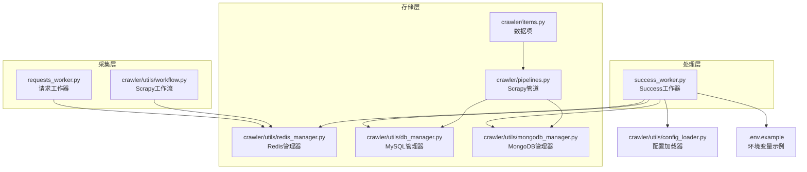
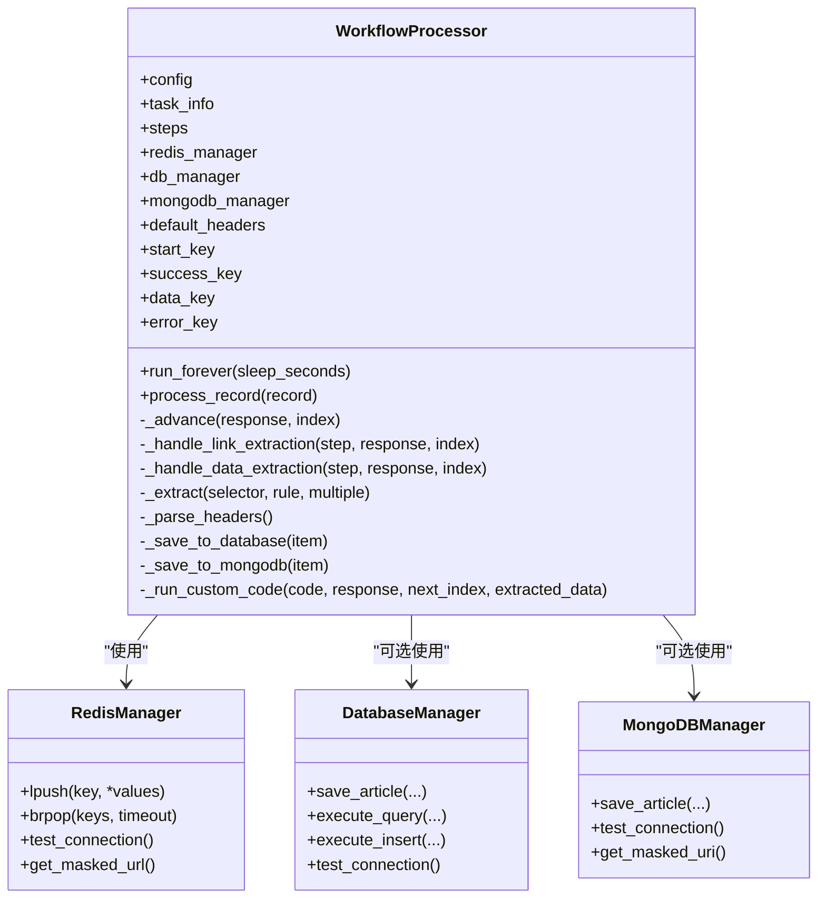
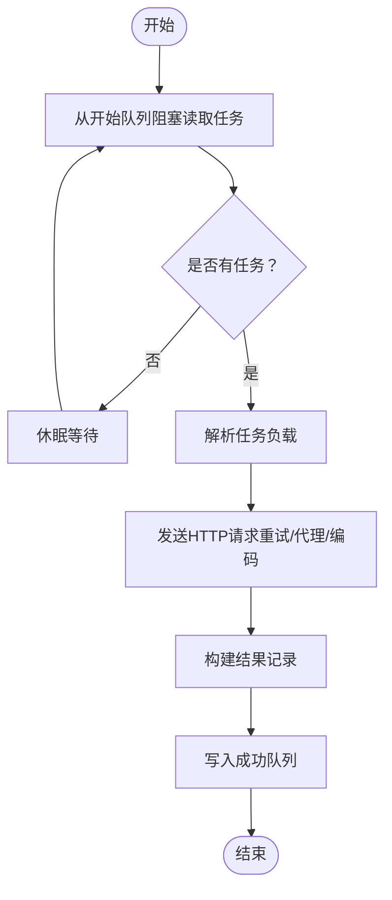
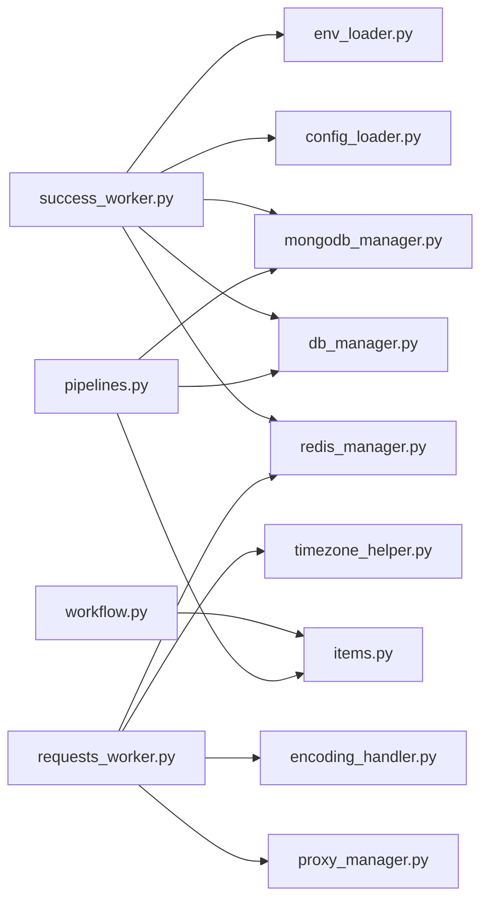

# Success工作器

<cite>
**本文引用的文件**
- [success_worker.py](file://success_worker.py)
- [requests_worker.py](file://requests_worker.py)
- [crawler/utils/workflow.py](file://crawler/utils/workflow.py)
- [crawler/utils/redis_manager.py](file://crawler/utils/redis_manager.py)
- [crawler/utils/db_manager.py](file://crawler/utils/db_manager.py)
- [crawler/utils/mongodb_manager.py](file://crawler/utils/mongodb_manager.py)
- [crawler/utils/config_loader.py](file://crawler/utils/config_loader.py)
- [crawler/utils/env_loader.py](file://crawler/utils/env_loader.py)
- [crawler/items.py](file://crawler/items.py)
- [crawler/pipelines.py](file://crawler/pipelines.py)
- [.env.example](file://.env.example)
- [demo.json](file://demo.json)
</cite>

## 目录
1. [简介](#简介)
2. [项目结构](#项目结构)
3. [核心组件](#核心组件)
4. [架构总览](#架构总览)
5. [详细组件分析](#详细组件分析)
6. [依赖关系分析](#依赖关系分析)
7. [性能考量](#性能考量)
8. [故障排查指南](#故障排查指南)
9. [结论](#结论)
10. [附录](#附录)

## 简介
Success工作器负责持续消费“成功队列”中的抓取结果，依据配置的流程步骤决定下一步请求或产出数据。它通过解析HTML响应，执行链接抽取、数据抽取等步骤，并将最终数据持久化到MongoDB、MySQL或Redis中。该组件与请求工作器、Redis、数据库管理器、配置加载器等协同工作，形成完整的采集-处理-存储流水线。

## 项目结构
Success工作器位于仓库根目录，主要文件与职责如下：
- success_worker.py：实现工作器核心逻辑，消费成功队列，推进工作流，保存数据
- requests_worker.py：使用requests库发起HTTP请求，将结果写入成功队列
- crawler/utils/workflow.py：Scrapy版工作流（与Success工作器共享流程思想）
- crawler/utils/redis_manager.py：Redis连接与操作封装
- crawler/utils/db_manager.py：MySQL连接与操作封装
- crawler/utils/mongodb_manager.py：MongoDB连接与操作封装
- crawler/utils/config_loader.py：配置文件加载
- crawler/utils/env_loader.py：.env文件加载
- crawler/items.py：数据项结构定义
- crawler/pipelines.py：Scrapy管道（与Success工作器数据存储策略一致）
- .env.example：环境变量配置示例
- demo.json：工作流配置示例



图表来源
- [success_worker.py](file://success_worker.py#L1-L363)
- [requests_worker.py](file://requests_worker.py#L1-L327)
- [crawler/utils/workflow.py](file://crawler/utils/workflow.py#L1-L157)
- [crawler/utils/redis_manager.py](file://crawler/utils/redis_manager.py#L1-L345)
- [crawler/utils/db_manager.py](file://crawler/utils/db_manager.py#L1-L618)
- [crawler/utils/mongodb_manager.py](file://crawler/utils/mongodb_manager.py#L1-L323)
- [crawler/utils/config_loader.py](file://crawler/utils/config_loader.py#L1-L16)
- [.env.example](file://.env.example#L1-L84)

章节来源
- [success_worker.py](file://success_worker.py#L1-L363)
- [requests_worker.py](file://requests_worker.py#L1-L327)
- [.env.example](file://.env.example#L1-L84)

## 核心组件
- WorkflowProcessor（Success工作器的核心类）
  - 负责从Redis成功队列读取记录，解析HTML，按步骤推进工作流，抽取链接或数据，保存到目标存储
  - 关键属性：config、task_info、steps、redis_manager、db_manager、mongodb_manager、default_headers
  - 关键方法：run_forever、process_record、_advance、_handle_link_extraction、_handle_data_extraction、_extract、_parse_headers、_save_to_database、_save_to_mongodb、_run_custom_code
- RedisManager：统一Redis连接与操作（lpush、brpop、exists等）
- DatabaseManager：MySQL连接与操作（save_article、查询、统计等）
- MongoDBManager：MongoDB连接与操作（save_article、查询、统计等）
- ConfigLoader：加载demo.json等配置文件
- EnvLoader：加载.env文件
- Scrapy工作流（workflow.py）：与Success工作器共享流程思想，用于Scrapy爬虫

章节来源
- [success_worker.py](file://success_worker.py#L23-L363)
- [crawler/utils/redis_manager.py](file://crawler/utils/redis_manager.py#L1-L345)
- [crawler/utils/db_manager.py](file://crawler/utils/db_manager.py#L1-L618)
- [crawler/utils/mongodb_manager.py](file://crawler/utils/mongodb_manager.py#L1-L323)
- [crawler/utils/config_loader.py](file://crawler/utils/config_loader.py#L1-L16)
- [crawler/utils/env_loader.py](file://crawler/utils/env_loader.py#L1-L63)
- [crawler/utils/workflow.py](file://crawler/utils/workflow.py#L1-L157)

## 架构总览
Success工作器与请求工作器通过Redis队列协作：
- 请求工作器从开始队列读取任务，发送HTTP请求，将结果写入成功队列
- Success工作器从成功队列读取结果，解析HTML，按配置的步骤抽取链接或数据，必要时生成新的请求并写回开始队列
- 数据最终写入MongoDB、MySQL或Redis，具体取决于配置与可用性

```mermaid
sequenceDiagram
participant RQ as "请求工作器<br/>requests_worker.py"
participant RM as "Redis管理器<br/>redis_manager.py"
participant SW as "Success工作器<br/>success_worker.py"
participant DB as "MySQL管理器<br/>db_manager.py"
participant MDB as "MongoDB管理器<br/>mongodb_manager.py"
RQ->>RM : 从开始队列阻塞读取任务
RQ->>RQ : 发送HTTP请求重试、代理、编码处理
RQ->>RM : 将结果写入成功队列
SW->>RM : 从成功队列阻塞读取记录
SW->>SW : 解析HTML、推进工作流步骤
alt 最后一步且无自定义代码
opt MongoDB可用
SW->>MDB : 保存文章
else MySQL可用
SW->>DB : 保存文章
else Redis可用
SW->>RM : 写入数据队列
end
else 非最后一步或有自定义代码
SW->>RM : 写入数据队列
SW->>SW : 执行自定义代码生成后续请求
SW->>RM : 将新请求写回开始队列
end
```

图表来源
- [requests_worker.py](file://requests_worker.py#L100-L295)
- [success_worker.py](file://success_worker.py#L37-L172)
- [crawler/utils/redis_manager.py](file://crawler/utils/redis_manager.py#L145-L159)
- [crawler/utils/db_manager.py](file://crawler/utils/db_manager.py#L139-L217)
- [crawler/utils/mongodb_manager.py](file://crawler/utils/mongodb_manager.py#L134-L194)

## 详细组件分析

### Success工作器类（WorkflowProcessor）
- 初始化与配置
  - 从配置文件加载workflowSteps与taskInfo
  - 从环境变量读取队列键（开始队列、成功队列、数据队列、错误队列）
  - 解析请求阶段的默认headers（支持从配置中读取JSON）
- 运行机制
  - run_forever：持续从成功队列阻塞读取，解析记录并处理
  - process_record：解析响应体为Selector，构建响应上下文，调用_advance推进步骤
  - _advance：顺序遍历步骤，遇到link_extraction或data_extraction即停止并处理
- 步骤处理
  - _handle_link_extraction：根据规则抽取链接，构造新请求，写回开始队列
  - _handle_data_extraction：根据规则抽取数据，构建数据项，按优先级保存到MongoDB、MySQL或Redis
- 数据保存策略
  - _save_to_mongodb：优先使用MongoDB，失败回退到错误队列
  - _save_to_database：优先使用MySQL，失败回退到错误队列
  - 无数据库可用时，写入Redis数据队列
- 自定义代码
  - _run_custom_code：安全执行用户提供的自定义代码，生成后续请求并注入meta



图表来源
- [success_worker.py](file://success_worker.py#L23-L363)
- [crawler/utils/redis_manager.py](file://crawler/utils/redis_manager.py#L1-L345)
- [crawler/utils/db_manager.py](file://crawler/utils/db_manager.py#L1-L618)
- [crawler/utils/mongodb_manager.py](file://crawler/utils/mongodb_manager.py#L1-L323)

章节来源
- [success_worker.py](file://success_worker.py#L23-L363)

### 请求工作器（RequestsWorker）
- 初始化：加载.env，建立Redis连接，创建requests会话，设置默认UA，打印代理配置
- 运行：run_forever持续从开始队列读取任务，发送HTTP请求（GET/POST/其他），处理重试、代理、编码
- 结果：将响应包装为记录，写入成功队列；记录包含URL、状态码、头部、正文、meta、编码信息等



图表来源
- [requests_worker.py](file://requests_worker.py#L99-L295)

章节来源
- [requests_worker.py](file://requests_worker.py#L1-L327)

### Scrapy工作流（WorkflowRunner）
- 与Success工作器共享流程思想：初始请求、链接抽取、数据抽取、自定义代码生成请求
- 用于Scrapy爬虫场景，与Success工作器的步骤推进逻辑一致

章节来源
- [crawler/utils/workflow.py](file://crawler/utils/workflow.py#L1-L157)

### 数据存储与管道
- Success工作器的数据保存优先级：MongoDB > MySQL > Redis
- Scrapy管道（MySQLStorePipeline）同样遵循MongoDB优先策略
- 数据项结构：ArticleItem（task_id、title、link、content、source_url、extra）

章节来源
- [success_worker.py](file://success_worker.py#L147-L172)
- [crawler/pipelines.py](file://crawler/pipelines.py#L1-L105)
- [crawler/items.py](file://crawler/items.py#L1-L12)

## 依赖关系分析
- Success工作器依赖
  - RedisManager：队列读写、连接测试
  - DatabaseManager：MySQL保存
  - MongoDBManager：MongoDB保存
  - ConfigLoader：配置加载
  - EnvLoader：.env加载
- 请求工作器依赖
  - RedisManager：队列读写、连接测试
  - ProxyManager：代理管理
  - EncodingHandler：编码处理
  - TimezoneHelper：时间戳
- Scrapy工作流与管道
  - WorkflowRunner：Scrapy版工作流
  - MySQLStorePipeline：Scrapy管道
  - ArticleItem：数据项



图表来源
- [success_worker.py](file://success_worker.py#L1-L363)
- [requests_worker.py](file://requests_worker.py#L1-L327)
- [crawler/utils/workflow.py](file://crawler/utils/workflow.py#L1-L157)
- [crawler/pipelines.py](file://crawler/pipelines.py#L1-L105)
- [crawler/items.py](file://crawler/items.py#L1-L12)

## 性能考量
- 队列轮询与阻塞
  - run_forever与run_forever均使用阻塞式读取（brpop），减少CPU占用
- 连接池与会话
  - RequestsWorker使用requests.Session复用连接，降低握手开销
  - DatabaseManager使用SQLAlchemy连接池，提升并发写入效率
- 编码处理
  - 请求工作器先尝试自定义编码，再自动检测，避免重复解码
- 重试与延迟
  - 请求工作器支持最大重试次数与重试延迟，平衡稳定性与吞吐
- 优先级存储
  - Success工作器优先使用MongoDB，其次MySQL，最后Redis，减少跨组件耦合

[本节为通用指导，无需列出具体文件来源]

## 故障排查指南
- Redis连接失败
  - 现象：认证失败或连接失败提示
  - 排查：检查REDIS_URL格式、密码、网络连通性；确认.env文件已加载
  - 参考路径：[success_worker.py](file://success_worker.py#L306-L359)、[requests_worker.py](file://requests_worker.py#L63-L82)
- 数据库连接失败
  - 现象：MySQL或MongoDB连接失败提示
  - 排查：检查数据库配置、网络、凭据；确认数据库服务可用
  - 参考路径：[success_worker.py](file://success_worker.py#L328-L355)、[crawler/utils/db_manager.py](file://crawler/utils/db_manager.py#L91-L102)、[crawler/utils/mongodb_manager.py](file://crawler/utils/mongodb_manager.py#L97-L113)
- 配置文件缺失或格式错误
  - 现象：配置加载报错
  - 排查：确认demo.json存在且包含taskInfo与workflowSteps
  - 参考路径：[crawler/utils/config_loader.py](file://crawler/utils/config_loader.py#L6-L16)
- 代理问题
  - 现象：请求超时或被拒绝
  - 排查：检查代理模式与代理地址；动态代理需确认API可用
  - 参考路径：[requests_worker.py](file://requests_worker.py#L160-L206)、[crawler/utils/env_loader.py](file://crawler/utils/env_loader.py#L1-L63)
- 编码异常
  - 现象：内容乱码或编码信息缺失
  - 排查：确认meta.encoding或自动检测逻辑；检查响应头
  - 参考路径：[requests_worker.py](file://requests_worker.py#L241-L287)

章节来源
- [success_worker.py](file://success_worker.py#L306-L359)
- [requests_worker.py](file://requests_worker.py#L63-L295)
- [crawler/utils/config_loader.py](file://crawler/utils/config_loader.py#L6-L16)
- [crawler/utils/db_manager.py](file://crawler/utils/db_manager.py#L91-L102)
- [crawler/utils/mongodb_manager.py](file://crawler/utils/mongodb_manager.py#L97-L113)
- [crawler/utils/env_loader.py](file://crawler/utils/env_loader.py#L1-L63)

## 结论
Success工作器通过清晰的步骤化流程与稳定的队列机制，实现了从请求到数据产出与存储的完整闭环。其优先级存储策略与可选的自定义代码扩展能力，使其既能满足常规采集需求，又能灵活适配复杂业务场景。配合请求工作器与数据库管理器，整体系统具备良好的可维护性与扩展性。

[本节为总结性内容，无需列出具体文件来源]

## 附录

### 配置选项与参数
- 环境变量（.env）
  - REDIS_URL：Redis连接URL
  - MYSQL_HOST/PORT/USER/PASSWORD/DB/CHARSET/POOL_SIZE/POOL_MAX_OVERFLOW：MySQL配置
  - MONGODB_URI/MONGODB_DB/MONGODB_COLLECTION：MongoDB配置
  - CONFIG_PATH：配置文件路径（默认demo.json）
  - SCRAPY_START_KEY/SUCCESS_QUEUE_KEY/SUCCESS_ITEM_KEY/SUCCESS_ERROR_KEY：队列键
  - REQUESTS_TIMEOUT/REQUESTS_MAX_RETRIES/REQUESTS_RETRY_DELAY/REQUESTS_SLEEP：请求工作器参数
  - PROXY_MODE/HTTP_PROXY/HTTPS_PROXY/SOCKS_PROXY/DYNAMIC_PROXY_API等：代理配置
  - 参考路径：[.env.example](file://.env.example#L1-L84)
- 配置文件（demo.json）
  - taskInfo：任务基本信息（id、name、baseUrl、concurrency、requestInterval等）
  - workflowSteps：工作流步骤数组，支持request、link_extraction、data_extraction
  - 参考路径：[demo.json](file://demo.json#L1-L181)

章节来源
- [.env.example](file://.env.example#L1-L84)
- [demo.json](file://demo.json#L1-L181)

### 接口与返回值
- Redis操作
  - lpush/rpush/brpop：列表操作，返回写入后长度或弹出的(key, value)
  - 参考路径：[crawler/utils/redis_manager.py](file://crawler/utils/redis_manager.py#L115-L159)
- 数据保存
  - MongoDB：save_article返回文档ID或None
  - MySQL：save_article返回文章ID或抛出异常
  - 参考路径：[crawler/utils/mongodb_manager.py](file://crawler/utils/mongodb_manager.py#L134-L194)、[crawler/utils/db_manager.py](file://crawler/utils/db_manager.py#L139-L217)

### 使用模式
- 基础模式：配置demo.json，启动请求工作器与Success工作器，数据自动落库
- 自定义代码：在data_extraction步骤配置nextRequestCustomCode，生成后续请求
- 代理模式：配置静态或动态代理，提升稳定性与匿名性
- 参考路径：[success_worker.py](file://success_worker.py#L168-L172)、[requests_worker.py](file://requests_worker.py#L160-L206)