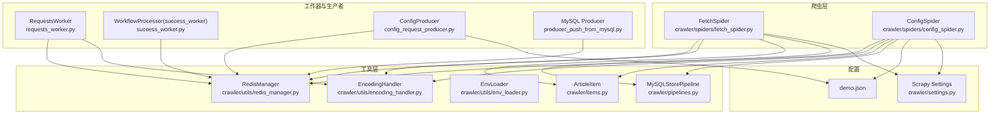
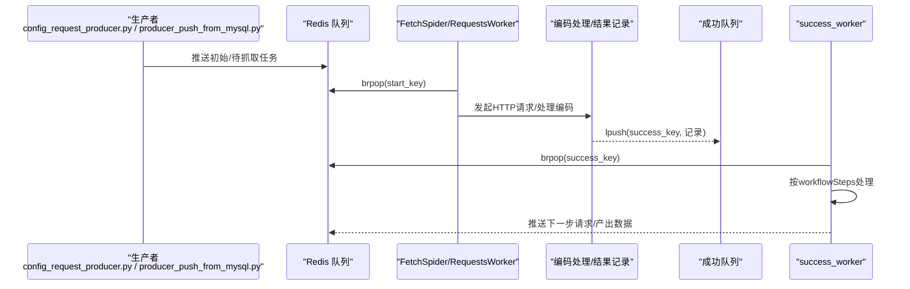
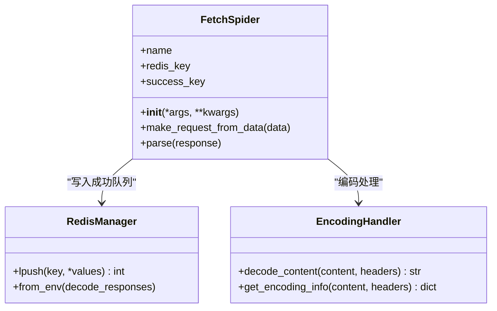
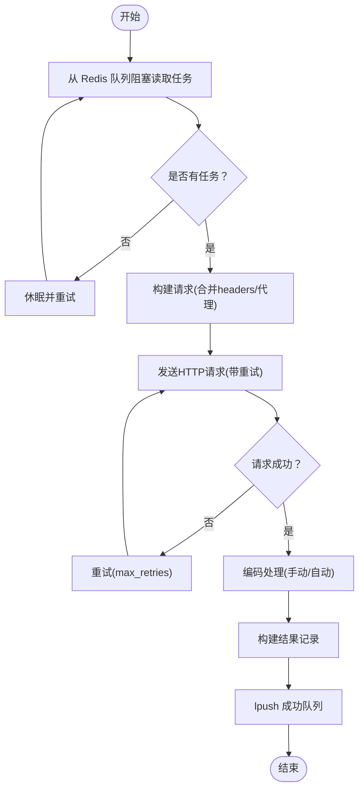
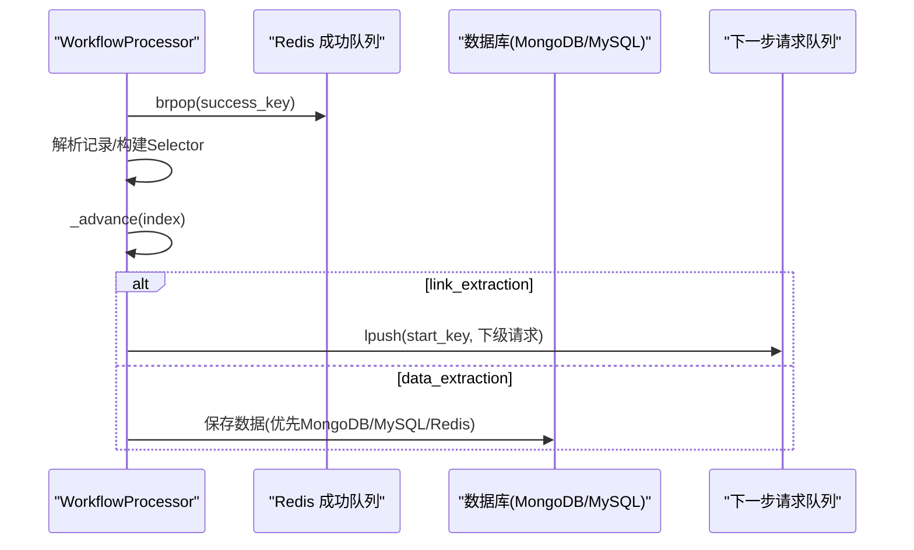
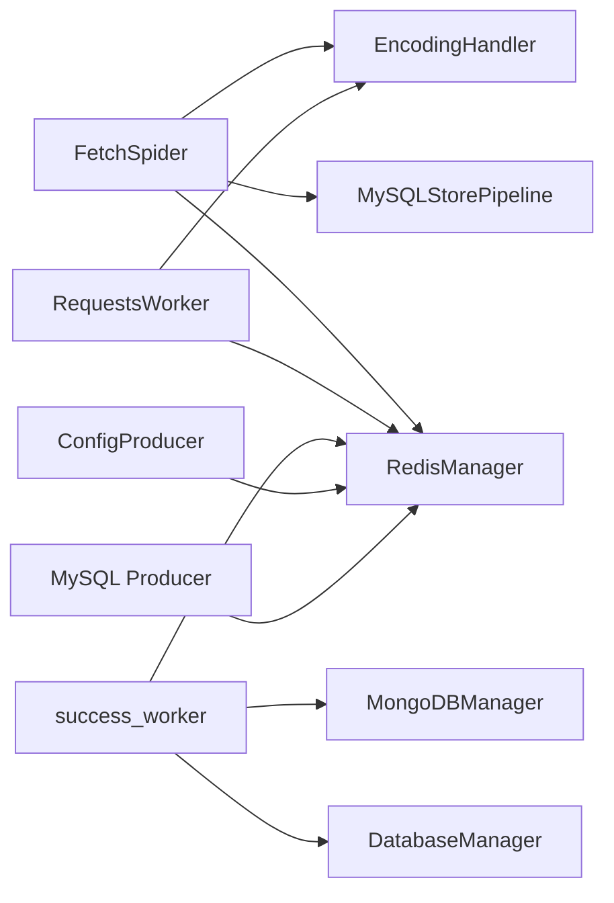

# 仅请求爬虫

<cite>
**本文引用的文件**
- [crawler/spiders/fetch_spider.py](file://crawler/spiders/fetch_spider.py)
- [crawler/spiders/config_spider.py](file://crawler/spiders/config_spider.py)
- [crawler/utils/encoding_handler.py](file://crawler/utils/encoding_handler.py)
- [crawler/utils/redis_manager.py](file://crawler/utils/redis_manager.py)
- [crawler/utils/env_loader.py](file://crawler/utils/env_loader.py)
- [crawler/settings.py](file://crawler/settings.py)
- [crawler/items.py](file://crawler/items.py)
- [crawler/pipelines.py](file://crawler/pipelines.py)
- [requests_worker.py](file://requests_worker.py)
- [success_worker.py](file://success_worker.py)
- [config_request_producer.py](file://config_request_producer.py)
- [producer_push_from_mysql.py](file://producer_push_from_mysql.py)
- [demo.json](file://demo.json)
</cite>

## 目录
1. [简介](#简介)
2. [项目结构](#项目结构)
3. [核心组件](#核心组件)
4. [架构总览](#架构总览)
5. [详细组件分析](#详细组件分析)
6. [依赖关系分析](#依赖关系分析)
7. [性能考量](#性能考量)
8. [故障排查指南](#故障排查指南)
9. [结论](#结论)
10. [附录](#附录)

## 简介
本节聚焦“仅请求爬虫”子功能，即通过 Scrapy-Redis 的 RedisSpider 实现从 Redis 队列拉取请求负载，完成 HTTP 请求、编码处理与结果落盘的流水线。该子功能强调：
- 从 Redis 队列消费任务，支持分布式扩展
- 自动/手动编码检测与解码，保证响应体可读性
- 将成功结果序列化后写入 Redis 成功队列，供后续工作器处理
- 与配置驱动的工作流（workflow）配合，形成“请求 -> 解析 -> 下一步”的闭环

## 项目结构
围绕“仅请求爬虫”，涉及以下关键文件与职责：
- 爬虫层
  - fetch_spider：基于 RedisSpider 的请求爬虫，负责从 Redis 队列读取任务并发起请求，处理编码，将结果写回 Redis 成功队列
  - config_spider：基于 RedisSpider 的配置驱动爬虫，按 workflowSteps 顺序执行链接提取与数据抽取
- 工具层
  - encoding_handler：编码检测与解码工具
  - redis_manager：Redis 连接与队列操作封装
  - env_loader：.env 环境变量加载
  - items/pipelines：数据项与存储管道（MySQL/MongoDB）
- 工作器与生产者
  - requests_worker：纯 requests 版本的请求工作器，与 fetch_spider 并行存在，同样从 Redis 队列消费任务
  - success_worker：消费 fetch_spider 成功队列，按 workflow 执行下一步或产出数据
  - config_request_producer：根据 demo.json 生成初始请求并推送到 Redis
  - producer_push_from_mysql：从 MySQL 表读取待抓取请求并推送到 Redis

图表来源
- [crawler/spiders/fetch_spider.py](file://crawler/spiders/fetch_spider.py#L1-L100)
- [crawler/spiders/config_spider.py](file://crawler/spiders/config_spider.py#L1-L325)
- [crawler/utils/encoding_handler.py](file://crawler/utils/encoding_handler.py#L1-L235)
- [crawler/utils/redis_manager.py](file://crawler/utils/redis_manager.py#L1-L345)
- [crawler/utils/env_loader.py](file://crawler/utils/env_loader.py#L1-L63)
- [crawler/items.py](file://crawler/items.py#L1-L12)
- [crawler/pipelines.py](file://crawler/pipelines.py#L1-L105)
- [requests_worker.py](file://requests_worker.py#L1-L327)
- [success_worker.py](file://success_worker.py#L1-L363)
- [config_request_producer.py](file://config_request_producer.py#L1-L77)
- [producer_push_from_mysql.py](file://producer_push_from_mysql.py#L1-L90)
- [demo.json](file://demo.json#L1-L181)
- [crawler/settings.py](file://crawler/settings.py#L1-L54)

章节来源
- [crawler/spiders/fetch_spider.py](file://crawler/spiders/fetch_spider.py#L1-L100)
- [crawler/spiders/config_spider.py](file://crawler/spiders/config_spider.py#L1-L325)
- [crawler/utils/encoding_handler.py](file://crawler/utils/encoding_handler.py#L1-L235)
- [crawler/utils/redis_manager.py](file://crawler/utils/redis_manager.py#L1-L345)
- [crawler/utils/env_loader.py](file://crawler/utils/env_loader.py#L1-L63)
- [crawler/items.py](file://crawler/items.py#L1-L12)
- [crawler/pipelines.py](file://crawler/pipelines.py#L1-L105)
- [requests_worker.py](file://requests_worker.py#L1-L327)
- [success_worker.py](file://success_worker.py#L1-L363)
- [config_request_producer.py](file://config_request_producer.py#L1-L77)
- [producer_push_from_mysql.py](file://producer_push_from_mysql.py#L1-L90)
- [demo.json](file://demo.json#L1-L181)
- [crawler/settings.py](file://crawler/settings.py#L1-L54)

## 核心组件
- FetchSpider（仅请求爬虫）
  - 从 Redis 队列键读取任务，构造 Scrapy Request，回调 parse
  - 在 parse 中处理响应编码（优先手动指定，否则自动检测），将结果序列化为记录并写入成功队列
- EncodingHandler（编码处理）
  - 从响应头、HTML meta、chardet 等多源检测编码，提供智能解码与编码信息
- RedisManager（Redis 管理）
  - 统一连接与队列操作（lpush/rpush/brpop 等），支持从环境变量/URL/Settings 构造
- RequestsWorker（requests 版本请求工作器）
  - 与 FetchSpider 并行，从 Redis 队列消费任务，使用 requests 发起 HTTP 请求，处理编码，写回成功队列
- success_worker（成功队列处理器）
  - 消费成功队列，按 workflowSteps 执行链接提取/数据抽取/自定义请求生成，最终产出数据或继续推进流程
- 配置与生产者
  - config_request_producer：根据 demo.json 生成初始请求并推送到 Redis
  - producer_push_from_mysql：从 MySQL 表读取待抓取请求并推送到 Redis

章节来源
- [crawler/spiders/fetch_spider.py](file://crawler/spiders/fetch_spider.py#L1-L100)
- [crawler/utils/encoding_handler.py](file://crawler/utils/encoding_handler.py#L1-L235)
- [crawler/utils/redis_manager.py](file://crawler/utils/redis_manager.py#L1-L345)
- [requests_worker.py](file://requests_worker.py#L1-L327)
- [success_worker.py](file://success_worker.py#L1-L363)
- [config_request_producer.py](file://config_request_producer.py#L1-L77)
- [producer_push_from_mysql.py](file://producer_push_from_mysql.py#L1-L90)

## 架构总览
“仅请求爬虫”采用“请求 -> 编码处理 -> 成功队列 -> 工作流处理”的链路，支持两种请求执行路径：
- Scrapy-Redis：FetchSpider 从 Redis 队列消费任务，parse 中完成编码处理并写回成功队列
- requests-worker：独立进程使用 requests 发起请求，同样写回成功队列，供 success_worker 消费

图表来源
- [config_request_producer.py](file://config_request_producer.py#L1-L77)
- [producer_push_from_mysql.py](file://producer_push_from_mysql.py#L1-L90)
- [crawler/spiders/fetch_spider.py](file://crawler/spiders/fetch_spider.py#L1-L100)
- [requests_worker.py](file://requests_worker.py#L1-L327)
- [success_worker.py](file://success_worker.py#L1-L363)

## 详细组件分析

### FetchSpider（仅请求爬虫）
- 关键点
  - 从环境变量/kwargs读取成功队列键，默认为 fetch_spider:success
  - 从 Redis 队列键 fetch_spider:start_urls 消费任务，构造 Scrapy Request
  - parse 中优先使用 meta.encoding 指定的编码，否则自动检测；将结果记录（url/status/headers/body/encoding/meta/requested_at）写入成功队列
- 接口与参数
  - 构造函数参数：success_key（可从 kwargs 或环境变量读取）
  - make_request_from_data：从 Redis 读取的 JSON 负载解析为 Scrapy Request
  - parse：处理响应编码与记录落盘
- 返回值
  - 无直接返回，通过 Redis 成功队列输出记录

图表来源
- [crawler/spiders/fetch_spider.py](file://crawler/spiders/fetch_spider.py#L1-L100)
- [crawler/utils/redis_manager.py](file://crawler/utils/redis_manager.py#L1-L345)
- [crawler/utils/encoding_handler.py](file://crawler/utils/encoding_handler.py#L1-L235)

章节来源
- [crawler/spiders/fetch_spider.py](file://crawler/spiders/fetch_spider.py#L1-L100)

### RequestsWorker（requests 版本请求工作器）
- 关键点
  - 从环境变量/RedisManager初始化，阻塞从 start_key 读取任务
  - 使用 requests 发起 GET/POST/其他 HTTP 方法请求，合并默认与自定义 headers，支持代理
  - 处理编码：优先 meta.encoding，否则自动检测；必要时替换 body 文本
  - 将结果记录（url/status/headers/body/meta/requested_at/error/encoding_info）写入 success_key
- 接口与参数
  - 构造函数：redis_manager/start_key/success_key/timeout/max_retries/retry_delay/proxy_manager
  - run_forever：持续监听队列
  - _process_request：单任务处理
- 返回值
  - 无直接返回，通过 Redis 成功队列输出记录

图表来源
- [requests_worker.py](file://requests_worker.py#L1-L327)
- [crawler/utils/encoding_handler.py](file://crawler/utils/encoding_handler.py#L1-L235)
- [crawler/utils/redis_manager.py](file://crawler/utils/redis_manager.py#L1-L345)

章节来源
- [requests_worker.py](file://requests_worker.py#L1-L327)

### success_worker（成功队列处理器）
- 关键点
  - 从 success_key 消费记录，按 workflowSteps 顺序推进
  - 支持链接提取（link_extraction）、数据抽取（data_extraction）、自定义请求生成（nextRequestCustomCode）
  - 最终将数据写入 MongoDB/MySQL/Redis（按优先级与可用性选择）
- 接口与参数
  - 构造函数：config/redis_manager/db_manager/mongodb_manager
  - run_forever/process_record/_advance/_handle_link_extraction/_handle_data_extraction/_run_custom_code
- 返回值
  - 无直接返回，通过数据库或 Redis 输出数据

图表来源
- [success_worker.py](file://success_worker.py#L1-L363)

章节来源
- [success_worker.py](file://success_worker.py#L1-L363)

### 编码处理（EncodingHandler）
- 关键点
  - 多源检测：响应头 Content-Type、HTML meta、chardet
  - 规范化编码名称，常见编码回退
  - 提供 decode_content 与 get_encoding_info
- 接口与参数
  - detect_encoding/content/meta/normalize
  - decode_content(content, headers, fallback_encoding)
  - get_encoding_info(content, headers)
- 返回值
  - decode_content 返回字符串
  - get_encoding_info 返回包含 encoding/confidence/source/methods 的字典

章节来源
- [crawler/utils/encoding_handler.py](file://crawler/utils/encoding_handler.py#L1-L235)

### Redis 管理（RedisManager）
- 关键点
  - 支持从 URL/环境变量/Settings 构造连接
  - 提供 lpush/rpush/brpop/blpop/get/set/delete/keys/llen/flushdb/test_connection/close 等常用操作
  - 提供 from_env/from_url/from_settings/get_instance 等便捷工厂方法
- 接口与参数
  - 构造函数：redis_url/host/port/db/password/decode_responses/auto_connect
  - 工厂方法：from_env/from_url/from_settings/get_instance
  - 常用方法：lpush/rpush/brpop/blpop/get/set/delete/keys/llen/flushdb/test_connection/close
- 返回值
  - 多数方法返回 Redis 原生命令结果类型

章节来源
- [crawler/utils/redis_manager.py](file://crawler/utils/redis_manager.py#L1-L345)

### 配置与生产者
- config_request_producer
  - 从 demo.json 读取 taskInfo.baseUrl 与 workflowSteps，校验首步必须为 request，生成初始 payload 并推送到 start_key
- producer_push_from_mysql
  - 从 MySQL 表 pending_requests 读取待抓取请求，解析 headers_json/params_json/meta_json，推送到 start_key

章节来源
- [config_request_producer.py](file://config_request_producer.py#L1-L77)
- [producer_push_from_mysql.py](file://producer_push_from_mysql.py#L1-L90)
- [demo.json](file://demo.json#L1-L181)

## 依赖关系分析
- 组件耦合
  - FetchSpider 依赖 RedisManager 与 EncodingHandler，输出到 Redis 成功队列
  - success_worker 依赖 RedisManager、数据库管理器（可选）与配置
  - RequestsWorker 独立于 Scrapy，但共享相同的 Redis 队列契约
- 外部依赖
  - Redis：队列与持久化
  - MySQL/MongoDB：数据存储（可选）
  - requests/chardet/parcels：网络请求、编码检测、选择器
- 环境变量
  - REDIS_URL、MYSQL_*、LOG_LEVEL、CONFIG_PATH、SCRAPY_START_KEY、SUCCESS_QUEUE_KEY、REQUESTS_* 等

图表来源
- [crawler/spiders/fetch_spider.py](file://crawler/spiders/fetch_spider.py#L1-L100)
- [requests_worker.py](file://requests_worker.py#L1-L327)
- [success_worker.py](file://success_worker.py#L1-L363)
- [config_request_producer.py](file://config_request_producer.py#L1-L77)
- [producer_push_from_mysql.py](file://producer_push_from_mysql.py#L1-L90)

章节来源
- [crawler/spiders/fetch_spider.py](file://crawler/spiders/fetch_spider.py#L1-L100)
- [requests_worker.py](file://requests_worker.py#L1-L327)
- [success_worker.py](file://success_worker.py#L1-L363)
- [config_request_producer.py](file://config_request_producer.py#L1-L77)
- [producer_push_from_mysql.py](file://producer_push_from_mysql.py#L1-L90)

## 性能考量
- 并发与去重
  - Scrapy-Redis 使用 DUPEFILTER_CLASS 为 BaseDupeFilter，允许重复 URL 进入队列，适合“仅请求爬虫”的去重策略
- 编码处理
  - 自动检测与常见编码回退，减少乱码导致的解析失败
- 队列与持久化
  - Redis 列表操作为 O(1)，适合高吞吐场景；MongoDB/MySQL 作为最终落盘，注意连接池与事务开销
- 代理与超时
  - RequestsWorker 支持动态代理与超时/重试配置，可根据目标站点调整

[本节为通用建议，无需列出具体文件来源]

## 故障排查指南
- Redis 连接失败
  - 检查 REDIS_URL 格式与认证信息；确认 Redis 服务运行
  - 参考 RequestsWorker/ConfigProducer/producer_push_from_mysql 的连接测试与错误提示
- 编码乱码
  - 在请求/响应的 meta 中显式指定 encoding；或依赖自动检测
  - 使用 EncodingHandler 的 get_encoding_info 查看检测来源与置信度
- 数据未落库
  - 确认 MySQL/MongoDB 配置与连接；若均不可用，数据将写入 Redis 队列
- 队列为空或积压
  - 使用 redis-cli 查看队列长度与内容，核对 start_key/success_key/data_key/error_key

章节来源
- [requests_worker.py](file://requests_worker.py#L1-L327)
- [success_worker.py](file://success_worker.py#L1-L363)
- [crawler/utils/redis_manager.py](file://crawler/utils/redis_manager.py#L1-L345)
- [crawler/utils/encoding_handler.py](file://crawler/utils/encoding_handler.py#L1-L235)
- [crawler/pipelines.py](file://crawler/pipelines.py#L1-L105)

## 结论
“仅请求爬虫”通过 FetchSpider/RequestsWorker 两条路径实现请求与编码处理，借助 Redis 队列实现分布式扩展；success_worker 则按配置驱动的工作流推进到数据抽取与落库阶段。该设计具备良好的可扩展性与容错能力，适合在复杂业务场景中快速落地。

[本节为总结性内容，无需列出具体文件来源]

## 附录

### 配置选项与参数清单
- 环境变量
  - REDIS_URL：Redis 连接串
  - MYSQL_HOST/PORT/USER/PASSWORD/DB/CHARSET/POOL_SIZE/POOL_MAX_OVERFLOW：MySQL 连接参数
  - LOG_LEVEL：日志级别
  - CONFIG_PATH：配置文件路径（默认 demo.json）
  - SCRAPY_START_KEY：待请求队列键（默认 fetch_spider:start_urls）
  - SUCCESS_QUEUE_KEY：成功队列键（默认 fetch_spider:success）
  - REQUESTS_TIMEOUT/REQUESTS_MAX_RETRIES/REQUESTS_RETRY_DELAY/REQUESTS_SLEEP：RequestsWorker 超时/重试/延迟
- Scrapy Settings
  - CONCURRENT_REQUESTS/DOWNLOAD_DELAY：并发与下载延迟
  - SCHEDULER/SCHEDULER_QUEUE_CLASS/SCHEDULER_PERSIST：Scrapy-Redis 配置
  - DOWNLOADER_MIDDLEWARES：代理中间件
  - ITEM_PIPELINES：数据存储管道
- demo.json（workflow）
  - taskInfo.baseUrl/concurrency/requestInterval 等
  - workflowSteps：包含 request/link_extraction/data_extraction 等步骤及规则

章节来源
- [crawler/settings.py](file://crawler/settings.py#L1-L54)
- [demo.json](file://demo.json#L1-L181)
- [crawler/utils/env_loader.py](file://crawler/utils/env_loader.py#L1-L63)