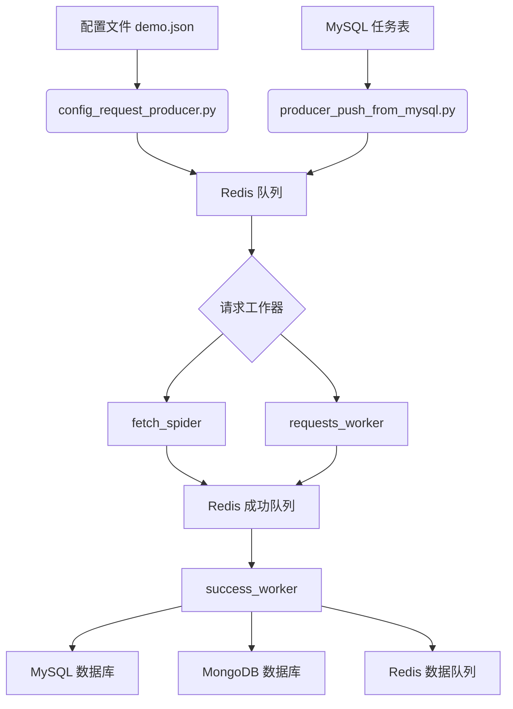
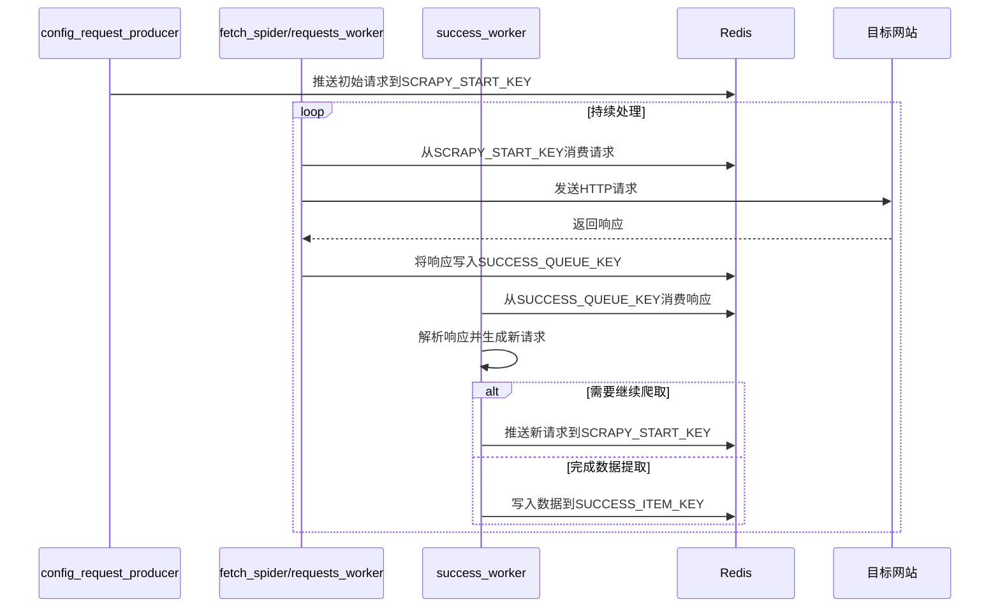

# 使用方式

<cite>
**本文档引用的文件**   
- [README.md](file://README.md)
- [ENV_CONFIG.md](file://ENV_CONFIG.md)
- [config_request_producer.py](file://config_request_producer.py)
- [requests_worker.py](file://requests_worker.py)
- [success_worker.py](file://success_worker.py)
- [producer_push_from_mysql.py](file://producer_push_from_mysql.py)
- [crawler/spiders/config_spider.py](file://crawler/spiders/config_spider.py)
- [crawler/spiders/fetch_spider.py](file://crawler/spiders/fetch_spider.py)
- [crawler/settings.py](file://crawler/settings.py)
- [crawler/utils/config_loader.py](file://crawler/utils/config_loader.py)
- [crawler/utils/redis_manager.py](file://crawler/utils/redis_manager.py)
- [crawler/utils/db_manager.py](file://crawler/utils/db_manager.py)
- [crawler/utils/mongodb_manager.py](file://crawler/utils/mongodb_manager.py)
</cite>

## 目录
1. [使用方式](#使用方式)
2. [核心架构与组件关系](#核心架构与组件关系)
3. [配置驱动爬虫](#配置驱动爬虫)
4. [全链路Redis模式](#全链路redis模式)
5. [从MySQL推送任务](#从mysql推送任务)
6. [配置选项](#配置选项)
7. [公共接口与参数](#公共接口与参数)
8. [常见用例示例](#常见用例示例)
9. [数据存储优先级](#数据存储优先级)

## 核心架构与组件关系

本系统基于Scrapy-Redis构建分布式爬虫架构，通过Redis作为任务队列和数据交换中心，实现多组件协同工作。系统包含三种主要工作模式：配置驱动爬虫、全链路Redis模式和MySQL任务推送模式。

核心组件关系如下：
- **配置文件**（如demo.json）定义爬虫任务和工作流
- **Redis**作为中央消息队列，协调各组件间的数据流动
- **MySQL/MongoDB**用于持久化存储爬取结果
- **config_spider**：Scrapy爬虫，直接处理配置文件驱动的任务
- **fetch_spider/requests_worker**：负责发送HTTP请求并返回响应
- **success_worker**：解析响应并根据工作流推进后续操作
- **config_request_producer**：将配置文件转换为初始请求并推送到Redis
- **producer_push_from_mysql**：从MySQL读取任务并推送到Redis



**图示来源**
- [README.md](file://README.md#L136-L202)
- [config_request_producer.py](file://config_request_producer.py)
- [requests_worker.py](file://requests_worker.py)
- [success_worker.py](file://success_worker.py)
- [producer_push_from_mysql.py](file://producer_push_from_mysql.py)

## 配置驱动爬虫

配置驱动爬虫模式使用`config_spider`直接读取JSON配置文件执行爬取任务。该模式适用于简单的爬取场景，所有解析逻辑都在Scrapy爬虫内部完成。

### 使用方法

```bash
# 运行配置驱动爬虫
scrapy crawl config_spider

# 指定自定义配置文件路径
scrapy crawl config_spider -s CONFIG_PATH=/path/to/custom_config.json
```

### 工作流程

1. 读取配置文件（默认`demo.json`）
2. 根据`taskInfo.baseUrl`生成初始请求
3. 按照`workflowSteps`执行：
   - `request`：发送HTTP请求
   - `link_extraction`：提取链接
   - `data_extraction`：提取数据
4. 将提取的数据保存到MySQL `articles`表

### 配置文件结构

配置文件包含`taskInfo`和`workflowSteps`两个主要部分：

- `taskInfo`：任务基本信息
  - `id`：任务ID
  - `name`：任务名称
  - `baseUrl`：基础URL
  - `concurrency`：并发数
  - `requestInterval`：请求间隔（秒）

- `workflowSteps`：工作流步骤数组
  - `type`：步骤类型（request/link_extraction/data_extraction）
  - `config`：步骤配置
  - `timeout`：超时时间
  - `retryCount`：重试次数

**代码来源**
- [crawler/spiders/config_spider.py](file://crawler/spiders/config_spider.py)
- [crawler/utils/config_loader.py](file://crawler/utils/config_loader.py)

## 全链路Redis模式

全链路Redis模式将爬取流程分解为多个独立组件，通过Redis队列进行通信，实现高度解耦和灵活扩展。该模式完全遵循`demo.json`的`workflowSteps`，Scrapy只负责请求，解析由外部脚本完成。

### 使用步骤

#### 1. 推送初始请求

```bash
python config_request_producer.py
```

此脚本读取`demo.json`，生成`workflow_index=0`的初始请求并写入`SCRAPY_START_KEY`。

#### 2. 发送请求

**方式A：使用Scrapy（推荐用于大规模分布式）**
```bash
scrapy crawl fetch_spider -L INFO
```
`fetch_spider`把响应写回`SUCCESS_QUEUE_KEY`，不做任何解析。

**方式B：使用requests库（轻量级，适合单机）**
```bash
python requests_worker.py
```
`requests_worker`使用Python requests库发送请求，功能与`fetch_spider`相同，但更轻量级。

#### 3. success_worker解析workflow

```bash
python success_worker.py
```

`success_worker`持续监听成功队列，按步骤执行：
- `request`：直接推进到下一步骤
- `link_extraction`：抽取链接/标题等字段，推送下一批请求（携带新的`workflow_index`）
- `data_extraction`：抽取数据写入`SUCCESS_ITEM_KEY`，并执行`nextRequestCustomCode`以生成更多请求

#### 4. 循环至任务完成

- 只要成功队列中仍有响应，`success_worker`就会继续解析并推送后续请求
- 队列为空即表示workflow完成，可从`SUCCESS_ITEM_KEY`读取数据结果，或在`SUCCESS_ERROR_KEY`查看失败记录



**图示来源**
- [README.md](file://README.md#L163-L199)
- [config_request_producer.py](file://config_request_producer.py)
- [requests_worker.py](file://requests_worker.py)
- [success_worker.py](file://success_worker.py)

## 从MySQL推送任务

此模式允许从MySQL数据库读取待抓取请求，解析后推送到Redis队列，供Scrapy-Redis消费。适用于需要从现有数据库系统集成任务的场景。

### 数据库表结构

```sql
CREATE TABLE pending_requests (
    id BIGINT PRIMARY KEY AUTO_INCREMENT,
    url TEXT NOT NULL,
    method VARCHAR(10) DEFAULT 'GET',
    headers_json TEXT,
    params_json TEXT,
    meta_json TEXT,
    created_at TIMESTAMP DEFAULT CURRENT_TIMESTAMP,
    INDEX idx_created_at (created_at)
);
```

### 使用方法

```bash
python producer_push_from_mysql.py
```

此脚本会从`pending_requests`表读取所有待处理请求，并将其推送到Redis队列。

**代码来源**
- [producer_push_from_mysql.py](file://producer_push_from_mysql.py)

## 配置选项

系统支持通过`.env`文件、环境变量或代码默认值三种方式配置，优先级为：系统环境变量 > `.env`文件 > 代码默认值。

### 主要配置项

| 配置项 | 说明 | 默认值 |
|--------|------|--------|
| `REDIS_URL` | Redis连接URL | `redis://localhost:6379/0` |
| `MYSQL_HOST` | MySQL主机地址 | `localhost` |
| `MYSQL_PORT` | MySQL端口 | `3306` |
| `MYSQL_USER` | MySQL用户名 | - |
| `MYSQL_PASSWORD` | MySQL密码 | - |
| `MYSQL_DB` | MySQL数据库名 | - |
| `CONFIG_PATH` | 配置文件路径 | `demo.json` |
| `SCRAPY_START_KEY` | Scrapy启动队列键 | `fetch_spider:start_urls` |
| `SUCCESS_QUEUE_KEY` | 成功队列键 | `fetch_spider:success` |
| `SUCCESS_ITEM_KEY` | 数据结果队列键 | `fetch_spider:data_items` |
| `SUCCESS_ERROR_KEY` | 错误队列键 | `fetch_spider:errors` |

### 数据库类型选择

通过`ARTICLE_DB_TYPE`环境变量选择数据存储类型：
- `mysql`：使用MySQL数据库存储文章数据
- `mongodb`：使用MongoDB存储文章数据
- 默认值：`mysql`

**配置来源**
- [README.md](file://README.md#L203-L233)
- [ENV_CONFIG.md](file://ENV_CONFIG.md)

## 公共接口与参数

### config_request_producer.py

- **功能**：根据配置文件生成初始请求并推送到Redis
- **主要参数**：
  - `CONFIG_PATH`：配置文件路径，默认`demo.json`
  - `SCRAPY_START_KEY`：Redis启动队列键，默认`fetch_spider:start_urls`

### requests_worker.py

- **功能**：使用requests库发送HTTP请求
- **主要参数**：
  - `REDIS_URL`：Redis连接URL
  - `SCRAPY_START_KEY`：待请求任务队列键
  - `SUCCESS_QUEUE_KEY`：成功结果队列键
  - `REQUESTS_TIMEOUT`：请求超时时间，默认30秒
  - `REQUESTS_MAX_RETRIES`：最大重试次数，默认3次

### success_worker.py

- **功能**：消费成功队列，根据工作流步骤处理响应
- **主要参数**：
  - `CONFIG_PATH`：配置文件路径
  - `SUCCESS_QUEUE_KEY`：成功队列键
  - `SUCCESS_ITEM_KEY`：数据结果队列键
  - `SUCCESS_ERROR_KEY`：错误队列键

### producer_push_from_mysql.py

- **功能**：从MySQL读取任务并推送到Redis
- **主要参数**：
  - `SCRAPY_START_KEY`：Redis队列键

**代码来源**
- [config_request_producer.py](file://config_request_producer.py)
- [requests_worker.py](file://requests_worker.py)
- [success_worker.py](file://success_worker.py)
- [producer_push_from_mysql.py](file://producer_push_from_mysql.py)

## 常见用例示例

### 示例1：基本配置驱动爬虫

```bash
# 1. 确保已配置.env文件
cp .env.example .env
# 编辑.env文件填入你的配置

# 2. 运行爬虫
scrapy crawl config_spider
```

### 示例2：全链路Redis模式

```bash
# 1. 推送初始请求
python config_request_producer.py

# 2. 启动请求工作器（选择一种）
scrapy crawl fetch_spider -L INFO
# 或
python requests_worker.py

# 3. 启动结果处理器
python success_worker.py
```

### 示例3：分布式部署

在多台服务器上启动多个fetch_spider实例：

```bash
# 服务器1
scrapy crawl fetch_spider

# 服务器2
scrapy crawl fetch_spider

# 服务器3
scrapy crawl fetch_spider
```

所有实例会从同一个Redis队列消费任务，实现分布式爬取。

### 示例4：监控队列状态

```bash
# 查看待处理任务数
redis-cli LLEN fetch_spider:start_urls

# 查看成功队列任务数
redis-cli LLEN fetch_spider:success

# 查看去重集合大小
redis-cli SCARD fetch_spider:dupefilter
```

**使用示例来源**
- [README.md](file://README.md#L136-L390)

## 数据存储优先级

系统遵循特定的数据存储优先级规则，确保数据能够被正确持久化：

1. **MongoDB > MySQL > Redis队列**
   - 如果配置了MongoDB且连接成功，优先使用MongoDB
   - 如果没有MongoDB但有MySQL，使用MySQL
   - 如果都没配置，数据存到Redis队列

2. **MongoDB优先级高于MySQL**
   - 即使同时配置了MySQL和MongoDB，系统也会优先使用MongoDB存储数据
   - 这可以通过`mongo比mysql等级高`的注释得到证实

3. **去重机制**
   - 系统使用链接哈希(link_hash)和内容哈希(content_hash)进行去重判断
   - 在插入新文章前会检查哈希值是否已存在，避免重复存储

**数据存储来源**
- [README.md](file://README.md#L339-L341)
- [ENV_CONFIG.md](file://ENV_CONFIG.md#L338-L342)
- [success_worker.py](file://success_worker.py#L154-L160)
- [crawler/utils/db_manager.py](file://crawler/utils/db_manager.py#L169-L182)
- [crawler/utils/mongodb_manager.py](file://crawler/utils/mongodb_manager.py#L163-L172)