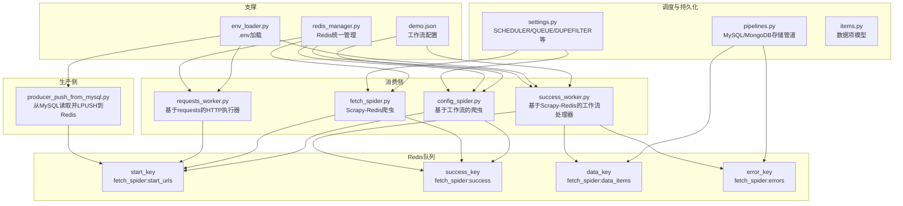
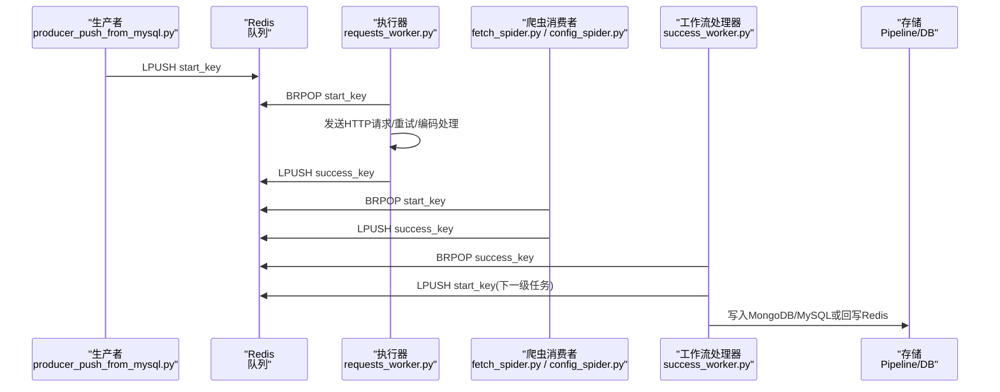
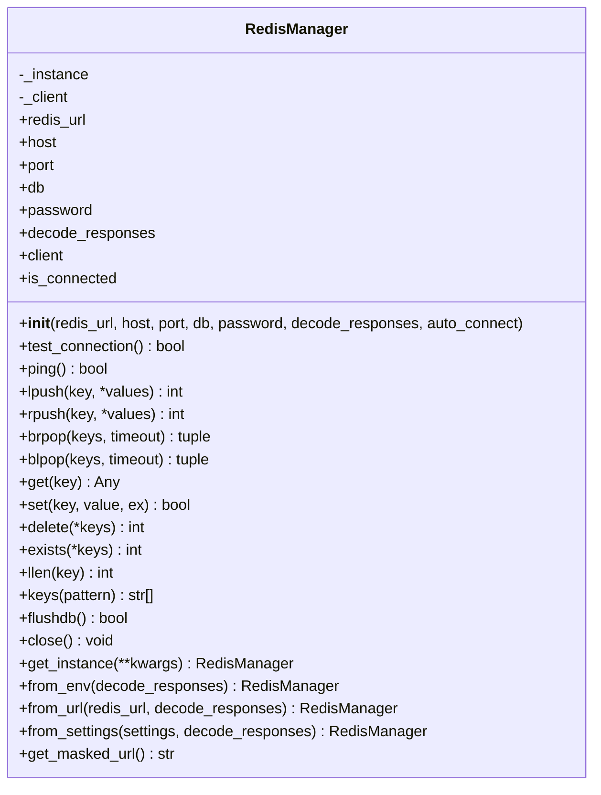
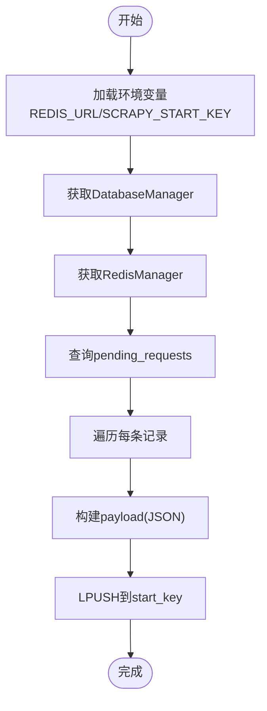
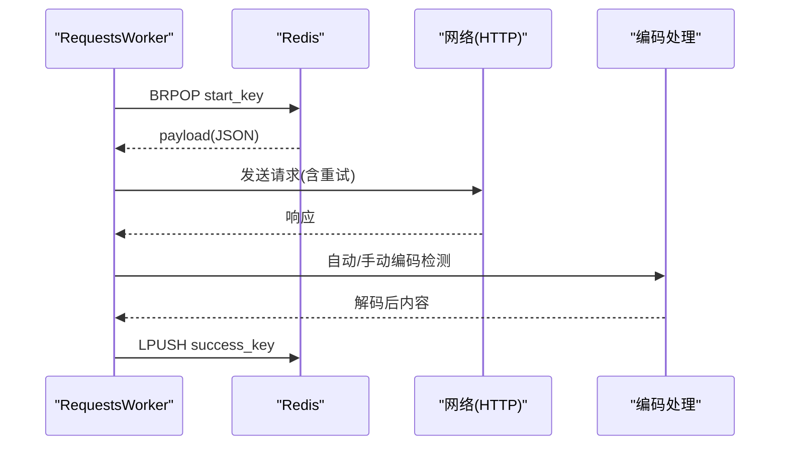
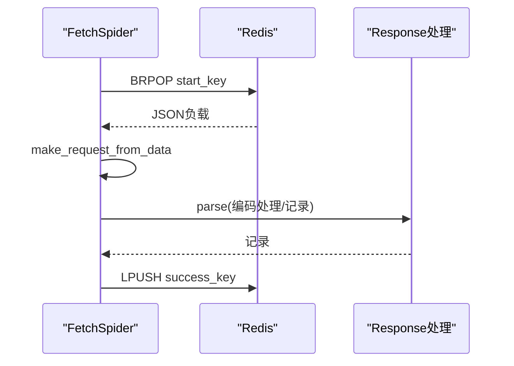
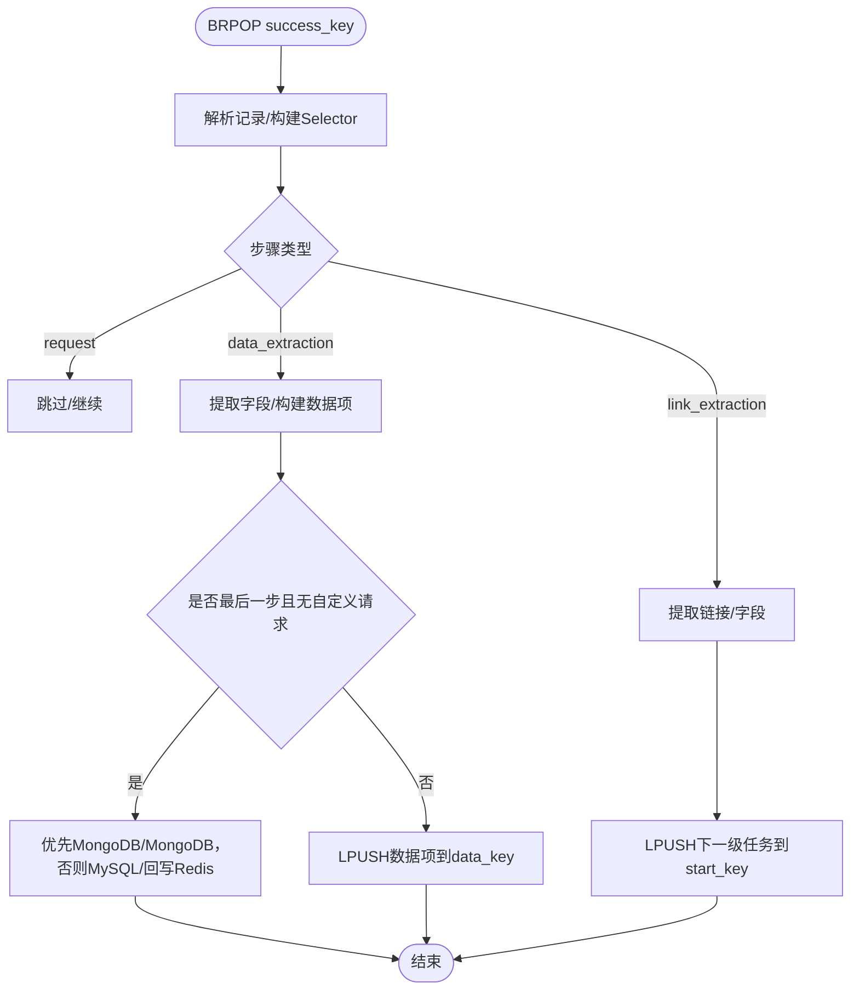
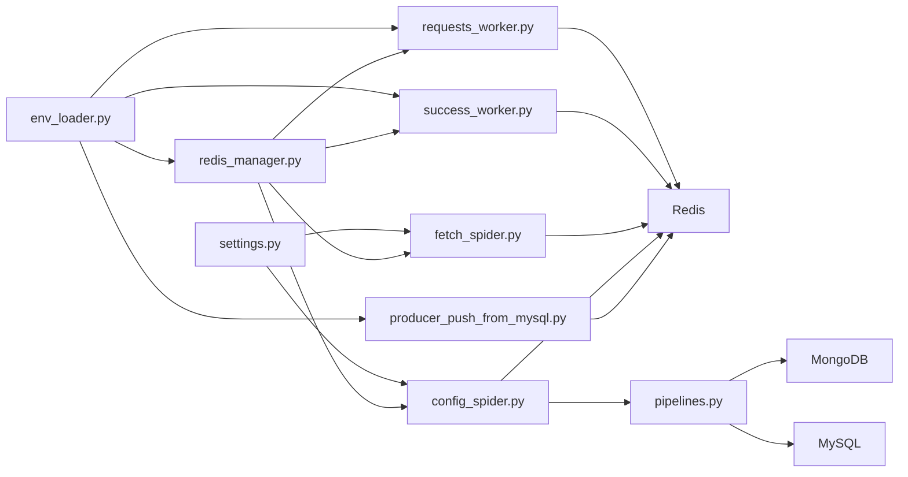

# 全链路Redis模式

<cite>
**本文引用的文件**
- [crawler/utils/redis_manager.py](file://crawler/utils/redis_manager.py)
- [crawler/spiders/fetch_spider.py](file://crawler/spiders/fetch_spider.py)
- [crawler/spiders/config_spider.py](file://crawler/spiders/config_spider.py)
- [crawler/pipelines.py](file://crawler/pipelines.py)
- [crawler/items.py](file://crawler/items.py)
- [producer_push_from_mysql.py](file://producer_push_from_mysql.py)
- [requests_worker.py](file://requests_worker.py)
- [success_worker.py](file://success_worker.py)
- [crawler/utils/env_loader.py](file://crawler/utils/env_loader.py)
- [crawler/settings.py](file://crawler/settings.py)
- [demo.json](file://demo.json)
- [requirements.txt](file://requirements.txt)
</cite>

## 目录
1. [简介](#简介)
2. [项目结构](#项目结构)
3. [核心组件](#核心组件)
4. [架构总览](#架构总览)
5. [详细组件分析](#详细组件分析)
6. [依赖关系分析](#依赖关系分析)
7. [性能考量](#性能考量)
8. [故障排查指南](#故障排查指南)
9. [结论](#结论)
10. [附录](#附录)

## 简介
本节聚焦“全链路Redis模式”，即以Redis为核心枢纽贯穿“生产者-消费者-调度-持久化”的完整采集流水线。该模式通过Redis列表实现任务队列与结果队列，结合Scrapy-Redis的分布式调度能力，形成可扩展、可监控、可回放的采集闭环。本文将解释其目的、架构、与各组件的关系、实现细节、配置选项与使用模式，并提供流程图与类图帮助理解。

## 项目结构
围绕全链路Redis模式的关键文件组织如下：
- 生产侧：从MySQL读取待抓取请求，序列化后推入Redis队列
- 消费侧：两类消费者
  - requests_worker：基于requests库的HTTP请求执行器，负责从Redis拉取任务并回写结果
  - success_worker：基于Scrapy-Redis的爬虫消费者，负责从Redis拉取任务并产出数据项
- 调度与持久化：Scrapy-Redis调度器、自定义Pipeline将数据落库或回写Redis
- 配置与环境：demo.json定义工作流，.env/.env.example提供环境变量

图表来源
- [producer_push_from_mysql.py](file://producer_push_from_mysql.py#L1-L90)
- [requests_worker.py](file://requests_worker.py#L1-L327)
- [success_worker.py](file://success_worker.py#L1-L363)
- [crawler/spiders/fetch_spider.py](file://crawler/spiders/fetch_spider.py#L1-L100)
- [crawler/spiders/config_spider.py](file://crawler/spiders/config_spider.py#L1-L325)
- [crawler/pipelines.py](file://crawler/pipelines.py#L1-L105)
- [crawler/utils/redis_manager.py](file://crawler/utils/redis_manager.py#L1-L345)
- [crawler/utils/env_loader.py](file://crawler/utils/env_loader.py#L1-L63)
- [crawler/settings.py](file://crawler/settings.py#L1-L54)
- [demo.json](file://demo.json#L1-L181)

章节来源
- [requirements.txt](file://requirements.txt#L1-L17)
- [crawler/settings.py](file://crawler/settings.py#L1-L54)

## 核心组件
- RedisManager：统一管理Redis连接、URL解析、基础命令封装（LPUSH/RPUSH/BRPOP/GET/SET/DEL/EXISTS/LLEN/KEYS/FLUSHDB/连接测试/PING），支持从URL、环境变量、Scrapy settings创建单例实例，提供掩码URL便于日志输出。
- RequestsWorker：基于requests的阻塞式消费者，从start_key BRPOP任务，按配置重试，自动处理编码，将结果记录LPUSH到success_key。
- success_worker：持续BRPOP success_key，按demo.json工作流推进，支持链接提取、数据提取、自定义代码生成后续请求，最终将数据项写入MongoDB/MySQL或回写Redis data_key。
- fetch_spider：继承RedisSpider，从Redis列表读取JSON负载，构造Scrapy Request，解析响应后将记录LPUSH到success_key。
- config_spider：继承RedisSpider，从demo.json加载工作流，按步骤执行链接提取、数据提取、自定义代码生成请求，产出ArticleItem并交由Pipeline处理。
- Pipeline：优先MongoDB，其次MySQL，最后回退到Redis队列，实现多存储策略。
- 配置与环境：settings.py启用Scrapy-Redis调度器与队列，REDIS_URL来自环境变量；demo.json定义任务信息与工作流步骤；env_loader自动加载.env。

章节来源
- [crawler/utils/redis_manager.py](file://crawler/utils/redis_manager.py#L1-L345)
- [requests_worker.py](file://requests_worker.py#L1-L327)
- [success_worker.py](file://success_worker.py#L1-L363)
- [crawler/spiders/fetch_spider.py](file://crawler/spiders/fetch_spider.py#L1-L100)
- [crawler/spiders/config_spider.py](file://crawler/spiders/config_spider.py#L1-L325)
- [crawler/pipelines.py](file://crawler/pipelines.py#L1-L105)
- [crawler/utils/env_loader.py](file://crawler/utils/env_loader.py#L1-L63)
- [crawler/settings.py](file://crawler/settings.py#L1-L54)
- [demo.json](file://demo.json#L1-L181)

## 架构总览
全链路Redis模式以Redis为中心，形成“生产-执行-处理-存储”的闭环：
- 生产阶段：producer_push_from_mysql.py从MySQL读取待抓取请求，序列化后LPUSH到start_key
- 执行阶段：requests_worker或Scrapy-Redis消费者从start_key BRPOP任务，执行HTTP请求并将结果LPUSH到success_key
- 处理阶段：success_worker按工作流推进，链接提取生成新任务LPUSH到start_key，数据提取产出数据项LPUSH到data_key或错误队列error_key
- 存储阶段：Pipeline优先MongoDB/MongoDB，其次MySQL，最后回退到Redis队列

图表来源
- [producer_push_from_mysql.py](file://producer_push_from_mysql.py#L1-L90)
- [requests_worker.py](file://requests_worker.py#L1-L327)
- [crawler/spiders/fetch_spider.py](file://crawler/spiders/fetch_spider.py#L1-L100)
- [crawler/spiders/config_spider.py](file://crawler/spiders/config_spider.py#L1-L325)
- [success_worker.py](file://success_worker.py#L1-L363)
- [crawler/pipelines.py](file://crawler/pipelines.py#L1-L105)

## 详细组件分析

### RedisManager：统一连接与命令封装
- 角色定位：提供Redis客户端生命周期管理、连接测试、常用命令封装、URL解析与环境变量兼容、单例与工厂方法
- 关键能力
  - URL解析与构建：支持redis://:password@host:port/db格式，自动解码响应或从环境变量构建
  - 连接测试：PING与test_connection，is_connected属性
  - 命令封装：LPUSH/RPUSH/BRPOP/BLPOP/GET/SET/DELETE/EXISTS/LLEN/KEYS/FLUSHDB
  - 工厂方法：from_env/from_url/from_settings/get_instance，支持decode_responses
  - 安全输出：get_masked_url隐藏密码
- 使用建议
  - decode_responses建议在需要字符串场景开启，避免bytes
  - 使用单例或from_env确保连接复用
  - 在日志中使用get_masked_url避免泄露密码

图表来源
- [crawler/utils/redis_manager.py](file://crawler/utils/redis_manager.py#L1-L345)

章节来源
- [crawler/utils/redis_manager.py](file://crawler/utils/redis_manager.py#L1-L345)

### 生产者：从MySQL推送任务到Redis
- 目标：将MySQL表pending_requests中的待抓取请求序列化为JSON负载，LPUSH到Redis队列
- 关键点
  - 从环境变量读取REDIS_URL与SCRAPY_START_KEY
  - 从数据库读取字段headers_json/params_json/meta_json并解析
  - payload包含url/method/headers/meta/dont_filter
- 典型用例
  - 批量导入待抓取URL
  - 从外部系统同步任务

图表来源
- [producer_push_from_mysql.py](file://producer_push_from_mysql.py#L1-L90)

章节来源
- [producer_push_from_mysql.py](file://producer_push_from_mysql.py#L1-L90)

### 执行器：requests_worker（基于requests）
- 目标：从Redis队列拉取任务，发送HTTP请求，自动编码处理，将结果记录LPUSH到success_key
- 关键点
  - BRPOP start_key，超时5秒
  - 支持GET/POST/其他HTTP方法，合并headers与代理
  - 重试机制：max_retries/retry_delay，超时与异常分类处理
  - 编码处理：支持手动指定编码与自动检测，记录编码信息
  - 输出：success_key包含url/status/headers/body/meta/requested_at/error/encoding_info
- 典型用例
  - 独立HTTP抓取节点
  - 与Scrapy-Redis混合部署

图表来源
- [requests_worker.py](file://requests_worker.py#L1-L327)

章节来源
- [requests_worker.py](file://requests_worker.py#L1-L327)

### 爬虫消费者：fetch_spider（Scrapy-Redis）
- 目标：从Redis队列拉取任务，构造Scrapy Request，解析响应，将记录LPUSH到success_key
- 关键点
  - 继承RedisSpider，使用redis_key作为起始队列
  - make_request_from_data解析JSON负载，支持method/headers/meta/dont_filter
  - parse阶段处理响应编码，记录编码信息与请求时间，LPUSH到success_key
- 典型用例
  - 与Scrapy生态集成，利用中间件、下载器、解析器

图表来源
- [crawler/spiders/fetch_spider.py](file://crawler/spiders/fetch_spider.py#L1-L100)

章节来源
- [crawler/spiders/fetch_spider.py](file://crawler/spiders/fetch_spider.py#L1-L100)

### 工作流处理器：success_worker（基于Scrapy-Redis）
- 目标：从success_key消费结果，按demo.json工作流推进，生成下一级任务或产出数据项
- 关键点
  - BRPOP success_key，构建Selector与响应上下文
  - 链接提取：按规则提取link/title等字段，生成下一级请求LPUSH到start_key
  - 数据提取：按规则提取字段，产出数据项，优先MongoDB/MongoDB，其次MySQL，最后回写Redis
  - 自定义代码：可执行自定义脚本生成后续请求
  - 错误处理：异常记录LPUSH到error_key
- 典型用例
  - 多步抓取与数据抽取
  - 动态生成后续请求

图表来源
- [success_worker.py](file://success_worker.py#L1-L363)
- [demo.json](file://demo.json#L1-L181)

章节来源
- [success_worker.py](file://success_worker.py#L1-L363)
- [demo.json](file://demo.json#L1-L181)

### 爬虫消费者：config_spider（基于工作流）
- 目标：从Redis队列或本地baseUrl开始，按demo.json工作流执行链接提取、数据提取、自定义代码
- 关键点
  - 从环境变量或参数覆盖并发与延时
  - start_requests支持从baseUrl发起
  - _handle_link_extraction/_handle_data_extraction按规则提取，生成下一级请求或产出ArticleItem
  - _run_custom_code执行自定义脚本生成请求
- 典型用例
  - 复杂站点的多步抽取与动态请求生成

章节来源
- [crawler/spiders/config_spider.py](file://crawler/spiders/config_spider.py#L1-L325)
- [crawler/items.py](file://crawler/items.py#L1-L12)

### Pipeline：存储策略
- 目标：将数据项持久化到MongoDB/MySQL，若均不可用则回写到Redis队列
- 关键点
  - 优先MongoDB，其次MySQL，最后Redis
  - 保存字段：task_id/title/link/content/source_url/extra
  - 异常时记录到error_key
- 典型用例
  - 多存储策略容灾

章节来源
- [crawler/pipelines.py](file://crawler/pipelines.py#L1-L105)

## 依赖关系分析
- 外部依赖
  - scrapy/scrapy-redis：分布式调度与RedisSpider
  - redis：队列与连接
  - requests：HTTP执行
  - parsel：选择器
  - pymongo/sqlalchemy：MongoDB/MySQL
  - python-dotenv：.env加载
- 内部依赖
  - env_loader统一加载环境变量，供各组件使用
  - settings.py启用Scrapy-Redis调度器与队列
  - redis_manager被所有Redis交互组件复用

图表来源
- [crawler/utils/env_loader.py](file://crawler/utils/env_loader.py#L1-L63)
- [crawler/utils/redis_manager.py](file://crawler/utils/redis_manager.py#L1-L345)
- [crawler/settings.py](file://crawler/settings.py#L1-L54)
- [crawler/spiders/fetch_spider.py](file://crawler/spiders/fetch_spider.py#L1-L100)
- [crawler/spiders/config_spider.py](file://crawler/spiders/config_spider.py#L1-L325)
- [requests_worker.py](file://requests_worker.py#L1-L327)
- [success_worker.py](file://success_worker.py#L1-L363)
- [producer_push_from_mysql.py](file://producer_push_from_mysql.py#L1-L90)
- [crawler/pipelines.py](file://crawler/pipelines.py#L1-L105)

章节来源
- [requirements.txt](file://requirements.txt#L1-L17)
- [crawler/settings.py](file://crawler/settings.py#L1-L54)

## 性能考量
- 队列长度与并发
  - start_key与success_key的长度直接影响吞吐，需根据下游处理能力调整
  - 并发与延时可通过环境变量或配置文件控制
- 连接与会话
  - RedisManager单例复用连接，减少握手开销
  - requests_worker使用Session复用连接
- 编码处理
  - 自动编码检测可能带来额外CPU开销，必要时可指定手动编码
- 重试与超时
  - 合理设置max_retries/retry_delay与timeout，避免资源浪费
- 去重与持久化
  - DUPEFILTER_CLASS设为空实现允许重复URL进入队列，适合全链路模式
  - Pipeline优先MongoDB/MongoDB，降低Redis压力

## 故障排查指南
- Redis连接问题
  - 使用RedisManager.test_connection或ping确认连通性
  - 检查REDIS_URL格式与密码，使用get_masked_url核对日志
- 认证失败
  - requests_worker/success_worker在认证失败时打印明确提示与修复建议
- 编码异常
  - 若手动指定编码失败，自动回退到自动检测；记录encoding_info便于诊断
- 任务无效
  - requests_worker跳过缺少URL的任务并记录
- 存储失败
  - Pipeline/MongoDB/MySQL保存失败时回写error_key，便于追踪

章节来源
- [requests_worker.py](file://requests_worker.py#L1-L327)
- [success_worker.py](file://success_worker.py#L1-L363)
- [crawler/utils/redis_manager.py](file://crawler/utils/redis_manager.py#L1-L345)

## 结论
全链路Redis模式通过Redis实现生产、执行、处理、存储的解耦与扩展，结合Scrapy-Redis与自定义工作流，既能满足复杂站点的多步抽取，又能灵活地与外部系统对接。通过统一的RedisManager与清晰的队列命名约定，系统具备良好的可观测性与可维护性。

## 附录

### 配置选项与环境变量
- Redis
  - REDIS_URL：Redis连接URL，如redis://:password@host:port/db
  - SCRAPY_START_KEY：起始任务队列键，默认"fetch_spider:start_urls"
  - SUCCESS_QUEUE_KEY：成功结果队列键，默认"fetch_spider:success"
  - SUCCESS_ITEM_KEY：数据项队列键，默认"fetch_spider:data_items"
  - SUCCESS_ERROR_KEY：错误队列键，默认"fetch_spider:errors"
- Scrapy-Redis
  - SCHEDULER：调度器类
  - SCHEDULER_QUEUE_CLASS：队列类
  - SCHEDULER_PERSIST：持久化开关
  - DUPEFILTER_CLASS：去重策略（空实现允许重复）
- 请求执行器
  - REQUESTS_TIMEOUT：请求超时秒数
  - REQUESTS_MAX_RETRIES：最大重试次数
  - REQUESTS_RETRY_DELAY：重试延迟秒数
  - REQUESTS_SLEEP：队列为空休眠秒数
- 数据库
  - MYSQL_HOST/PORT/USER/PASSWORD/DB/CHARSET/POOL_SIZE/POOL_MAX_OVERFLOW
- 日志与配置
  - LOG_LEVEL：日志级别
  - CONFIG_PATH：工作流配置文件路径

章节来源
- [crawler/settings.py](file://crawler/settings.py#L1-L54)
- [requests_worker.py](file://requests_worker.py#L301-L327)
- [success_worker.py](file://success_worker.py#L306-L361)
- [producer_push_from_mysql.py](file://producer_push_from_mysql.py#L75-L90)

### 公共接口与返回值
- RedisManager
  - get_instance/from_env/from_url/from_settings：创建实例
  - test_connection/ping：连接测试
  - lpush/rpush/brpop/blpop/get/set/delete/exists/llen/keys/flushdb/close：命令封装
  - get_masked_url：掩码URL
- RequestsWorker
  - run_forever：持续消费队列
  - _process_request：处理单个任务，返回记录写入success_key
- success_worker.WorkflowProcessor
  - run_forever：持续消费队列
  - process_record/_advance/_handle_link_extraction/_handle_data_extraction：工作流推进
  - _save_to_database/_save_to_mongodb：存储
- fetch_spider/config_spider
  - make_request_from_data：从JSON负载构造Request
  - parse/handle_response：解析响应/工作流推进
- Pipeline
  - process_item：优先MongoDB/MongoDB，其次MySQL，最后回写Redis

章节来源
- [crawler/utils/redis_manager.py](file://crawler/utils/redis_manager.py#L1-L345)
- [requests_worker.py](file://requests_worker.py#L1-L327)
- [success_worker.py](file://success_worker.py#L1-L363)
- [crawler/spiders/fetch_spider.py](file://crawler/spiders/fetch_spider.py#L1-L100)
- [crawler/spiders/config_spider.py](file://crawler/spiders/config_spider.py#L1-L325)
- [crawler/pipelines.py](file://crawler/pipelines.py#L1-L105)