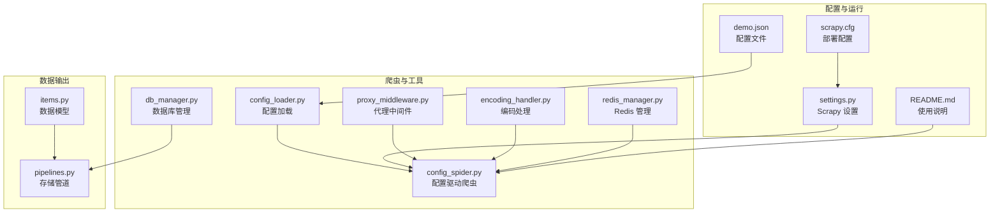
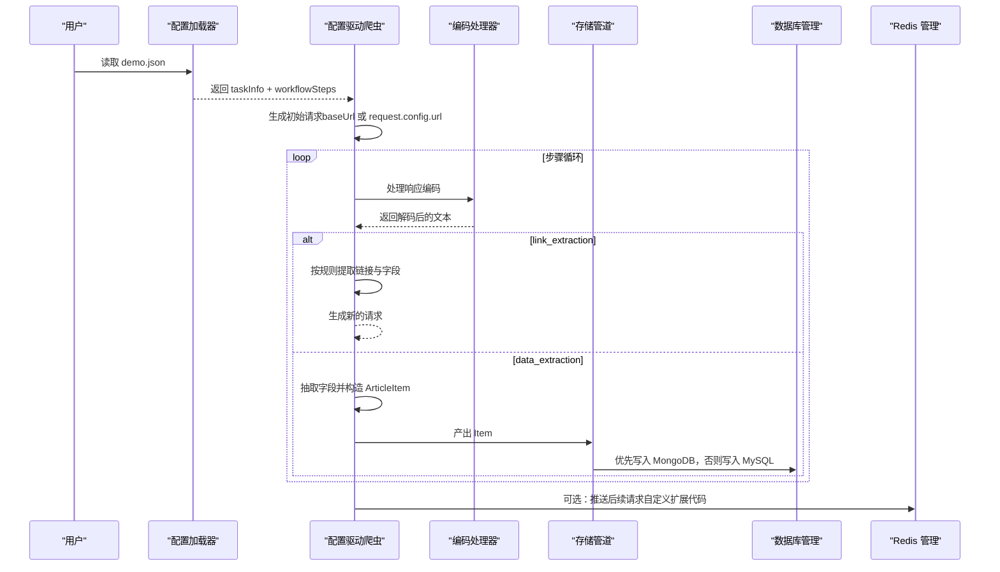
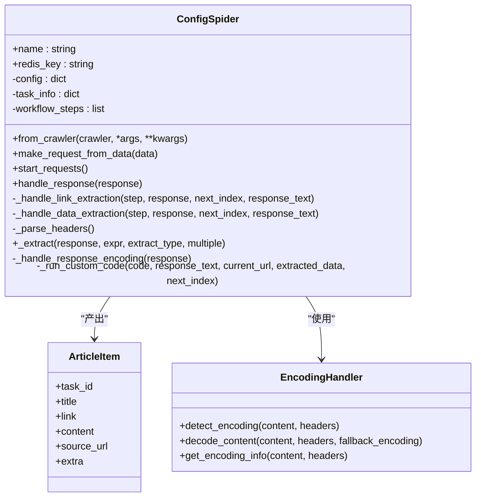
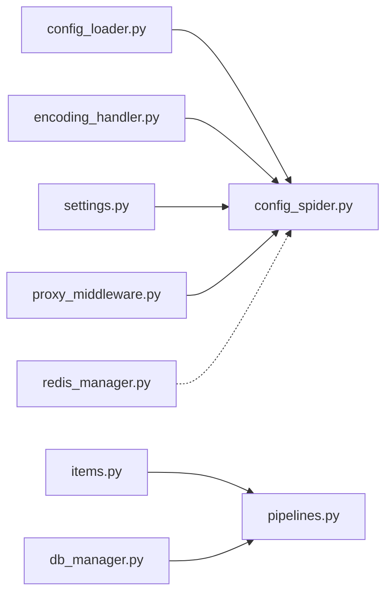

# 配置驱动爬虫

<cite>
**本文引用的文件**
- [crawler/spiders/config_spider.py](file://crawler/spiders/config_spider.py)
- [crawler/utils/config_loader.py](file://crawler/utils/config_loader.py)
- [crawler/settings.py](file://crawler/settings.py)
- [demo.json](file://demo.json)
- [crawler/utils/encoding_handler.py](file://crawler/utils/encoding_handler.py)
- [crawler/items.py](file://crawler/items.py)
- [crawler/pipelines.py](file://crawler/pipelines.py)
- [crawler/utils/redis_manager.py](file://crawler/utils/redis_manager.py)
- [crawler/utils/db_manager.py](file://crawler/utils/db_manager.py)
- [crawler/middlewares/proxy_middleware.py](file://crawler/middlewares/proxy_middleware.py)
- [README.md](file://README.md)
- [scrapy.cfg](file://scrapy.cfg)
</cite>

## 目录
1. [简介](#简介)
2. [项目结构](#项目结构)
3. [核心组件](#核心组件)
4. [架构总览](#架构总览)
5. [详细组件分析](#详细组件分析)
6. [依赖关系分析](#依赖关系分析)
7. [性能考量](#性能考量)
8. [故障排查指南](#故障排查指南)
9. [结论](#结论)
10. [附录](#附录)

## 简介
配置驱动爬虫通过外部 JSON 配置文件驱动 Scrapy 爬取流程，无需修改代码即可灵活调整抓取目标、请求参数、链接提取规则与数据抽取规则。该模式将“业务配置”与“执行引擎”解耦，便于非技术用户维护抓取任务。

- 目标：以 demo.json 为唯一配置源，按顺序执行 request/link_extraction/data_extraction 步骤，最终产出结构化数据并持久化。
- 关键特性：多步骤工作流、动态请求头、编码自动识别、自定义扩展代码、Redis 集成、代理中间件、存储管道优先级策略。

## 项目结构
围绕配置驱动爬虫的相关文件组织如下：
- 配置加载与校验：config_loader.py
- 爬虫实现：config_spider.py（继承 RedisSpider，基于配置驱动）
- 抓取配置：demo.json（taskInfo + workflowSteps）
- 编码处理：encoding_handler.py
- 数据模型与管道：items.py、pipelines.py
- 运行参数与中间件：settings.py、proxy_middleware.py
- Redis 管理：redis_manager.py
- 数据库管理：db_manager.py
- 项目部署配置：scrapy.cfg
- 使用说明：README.md

图示来源
- [crawler/spiders/config_spider.py](file://crawler/spiders/config_spider.py#L1-L325)
- [crawler/utils/config_loader.py](file://crawler/utils/config_loader.py#L1-L16)
- [crawler/utils/encoding_handler.py](file://crawler/utils/encoding_handler.py#L1-L235)
- [crawler/pipelines.py](file://crawler/pipelines.py#L1-L105)
- [crawler/items.py](file://crawler/items.py#L1-L12)
- [crawler/utils/redis_manager.py](file://crawler/utils/redis_manager.py#L1-L345)
- [crawler/utils/db_manager.py](file://crawler/utils/db_manager.py#L1-L618)
- [crawler/middlewares/proxy_middleware.py](file://crawler/middlewares/proxy_middleware.py#L1-L69)
- [crawler/settings.py](file://crawler/settings.py#L1-L54)
- [scrapy.cfg](file://scrapy.cfg#L1-L6)
- [README.md](file://README.md#L136-L165)

章节来源
- [crawler/spiders/config_spider.py](file://crawler/spiders/config_spider.py#L1-L325)
- [crawler/utils/config_loader.py](file://crawler/utils/config_loader.py#L1-L16)
- [crawler/settings.py](file://crawler/settings.py#L1-L54)
- [demo.json](file://demo.json#L1-L181)
- [README.md](file://README.md#L136-L165)
- [scrapy.cfg](file://scrapy.cfg#L1-L6)

## 核心组件
- 配置加载器：读取并校验 demo.json，确保包含 taskInfo 与 workflowSteps。
- 配置驱动爬虫：从配置生成初始请求，按步骤执行链接提取与数据抽取，支持自定义扩展代码生成后续请求。
- 编码处理器：自动识别响应编码，必要时回退到常见编码，记录编码信息。
- 数据模型与管道：ArticleItem 结构化输出，MySQL/MongoDB 双存储优先级策略。
- 中间件与运行参数：代理中间件、Redis 集成、并发与延时等运行参数可由配置覆盖。
- Redis 管理：统一连接与队列操作接口。
- 数据库管理：MySQL 连接池、去重与事务写入、统计查询等。

章节来源
- [crawler/utils/config_loader.py](file://crawler/utils/config_loader.py#L1-L16)
- [crawler/spiders/config_spider.py](file://crawler/spiders/config_spider.py#L1-L325)
- [crawler/utils/encoding_handler.py](file://crawler/utils/encoding_handler.py#L1-L235)
- [crawler/items.py](file://crawler/items.py#L1-L12)
- [crawler/pipelines.py](file://crawler/pipelines.py#L1-L105)
- [crawler/utils/redis_manager.py](file://crawler/utils/redis_manager.py#L1-L345)
- [crawler/utils/db_manager.py](file://crawler/utils/db_manager.py#L1-L618)
- [crawler/middlewares/proxy_middleware.py](file://crawler/middlewares/proxy_middleware.py#L1-L69)
- [crawler/settings.py](file://crawler/settings.py#L1-L54)

## 架构总览
配置驱动爬虫的整体流程：
- 读取 demo.json，解析 taskInfo 与 workflowSteps。
- 从第一个 request 步骤生成初始请求；若无 Redis 启动队列，则使用 baseUrl。
- 按步骤顺序执行：
  - request：直接进入下一步
  - link_extraction：按规则提取链接与上下文字段，生成新请求
  - data_extraction：按规则抽取字段，构造 ArticleItem 并产出
- 可选：在 data_extraction 步骤执行自定义扩展代码，生成后续请求
- 编码处理：自动识别并记录编码信息，保障文本提取稳定
- 输出：ArticleItem 交由管道，优先写入 MongoDB，否则写入 MySQL

图示来源
- [crawler/spiders/config_spider.py](file://crawler/spiders/config_spider.py#L1-L325)
- [crawler/utils/config_loader.py](file://crawler/utils/config_loader.py#L1-L16)
- [crawler/utils/encoding_handler.py](file://crawler/utils/encoding_handler.py#L1-L235)
- [crawler/pipelines.py](file://crawler/pipelines.py#L1-L105)
- [crawler/utils/db_manager.py](file://crawler/utils/db_manager.py#L1-L618)
- [crawler/utils/redis_manager.py](file://crawler/utils/redis_manager.py#L1-L345)

## 详细组件分析

### 配置驱动爬虫类（ConfigSpider）
职责与行为要点：
- 从 kwargs 或环境变量读取配置文件路径，默认 ./demo.json
- 读取 taskInfo 与 workflowSteps，注入到实例
- 通过 from_crawler 动态覆盖并发与下载延时
- 从 Redis 队列拉取初始请求，或使用 baseUrl 生成初始请求
- 响应回调 handle_response：按步骤类型分派至链接提取或数据抽取
- 链接提取：强制以列表方式提取 link 字段，其他字段按索引配对，生成新请求
- 数据抽取：按规则抽取字段，构造 ArticleItem，支持自定义扩展代码生成后续请求
- 编码处理：自动识别编码，记录编码信息到 meta
- 提供通用提取函数，支持 xpath/css 与多值/单值提取

图示来源
- [crawler/spiders/config_spider.py](file://crawler/spiders/config_spider.py#L1-L325)
- [crawler/items.py](file://crawler/items.py#L1-L12)
- [crawler/utils/encoding_handler.py](file://crawler/utils/encoding_handler.py#L1-L235)

章节来源
- [crawler/spiders/config_spider.py](file://crawler/spiders/config_spider.py#L1-L325)
- [crawler/items.py](file://crawler/items.py#L1-L12)
- [crawler/utils/encoding_handler.py](file://crawler/utils/encoding_handler.py#L1-L235)

### 配置加载器（load_config）
- 读取 JSON 配置文件，校验必须字段 taskInfo 与 workflowSteps
- 若缺失则抛出异常，避免错误配置导致运行时问题

章节来源
- [crawler/utils/config_loader.py](file://crawler/utils/config_loader.py#L1-L16)

### 编码处理（EncodingHandler）
- 自动检测顺序：响应头 Content-Type、HTML meta、chardet、常见编码回退
- 提供解码与编码信息记录能力，便于调试与追踪
- 在 ConfigSpider 中按步骤级别支持手动编码覆盖

章节来源
- [crawler/utils/encoding_handler.py](file://crawler/utils/encoding_handler.py#L1-L235)
- [crawler/spiders/config_spider.py](file://crawler/spiders/config_spider.py#L226-L322)

### 数据模型与存储管道
- ArticleItem：统一输出字段（任务ID、标题、链接、内容、来源URL、额外数据）
- MySQLStorePipeline：优先写入 MongoDB，否则写入 MySQL；均失败则跳过保存
- 数据库管理：提供连接池、去重（链接哈希）、事务写入、统计查询等

章节来源
- [crawler/items.py](file://crawler/items.py#L1-L12)
- [crawler/pipelines.py](file://crawler/pipelines.py#L1-L105)
- [crawler/utils/db_manager.py](file://crawler/utils/db_manager.py#L1-L618)

### 运行参数与中间件
- settings.py：默认并发、下载延时、Redis 集成、MySQL 配置、DOWNLOADER_MIDDLEWARES、ITEM_PIPELINES、日志级别、配置文件路径
- proxy_middleware.py：代理中间件，支持固定与动态代理，按请求设置 meta.proxy

章节来源
- [crawler/settings.py](file://crawler/settings.py#L1-L54)
- [crawler/middlewares/proxy_middleware.py](file://crawler/middlewares/proxy_middleware.py#L1-L69)

### Redis 管理
- 统一连接与队列操作接口，支持从环境变量、URL、settings 构造
- 提供阻塞弹出、列表操作、连接测试等常用方法

章节来源
- [crawler/utils/redis_manager.py](file://crawler/utils/redis_manager.py#L1-L345)

### 配置文件（demo.json）结构与字段
- taskInfo：任务基本信息（id、name、baseUrl、concurrency、requestInterval 等）
- workflowSteps：步骤数组，支持以下类型：
  - request：发送 HTTP 请求（headersMode/headersJson、nextRequest* 等）
  - link_extraction：提取链接与上下文字段（linkExtractionRules）
  - data_extraction：抽取字段（extractionRules），可选 nextRequestCustomCode 生成后续请求
- encodingMode/encoding：步骤级别的编码控制（auto/manual）

章节来源
- [demo.json](file://demo.json#L1-L181)

## 依赖关系分析
- 配置驱动爬虫依赖配置加载器与编码处理器；通过 settings 覆盖运行参数；通过中间件启用代理；通过管道与数据库管理器持久化数据。
- Redis 管理器用于队列通信（如全链路模式），但本节重点的配置驱动模式主要依赖 Scrapy-Redis 的 RedisSpider 机制。
- 存储管道优先选择 MongoDB，其次 MySQL，两者均不可用时跳过保存。

图示来源
- [crawler/spiders/config_spider.py](file://crawler/spiders/config_spider.py#L1-L325)
- [crawler/utils/config_loader.py](file://crawler/utils/config_loader.py#L1-L16)
- [crawler/utils/encoding_handler.py](file://crawler/utils/encoding_handler.py#L1-L235)
- [crawler/pipelines.py](file://crawler/pipelines.py#L1-L105)
- [crawler/utils/db_manager.py](file://crawler/utils/db_manager.py#L1-L618)
- [crawler/utils/redis_manager.py](file://crawler/utils/redis_manager.py#L1-L345)
- [crawler/middlewares/proxy_middleware.py](file://crawler/middlewares/proxy_middleware.py#L1-L69)
- [crawler/settings.py](file://crawler/settings.py#L1-L54)

## 性能考量
- 并发与延时：可通过 taskInfo.concurrency 与 taskInfo.requestInterval 控制，避免触发目标反爬策略。
- 编码处理：自动检测与回退减少乱码导致的解析失败，提升稳定性。
- 代理中间件：在受限环境下启用代理，降低封禁风险。
- 存储策略：优先 MongoDB，减少 MySQL 写入压力；批量写入建议结合业务场景优化。
- Redis 队列：在全链路模式下可提升吞吐，但需注意队列长度与消费速率平衡。

## 故障排查指南
- 配置文件缺失或格式错误
  - 现象：启动时报错提示配置文件不存在或缺少必需字段
  - 处理：确认 CONFIG_PATH 或命令行参数指向正确的 demo.json；确保包含 taskInfo 与 workflowSteps
  - 参考
    - [crawler/utils/config_loader.py](file://crawler/utils/config_loader.py#L1-L16)
- Redis 连接失败或认证失败
  - 现象：推送初始请求或消费队列时报错
  - 处理：检查 REDIS_URL 格式与凭据；使用 redis-manager 测试连接
  - 参考
    - [crawler/utils/redis_manager.py](file://crawler/utils/redis_manager.py#L1-L345)
- 编码异常导致文本提取失败
  - 现象：中文乱码或字段为空
  - 处理：在对应步骤配置 encodingMode 为 manual 并指定 encoding；或检查网页实际编码
  - 参考
    - [crawler/spiders/config_spider.py](file://crawler/spiders/config_spider.py#L226-L322)
    - [crawler/utils/encoding_handler.py](file://crawler/utils/encoding_handler.py#L1-L235)
- 代理设置无效
  - 现象：请求未走代理或被识别
  - 处理：确认代理中间件已启用；检查代理管理器配置与模式
  - 参考
    - [crawler/middlewares/proxy_middleware.py](file://crawler/middlewares/proxy_middleware.py#L1-L69)
- 存储失败
  - 现象：数据未入库
  - 处理：检查 MySQL/MongoDB 连接配置；查看管道日志；确认至少一种数据库可用
  - 参考
    - [crawler/pipelines.py](file://crawler/pipelines.py#L1-L105)
    - [crawler/utils/db_manager.py](file://crawler/utils/db_manager.py#L1-L618)

## 结论
配置驱动爬虫通过 demo.json 将抓取逻辑与实现解耦，具备良好的可维护性与扩展性。结合编码处理、代理中间件与双存储管道，能够在复杂站点上稳定抓取并高效落地数据。建议在生产环境中：
- 明确 taskInfo 的并发与延时策略
- 为关键步骤配置合适的编码模式
- 启用代理中间件应对反爬
- 优先使用 MongoDB，确保高可用与高性能

## 附录

### 常见用例与使用模式
- 基础使用：直接运行配置驱动爬虫，读取 demo.json 并按步骤执行
  - 参考
    - [README.md](file://README.md#L136-L165)
- 指定配置文件：通过命令行参数覆盖 CONFIG_PATH
  - 参考
    - [crawler/settings.py](file://crawler/settings.py#L51-L54)
- 全链路 Redis 模式：由外部脚本生成初始请求并推送到 Redis，爬虫从队列消费
  - 参考
    - [README.md](file://README.md#L163-L165)

### 公共接口、参数与返回值
- 配置驱动爬虫（ConfigSpider）
  - 关键属性
    - name：爬虫名称
    - redis_key：Redis 队列键
  - 关键方法
    - from_crawler(crawler, *args, **kwargs)：动态覆盖并发与延时
    - make_request_from_data(data)：从 Redis 队列负载构造 Request
    - start_requests()：生成初始请求（baseUrl 或 request.config.url）
    - handle_response(response)：按步骤类型分派处理
    - _handle_link_extraction(step, response, next_index, response_text)：链接提取
    - _handle_data_extraction(step, response, next_index, response_text)：数据抽取
    - _extract(response, expr, extract_type, multiple)：通用抽取
    - _handle_response_encoding(response)：编码处理
    - _run_custom_code(code, response_text, current_url, extracted_data, next_index)：自定义扩展代码
  - 返回值
    - Request/Item/None（视步骤而定）
  - 参考
    - [crawler/spiders/config_spider.py](file://crawler/spiders/config_spider.py#L1-L325)

- 配置加载器（load_config）
  - 输入：配置文件路径
  - 输出：配置字典
  - 异常：文件不存在或缺少必需字段
  - 参考
    - [crawler/utils/config_loader.py](file://crawler/utils/config_loader.py#L1-L16)

- 编码处理器（EncodingHandler）
  - 方法：detect_encoding、decode_content、get_encoding_info
  - 返回：编码信息字典（编码、置信度、来源、方法）
  - 参考
    - [crawler/utils/encoding_handler.py](file://crawler/utils/encoding_handler.py#L1-L235)

- 数据模型（ArticleItem）
  - 字段：task_id、title、link、content、source_url、extra
  - 参考
    - [crawler/items.py](file://crawler/items.py#L1-L12)

- 存储管道（MySQLStorePipeline）
  - 优先写入 MongoDB，否则写入 MySQL；均失败跳过
  - 参考
    - [crawler/pipelines.py](file://crawler/pipelines.py#L1-L105)

- 运行参数（settings.py）
  - 关键项：CONCURRENT_REQUESTS、DOWNLOAD_DELAY、REDIS_URL、MYSQL_*、DOWNLOADER_MIDDLEWARES、ITEM_PIPELINES、LOG_LEVEL、CONFIG_PATH
  - 参考
    - [crawler/settings.py](file://crawler/settings.py#L1-L54)

- 代理中间件（ProxyMiddleware）
  - 功能：为请求设置 meta.proxy，支持固定与动态代理
  - 参考
    - [crawler/middlewares/proxy_middleware.py](file://crawler/middlewares/proxy_middleware.py#L1-L69)

- Redis 管理（RedisManager）
  - 方法：lpush/rpush/brpop/blpop/get/set/delete/llen/keys/flushdb/test_connection/close 等
  - 参考
    - [crawler/utils/redis_manager.py](file://crawler/utils/redis_manager.py#L1-L345)

- 数据库管理（DatabaseManager）
  - 方法：save_article、get_article_by_id、get_articles_by_task_id、count_articles_by_task_id、get_all_articles、count_all_articles、delete_article、delete_articles_by_task_id、get_task_statistics
  - 参考
    - [crawler/utils/db_manager.py](file://crawler/utils/db_manager.py#L1-L618)