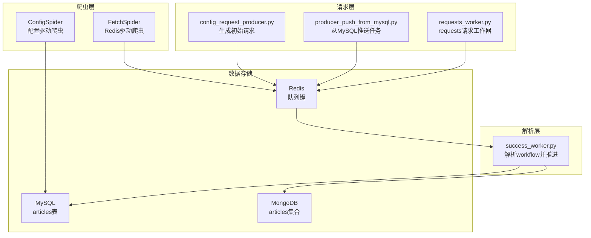
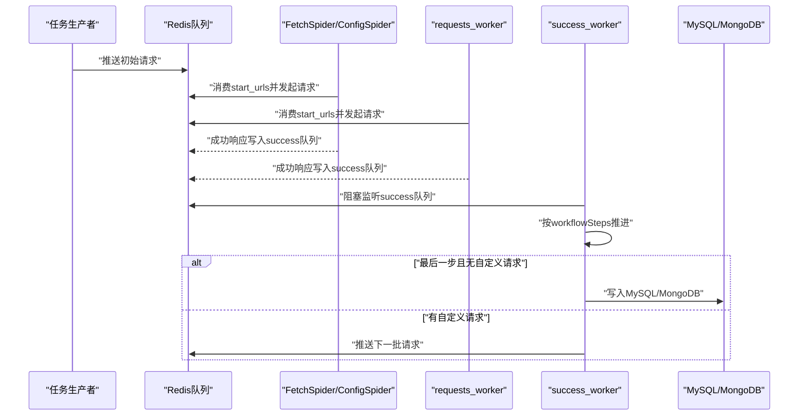
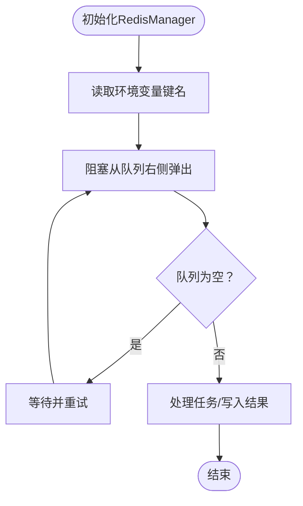
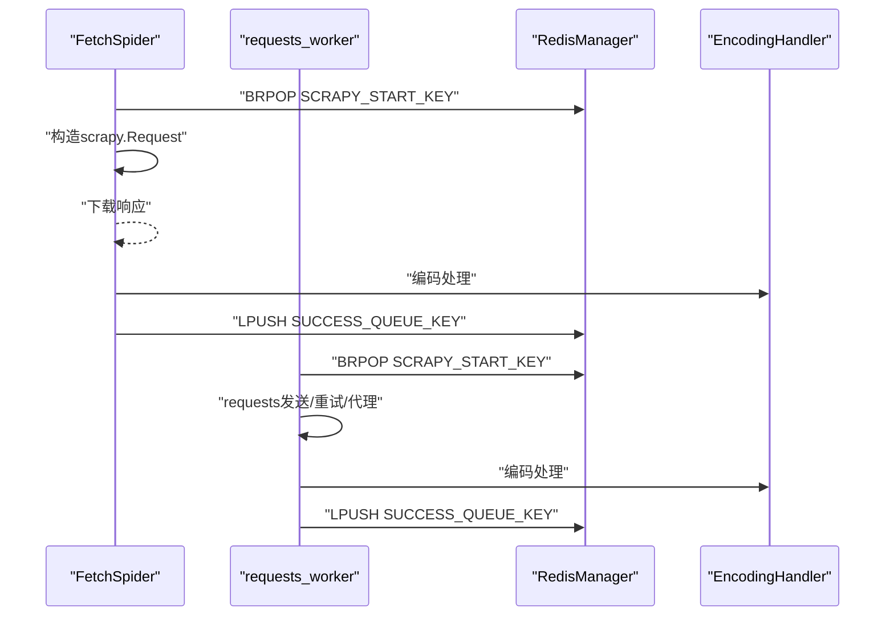
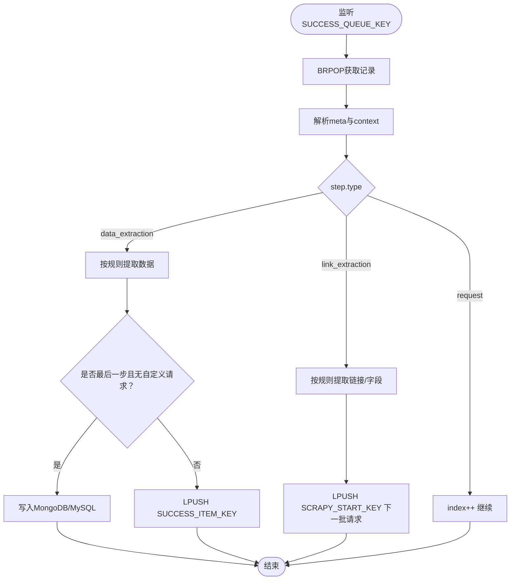
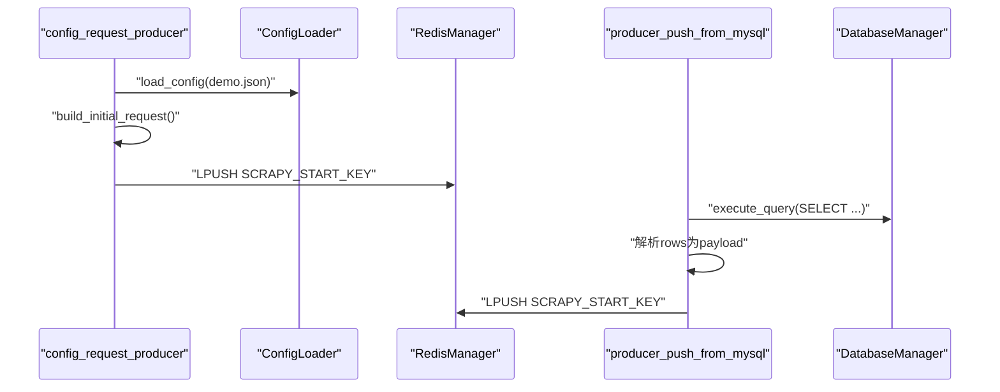
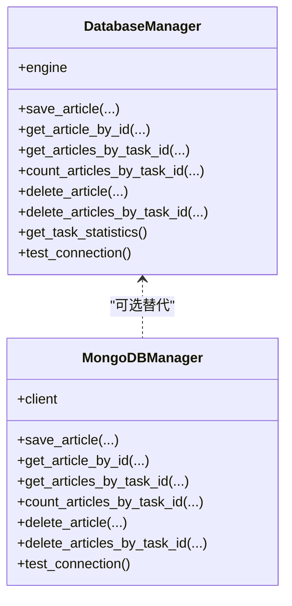
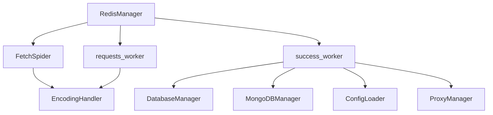

# 分布式部署

<cite>
**本文引用的文件**
- [README.md](file://README.md)
- [crawler/settings.py](file://crawler/settings.py)
- [crawler/spiders/fetch_spider.py](file://crawler/spiders/fetch_spider.py)
- [crawler/spiders/config_spider.py](file://crawler/spiders/config_spider.py)
- [config_request_producer.py](file://config_request_producer.py)
- [producer_push_from_mysql.py](file://producer_push_from_mysql.py)
- [requests_worker.py](file://requests_worker.py)
- [success_worker.py](file://success_worker.py)
- [crawler/utils/redis_manager.py](file://crawler/utils/redis_manager.py)
- [crawler/utils/mongodb_manager.py](file://crawler/utils/mongodb_manager.py)
- [crawler/utils/db_manager.py](file://crawler/utils/db_manager.py)
- [crawler/utils/proxy_manager.py](file://crawler/utils/proxy_manager.py)
- [crawler/utils/env_loader.py](file://crawler/utils/env_loader.py)
- [crawler/utils/config_loader.py](file://crawler/utils/config_loader.py)
- [demo.json](file://demo.json)
</cite>

## 目录
1. [简介](#简介)
2. [项目结构](#项目结构)
3. [核心组件](#核心组件)
4. [架构总览](#架构总览)
5. [详细组件分析](#详细组件分析)
6. [依赖关系分析](#依赖关系分析)
7. [性能考量](#性能考量)
8. [故障排查指南](#故障排查指南)
9. [结论](#结论)
10. [附录](#附录)

## 简介
本节聚焦“分布式部署”，解释其目标、架构以及与系统其他组件的关系。该系统基于 Scrapy-Redis 实现分布式爬取，支持从配置文件或 MySQL 读取任务，将数据保存到 MySQL/MongoDB。分布式部署通过 Redis 队列实现多实例并行消费，结合可选的 requests 工作器与 success 解析器，形成“请求层 + 解析层”的解耦流水线，便于横向扩展与监控。

## 项目结构
- 爬虫项目位于 crawler/，包含 Scrapy 配置、爬虫、管道与工具模块
- 顶层脚本提供任务生产、请求执行、解析推进与数据落库
- 配置文件 demo.json 驱动工作流步骤（request/link_extraction/data_extraction）

图示来源
- [README.md](file://README.md#L137-L202)
- [crawler/spiders/config_spider.py](file://crawler/spiders/config_spider.py#L1-L120)
- [crawler/spiders/fetch_spider.py](file://crawler/spiders/fetch_spider.py#L1-L40)
- [config_request_producer.py](file://config_request_producer.py#L1-L40)
- [producer_push_from_mysql.py](file://producer_push_from_mysql.py#L1-L40)
- [requests_worker.py](file://requests_worker.py#L1-L60)
- [success_worker.py](file://success_worker.py#L1-L40)
- [crawler/utils/redis_manager.py](file://crawler/utils/redis_manager.py#L1-L60)
- [crawler/utils/db_manager.py](file://crawler/utils/db_manager.py#L1-L60)
- [crawler/utils/mongodb_manager.py](file://crawler/utils/mongodb_manager.py#L1-L40)

章节来源
- [README.md](file://README.md#L137-L202)

## 核心组件
- Redis 管理器：统一连接与队列操作，提供阻塞弹出、列表操作、连接测试等能力
- 爬虫组件：ConfigSpider（配置驱动）、FetchSpider（Redis驱动）
- 请求层：config_request_producer（从 demo.json 生成初始请求）、producer_push_from_mysql（从 MySQL 推送）、requests_worker（requests 库请求工作器）
- 解析层：success_worker（消费成功队列，按 workflowSteps 推进）
- 数据存储：DatabaseManager（MySQL）、MongoDBManager（MongoDB）
- 工具：ProxyManager（代理）、EnvLoader（.env 加载）、ConfigLoader（配置加载）

章节来源
- [crawler/utils/redis_manager.py](file://crawler/utils/redis_manager.py#L1-L120)
- [crawler/spiders/config_spider.py](file://crawler/spiders/config_spider.py#L1-L60)
- [crawler/spiders/fetch_spider.py](file://crawler/spiders/fetch_spider.py#L1-L40)
- [config_request_producer.py](file://config_request_producer.py#L1-L40)
- [producer_push_from_mysql.py](file://producer_push_from_mysql.py#L1-L40)
- [requests_worker.py](file://requests_worker.py#L1-L60)
- [success_worker.py](file://success_worker.py#L1-L60)
- [crawler/utils/db_manager.py](file://crawler/utils/db_manager.py#L1-L60)
- [crawler/utils/mongodb_manager.py](file://crawler/utils/mongodb_manager.py#L1-L60)
- [crawler/utils/proxy_manager.py](file://crawler/utils/proxy_manager.py#L1-L60)
- [crawler/utils/env_loader.py](file://crawler/utils/env_loader.py#L1-L40)
- [crawler/utils/config_loader.py](file://crawler/utils/config_loader.py#L1-L16)

## 架构总览
分布式部署采用“请求层 + 解析层 + 存储层”的三层解耦设计：
- 请求层：通过 Redis 队列统一接收任务，支持多种来源（配置文件、MySQL、Scrapy-Redis、requests 工作器）
- 解析层：success_worker 持续监听成功队列，按 workflowSteps 顺序推进，支持链接抽取、数据抽取、自定义请求生成
- 存储层：优先写入 MongoDB，其次写入 MySQL，最后回退到 Redis 队列

图示来源
- [README.md](file://README.md#L163-L202)
- [crawler/spiders/fetch_spider.py](file://crawler/spiders/fetch_spider.py#L1-L40)
- [requests_worker.py](file://requests_worker.py#L1-L120)
- [success_worker.py](file://success_worker.py#L1-L120)
- [crawler/utils/redis_manager.py](file://crawler/utils/redis_manager.py#L120-L200)
- [crawler/utils/db_manager.py](file://crawler/utils/db_manager.py#L139-L217)
- [crawler/utils/mongodb_manager.py](file://crawler/utils/mongodb_manager.py#L134-L194)

## 详细组件分析

### 组件A：分布式队列与键空间
- 关键键
  - SCRAPY_START_KEY：待请求任务队列（默认 fetch_spider:start_urls）
  - SUCCESS_QUEUE_KEY：成功响应队列（默认 fetch_spider:success）
  - SUCCESS_ITEM_KEY：数据结果队列（默认 fetch_spider:data_items）
  - SUCCESS_ERROR_KEY：错误队列（默认 fetch_spider:errors）
- RedisManager 提供阻塞弹出、列表操作、连接测试等能力，支撑多实例并行消费

图示来源
- [crawler/utils/redis_manager.py](file://crawler/utils/redis_manager.py#L145-L174)
- [crawler/utils/redis_manager.py](file://crawler/utils/redis_manager.py#L200-L238)
- [crawler/settings.py](file://crawler/settings.py#L28-L39)

章节来源
- [crawler/utils/redis_manager.py](file://crawler/utils/redis_manager.py#L1-L200)
- [crawler/settings.py](file://crawler/settings.py#L28-L39)

### 组件B：请求层（Scrapy-Redis 与 requests 工作器）
- Scrapy-Redis
  - FetchSpider 从 SCRAPY_START_KEY 消费任务，解析响应编码后写入 SUCCESS_QUEUE_KEY
  - ConfigSpider 从 demo.json 驱动工作流，直接在爬虫内推进
- requests 工作器
  - 从 SCRAPY_START_KEY 消费任务，使用 requests 发起请求，处理重试、代理、编码，写入 SUCCESS_QUEUE_KEY

图示来源
- [crawler/spiders/fetch_spider.py](file://crawler/spiders/fetch_spider.py#L1-L100)
- [requests_worker.py](file://requests_worker.py#L1-L160)
- [crawler/utils/redis_manager.py](file://crawler/utils/redis_manager.py#L145-L174)

章节来源
- [crawler/spiders/fetch_spider.py](file://crawler/spiders/fetch_spider.py#L1-L100)
- [requests_worker.py](file://requests_worker.py#L1-L200)

### 组件C：解析层（success_worker）
- 从 SUCCESS_QUEUE_KEY 持续消费成功响应，按 workflowSteps 推进
- 支持步骤类型：request、link_extraction、data_extraction
- 链接抽取：基于规则提取链接与上下文字段，生成下一批请求
- 数据抽取：提取字段写入 SUCCESS_ITEM_KEY，若为最后一步且无自定义请求，优先写入 MongoDB/MySQL

图示来源
- [success_worker.py](file://success_worker.py#L1-L120)
- [success_worker.py](file://success_worker.py#L120-L220)
- [success_worker.py](file://success_worker.py#L220-L320)

章节来源
- [success_worker.py](file://success_worker.py#L1-L200)

### 组件D：任务生产与来源
- 配置驱动：config_request_producer 读取 demo.json，生成首个 request 步骤的 payload，写入 SCRAPY_START_KEY
- MySQL 驱动：producer_push_from_mysql 从 pending_requests 表读取待抓取请求，解析后写入 SCRAPY_START_KEY

图示来源
- [config_request_producer.py](file://config_request_producer.py#L1-L60)
- [crawler/utils/config_loader.py](file://crawler/utils/config_loader.py#L1-L16)
- [producer_push_from_mysql.py](file://producer_push_from_mysql.py#L1-L80)
- [crawler/utils/db_manager.py](file://crawler/utils/db_manager.py#L103-L139)

章节来源
- [config_request_producer.py](file://config_request_producer.py#L1-L77)
- [producer_push_from_mysql.py](file://producer_push_from_mysql.py#L1-L90)

### 组件E：存储层（MySQL 与 MongoDB）
- MySQL：DatabaseManager.save_article 使用链接哈希与内容哈希去重，支持事务与分表
- MongoDB：MongoDBManager.save_article 使用链接哈希去重，支持脱敏 URI 输出

图示来源
- [crawler/utils/db_manager.py](file://crawler/utils/db_manager.py#L139-L217)
- [crawler/utils/mongodb_manager.py](file://crawler/utils/mongodb_manager.py#L134-L194)

章节来源
- [crawler/utils/db_manager.py](file://crawler/utils/db_manager.py#L1-L200)
- [crawler/utils/mongodb_manager.py](file://crawler/utils/mongodb_manager.py#L1-L200)

### 组件F：配置与环境
- .env 加载：自动定位项目根目录下的 .env 文件，支持调试输出
- 配置优先级：系统环境变量 > .env 文件 > 代码默认值
- 关键配置项：REDIS_URL、MYSQL_*、CONFIG_PATH、LOG_LEVEL、队列键名等

章节来源
- [crawler/utils/env_loader.py](file://crawler/utils/env_loader.py#L1-L60)
- [README.md](file://README.md#L205-L233)
- [crawler/settings.py](file://crawler/settings.py#L1-L54)

## 依赖关系分析
- 组件耦合
  - RedisManager 为请求层与解析层共享依赖，提供统一队列操作
  - success_worker 依赖 ConfigLoader、RedisManager、DatabaseManager/MongoDBManager
  - FetchSpider/ConfigSpider 依赖 RedisManager 与编码处理工具
- 外部依赖
  - Redis：队列与去重集合
  - MySQL：文章主表与内容表
  - MongoDB：可选全文/结构化存储
  - requests：requests_worker 的 HTTP 请求栈

图示来源
- [crawler/utils/redis_manager.py](file://crawler/utils/redis_manager.py#L1-L120)
- [crawler/spiders/fetch_spider.py](file://crawler/spiders/fetch_spider.py#L1-L60)
- [requests_worker.py](file://requests_worker.py#L1-L120)
- [success_worker.py](file://success_worker.py#L1-L120)
- [crawler/utils/config_loader.py](file://crawler/utils/config_loader.py#L1-L16)
- [crawler/utils/proxy_manager.py](file://crawler/utils/proxy_manager.py#L1-L120)
- [crawler/utils/db_manager.py](file://crawler/utils/db_manager.py#L1-L120)
- [crawler/utils/mongodb_manager.py](file://crawler/utils/mongodb_manager.py#L1-L120)

## 性能考量
- 并发与延迟
  - Scrapy 层可通过 taskInfo.concurrency 与 DOWNLOAD_DELAY 控制并发与请求间隔
  - requests_worker 支持超时、重试、重试延迟配置
- 队列与去重
  - 使用 Redis 列表与集合实现任务分发与去重
  - 建议合理设置队列键名，避免跨任务冲突
- 存储性能
  - MySQL 使用连接池与预编译语句，MongoDB 使用哈希去重减少重复写入
- 编码处理
  - 自动检测与手动指定编码相结合，降低乱码风险

章节来源
- [crawler/spiders/config_spider.py](file://crawler/spiders/config_spider.py#L28-L40)
- [demo.json](file://demo.json#L1-L40)
- [requests_worker.py](file://requests_worker.py#L1-L120)
- [crawler/utils/db_manager.py](file://crawler/utils/db_manager.py#L60-L120)
- [crawler/utils/mongodb_manager.py](file://crawler/utils/mongodb_manager.py#L1-L60)

## 故障排查指南
- Redis 连接失败
  - 检查 REDIS_URL 格式与密码
  - 使用 RedisManager.test_connection() 验证
- MySQL 连接失败
  - 检查 MYSQL_USER/PASSWORD/DB 配置
  - 使用 DatabaseManager.test_connection() 验证
- MongoDB 连接失败
  - 检查 MONGODB_URI/MONGODB_DB
  - 使用 MongoDBManager.test_connection() 验证
- 队列状态监控
  - 使用 LLEN 查看队列长度，SCARD 查看去重集合大小
- 日志级别
  - 通过 LOG_LEVEL 调整日志输出

章节来源
- [README.md](file://README.md#L357-L391)
- [crawler/utils/redis_manager.py](file://crawler/utils/redis_manager.py#L95-L120)
- [crawler/utils/db_manager.py](file://crawler/utils/db_manager.py#L91-L120)
- [crawler/utils/mongodb_manager.py](file://crawler/utils/mongodb_manager.py#L97-L120)

## 结论
该分布式部署方案通过 Redis 队列实现请求与解析的解耦，支持多实例并行消费与横向扩展。请求层可灵活选择 Scrapy-Redis 或 requests 工作器，解析层通过 success_worker 严格遵循配置驱动的工作流，最终将数据可靠地写入 MongoDB/MySQL。配合代理、编码处理与去重策略，系统具备良好的稳定性与可维护性。

## 附录

### 常见用例
- 多实例分布式爬取
  - 在不同服务器或终端启动多个 FetchSpider 实例，共享 SCRAPY_START_KEY 实现负载均衡
- 仅请求模式
  - 使用 requests_worker 替代 Scrapy，适合轻量场景
- 配置驱动全链路
  - 使用 demo.json 驱动，success_worker 负责解析与推进，适合复杂抽取逻辑

章节来源
- [README.md](file://README.md#L357-L378)
- [README.md](file://README.md#L163-L202)

### 公共接口与参数
- RedisManager
  - lpush/rpush/brpop/blpop/get/set/delete/llen/keys/flushdb/test_connection/close
  - 关键参数：redis_url/host/port/db/password/decode_responses/auto_connect
- DatabaseManager
  - save_article/get_article_by_id/get_articles_by_task_id/count_articles_by_task_id/delete_article/delete_articles_by_task_id/get_task_statistics/test_connection
  - 关键参数：user/password/host/port/database/charset/pool_size/max_overflow
- MongoDBManager
  - save_article/get_article_by_id/get_articles_by_task_id/count_articles_by_task_id/delete_article/delete_articles_by_task_id/test_connection
  - 关键参数：uri/database/collection/connect_timeout/server_selection_timeout
- ProxyManager
  - get_proxies/is_enabled/from_env
  - 关键参数：mode/http_proxy/https_proxy/socks_proxy/dynamic_api/dynamic_api_method/dynamic_api_headers/refresh_interval
- EnvLoader
  - load_env_file(env_path)
- ConfigLoader
  - load_config(config_path)

章节来源
- [crawler/utils/redis_manager.py](file://crawler/utils/redis_manager.py#L115-L238)
- [crawler/utils/db_manager.py](file://crawler/utils/db_manager.py#L139-L217)
- [crawler/utils/mongodb_manager.py](file://crawler/utils/mongodb_manager.py#L134-L194)
- [crawler/utils/proxy_manager.py](file://crawler/utils/proxy_manager.py#L1-L120)
- [crawler/utils/env_loader.py](file://crawler/utils/env_loader.py#L1-L60)
- [crawler/utils/config_loader.py](file://crawler/utils/config_loader.py#L1-L16)