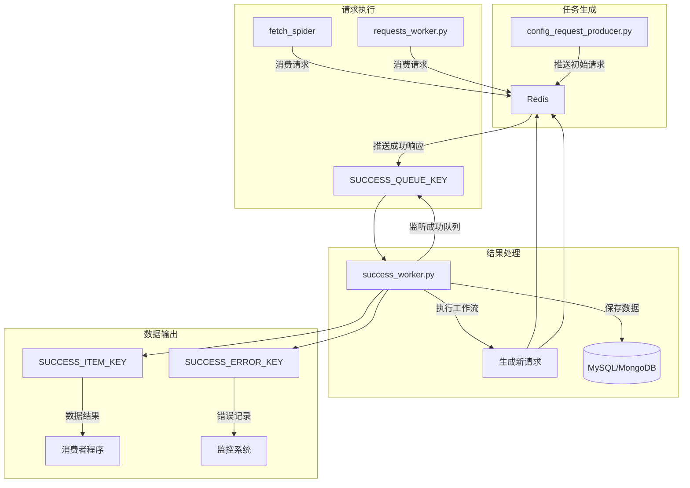
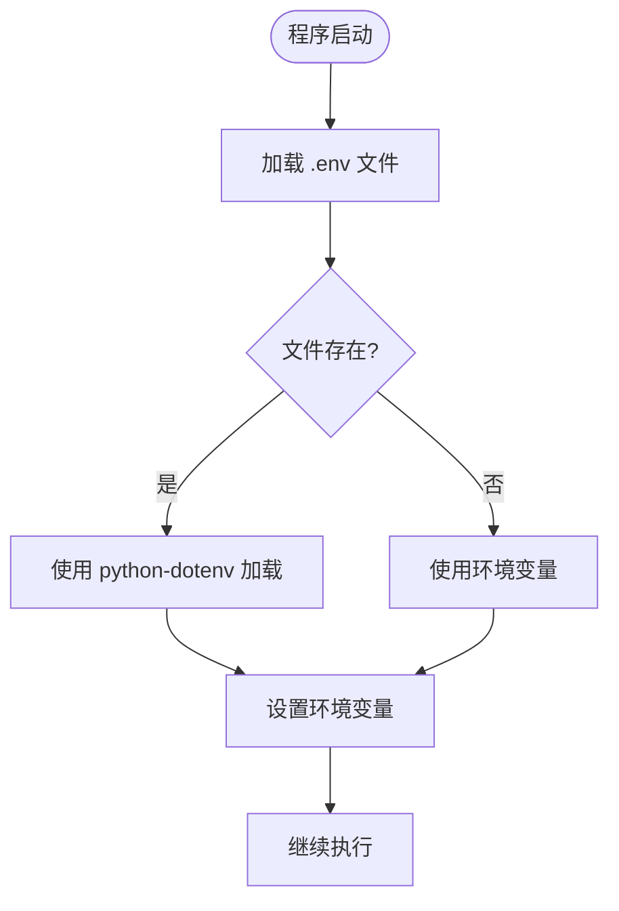
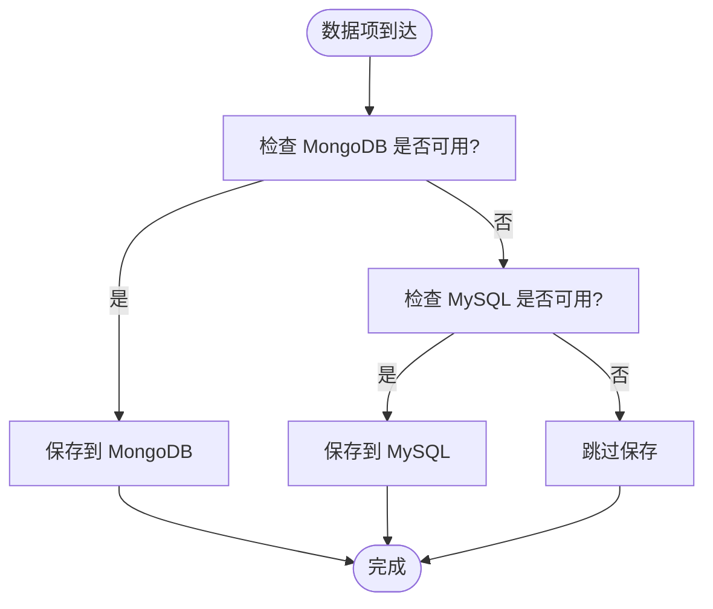
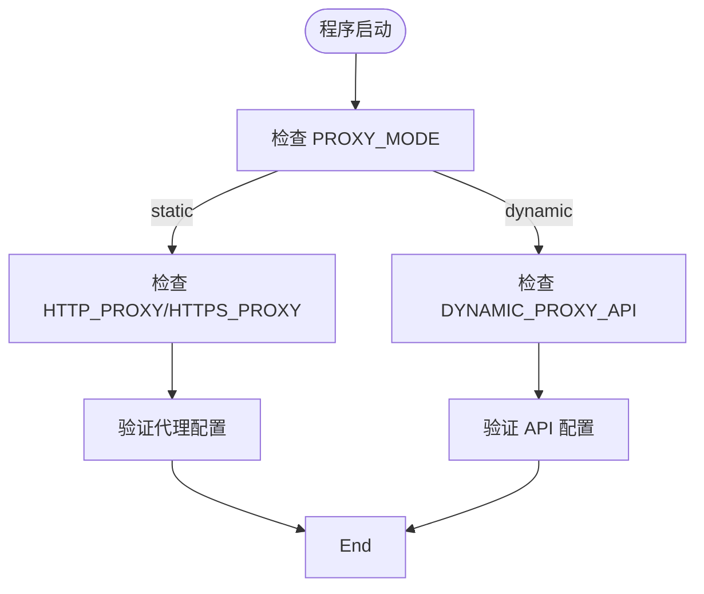

# 常见问题

<cite>
**本文档引用的文件**  
- [README.md](file://README.md)
- [ENV_CONFIG.md](file://ENV_CONFIG.md)
- [crawler/settings.py](file://crawler/settings.py)
- [crawler/spiders/config_spider.py](file://crawler/spiders/config_spider.py)
- [crawler/spiders/fetch_spider.py](file://crawler/spiders/fetch_spider.py)
- [success_worker.py](file://success_worker.py)
- [requests_worker.py](file://requests_worker.py)
- [config_request_producer.py](file://config_request_producer.py)
- [crawler/pipelines.py](file://crawler/pipelines.py)
- [crawler/utils/env_loader.py](file://crawler/utils/env_loader.py)
</cite>

## 目录
1. [简介](#简介)
2. [核心架构与工作流程](#核心架构与工作流程)
3. [配置与环境变量](#配置与环境变量)
4. [数据库与数据存储](#数据库与数据存储)
5. [代理配置](#代理配置)
6. [常见问题与解决方案](#常见问题与解决方案)
7. [系统监控与调试](#系统监控与调试)
8. [分布式部署](#分布式部署)

## 简介

本节详细说明该分布式爬虫系统中常见的问题及其解决方案。系统基于 Scrapy-Redis 构建，支持从 JSON 配置文件或 MySQL 数据库读取任务，通过 Redis 实现分布式调度，并将爬取结果保存到 MySQL 或 MongoDB。系统采用模块化设计，包含配置驱动爬虫、仅请求模式爬虫、外部解析工作流等多种运行模式。

系统的核心特点是支持灵活的工作流（workflow）机制，允许通过 `demo.json` 配置文件定义复杂的爬取流程，包括请求、链接提取和数据提取等步骤。同时，系统提供了 `success_worker.py` 和 `requests_worker.py` 等外部工作器，实现了爬取与解析的解耦，提高了系统的灵活性和可扩展性。

**Section sources**
- [README.md](file://README.md#L1-L454)
- [ENV_CONFIG.md](file://ENV_CONFIG.md#L1-L375)

## 核心架构与工作流程

该系统采用分布式架构，以 Redis 作为任务队列和状态管理的中心。核心组件包括 Scrapy 爬虫、Redis 队列、MySQL/MongoDB 数据库以及多个外部工作器。



**Diagram sources**  
- [config_request_producer.py](file://config_request_producer.py#L1-L77)
- [crawler/spiders/fetch_spider.py](file://crawler/spiders/fetch_spider.py#L1-L100)
- [requests_worker.py](file://requests_worker.py#L1-L327)
- [success_worker.py](file://success_worker.py#L1-L363)

### 工作流执行流程

系统支持两种主要的工作流执行模式：

1. **全链路 Redis 模式**：完全遵循 `demo.json` 的 `workflowSteps`，Scrapy 只负责发送请求，解析工作由 `success_worker.py` 完成。
2. **配置驱动模式**：使用 `config_spider.py` 直接在 Scrapy 内部执行工作流，适用于简单的爬取任务。

在全链路 Redis 模式下，工作流的执行流程如下：
1. `config_request_producer.py` 读取 `demo.json`，生成初始请求并写入 `SCRAPY_START_KEY`。
2. `fetch_spider` 或 `requests_worker.py` 从 `SCRAPY_START_KEY` 消费请求，发送 HTTP 请求，并将响应写回 `SUCCESS_QUEUE_KEY`。
3. `success_worker.py` 监听 `SUCCESS_QUEUE_KEY`，根据 `workflowSteps` 执行相应操作：
   - `request`：直接推进到下一步骤
   - `link_extraction`：抽取链接并推送下一批请求
   - `data_extraction`：抽取数据并写入 `SUCCESS_ITEM_KEY`
4. 循环执行，直到工作流完成。

**Section sources**
- [README.md](file://README.md#L163-L199)
- [success_worker.py](file://success_worker.py#L1-L363)
- [crawler/spiders/config_spider.py](file://crawler/spiders/config_spider.py#L1-L325)

## 配置与环境变量

系统支持通过 `.env` 文件、环境变量和代码默认值三种方式配置参数，配置优先级为：系统环境变量 > `.env` 文件 > 代码默认值。

### 主要配置项

| 配置项 | 说明 | 默认值 | 是否必填 |
|--------|------|--------|--------|
| `REDIS_URL` | Redis 连接 URL | `redis://localhost:6379/0` | 否 |
| `MYSQL_HOST` | MySQL 主机地址 | `localhost` | 否 |
| `MYSQL_PORT` | MySQL 端口 | `3306` | 否 |
| `MYSQL_USER` | MySQL 用户名 | - | 是 |
| `MYSQL_PASSWORD` | MySQL 密码 | - | 是 |
| `MYSQL_DB` | MySQL 数据库名 | - | 是 |
| `CONFIG_PATH` | 配置文件路径 | `demo.json` | 否 |
| `SCRAPY_START_KEY` | Scrapy 启动队列键 | `fetch_spider:start_urls` | 否 |
| `SUCCESS_QUEUE_KEY` | 成功队列键 | `fetch_spider:success` | 否 |

### 配置加载机制

系统通过 `crawler/utils/env_loader.py` 模块自动加载 `.env` 文件。该模块会在导入时自动查找项目根目录下的 `.env` 文件并加载其内容。如果 `.env` 文件不存在，系统将回退到环境变量和代码默认值。



**Diagram sources**  
- [crawler/utils/env_loader.py](file://crawler/utils/env_loader.py#L1-L63)
- [crawler/settings.py](file://crawler/settings.py#L1-L54)

**Section sources**
- [README.md](file://README.md#L203-L233)
- [ENV_CONFIG.md](file://ENV_CONFIG.md#L1-L375)
- [crawler/settings.py](file://crawler/settings.py#L1-L54)

## 数据库与数据存储

系统支持 MySQL 和 MongoDB 两种数据库存储方式，数据存储优先级为：MongoDB > MySQL > Redis 队列。

### 存储优先级

1. **MongoDB**：如果配置了 MongoDB 且连接成功，优先使用 MongoDB 存储数据。
2. **MySQL**：如果没有 MongoDB 但有 MySQL，使用 MySQL 存储数据。
3. **Redis**：如果都没有配置，数据存到 Redis 队列。

### 数据表结构

#### MySQL 数据表

```sql
-- 用于保存爬取结果
CREATE TABLE articles (
    id BIGINT PRIMARY KEY AUTO_INCREMENT,
    task_id VARCHAR(32),
    title TEXT,
    link TEXT,
    content LONGTEXT,
    source_url TEXT,
    extra JSON,
    created_at TIMESTAMP DEFAULT CURRENT_TIMESTAMP,
    INDEX idx_task_id (task_id),
    INDEX idx_created_at (created_at)
) ENGINE=InnoDB DEFAULT CHARSET=utf8mb4 COLLATE=utf8mb4_unicode_ci;

-- 用于存储待抓取请求
CREATE TABLE pending_requests (
    id BIGINT PRIMARY KEY AUTO_INCREMENT,
    url TEXT NOT NULL,
    method VARCHAR(10) DEFAULT 'GET',
    headers_json TEXT,
    params_json TEXT,
    meta_json TEXT,
    created_at TIMESTAMP DEFAULT CURRENT_TIMESTAMP,
    INDEX idx_created_at (created_at)
) ENGINE=InnoDB DEFAULT CHARSET=utf8mb4 COLLATE=utf8mb4_unicode_ci;
```

### 数据存储流程



**Diagram sources**  
- [crawler/pipelines.py](file://crawler/pipelines.py#L1-L105)
- [success_worker.py](file://success_worker.py#L1-L363)

**Section sources**
- [README.md](file://README.md#L88-L115)
- [crawler/pipelines.py](file://crawler/pipelines.py#L1-L105)
- [ENV_CONFIG.md](file://ENV_CONFIG.md#L338-L342)

## 代理配置

系统支持两种代理模式：固定代理和动态代理。

### 固定代理配置

使用固定的代理服务器地址：

```bash
# 设置代理模式为固定代理
PROXY_MODE=static

# HTTP/HTTPS 代理
HTTP_PROXY=http://127.0.0.1:7890
HTTPS_PROXY=http://127.0.0.1:7890

# 或者使用 SOCKS5 代理
SOCKS_PROXY=socks5://127.0.0.1:1080
```

### 动态代理配置

通过 API 接口获取代理地址，适用于代理池服务：

```bash
# 设置代理模式为动态代理
PROXY_MODE=dynamic

# 动态代理 API 地址
DYNAMIC_PROXY_API=http://your-proxy-api.com/get

# API 请求方法（GET 或 POST）
DYNAMIC_PROXY_API_METHOD=GET

# 代理刷新间隔（秒），0 表示每次请求都获取新代理
DYNAMIC_PROXY_REFRESH_INTERVAL=0
```

### 代理配置验证



**Section sources**
- [ENV_CONFIG.md](file://ENV_CONFIG.md#L109-L201)
- [requests_worker.py](file://requests_worker.py#L1-L327)

## 常见问题与解决方案

### 1. Redis 连接失败

- 检查 Redis 服务是否启动：`redis-cli ping`
- 检查 `REDIS_URL` 环境变量是否正确
- 检查防火墙设置
- 如果使用密码，确保格式正确：`redis://:password@host:port/db`
- 特殊字符需要 URL 编码（如 `@` → `%40`）

### 2. MySQL 连接失败

- 检查 MySQL 服务是否启动
- 验证用户名、密码、数据库名是否正确
- 检查 MySQL 用户权限
- 如果密码包含特殊字符，用引号包裹：`MYSQL_PASSWORD="pass@word"`

### 3. 爬虫不工作

- 检查 Redis 队列中是否有任务：`redis-cli LLEN fetch_spider:start_urls`
- 查看日志：`scrapy crawl fetch_spider -L DEBUG`
- 检查配置文件格式是否正确
- 确认 `.env` 文件已正确配置并加载

### 4. 数据未保存到 MySQL

- 检查 `ITEM_PIPELINES` 配置
- 检查 MySQL 表结构是否正确
- 查看爬虫日志中的错误信息
- 确认 `MYSQL_USER`、`MYSQL_PASSWORD`、`MYSQL_DB` 等必填项已配置

### 5. 代理不生效

- 确认 `PROXY_MODE` 已正确设置为 `static` 或 `dynamic`
- 如果是 static 模式，确认 `HTTP_PROXY` 或 `HTTPS_PROXY` 已配置
- 如果是 dynamic 模式，确认 `DYNAMIC_PROXY_API` 已配置
- 查看程序运行日志，确认代理是否正常加载

### 6. 编码问题

系统内置了编码处理机制，自动识别和解码响应内容。可以通过配置手动指定编码：

```json
{
  "workflowSteps": [
    {
      "type": "request",
      "config": {
        "encodingMode": "manual",
        "encoding": "gbk"
      }
    }
  ]
}
```

**Section sources**
- [README.md](file://README.md#L408-L433)
- [ENV_CONFIG.md](file://ENV_CONFIG.md#L327-L374)
- [crawler/spiders/config_spider.py](file://crawler/spiders/config_spider.py#L1-L325)

## 系统监控与调试

### 队列状态监控

```bash
# 查看待处理任务数
redis-cli LLEN fetch_spider:start_urls

# 查看成功队列任务数
redis-cli LLEN fetch_spider:success

# 查看去重集合大小
redis-cli SCARD fetch_spider:dupefilter
```

### 测试脚本

系统提供了 `test_setup.py` 测试脚本，用于验证环境配置：

```bash
python test_setup.py
```

该脚本会自动验证：
- 依赖包是否安装
- Redis 连接是否正常
- MySQL 连接是否正常
- 配置文件是否能加载
- 数据库表是否存在
- Redis 队列是否可用

### 日志级别

可以通过 `LOG_LEVEL` 环境变量设置日志级别，默认为 `INFO`。在调试时可以设置为 `DEBUG` 以获取更详细的信息。

**Section sources**
- [README.md](file://README.md#L379-L390)
- [test_setup.py](file://test_setup.py)

## 分布式部署

### 多实例部署

在不同服务器或同一服务器的不同终端启动多个爬虫实例：

```bash
# 服务器 1
source scrabgs/bin/activate
scrapy crawl fetch_spider

# 服务器 2
source scrabgs/bin/activate
scrapy crawl fetch_spider

# 服务器 3
source scrabgs/bin/activate
scrapy crawl fetch_spider
```

所有实例会从同一个 Redis 队列消费任务，实现分布式爬取。

### 负载均衡

由于所有爬虫实例共享同一个 Redis 队列，系统天然支持负载均衡。可以根据任务量动态增加或减少爬虫实例数量。

**Section sources**
- [README.md](file://README.md#L357-L377)