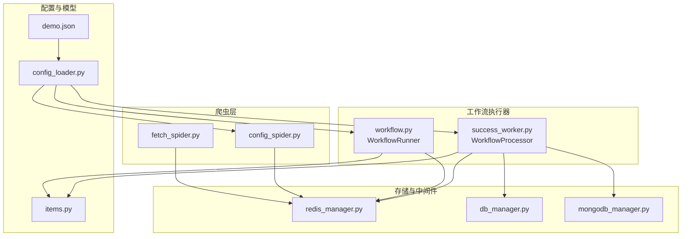
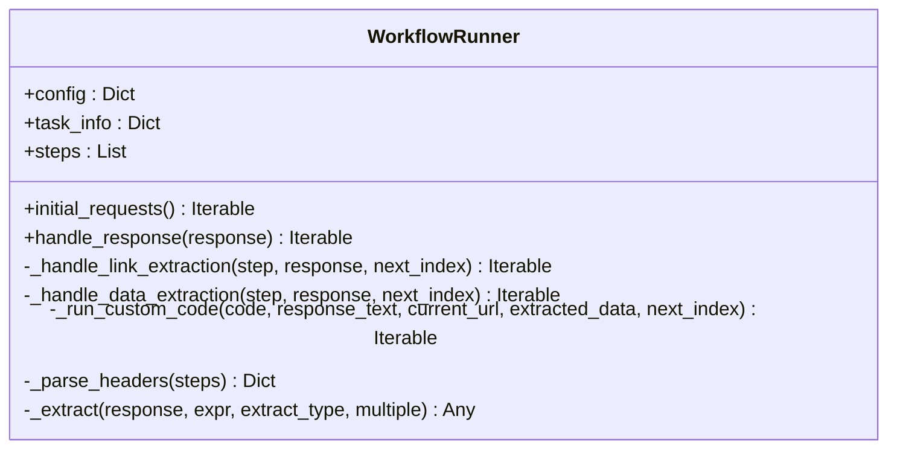
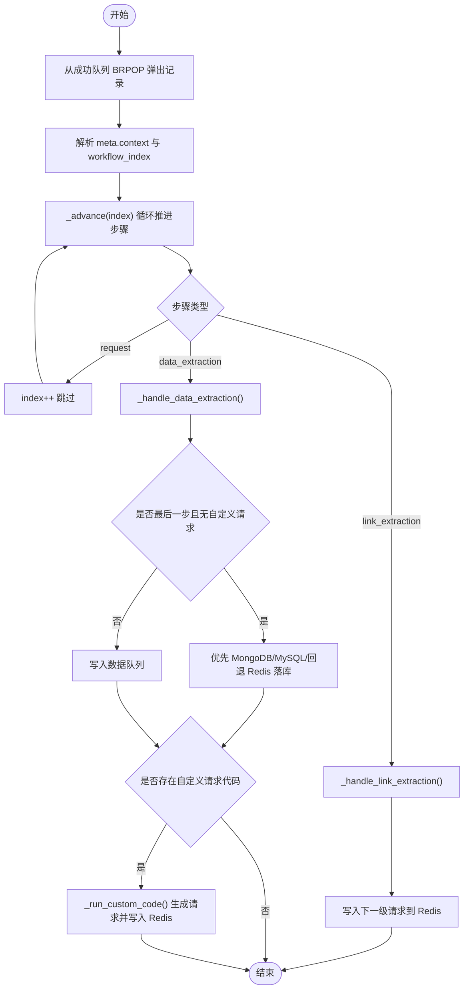
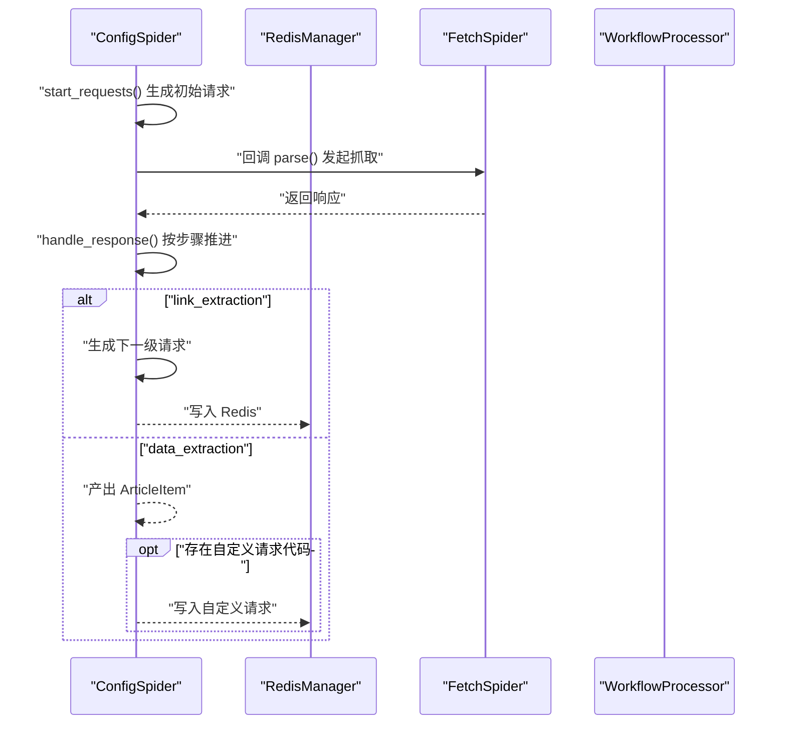
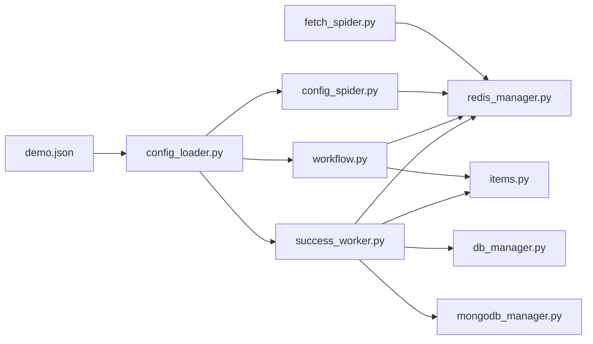

# 工作流扩展

<cite>
**本文引用的文件**
- [crawler/utils/workflow.py](file://crawler/utils/workflow.py)
- [success_worker.py](file://success_worker.py)
- [crawler/spiders/config_spider.py](file://crawler/spiders/config_spider.py)
- [crawler/spiders/fetch_spider.py](file://crawler/spiders/fetch_spider.py)
- [demo.json](file://demo.json)
- [crawler/utils/config_loader.py](file://crawler/utils/config_loader.py)
- [crawler/items.py](file://crawler/items.py)
- [crawler/utils/redis_manager.py](file://crawler/utils/redis_manager.py)
- [crawler/utils/db_manager.py](file://crawler/utils/db_manager.py)
- [crawler/utils/mongodb_manager.py](file://crawler/utils/mongodb_manager.py)
</cite>

## 目录
1. [简介](#简介)
2. [项目结构](#项目结构)
3. [核心组件](#核心组件)
4. [架构总览](#架构总览)
5. [详细组件分析](#详细组件分析)
6. [依赖关系分析](#依赖关系分析)
7. [性能考量](#性能考量)
8. [故障排查指南](#故障排查指南)
9. [结论](#结论)
10. [附录](#附录)

## 简介
本节聚焦“工作流扩展”，系统性阐述其目标、架构与实现要点，解释如何通过配置驱动的 workflowSteps 实现链路提取与数据提取的顺序化执行，支持自定义 Python 代码注入以动态生成后续请求，并通过 meta.workflow_index 控制流程跳转。同时，结合 success_worker.py 中的 WorkflowProcessor 在分布式环境下实现异步处理与落库/落库策略，形成完整的采集-处理-存储闭环。

## 项目结构
工作流扩展涉及以下关键模块：
- 配置加载与模型：配置文件 demo.json、配置加载器
- 爬虫层：FetchSpider（抓取成功后入队）、ConfigSpider（基于配置的请求调度）
- 工作流执行器：WorkflowRunner（Scrapy Spider 内部执行器）、WorkflowProcessor（分布式异步处理）
- 数据存储：Redis 队列、MySQL、MongoDB
- 数据模型：ArticleItem



**图示来源**
- [demo.json](file://demo.json#L1-L181)
- [crawler/utils/config_loader.py](file://crawler/utils/config_loader.py#L1-L16)
- [crawler/spiders/fetch_spider.py](file://crawler/spiders/fetch_spider.py#L1-L100)
- [crawler/spiders/config_spider.py](file://crawler/spiders/config_spider.py#L1-L325)
- [crawler/utils/workflow.py](file://crawler/utils/workflow.py#L1-L157)
- [success_worker.py](file://success_worker.py#L1-L363)
- [crawler/utils/redis_manager.py](file://crawler/utils/redis_manager.py#L1-L345)
- [crawler/utils/db_manager.py](file://crawler/utils/db_manager.py#L1-L618)
- [crawler/utils/mongodb_manager.py](file://crawler/utils/mongodb_manager.py#L1-L323)
- [crawler/items.py](file://crawler/items.py#L1-L12)

**章节来源**
- [demo.json](file://demo.json#L1-L181)
- [crawler/utils/config_loader.py](file://crawler/utils/config_loader.py#L1-L16)
- [crawler/spiders/fetch_spider.py](file://crawler/spiders/fetch_spider.py#L1-L100)
- [crawler/spiders/config_spider.py](file://crawler/spiders/config_spider.py#L1-L325)
- [crawler/utils/workflow.py](file://crawler/utils/workflow.py#L1-L157)
- [success_worker.py](file://success_worker.py#L1-L363)
- [crawler/utils/redis_manager.py](file://crawler/utils/redis_manager.py#L1-L345)
- [crawler/utils/db_manager.py](file://crawler/utils/db_manager.py#L1-L618)
- [crawler/utils/mongodb_manager.py](file://crawler/utils/mongodb_manager.py#L1-L323)
- [crawler/items.py](file://crawler/items.py#L1-L12)

## 核心组件
- WorkflowRunner（Scrapy 内部执行器）
  - 解析配置中的 workflowSteps，按序执行 link_extraction 与 data_extraction 步骤
  - 支持 nextRequestCustomCode 注入自定义 Python 代码，动态生成后续请求
  - 通过 meta.workflow_index 控制流程跳转
- WorkflowProcessor（分布式异步处理）
  - 持续消费 fetch_spider 成功队列，推进工作流并产出数据
  - 支持多存储落库策略：MongoDB > MySQL > Redis
  - 支持自定义 Python 代码注入，生成后续请求并推送到 Redis
- FetchSpider（抓取成功入队）
  - 抓取完成后将解析后的记录写入 Redis 成功队列
- ConfigSpider（基于配置的请求调度）
  - 从 Redis 或配置的 baseUrl 启动，按 workflowSteps 顺序推进
  - 支持编码处理、链接提取、数据提取与自定义代码注入
- 存储与中间件
  - RedisManager：统一 Redis 连接与队列操作
  - DatabaseManager：MySQL 连接与文章落库
  - MongoDBManager：MongoDB 连接与文章落库
- 数据模型
  - ArticleItem：统一的数据结构

**章节来源**
- [crawler/utils/workflow.py](file://crawler/utils/workflow.py#L1-L157)
- [success_worker.py](file://success_worker.py#L1-L363)
- [crawler/spiders/fetch_spider.py](file://crawler/spiders/fetch_spider.py#L1-L100)
- [crawler/spiders/config_spider.py](file://crawler/spiders/config_spider.py#L1-L325)
- [crawler/utils/redis_manager.py](file://crawler/utils/redis_manager.py#L1-L345)
- [crawler/utils/db_manager.py](file://crawler/utils/db_manager.py#L1-L618)
- [crawler/utils/mongodb_manager.py](file://crawler/utils/mongodb_manager.py#L1-L323)
- [crawler/items.py](file://crawler/items.py#L1-L12)

## 架构总览
工作流扩展采用“采集-处理-存储”三层架构：
- 采集层：FetchSpider 从目标站点抓取页面，成功后将记录写入 Redis 成功队列
- 处理层：WorkflowProcessor 消费成功队列，按 workflowSteps 推进，支持链接提取、数据提取与自定义代码注入
- 存储层：根据配置优先级选择 MongoDB、MySQL 或 Redis 作为最终存储

```mermaid
sequenceDiagram
participant Target as "目标站点"
participant FS as "FetchSpider"
participant RM as "RedisManager"
participant WP as "WorkflowProcessor"
participant DB as "DatabaseManager"
participant MDB as "MongoDBManager"
Target-->>FS : "HTTP 响应"
FS->>RM : "lpush 成功队列"
loop 持续消费
WP->>RM : "brpop 成功队列"
RM-->>WP : "记录"
WP->>WP : "_advance() 推进工作流"
alt "link_extraction"
WP->>RM : "lpush 下一级请求"
else "data_extraction"
WP->>WP : "保存数据"
opt "MongoDB 可用"
WP->>MDB : "save_article()"
else "MySQL 可用"
WP->>DB : "save_article()"
else "回退到 Redis"
WP->>RM : "lpush 数据队列"
end
opt "存在 nextRequestCustomCode"
WP->>RM : "lpush 自定义请求"
end
end
end
```

**图示来源**
- [crawler/spiders/fetch_spider.py](file://crawler/spiders/fetch_spider.py#L1-L100)
- [success_worker.py](file://success_worker.py#L1-L363)
- [crawler/utils/redis_manager.py](file://crawler/utils/redis_manager.py#L1-L345)
- [crawler/utils/db_manager.py](file://crawler/utils/db_manager.py#L1-L618)
- [crawler/utils/mongodb_manager.py](file://crawler/utils/mongodb_manager.py#L1-L323)

## 详细组件分析

### WorkflowRunner（Scrapy 内部执行器）
- 目标：在 Scrapy Spider 内部按配置顺序执行工作流步骤
- 关键点：
  - initial_requests：从 taskInfo.baseUrl 生成首个请求，初始 meta.workflow_index=0
  - handle_response：按 index 读取步骤类型，依次处理 link_extraction、data_extraction、request
  - link_extraction：根据 linkExtractionRules 提取链接，生成后续请求并递增 workflow_index
  - data_extraction：根据 extractionRules 提取字段，构造 ArticleItem 并产出；若配置 nextRequestCustomCode，则执行自定义代码生成后续请求
  - _run_custom_code：安全执行自定义代码，要求 process_request 可调用，返回一组请求对象
  - _parse_headers：从 request 步骤解析 headers（支持 JSON 字符串）



**图示来源**
- [crawler/utils/workflow.py](file://crawler/utils/workflow.py#L1-L157)

**章节来源**
- [crawler/utils/workflow.py](file://crawler/utils/workflow.py#L1-L157)

### WorkflowProcessor（分布式异步处理）
- 目标：在分布式环境中持续消费成功队列，推进工作流并产出数据
- 关键点：
  - run_forever：循环从 Redis 成功队列阻塞式弹出记录，处理异常并写入错误队列
  - process_record：解析 meta.context 与 meta.workflow_index，构造响应上下文
  - _advance：按步骤类型推进，跳过 request 步骤，遇到 link_extraction/data_extraction 后立即停止并推送/落库
  - _handle_link_extraction：按 linkExtractionRules 提取链接，合并其他字段，生成下一级请求并写入 Redis
  - _handle_data_extraction：提取字段，构造数据项；若为最后一步且无自定义请求，则优先落库，否则写入数据队列
  - _save_to_mongodb/_save_to_database：优先 MongoDB，其次 MySQL，最后回退到 Redis
  - _run_custom_code：安全执行自定义代码，返回一组请求对象并写入 Redis
  - _parse_headers：从 request 步骤解析 headers（支持 JSON 字符串）



**图示来源**
- [success_worker.py](file://success_worker.py#L1-L363)

**章节来源**
- [success_worker.py](file://success_worker.py#L1-L363)

### ConfigSpider（基于配置的请求调度）
- 目标：从 Redis 或配置的 baseUrl 启动，按 workflowSteps 顺序推进
- 关键点：
  - start_requests：从 taskInfo.baseUrl 生成首个请求，初始 meta.workflow_index=0
  - handle_response：与 WorkflowRunner 类似，按步骤类型推进
  - _handle_link_extraction：强制多值提取链接，其他字段按索引配对，生成请求并携带 context
  - _handle_data_extraction：提取字段并产出 ArticleItem；支持 nextRequestCustomCode
  - _extract：支持 XPath/CSS，自动 strip，支持传入字符串或响应对象
  - _handle_response_encoding：支持手动编码与自动编码，记录编码信息到 meta



**图示来源**
- [crawler/spiders/config_spider.py](file://crawler/spiders/config_spider.py#L1-L325)
- [crawler/spiders/fetch_spider.py](file://crawler/spiders/fetch_spider.py#L1-L100)
- [crawler/utils/redis_manager.py](file://crawler/utils/redis_manager.py#L1-L345)

**章节来源**
- [crawler/spiders/config_spider.py](file://crawler/spiders/config_spider.py#L1-L325)
- [crawler/spiders/fetch_spider.py](file://crawler/spiders/fetch_spider.py#L1-L100)

### FetchSpider（抓取成功入队）
- 目标：抓取完成后将解析后的记录写入 Redis 成功队列
- 关键点：
  - parse：处理响应编码，构造记录并写入成功队列
  - 支持手动编码与自动编码，记录编码信息

**章节来源**
- [crawler/spiders/fetch_spider.py](file://crawler/spiders/fetch_spider.py#L1-L100)

### 数据模型与存储
- ArticleItem：统一的数据结构，包含 task_id、title、link、content、source_url、extra
- RedisManager：统一 Redis 连接与队列操作（LPUSH/RPUSH/BRPOP 等）
- DatabaseManager：MySQL 连接与文章落库，支持去重与事务
- MongoDBManager：MongoDB 连接与文章落库，支持去重与事务

**章节来源**
- [crawler/items.py](file://crawler/items.py#L1-L12)
- [crawler/utils/redis_manager.py](file://crawler/utils/redis_manager.py#L1-L345)
- [crawler/utils/db_manager.py](file://crawler/utils/db_manager.py#L1-L618)
- [crawler/utils/mongodb_manager.py](file://crawler/utils/mongodb_manager.py#L1-L323)

## 依赖关系分析
- 配置依赖：demo.json 提供 taskInfo 与 workflowSteps，config_loader 负责校验与加载
- 执行依赖：WorkflowRunner 与 WorkflowProcessor 分别在 Scrapy 与分布式场景下复用相同的工作流逻辑
- 存储依赖：WorkflowProcessor 优先使用 MongoDB，其次 MySQL，最后回退到 Redis
- 爬取依赖：FetchSpider 与 ConfigSpider 通过 Redis 队列串联采集与处理



**图示来源**
- [demo.json](file://demo.json#L1-L181)
- [crawler/utils/config_loader.py](file://crawler/utils/config_loader.py#L1-L16)
- [crawler/spiders/config_spider.py](file://crawler/spiders/config_spider.py#L1-L325)
- [crawler/utils/workflow.py](file://crawler/utils/workflow.py#L1-L157)
- [success_worker.py](file://success_worker.py#L1-L363)
- [crawler/spiders/fetch_spider.py](file://crawler/spiders/fetch_spider.py#L1-L100)
- [crawler/utils/redis_manager.py](file://crawler/utils/redis_manager.py#L1-L345)
- [crawler/utils/db_manager.py](file://crawler/utils/db_manager.py#L1-L618)
- [crawler/utils/mongodb_manager.py](file://crawler/utils/mongodb_manager.py#L1-L323)
- [crawler/items.py](file://crawler/items.py#L1-L12)

**章节来源**
- [demo.json](file://demo.json#L1-L181)
- [crawler/utils/config_loader.py](file://crawler/utils/config_loader.py#L1-L16)
- [crawler/spiders/config_spider.py](file://crawler/spiders/config_spider.py#L1-L325)
- [crawler/utils/workflow.py](file://crawler/utils/workflow.py#L1-L157)
- [success_worker.py](file://success_worker.py#L1-L363)
- [crawler/spiders/fetch_spider.py](file://crawler/spiders/fetch_spider.py#L1-L100)
- [crawler/utils/redis_manager.py](file://crawler/utils/redis_manager.py#L1-L345)
- [crawler/utils/db_manager.py](file://crawler/utils/db_manager.py#L1-L618)
- [crawler/utils/mongodb_manager.py](file://crawler/utils/mongodb_manager.py#L1-L323)
- [crawler/items.py](file://crawler/items.py#L1-L12)

## 性能考量
- 并发与延迟：ConfigSpider 会根据 taskInfo.concurrency 与 taskInfo.requestInterval 覆盖 Scrapy 并发与下载延迟设置
- 编码处理：自动编码与手动编码切换，减少乱码导致的重复抓取
- 队列操作：使用 BRPOP/阻塞弹出，降低 CPU 占用
- 去重策略：落库前计算链接哈希，避免重复存储
- 存储优先级：优先 MongoDB/MySQL，减少 Redis 压力

[本节为通用建议，无需具体文件来源]

## 故障排查指南
- Redis 连接问题：检查 REDIS_URL 格式与认证信息，查看连接测试输出
- MySQL/MongoDB 连接问题：确认环境变量配置，查看连接测试输出
- 编码问题：若出现乱码，检查 workflowSteps 中 encodingMode 与 encoding 配置
- 自定义代码问题：确保 process_request 可调用，返回结构符合预期
- 队列堆积：监控成功队列与数据队列长度，调整并发与延迟

**章节来源**
- [success_worker.py](file://success_worker.py#L306-L363)
- [crawler/spiders/config_spider.py](file://crawler/spiders/config_spider.py#L227-L325)
- [crawler/utils/redis_manager.py](file://crawler/utils/redis_manager.py#L95-L114)
- [crawler/utils/db_manager.py](file://crawler/utils/db_manager.py#L91-L102)
- [crawler/utils/mongodb_manager.py](file://crawler/utils/mongodb_manager.py#L97-L113)

## 结论
工作流扩展通过配置驱动的方式，实现了链路提取与数据提取的顺序化执行，并支持自定义 Python 代码注入以灵活扩展后续请求生成逻辑。在分布式场景下，WorkflowProcessor 通过 Redis 队列实现异步处理，具备良好的可扩展性与容错能力。结合去重与多存储策略，能够稳定地支撑大规模采集任务。

[本节为总结，无需具体文件来源]

## 附录

### 常见用例
- 链接提取：在 link_extraction 步骤中配置 linkExtractionRules，提取列表页链接并生成下一级请求
- 数据提取：在 data_extraction 步骤中配置 extractionRules，提取详情页字段并产出 ArticleItem
- 自定义请求：在 data_extraction 步骤中配置 nextRequestCustomCode，动态生成后续请求并写入 Redis
- 编码处理：在 request/link_extraction/data_extraction 步骤中配置 encodingMode 与 encoding，确保正确解码

**章节来源**
- [demo.json](file://demo.json#L1-L181)
- [crawler/spiders/config_spider.py](file://crawler/spiders/config_spider.py#L1-L325)
- [success_worker.py](file://success_worker.py#L1-L363)

### 公共接口与参数
- WorkflowRunner
  - initial_requests(): 生成初始请求
  - handle_response(response): 处理响应并推进工作流
  - 参数：response（Scrapy 响应对象）
  - 返回：迭代生成 Request 或 Item
- WorkflowProcessor
  - run_forever(sleep_seconds): 持续消费成功队列
  - process_record(record): 处理单条记录
  - 参数：record（字典，包含 url/body/meta 等）
  - 返回：无
- ConfigSpider
  - start_requests(): 生成初始请求
  - handle_response(response): 处理响应并推进工作流
  - 参数：response（Scrapy 响应对象）
  - 返回：迭代生成 Request 或 Item
- FetchSpider
  - parse(response): 抓取完成后写入成功队列
  - 参数：response（Scrapy 响应对象）
  - 返回：无
- ArticleItem
  - 字段：task_id、title、link、content、source_url、extra

**章节来源**
- [crawler/utils/workflow.py](file://crawler/utils/workflow.py#L1-L157)
- [success_worker.py](file://success_worker.py#L1-L363)
- [crawler/spiders/config_spider.py](file://crawler/spiders/config_spider.py#L1-L325)
- [crawler/spiders/fetch_spider.py](file://crawler/spiders/fetch_spider.py#L1-L100)
- [crawler/items.py](file://crawler/items.py#L1-L12)