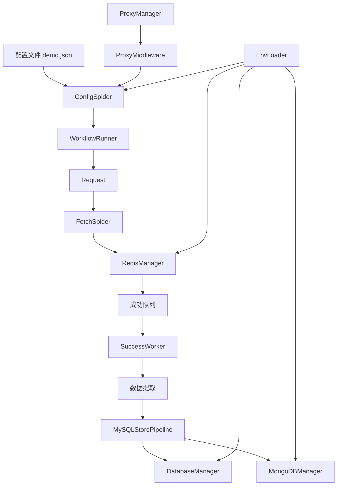
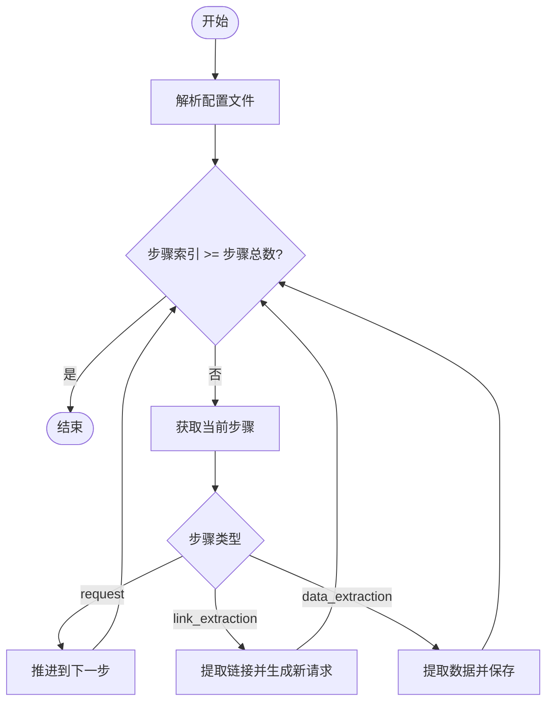
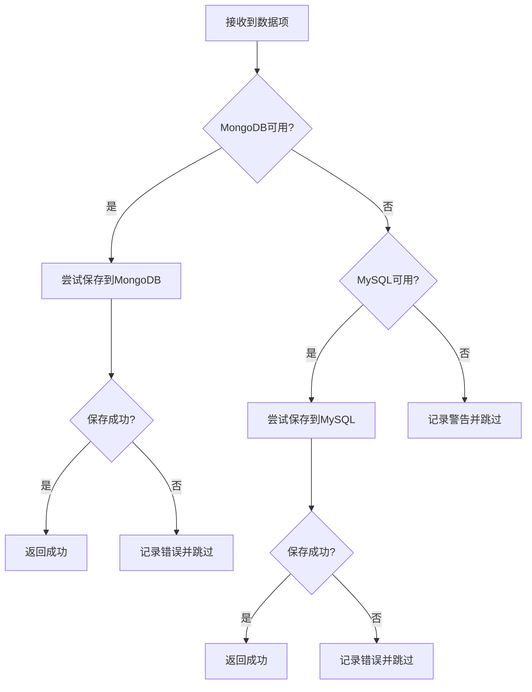

# 开发扩展

<cite>
**本文档引用的文件**  
- [README.md](file://README.md)
- [crawler/utils/workflow.py](file://crawler/utils/workflow.py)
- [crawler/spiders/config_spider.py](file://crawler/spiders/config_spider.py)
- [crawler/pipelines.py](file://crawler/pipelines.py)
- [crawler/middlewares/proxy_middleware.py](file://crawler/middlewares/proxy_middleware.py)
- [crawler/utils/db_manager.py](file://crawler/utils/db_manager.py)
- [crawler/utils/mongodb_manager.py](file://crawler/utils/mongodb_manager.py)
- [crawler/utils/proxy_manager.py](file://crawler/utils/proxy_manager.py)
- [crawler/utils/redis_manager.py](file://crawler/utils/redis_manager.py)
- [crawler/settings.py](file://crawler/settings.py)
- [crawler/items.py](file://crawler/items.py)
</cite>

## 目录
1. [开发扩展](#开发扩展)
2. [目的与架构](#目的与架构)
3. [核心组件关系](#核心组件关系)
4. [实现细节](#实现细节)
5. [配置选项](#配置选项)
6. [使用模式](#使用模式)
7. [公共接口](#公共接口)
8. [常见用例](#常见用例)
9. [关键概念图示](#关键概念图示)

## 目的与架构

“开发扩展”旨在为本Scrapy-Redis分布式爬虫系统提供灵活的可扩展机制，使开发者能够根据业务需求自定义爬虫行为、数据处理逻辑和系统集成方式。系统通过模块化设计，将配置解析、工作流执行、数据存储、代理管理等核心功能解耦，允许开发者在不修改核心框架的前提下进行功能增强。

系统架构基于Scrapy框架，结合Redis实现分布式任务调度，通过JSON配置驱动爬虫工作流。整体架构分为三层：
- **配置层**：以`demo.json`为代表的配置文件定义任务参数和工作流步骤。
- **执行层**：由`config_spider.py`和`fetch_spider.py`等爬虫构成，负责解析配置并执行HTTP请求。
- **服务层**：包括数据库（MySQL/MongoDB）、Redis队列和各类工具管理器（如`db_manager`、`proxy_manager`），提供数据持久化和外部服务支持。

该架构支持两种主要使用模式：一是由Scrapy直接驱动的配置化爬虫；二是通过外部脚本（如`success_worker.py`）处理工作流的全链路模式，实现了请求与解析的解耦。

**Section sources**
- [README.md](file://README.md#L434-L445)
- [crawler/spiders/config_spider.py](file://crawler/spiders/config_spider.py#L15-L325)
- [crawler/settings.py](file://crawler/settings.py#L1-L54)

## 核心组件关系

本系统的开发扩展能力依赖于多个核心组件的协同工作。这些组件通过清晰的接口和依赖关系，构成了一个高内聚、低耦合的系统。



**Diagram sources**
- [crawler/spiders/config_spider.py](file://crawler/spiders/config_spider.py#L15-L325)
- [crawler/utils/workflow.py](file://crawler/utils/workflow.py#L11-L157)
- [crawler/spiders/fetch_spider.py](file://crawler/spiders/fetch_spider.py#L14-L100)
- [crawler/utils/redis_manager.py](file://crawler/utils/redis_manager.py#L11-L345)
- [crawler/pipelines.py](file://crawler/pipelines.py#L7-L105)
- [crawler/utils/db_manager.py](file://crawler/utils/db_manager.py#L13-L618)
- [crawler/utils/mongodb_manager.py](file://crawler/utils/mongodb_manager.py#L14-L323)
- [crawler/middlewares/proxy_middleware.py](file://crawler/middlewares/proxy_middleware.py#L11-L69)
- [crawler/utils/env_loader.py](file://crawler/utils/env_loader.py#L14-L63)

## 实现细节

开发扩展的实现细节主要体现在工作流引擎、数据管道和中间件机制上。系统通过`WorkflowRunner`类实现可配置的工作流执行，支持`request`、`link_extraction`和`data_extraction`三种步骤类型。每种类型对应不同的处理逻辑，允许开发者通过JSON配置灵活定义爬取流程。

数据存储通过`MySQLStorePipeline`实现，该管道优先尝试将数据保存到MongoDB，若失败则回退到MySQL，体现了良好的容错设计。`DatabaseManager`和`MongoDBManager`分别封装了对两种数据库的操作，提供了统一的API接口。

代理功能通过`ProxyMiddleware`中间件实现，该中间件依赖`ProxyManager`从环境变量中读取代理配置，支持静态代理和动态代理两种模式。当代理启用时，中间件会自动为Scrapy请求设置代理地址。

**Section sources**
- [crawler/utils/workflow.py](file://crawler/utils/workflow.py#L11-L157)
- [crawler/pipelines.py](file://crawler/pipelines.py#L7-L105)
- [crawler/middlewares/proxy_middleware.py](file://crawler/middlewares/proxy_middleware.py#L11-L69)
- [crawler/utils/db_manager.py](file://crawler/utils/db_manager.py#L13-L618)
- [crawler/utils/mongodb_manager.py](file://crawler/utils/mongodb_manager.py#L14-L323)

## 配置选项

系统支持丰富的配置选项，主要通过环境变量和JSON配置文件两种方式提供。环境变量配置具有最高优先级，其次是`.env`文件，最后是代码中的默认值。

### 环境变量配置
| 配置项 | 说明 | 默认值 |
|--------|------|--------|
| `REDIS_URL` | Redis连接URL | `redis://localhost:6379/0` |
| `MYSQL_HOST` | MySQL主机地址 | `localhost` |
| `MYSQL_PORT` | MySQL端口 | `3306` |
| `MYSQL_USER` | MySQL用户名 | - |
| `MYSQL_PASSWORD` | MySQL密码 | - |
| `MYSQL_DB` | MySQL数据库名 | - |
| `CONFIG_PATH` | 配置文件路径 | `demo.json` |
| `PROXY_MODE` | 代理模式 (static/dynamic) | `static` |
| `MONGODB_URI` | MongoDB连接URI | - |

### JSON配置结构
`demo.json`文件定义了任务的基本信息和工作流步骤：
- `taskInfo`: 任务ID、名称、基础URL、并发数等。
- `workflowSteps`: 工作流步骤数组，每个步骤包含类型、配置、超时和重试次数等。

**Section sources**
- [README.md](file://README.md#L216-L233)
- [crawler/settings.py](file://crawler/settings.py#L28-L52)
- [demo.json](file://demo.json#L1-L181)

## 使用模式

系统支持多种使用模式，开发者可根据具体需求选择合适的模式进行扩展。

### 配置驱动模式
使用`config_spider`爬虫，直接读取`demo.json`配置文件生成请求。此模式适合简单的爬取任务，所有逻辑都在Scrapy内部完成。

```bash
scrapy crawl config_spider
```

### 全链路Redis模式
此模式将请求与解析完全解耦，适合复杂的工作流处理。流程如下：
1. `config_request_producer.py`读取配置并推送初始请求到Redis。
2. `fetch_spider`或`requests_worker.py`消费请求并发送HTTP请求，将响应存入成功队列。
3. `success_worker.py`监听成功队列，按工作流步骤解析响应并生成后续请求。

### 轻量级请求模式
使用`requests_worker.py`替代Scrapy的`fetch_spider`，适用于资源受限的环境或需要快速原型开发的场景。

**Section sources**
- [README.md](file://README.md#L138-L199)
- [config_request_producer.py](file://config_request_producer.py)
- [requests_worker.py](file://requests_worker.py)
- [success_worker.py](file://success_worker.py)

## 公共接口

系统提供了多个公共接口，便于开发者进行扩展和集成。

### WorkflowRunner 接口
- `initial_requests()`: 生成初始请求。
- `handle_response(response)`: 处理响应，根据工作流步骤决定后续操作。
- `_handle_link_extraction(step, response, next_index)`: 处理链接提取步骤。
- `_handle_data_extraction(step, response, next_index)`: 处理数据提取步骤。

### 数据库管理器接口
- `save_article(...)`: 保存文章到数据库，支持去重。
- `get_article_by_id(...)`: 根据ID获取文章。
- `get_articles_by_task_id(...)`: 根据任务ID获取文章列表。
- `count_articles_by_task_id(...)`: 统计指定任务的文章数量。

### 代理管理器接口
- `from_env()`: 从环境变量创建代理管理器实例。
- `get_proxies()`: 获取代理配置。
- `is_enabled()`: 检查代理是否启用。

**Section sources**
- [crawler/utils/workflow.py](file://crawler/utils/workflow.py#L11-L157)
- [crawler/utils/db_manager.py](file://crawler/utils/db_manager.py#L13-L618)
- [crawler/utils/proxy_manager.py](file://crawler/utils/proxy_manager.py#L12-L239)

## 常见用例

### 添加新的工作流步骤类型
开发者可以通过修改`crawler/utils/workflow.py`中的`handle_response`方法来支持新的步骤类型。例如，添加`api_call`类型用于调用外部API。

### 自定义数据处理
通过修改`crawler/pipelines.py`中的`process_item`方法，可以添加自定义的数据清洗、转换或验证逻辑。例如，在保存前对内容进行摘要生成。

### 集成新的数据库
系统目前支持MySQL和MongoDB。要集成新的数据库（如PostgreSQL），需要创建新的管理器类，实现与`DatabaseManager`类似的接口，并在管道中添加相应的处理逻辑。

### 扩展代理功能
`ProxyManager`支持动态代理API。开发者可以扩展`_parse_proxy_response`方法以支持更多格式的代理API响应，或添加代理验证功能。

**Section sources**
- [README.md](file://README.md#L436-L445)
- [crawler/utils/workflow.py](file://crawler/utils/workflow.py#L29-L47)
- [crawler/pipelines.py](file://crawler/pipelines.py#L50-L78)

## 关键概念图示

### 工作流执行流程图


**Diagram sources**
- [crawler/utils/workflow.py](file://crawler/utils/workflow.py#L29-L47)
- [crawler/spiders/config_spider.py](file://crawler/spiders/config_spider.py#L63-L85)

### 数据存储优先级流程图


**Diagram sources**
- [crawler/pipelines.py](file://crawler/pipelines.py#L50-L78)
- [crawler/utils/mongodb_manager.py](file://crawler/utils/mongodb_manager.py#L134-L193)
- [crawler/utils/db_manager.py](file://crawler/utils/db_manager.py#L139-L217)