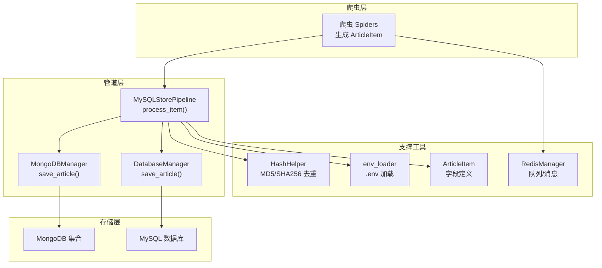
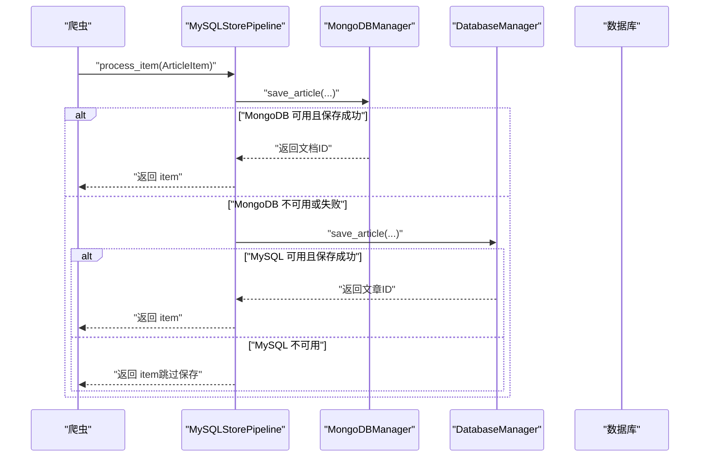
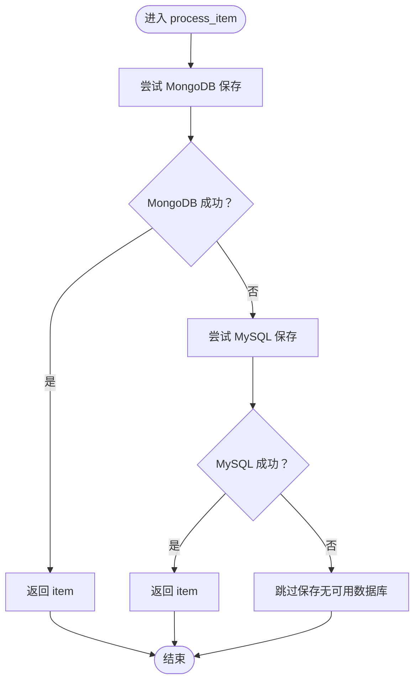
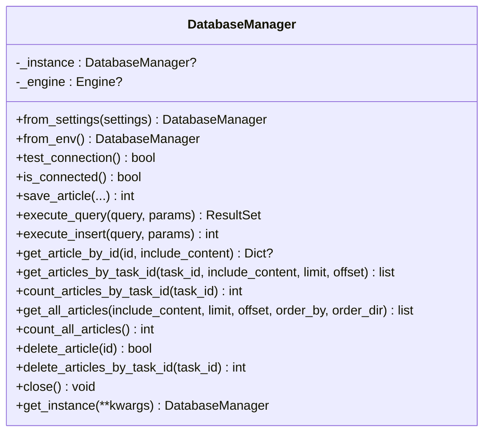
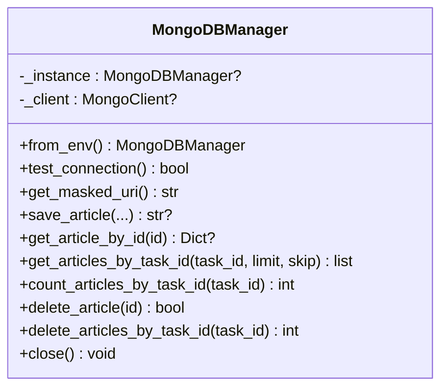
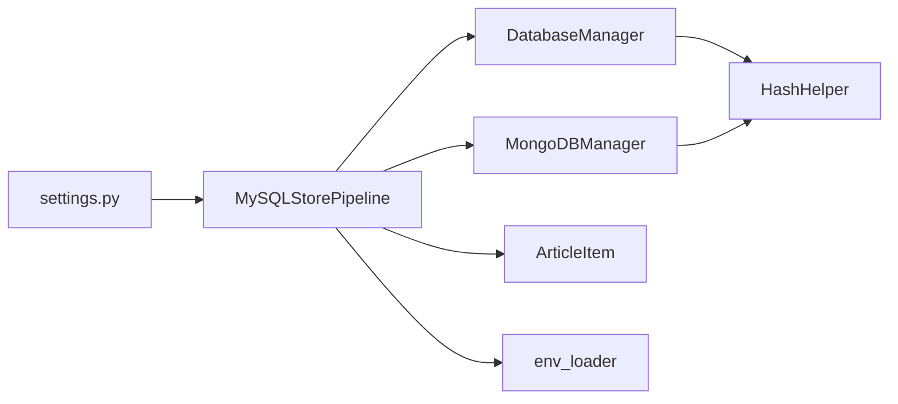

# 数据管道定制

<cite>
**本文引用的文件**
- [crawler/pipelines.py](file://crawler/pipelines.py)
- [crawler/utils/db_manager.py](file://crawler/utils/db_manager.py)
- [crawler/utils/mongodb_manager.py](file://crawler/utils/mongodb_manager.py)
- [crawler/utils/redis_manager.py](file://crawler/utils/redis_manager.py)
- [crawler/items.py](file://crawler/items.py)
- [crawler/settings.py](file://crawler/settings.py)
- [crawler/utils/hash_helper.py](file://crawler/utils/hash_helper.py)
- [crawler/utils/env_loader.py](file://crawler/utils/env_loader.py)
- [test_mongodb.py](file://test_mongodb.py)
- [test_setup.py](file://test_setup.py)
</cite>

## 目录
1. [简介](#简介)
2. [项目结构](#项目结构)
3. [核心组件](#核心组件)
4. [架构总览](#架构总览)
5. [详细组件分析](#详细组件分析)
6. [依赖关系分析](#依赖关系分析)
7. [性能考量](#性能考量)
8. [故障排查指南](#故障排查指南)
9. [结论](#结论)
10. [附录](#附录)

## 简介
本节聚焦于子功能“数据管道定制”，深入解析 crawler/pipelines.py 中的 MySQLStorePipeline 实现细节，阐明其与 MySQL 和 MongoDB 的集成策略、降级机制与异常处理流程。同时，梳理 DatabaseManager 与 MongoDBManager 单例类的初始化、连接管理与 save_article 方法的实现逻辑，并给出从爬虫提取到最终落库的完整链路示例与扩展指南，帮助读者快速掌握如何基于现有架构扩展自定义 Pipeline 以支持其他存储系统。

## 项目结构
围绕数据管道的关键文件组织如下：
- 管道实现：crawler/pipelines.py
- 数据库管理器：crawler/utils/db_manager.py（MySQL）
- MongoDB 管理器：crawler/utils/mongodb_manager.py
- Redis 管理器：crawler/utils/redis_manager.py（用于队列与消息传递，间接影响数据流）
- 数据模型：crawler/items.py（ArticleItem 字段定义）
- 项目配置：crawler/settings.py（启用 MySQLStorePipeline）
- 哈希工具：crawler/utils/hash_helper.py（去重）
- 环境加载：crawler/utils/env_loader.py（.env 加载）

图表来源
- [crawler/pipelines.py](file://crawler/pipelines.py#L1-L105)
- [crawler/utils/db_manager.py](file://crawler/utils/db_manager.py#L1-L217)
- [crawler/utils/mongodb_manager.py](file://crawler/utils/mongodb_manager.py#L1-L194)
- [crawler/utils/hash_helper.py](file://crawler/utils/hash_helper.py#L1-L66)
- [crawler/utils/env_loader.py](file://crawler/utils/env_loader.py#L1-L63)
- [crawler/items.py](file://crawler/items.py#L1-L12)
- [crawler/utils/redis_manager.py](file://crawler/utils/redis_manager.py#L1-L120)

章节来源
- [crawler/pipelines.py](file://crawler/pipelines.py#L1-L105)
- [crawler/settings.py](file://crawler/settings.py#L1-L54)

## 核心组件
- MySQLStorePipeline：负责按优先级选择存储目标（MongoDB > MySQL），并在两者均不可用时跳过保存。
- DatabaseManager：MySQL 单例管理器，提供连接池、去重、事务一致性与常用 CRUD。
- MongoDBManager：MongoDB 单例管理器，提供连接、去重、文档插入与查询。
- HashHelper：提供链接哈希与内容哈希，保障去重。
- ArticleItem：爬虫输出的标准数据结构。
- Settings：启用 MySQLStorePipeline 并配置 Redis/MySQL 环境变量。

章节来源
- [crawler/pipelines.py](file://crawler/pipelines.py#L1-L105)
- [crawler/utils/db_manager.py](file://crawler/utils/db_manager.py#L1-L217)
- [crawler/utils/mongodb_manager.py](file://crawler/utils/mongodb_manager.py#L1-L194)
- [crawler/utils/hash_helper.py](file://crawler/utils/hash_helper.py#L1-L66)
- [crawler/items.py](file://crawler/items.py#L1-L12)
- [crawler/settings.py](file://crawler/settings.py#L1-L54)

## 架构总览
数据从爬虫提取到最终落库的完整链路如下：
1. 爬虫生成 ArticleItem（包含 task_id、title、link、content、source_url、extra）。
2. Scrapy 调用 MySQLStorePipeline.process_item()。
3. 管道优先尝试 MongoDBManager.save_article()，若成功则结束；否则尝试 DatabaseManager.save_article()。
4. 若两者均不可用，跳过保存并向日志提示。
5. 去重逻辑：基于链接哈希（MD5）与内容哈希（SHA256）判断是否重复。

图表来源
- [crawler/pipelines.py](file://crawler/pipelines.py#L50-L105)
- [crawler/utils/mongodb_manager.py](file://crawler/utils/mongodb_manager.py#L134-L194)
- [crawler/utils/db_manager.py](file://crawler/utils/db_manager.py#L139-L217)

## 详细组件分析

### MySQLStorePipeline：优先级与降级策略
- 初始化阶段：
  - 从 Scrapy settings 构造 DatabaseManager（from_settings），测试连接后保存引用。
  - 从环境变量构造 MongoDBManager（from_env），测试连接后保存引用。
  - 若两者均不可用，打印警告并继续运行。
- 处理阶段：
  - 优先调用 MongoDBManager.save_article()，成功即返回 item。
  - 若 MongoDB 失败，回退调用 DatabaseManager.save_article()。
  - 若两者均失败，跳过保存并返回 item。
- 异常处理：
  - 捕获保存过程中的异常并打印日志，不影响后续降级尝试。
  - MongoDB 侧若返回空 ID，抛出异常以触发降级。

图表来源
- [crawler/pipelines.py](file://crawler/pipelines.py#L50-L105)

章节来源
- [crawler/pipelines.py](file://crawler/pipelines.py#L1-L105)

### DatabaseManager：MySQL 单例与 save_article 实现
- 单例与连接：
  - 提供 from_settings 与 from_env 构造器，支持从 Scrapy settings 或环境变量加载。
  - 内部维护 _instance 与 _engine，使用连接池（pool_pre_ping、pool_recycle）提升稳定性。
  - 提供 test_connection/is_connected 与 execute_query/execute_insert 辅助方法。
- save_article 去重与事务：
  - 使用 HashHelper.get_link_hash 与 get_content_hash 计算哈希。
  - 事务内先查重（link_hash），存在则返回现有 ID；否则插入主表 articles，再插入内容表 article_contents（如有内容）。
  - 返回插入的文章 ID（或现有 ID）。
- 其他能力：
  - 支持按任务 ID 查询、统计、删除等常用操作。

图表来源
- [crawler/utils/db_manager.py](file://crawler/utils/db_manager.py#L1-L217)

章节来源
- [crawler/utils/db_manager.py](file://crawler/utils/db_manager.py#L1-L217)

### MongoDBManager：MongoDB 单例与 save_article 实现
- 单例与连接：
  - 提供 from_env 构造器，从环境变量 MONGODB_URI/MONGODB_DB/MONGODB_COLLECTION 加载。
  - 内部维护 _instance 与 _client，test_connection 使用 admin.ping()。
- save_article 去重与插入：
  - 使用 HashHelper.get_link_hash 与 get_content_hash 计算哈希。
  - 先按 link_hash 查重，存在则返回现有文档 ID；否则插入新文档（包含哈希字段）并返回插入 ID。
- 其他能力：
  - 提供按任务 ID 查询、统计、删除等常用操作。

图表来源
- [crawler/utils/mongodb_manager.py](file://crawler/utils/mongodb_manager.py#L1-L194)

章节来源
- [crawler/utils/mongodb_manager.py](file://crawler/utils/mongodb_manager.py#L1-L194)

### ArticleItem：数据模型
- 字段：task_id、title、link、content、source_url、extra。
- 作为爬虫输出标准结构，供管道统一处理。

章节来源
- [crawler/items.py](file://crawler/items.py#L1-L12)

### 去重与哈希策略
- 链接去重：使用 MD5 计算 link_hash，避免重复链接入库。
- 内容去重：使用 SHA256 计算 content_hash，降低内容碰撞概率。
- 两处均在各自 save_article 中执行，确保一致性。

章节来源
- [crawler/utils/hash_helper.py](file://crawler/utils/hash_helper.py#L1-L66)
- [crawler/utils/db_manager.py](file://crawler/utils/db_manager.py#L139-L217)
- [crawler/utils/mongodb_manager.py](file://crawler/utils/mongodb_manager.py#L134-L194)

### 环境加载与配置
- env_loader 在模块导入时自动加载 .env 文件，支持调试模式输出。
- settings.py 中启用 MySQLStorePipeline，并从环境变量读取 Redis/MySQL 配置。

章节来源
- [crawler/utils/env_loader.py](file://crawler/utils/env_loader.py#L1-L63)
- [crawler/settings.py](file://crawler/settings.py#L1-L54)

## 依赖关系分析
- 管道依赖：
  - MySQLStorePipeline 依赖 DatabaseManager 与 MongoDBManager。
  - 二者均依赖 HashHelper 进行去重。
- 配置依赖：
  - settings.py 启用管道并提供 MySQL 环境变量。
  - env_loader 自动加载 .env，供管理器读取。
- 数据模型依赖：
  - ArticleItem 为管道输入数据结构。

图表来源
- [crawler/pipelines.py](file://crawler/pipelines.py#L1-L105)
- [crawler/utils/db_manager.py](file://crawler/utils/db_manager.py#L1-L217)
- [crawler/utils/mongodb_manager.py](file://crawler/utils/mongodb_manager.py#L1-L194)
- [crawler/utils/hash_helper.py](file://crawler/utils/hash_helper.py#L1-L66)
- [crawler/items.py](file://crawler/items.py#L1-L12)
- [crawler/utils/env_loader.py](file://crawler/utils/env_loader.py#L1-L63)
- [crawler/settings.py](file://crawler/settings.py#L1-L54)

章节来源
- [crawler/pipelines.py](file://crawler/pipelines.py#L1-L105)
- [crawler/utils/db_manager.py](file://crawler/utils/db_manager.py#L1-L217)
- [crawler/utils/mongodb_manager.py](file://crawler/utils/mongodb_manager.py#L1-L194)
- [crawler/utils/hash_helper.py](file://crawler/utils/hash_helper.py#L1-L66)
- [crawler/items.py](file://crawler/items.py#L1-L12)
- [crawler/utils/env_loader.py](file://crawler/utils/env_loader.py#L1-L63)
- [crawler/settings.py](file://crawler/settings.py#L1-L54)

## 性能考量
- 连接池与预检：
  - DatabaseManager 使用 pool_pre_ping 与 pool_recycle，提升连接存活率与回收效率。
- 去重成本：
  - save_article 中的哈希计算与查询为 O(1) 级别（哈希表），整体开销可控。
- 事务与一致性：
  - MySQL 侧使用事务保证主表与内容表的一致性，避免半写状态。
- 降级策略：
  - 优先 MongoDB，失败回退 MySQL，减少单点故障风险；两者均不可用时跳过保存，避免阻塞。

[本节为通用性能讨论，无需列出具体文件来源]

## 故障排查指南
- 管道初始化失败：
  - 检查 settings.py 中 ITEM_PIPELINES 是否启用 MySQLStorePipeline。
  - 确认 .env 中 MONGODB_URI/MONGODB_DB/MYSQL_* 环境变量是否正确。
- MongoDB 不可用：
  - 使用 test_mongodb.py 进行连接与保存测试，确认 URI、数据库与集合配置。
- MySQL 不可用：
  - 使用 test_setup.py 的 test_mysql_connection 进行连接测试，确认用户、密码、主机、端口与数据库。
- 日志定位：
  - 管道在初始化与保存过程中会打印连接状态与错误信息，便于快速定位问题。

章节来源
- [crawler/settings.py](file://crawler/settings.py#L1-L54)
- [crawler/utils/env_loader.py](file://crawler/utils/env_loader.py#L1-L63)
- [test_mongodb.py](file://test_mongodb.py#L1-L149)
- [test_setup.py](file://test_setup.py#L1-L167)

## 结论
MySQLStorePipeline 通过“MongoDB 优先、MySQL 回退”的策略，在保证去重与一致性的前提下，提供了高可用的数据落库方案。DatabaseManager 与 MongoDBManager 采用单例与连接池设计，结合哈希去重与事务保障，使数据管道具备良好的稳定性与扩展性。对于需要扩展到其他存储系统的场景，可参考现有管理器的单例化、连接测试与 save_article 规范，快速实现新的 Pipeline。

[本节为总结性内容，无需列出具体文件来源]

## 附录

### 从爬虫提取到落库的完整链路示例（步骤说明）
- 爬虫生成 ArticleItem（包含 task_id、title、link、content、source_url、extra）。
- Scrapy 调用 MySQLStorePipeline.process_item()。
- 管道优先调用 MongoDBManager.save_article()：
  - 计算 link_hash 与 content_hash。
  - 按 link_hash 查重，存在则返回现有文档 ID；否则插入新文档并返回插入 ID。
- 若 MongoDB 失败或不可用，回退调用 DatabaseManager.save_article()：
  - 事务内先按 link_hash 查重，存在则返回现有文章 ID；否则插入主表 articles，再插入内容表 article_contents（如有内容）。
- 若两者均不可用，跳过保存并返回 item。

章节来源
- [crawler/pipelines.py](file://crawler/pipelines.py#L50-L105)
- [crawler/utils/mongodb_manager.py](file://crawler/utils/mongodb_manager.py#L134-L194)
- [crawler/utils/db_manager.py](file://crawler/utils/db_manager.py#L139-L217)
- [crawler/items.py](file://crawler/items.py#L1-L12)

### 如何扩展自定义 Pipeline 以支持其他存储系统
- 设计思路：
  - 新建管理器类（单例），提供 from_env/from_settings 构造器、test_connection 与 save_article 方法。
  - save_article 应包含去重逻辑（如哈希计算与查重），并返回持久化后的标识（如 ID）。
- 与现有管道集成：
  - 在 settings.py 中启用新 Pipeline（例如 ITEM_PIPELINES 中新增条目）。
  - 在新 Pipeline 的 process_item 中，按“优先级 + 降级”策略依次尝试多个存储管理器。
- 最佳实践：
  - 保持 save_article 的幂等性与去重一致性。
  - 使用连接测试与异常捕获，确保降级链路稳定。
  - 在日志中清晰记录连接状态与失败原因，便于排障。

章节来源
- [crawler/pipelines.py](file://crawler/pipelines.py#L1-L105)
- [crawler/utils/db_manager.py](file://crawler/utils/db_manager.py#L1-L217)
- [crawler/utils/mongodb_manager.py](file://crawler/utils/mongodb_manager.py#L1-L194)
- [crawler/settings.py](file://crawler/settings.py#L1-L54)