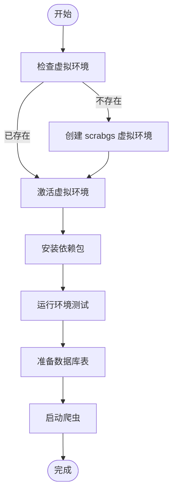
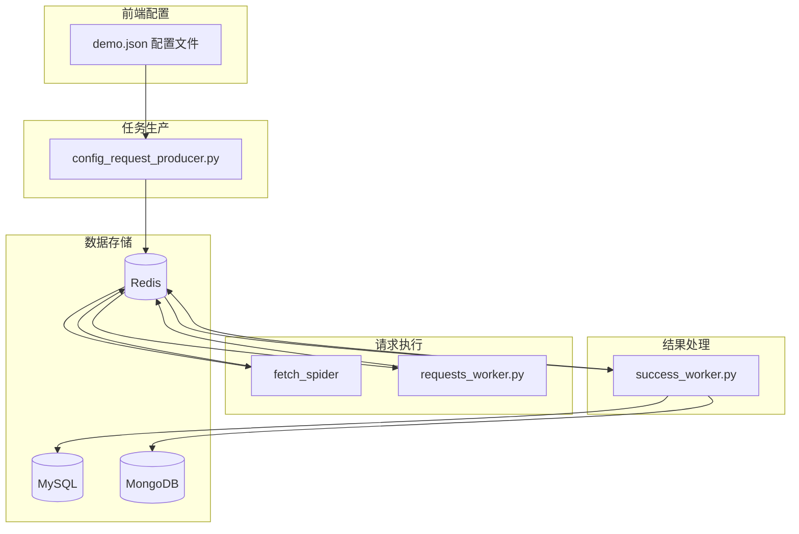

# 快速开始

<cite>
**本文档中引用的文件**  
- [quick_start.sh](file://quick_start.sh)
- [quick_start.bat](file://quick_start.bat)
- [README.md](file://README.md)
- [test_setup.py](file://test_setup.py)
- [requirements.txt](file://requirements.txt)
- [scrapy.cfg](file://scrapy.cfg)
</cite>

## 目录
1. [快速开始](#快速开始)
2. [目的与架构](#目的与架构)
3. [配置与环境设置](#配置与环境设置)
4. [启动流程](#启动流程)
5. [使用模式与示例](#使用模式与示例)
6. [公共接口与参数](#公共接口与参数)
7. [关键流程图示](#关键流程图示)

## 目的与架构

快速开始功能旨在为开发者提供一个简洁、高效的环境初始化流程，帮助用户快速部署和测试分布式爬虫系统。该功能通过自动化脚本完成虚拟环境创建、依赖安装、环境测试等关键步骤，确保项目在不同操作系统上的一致性。

系统采用基于 Scrapy-Redis 的分布式架构，支持从配置文件或 MySQL 数据库读取任务，并将数据保存到 MySQL。核心组件包括配置驱动爬虫、仅请求模式爬虫、Redis 队列管理器和 MySQL 数据管道，形成完整的分布式爬取工作流。

**Section sources**
- [README.md](file://README.md#L1-L454)
- [quick_start.sh](file://quick_start.sh#L1-L50)
- [quick_start.bat](file://quick_start.bat#L1-L50)

## 配置与环境设置

项目通过 `.env` 文件进行环境变量配置，支持 Redis、MySQL 和 MongoDB 的连接设置。配置优先级为：系统环境变量 > `.env` 文件 > 代码默认值。关键配置项包括 `REDIS_URL`、`MYSQL_USER`、`MYSQL_PASSWORD`、`MYSQL_DB` 等。

推荐配置流程：
1. 复制 `.env.example` 为 `.env`
2. 修改 `.env` 中的数据库连接信息
3. 设置 Redis 连接 URL（含密码时格式为 `redis://:password@host:port/db`）
4. 配置 MySQL 密码时若包含特殊字符需用引号包裹

**Section sources**
- [README.md](file://README.md#L73-L83)
- [crawler/settings.py](file://crawler/settings.py#L1-L54)

## 启动流程

快速启动流程包含以下步骤：

1. **虚拟环境创建**：检查是否存在 `scrabgs` 虚拟环境，不存在则创建
2. **依赖安装**：激活虚拟环境后安装 `requirements.txt` 中的所有依赖包
3. **环境测试**：运行 `test_setup.py` 验证依赖、Redis 连接、MySQL 连接、配置文件加载和 Redis 队列可用性
4. **数据库准备**：执行 `test_data.sql` 创建必要的数据表
5. **启动爬虫**：根据需求选择合适的爬虫启动方式



**Diagram sources **
- [quick_start.sh](file://quick_start.sh#L1-L50)
- [quick_start.bat](file://quick_start.bat#L1-L50)
- [test_setup.py](file://test_setup.py#L1-L167)

## 使用模式与示例

### 配置驱动爬虫模式

使用 `demo.json` 配置文件驱动爬虫：

```bash
source scrabgs/bin/activate
scrapy crawl config_spider
```

可指定配置文件路径：
```bash
scrapy crawl config_spider -s CONFIG_PATH=/path/to/config.json
```

### 全链路 Redis 模式

1. **推送初始请求**：
```bash
python config_request_producer.py
```

2. **发送请求**（两种方式）：
   - 使用 Scrapy：
   ```bash
   scrapy crawl fetch_spider -L INFO
   ```
   - 使用 requests 库：
   ```bash
   python requests_worker.py
   ```

3. **解析 workflow**：
```bash
python success_worker.py
```

**Section sources**
- [README.md](file://README.md#L136-L202)
- [config_request_producer.py](file://config_request_producer.py#L1-L77)

## 公共接口与参数

### 环境变量配置

| 配置项 | 说明 | 默认值 | 必填 |
|--------|------|--------|------|
| `REDIS_URL` | Redis 连接 URL | `redis://localhost:6379/0` | 否 |
| `MYSQL_HOST` | MySQL 主机地址 | `localhost` | 否 |
| `MYSQL_PORT` | MySQL 端口 | `3306` | 否 |
| `MYSQL_USER` | MySQL 用户名 | - | 是 |
| `MYSQL_PASSWORD` | MySQL 密码 | - | 是 |
| `MYSQL_DB` | MySQL 数据库名 | - | 是 |
| `CONFIG_PATH` | 配置文件路径 | `demo.json` | 否 |
| `SCRAPY_START_KEY` | Scrapy 启动队列键 | `fetch_spider:start_urls` | 否 |

### 命令行参数

- `CONFIG_PATH`: 指定配置文件路径
- `LOG_LEVEL`: 设置日志级别
- `REQUESTS_TIMEOUT`: requests 工作器请求超时时间
- `REQUESTS_MAX_RETRIES`: 最大重试次数

**Section sources**
- [README.md](file://README.md#L216-L233)
- [crawler/settings.py](file://crawler/settings.py#L1-L54)

## 关键流程图示



**Diagram sources **
- [README.md](file://README.md#L163-L202)
- [config_request_producer.py](file://config_request_producer.py#L1-L77)
- [requests_worker.py](file://requests_worker.py#L1-L327)
- [success_worker.py](file://success_worker.py#L1-L363)