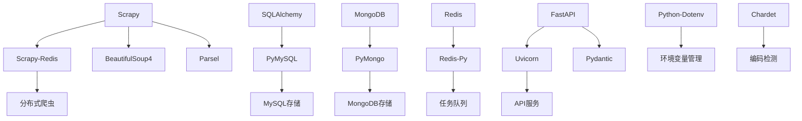
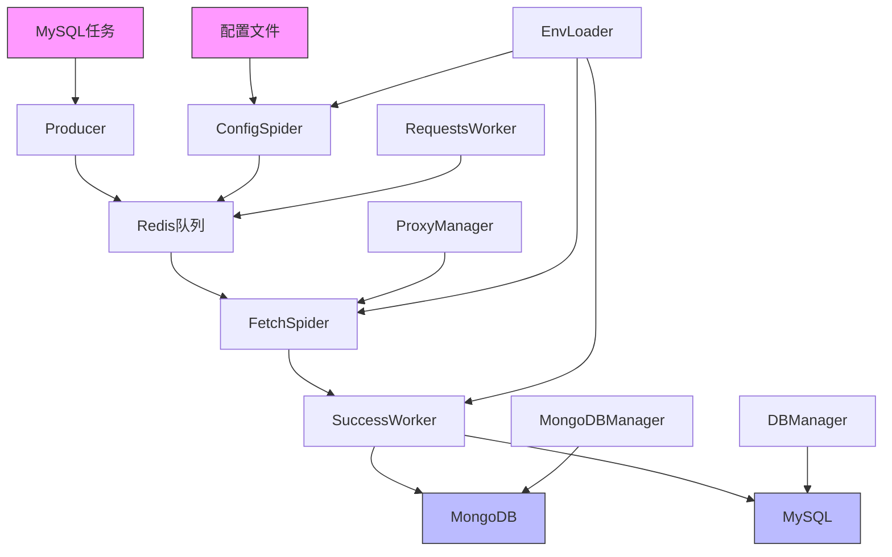
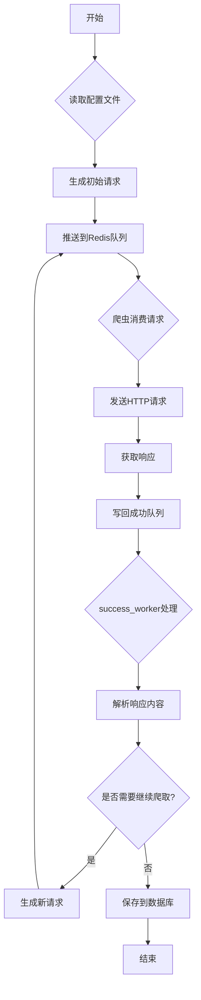

# 技术栈与依赖

<cite>
**本文档引用的文件**   
- [requirements.txt](file://requirements.txt)
- [scrapy.cfg](file://scrapy.cfg)
- [settings.py](file://crawler/settings.py)
- [README.md](file://README.md)
- [ENV_CONFIG.md](file://ENV_CONFIG.md)
- [items.py](file://crawler/items.py)
- [pipelines.py](file://crawler/pipelines.py)
- [config_spider.py](file://crawler/spiders/config_spider.py)
- [fetch_spider.py](file://crawler/spiders/fetch_spider.py)
- [proxy_middleware.py](file://crawler/middlewares/proxy_middleware.py)
- [config_loader.py](file://crawler/utils/config_loader.py)
- [env_loader.py](file://crawler/utils/env_loader.py)
- [db_manager.py](file://crawler/utils/db_manager.py)
- [mongodb_manager.py](file://crawler/utils/mongodb_manager.py)
- [proxy_manager.py](file://crawler/utils/proxy_manager.py)
</cite>

## 目录
1. [技术栈概览](#技术栈概览)
2. [核心依赖分析](#核心依赖分析)
3. [架构与组件关系](#架构与组件关系)
4. [配置与使用模式](#配置与使用模式)
5. [数据流与处理流程](#数据流与处理流程)
6. [公共接口与参数](#公共接口与参数)
7. [常见用例示例](#常见用例示例)

## 技术栈概览

本项目是一个基于 Scrapy-Redis 的分布式爬虫系统，采用 Python 3.8+ 构建，支持从配置文件或 MySQL 数据库读取任务，并将数据保存到 MySQL 或 MongoDB。系统采用模块化设计，通过 Redis 实现分布式任务调度，支持多种数据库存储选项和代理配置模式。

项目技术栈主要由以下几个核心部分组成：
- **爬虫框架**: 基于 Scrapy 和 Scrapy-Redis 构建分布式爬虫架构
- **数据库支持**: 支持 MySQL 和 MongoDB 两种数据库存储，具有优先级切换机制
- **任务调度**: 使用 Redis 作为分布式任务队列和去重过滤器
- **配置管理**: 支持 .env 文件环境变量配置和 JSON 配置文件驱动
- **代理支持**: 支持固定代理和动态代理两种模式
- **数据处理**: 支持配置驱动的工作流处理，包括请求、链接提取和数据提取等步骤

系统设计遵循高内聚低耦合原则，各组件通过清晰的接口进行通信，便于扩展和维护。通过配置文件可以灵活定义爬虫任务的工作流，实现不同场景下的数据采集需求。

**Section sources**
- [README.md](file://README.md#L1-L454)
- [requirements.txt](file://requirements.txt#L1-L17)

## 核心依赖分析

项目的核心依赖在 `requirements.txt` 文件中定义，主要包括以下几类：

### 爬虫框架依赖
- **scrapy>=2.11**: 核心爬虫框架，提供强大的网页抓取和数据提取功能
- **scrapy-redis>=0.7**: Scrapy 的 Redis 扩展，实现分布式爬虫架构，支持共享的请求队列和去重过滤器

### 数据库相关依赖
- **pymysql>=1.1**: MySQL 数据库连接驱动
- **sqlalchemy>=2.0**: ORM 框架，用于数据库操作的抽象层
- **pymongo>=4.15.5**: MongoDB 数据库连接驱动
- **redis>=5.0**: Redis 客户端库，用于与 Redis 服务器通信

### 网络请求与数据处理依赖
- **requests>=2.31**: HTTP 请求库，用于外部 API 调用
- **beautifulsoup4>=4.12**: HTML/XML 解析库，用于网页内容解析
- **parsel>=1.8**: Scrapy 使用的解析库，支持 XPath 和 CSS 选择器

### 配置与环境管理依赖
- **python-dotenv>=1.0**: 用于从 .env 文件加载环境变量
- **chardet>=5.0**: 字符编码检测库，用于正确处理不同编码的网页内容

### Web 服务依赖
- **fastapi>=0.115**: 现代 Python Web 框架，用于构建 API 服务
- **uvicorn[standard]>=0.24**: ASGI 服务器，用于运行 FastAPI 应用
- **pydantic>=2.0**: 数据验证和设置管理库

这些依赖共同构成了项目的完整技术栈，每个依赖都有明确的职责和作用范围。项目通过 `requirements.txt` 文件管理依赖版本，确保开发环境的一致性。



**Diagram sources **
- [requirements.txt](file://requirements.txt#L1-L17)
- [README.md](file://README.md#L1-L454)

**Section sources**
- [requirements.txt](file://requirements.txt#L1-L17)
- [scrapy.cfg](file://scrapy.cfg#L1-L8)

## 架构与组件关系

项目采用分层架构设计，各组件之间通过清晰的接口进行通信。整体架构可以分为以下几个层次：

### 核心架构组件
- **Scrapy 爬虫核心**: 负责网页请求、响应处理和数据提取
- **Redis 分布式队列**: 作为共享的任务队列和去重过滤器
- **数据库存储层**: 支持 MySQL 和 MongoDB 两种存储方式
- **配置管理层**: 管理环境变量和配置文件

### 组件关系图


**Diagram sources **
- [settings.py](file://crawler/settings.py#L1-L54)
- [pipelines.py](file://crawler/pipelines.py#L1-L105)
- [config_spider.py](file://crawler/spiders/config_spider.py#L1-L325)

**Section sources**
- [settings.py](file://crawler/settings.py#L1-L54)
- [pipelines.py](file://crawler/pipelines.py#L1-L105)

## 配置与使用模式

项目支持多种配置方式和使用模式，通过灵活的配置实现不同的爬虫场景。

### 配置优先级
配置的优先级顺序为：系统环境变量 > .env 文件 > 代码中的默认值。这种设计允许在不同环境中灵活调整配置，同时保持代码的可移植性。

### 配置文件结构
`demo.json` 配置文件定义了爬虫任务的基本信息和工作流步骤：
- `taskInfo`: 任务基本信息，包括任务ID、名称、基础URL等
- `workflowSteps`: 工作流步骤数组，定义了爬虫的执行流程

### 数据库配置模式
项目支持 MySQL 和 MongoDB 两种数据库存储，通过 `ARTICLE_DB_TYPE` 环境变量进行切换：
- `mysql`: 使用 MySQL 数据库存储文章数据
- `mongodb`: 使用 MongoDB 存储文章数据
- 默认值为 `mysql`

数据存储优先级为：MongoDB > MySQL > Redis 队列。如果配置了 MongoDB 且连接成功，优先使用 MongoDB；如果没有 MongoDB 但有 MySQL，使用 MySQL；如果都没有配置，数据存到 Redis 队列。

### 代理配置模式
项目支持两种代理模式：
- **固定代理**: 使用固定的代理服务器地址
- **动态代理**: 通过 API 接口获取代理地址，适用于代理池服务

代理配置通过 `PROXY_MODE` 环境变量设置，支持带认证的代理和特殊字符处理。

**Section sources**
- [ENV_CONFIG.md](file://ENV_CONFIG.md#L1-L375)
- [settings.py](file://crawler/settings.py#L1-L54)

## 数据流与处理流程

系统的数据流遵循典型的分布式爬虫架构，通过 Redis 实现任务的分发和结果的收集。

### 主要数据流
1. **任务生成**: 从配置文件或 MySQL 数据库读取任务，生成初始请求并推送到 Redis 队列
2. **请求处理**: 爬虫实例从 Redis 队列消费任务，发送 HTTP 请求并获取响应
3. **结果处理**: 将响应结果写回 Redis 成功队列，由 `success_worker` 进行后续处理
4. **数据存储**: 根据配置将数据保存到 MySQL 或 MongoDB

### 工作流处理流程


**Diagram sources **
- [config_spider.py](file://crawler/spiders/config_spider.py#L1-L325)
- [fetch_spider.py](file://crawler/spiders/fetch_spider.py#L1-L100)
- [pipelines.py](file://crawler/pipelines.py#L1-L105)

**Section sources**
- [config_spider.py](file://crawler/spiders/config_spider.py#L1-L325)
- [fetch_spider.py](file://crawler/spiders/fetch_spider.py#L1-L100)

## 公共接口与参数

项目提供了多个公共接口和可配置参数，通过环境变量和配置文件进行设置。

### 环境变量配置
| 配置项 | 说明 | 默认值 | 必填 |
|--------|------|--------|------|
| `REDIS_URL` | Redis 连接 URL | `redis://localhost:6379/0` | 否 |
| `MYSQL_HOST` | MySQL 主机地址 | `localhost` | 否 |
| `MYSQL_PORT` | MySQL 端口 | `3306` | 否 |
| `MYSQL_USER` | MySQL 用户名 | - | 是 |
| `MYSQL_PASSWORD` | MySQL 密码 | - | 是 |
| `MYSQL_DB` | MySQL 数据库名 | - | 是 |
| `MYSQL_CHARSET` | MySQL 字符集 | `utf8mb4` | 否 |
| `MYSQL_POOL_SIZE` | 连接池大小 | `5` | 否 |
| `MYSQL_POOL_MAX_OVERFLOW` | 连接池最大溢出 | `5` | 否 |
| `CONFIG_PATH` | 配置文件路径 | `demo.json` | 否 |
| `LOG_LEVEL` | 日志级别 | `INFO` | 否 |
| `SCRAPY_START_KEY` | Scrapy 启动队列键 | `fetch_spider:start_urls` | 否 |
| `SUCCESS_QUEUE_KEY` | 成功队列键 | `fetch_spider:success` | 否 |
| `SUCCESS_ITEM_KEY` | 数据结果队列键 | `fetch_spider:data_items` | 否 |
| `SUCCESS_ERROR_KEY` | 错误队列键 | `fetch_spider:errors` | 否 |

### 爬虫参数
- `CONCURRENT_REQUESTS`: 并发请求数，默认 8
- `DOWNLOAD_DELAY`: 下载延迟，单位秒，默认 0
- `CONFIG_PATH`: 配置文件路径，可通过命令行参数覆盖

### 数据管道接口
`MySQLStorePipeline` 类提供了数据存储的核心接口：
- `process_item`: 处理数据项，优先保存到 MongoDB，其次保存到 MySQL
- `_save_to_mysql`: 保存数据到 MySQL
- `_save_to_mongodb`: 保存数据到 MongoDB

**Section sources**
- [settings.py](file://crawler/settings.py#L1-L54)
- [pipelines.py](file://crawler/pipelines.py#L1-L105)
- [README.md](file://README.md#L204-L233)

## 常见用例示例

### 配置驱动爬虫
使用 `demo.json` 配置文件驱动爬虫：

```bash
# 运行爬虫
scrapy crawl config_spider

# 或指定配置文件路径
scrapy crawl config_spider -s CONFIG_PATH=/path/to/config.json
```

工作流程：
1. 读取配置文件 `demo.json`
2. 根据 `taskInfo.baseUrl` 生成初始请求
3. 按照 `workflowSteps` 执行：请求 → 链接提取 → 数据提取
4. 将提取的数据保存到 MySQL `articles` 表

### 全链路 Redis 模式
该模式完全遵循 `demo.json` 的 `workflowSteps`，Scrapy 只负责请求，解析由外部脚本完成：

1. **推送初始请求**
   ```bash
   python config_request_producer.py
   ```
   读取 `demo.json`，生成 `workflow_index=0` 的初始请求并写入 `SCRAPY_START_KEY`。

2. **发送请求**
   ```bash
   # 使用 Scrapy
   scrapy crawl fetch_spider -L INFO
   
   # 或使用 requests 库
   python requests_worker.py
   ```

3. **解析 workflow**
   ```bash
   python success_worker.py
   ```
   持续监听成功队列，按步骤执行解析和后续请求生成。

### 分布式部署
在不同服务器启动多个爬虫实例：
```bash
# 服务器 1
scrapy crawl fetch_spider

# 服务器 2
scrapy crawl fetch_spider

# 服务器 3
scrapy crawl fetch_spider
```

所有实例会从同一个 Redis 队列消费任务，实现分布式爬取。

**Section sources**
- [README.md](file://README.md#L136-L199)
- [config_request_producer.py](file://config_request_producer.py)
- [requests_worker.py](file://requests_worker.py)
- [success_worker.py](file://success_worker.py)