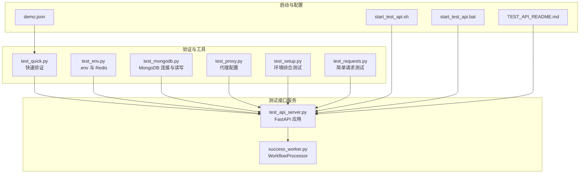
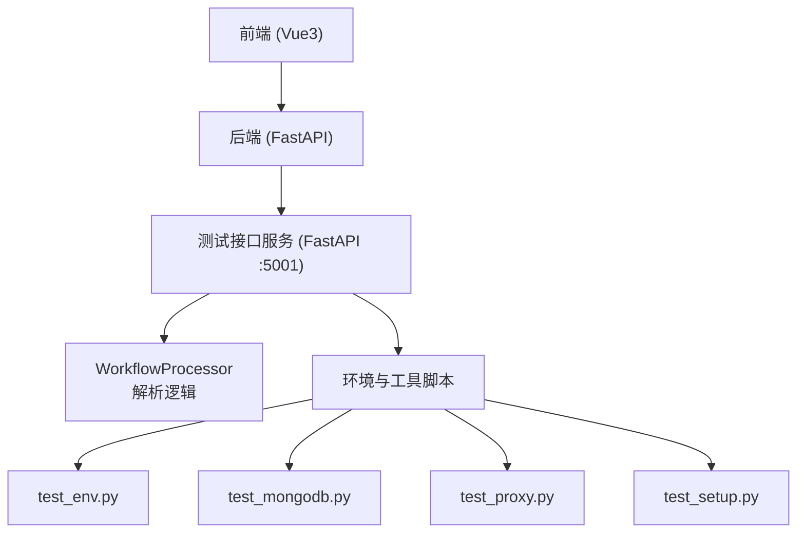
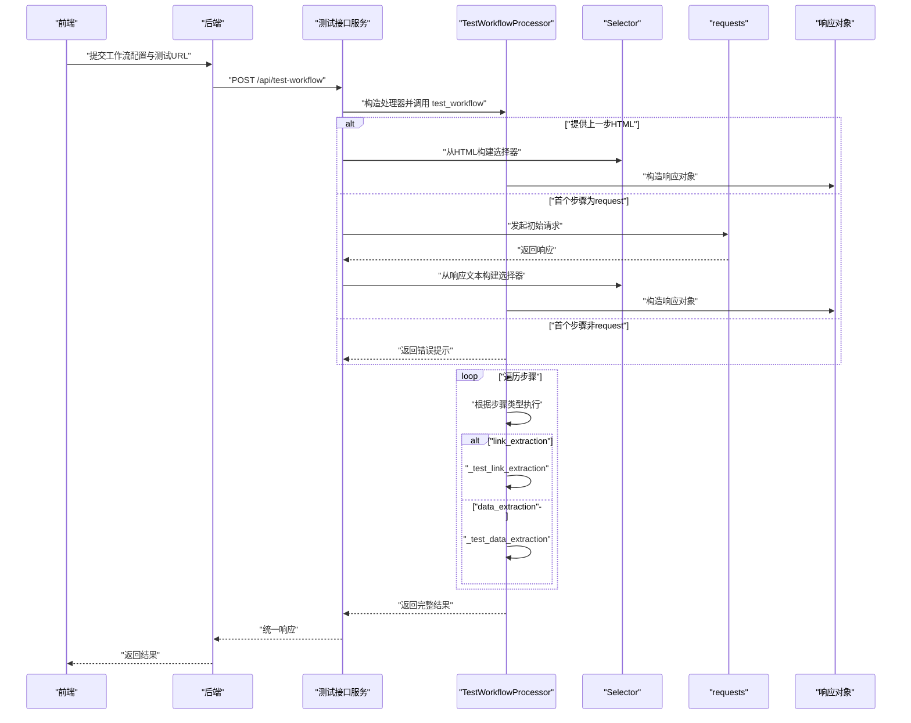
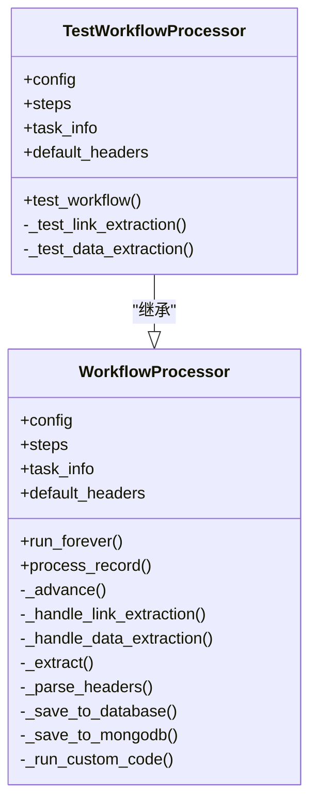
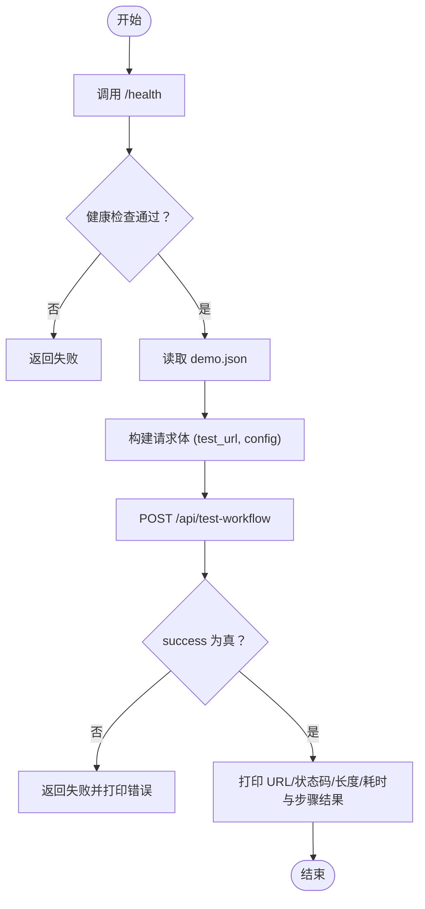
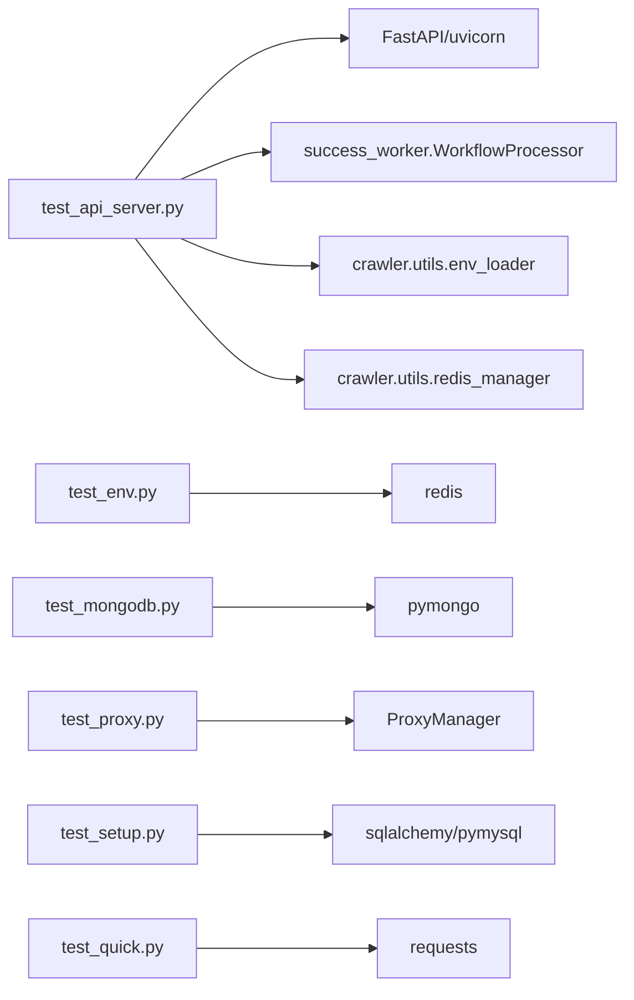

# 测试项目

<cite>
**本文引用的文件**
- [test_api_server.py](file://test_api_server.py)
- [TEST_API_README.md](file://TEST_API_README.md)
- [success_worker.py](file://success_worker.py)
- [demo.json](file://demo.json)
- [test_quick.py](file://test_quick.py)
- [start_test_api.sh](file://start_test_api.sh)
- [start_test_api.bat](file://start_test_api.bat)
- [test_env.py](file://test_env.py)
- [test_mongodb.py](file://test_mongodb.py)
- [test_proxy.py](file://test_proxy.py)
- [test_setup.py](file://test_setup.py)
- [test_requests.py](file://test_requests.py)
</cite>

## 目录
1. [简介](#简介)
2. [项目结构](#项目结构)
3. [核心组件](#核心组件)
4. [架构总览](#架构总览)
5. [详细组件分析](#详细组件分析)
6. [依赖关系分析](#依赖关系分析)
7. [性能考虑](#性能考虑)
8. [故障排查指南](#故障排查指南)
9. [结论](#结论)
10. [附录](#附录)

## 简介
本节聚焦“测试项目”，旨在解释测试接口服务的目的、架构以及与爬虫工作流核心组件的关系。测试项目通过独立的 FastAPI 服务，提供与生产工作流一致的解析逻辑，支持对完整工作流和单个步骤进行在线测试，便于前端配置与调试。同时，配套的环境与组件测试脚本帮助快速验证 .env、Redis、MySQL、MongoDB、代理等基础设施配置是否正确。

## 项目结构
测试项目由以下模块组成：
- 测试接口服务：基于 FastAPI 的 HTTP API，提供健康检查、工作流测试、单步测试接口，并复用生产解析逻辑。
- 快速验证脚本：一键验证服务健康与工作流接口返回。
- 环境与组件测试：分别验证 .env 加载、Redis 连接、MySQL 连接、MongoDB 连接与读写、代理配置。
- 启动脚本：跨平台启动测试服务，设置默认环境变量。
- 示例配置：提供完整的工作流配置样例，便于测试调用。

图示来源
- [test_api_server.py](file://test_api_server.py#L1-L120)
- [success_worker.py](file://success_worker.py#L23-L120)
- [test_quick.py](file://test_quick.py#L1-L143)
- [test_env.py](file://test_env.py#L1-L113)
- [test_mongodb.py](file://test_mongodb.py#L1-L149)
- [test_proxy.py](file://test_proxy.py#L1-L100)
- [test_setup.py](file://test_setup.py#L1-L167)
- [test_requests.py](file://test_requests.py#L1-L6)
- [start_test_api.sh](file://start_test_api.sh#L1-L17)
- [start_test_api.bat](file://start_test_api.bat#L1-L17)
- [demo.json](file://demo.json#L1-L181)
- [TEST_API_README.md](file://TEST_API_README.md#L1-L308)

章节来源
- [test_api_server.py](file://test_api_server.py#L1-L120)
- [TEST_API_README.md](file://TEST_API_README.md#L1-L120)

## 核心组件
- 测试接口服务（FastAPI）
  - 提供健康检查、工作流测试、单步测试三个接口。
  - 复用生产解析逻辑，确保测试与生产一致。
- 测试工作流处理器（TestWorkflowProcessor）
  - 继承自生产解析器 WorkflowProcessor，去除 Redis 与数据库依赖，专注测试场景。
  - 支持从外部传入上一步 HTML 与提取数据，模拟链路中间态。
- 快速验证脚本（test_quick.py）
  - 自动调用健康检查与工作流接口，输出步骤结果摘要。
- 环境与组件测试脚本
  - test_env.py：验证 .env 加载与 Redis 连接。
  - test_mongodb.py：验证 MongoDB 连接、读写与清理。
  - test_proxy.py：验证代理模式与代理获取。
  - test_setup.py：综合验证依赖、Redis、MySQL、配置文件与队列读写。
  - test_requests.py：简单请求示例，便于快速验证网络连通性。

章节来源
- [test_api_server.py](file://test_api_server.py#L91-L120)
- [test_quick.py](file://test_quick.py#L1-L143)
- [test_env.py](file://test_env.py#L1-L113)
- [test_mongodb.py](file://test_mongodb.py#L1-L149)
- [test_proxy.py](file://test_proxy.py#L1-L100)
- [test_setup.py](file://test_setup.py#L1-L167)
- [test_requests.py](file://test_requests.py#L1-L6)

## 架构总览
测试接口服务采用“前端 → 后端 → 测试服务 → 生产解析逻辑”的解耦架构。测试服务通过继承 WorkflowProcessor，直接复用生产解析逻辑，保证测试与生产的解析一致性。同时，测试服务不依赖 Redis 与数据库，避免对生产系统的干扰。

图示来源
- [TEST_API_README.md](file://TEST_API_README.md#L1-L40)
- [test_api_server.py](file://test_api_server.py#L91-L120)
- [success_worker.py](file://success_worker.py#L23-L120)

## 详细组件分析

### 测试接口服务（FastAPI）
- 目的
  - 提供独立的 HTTP API，用于测试爬虫工作流配置，支持完整工作流测试与单步测试。
- 关键接口
  - GET /health：健康检查。
  - POST /api/test-workflow：测试完整工作流，支持传入上一步 HTML 与提取数据，以及目标链接索引。
  - POST /api/test-step：测试单个步骤，支持直接传入 HTML 内容或自动发起请求。
- 数据模型
  - TaskInfo：任务基本信息。
  - WorkflowConfig：工作流配置，包含任务信息、步骤列表、可选的上一步 HTML 与提取数据、可选的目标链接索引。
  - TestWorkflowRequest/TestStepRequest：请求体封装。
  - ApiResponse：统一响应模型，包含成功标志、数据、消息、执行时间与错误追踪。
- 处理流程
  - 解析请求体，构建测试处理器。
  - 若提供上一步 HTML，则直接使用；否则首个步骤必须为 request 类型。
  - 顺序执行各步骤：request、link_extraction、data_extraction。
  - 支持从上下文提取链接并请求详情页，再进行数据提取。
  - 返回每步结果与整体执行时间、状态码、内容长度等信息。
- 公共接口与参数
  - /health：无参数，返回服务状态与版本。
  - /api/test-workflow：
    - 参数：test_url、config（包含 taskInfo、workflowSteps、可选 previous_html、previous_extracted_data、test_link_index）。
    - 返回：success、data（包含 url、status_code、content_length、steps_results、execution_time、response_html）、message、execution_time。
  - /api/test-step：
    - 参数：test_url、step（步骤配置）、html_content（可选）。
    - 返回：success、data（提取结果）、message。
- 使用模式
  - 前端配置工作流后，调用 /api/test-workflow 传入 demo.json 中的配置与测试 URL，即可得到每步的提取结果与耗时。
  - 单步测试：当需要验证某个提取规则时，调用 /api/test-step 传入对应 step 与可选 HTML 内容。

图示来源
- [test_api_server.py](file://test_api_server.py#L413-L528)
- [test_api_server.py](file://test_api_server.py#L104-L354)
- [success_worker.py](file://success_worker.py#L173-L188)

章节来源
- [test_api_server.py](file://test_api_server.py#L403-L528)
- [TEST_API_README.md](file://TEST_API_README.md#L83-L245)

### 测试工作流处理器（TestWorkflowProcessor）
- 继承关系
  - 继承自 WorkflowProcessor，重用其解析方法（如 _extract、_parse_headers 等）。
- 设计要点
  - 构造时将 Redis 与数据库管理器设为 None，避免持久化与队列依赖。
  - 提供 test_workflow 方法，按步骤顺序执行，支持从外部注入上一步 HTML 与提取数据，支持链接索引切换。
  - 提供 _test_link_extraction 与 _test_data_extraction，直接复用生产解析逻辑。
- 与生产解析器的关系
  - 保持相同的解析规则与字段命名，确保测试与生产结果一致。
  - 仅在测试场景下不写入 Redis/数据库，便于隔离与调试。

图示来源
- [success_worker.py](file://success_worker.py#L23-L304)
- [test_api_server.py](file://test_api_server.py#L91-L120)

章节来源
- [test_api_server.py](file://test_api_server.py#L91-L120)
- [success_worker.py](file://success_worker.py#L23-L120)

### 快速验证脚本（test_quick.py）
- 目的
  - 自动验证测试服务健康与工作流接口可用性，输出步骤结果摘要。
- 使用流程
  - 先调用 /health，确认服务可用。
  - 读取 demo.json，构造请求体，调用 /api/test-workflow，打印 URL、状态码、内容长度、执行时间与每步结果。
- 常见用例
  - 启动测试服务后，直接运行该脚本，即可快速得到工作流测试结果。

图示来源
- [test_quick.py](file://test_quick.py#L1-L143)
- [demo.json](file://demo.json#L1-L181)

章节来源
- [test_quick.py](file://test_quick.py#L1-L143)
- [demo.json](file://demo.json#L1-L181)

### 环境与组件测试脚本
- test_env.py
  - 验证 .env 文件存在与加载成功，读取并脱敏显示 REDIS_URL，测试 Redis 连接与读写。
- test_mongodb.py
  - 从环境变量读取 MongoDB 连接信息，测试连接、保存与读取、删除，验证配置正确性。
- test_proxy.py
  - 依据 PROXY_MODE 读取静态或动态代理配置，测试获取代理与动态刷新。
- test_setup.py
  - 综合测试依赖包、Redis 连接、MySQL 连接、配置文件加载、Redis 队列读写。
- test_requests.py
  - 简单请求示例，便于快速验证网络连通性。

章节来源
- [test_env.py](file://test_env.py#L1-L113)
- [test_mongodb.py](file://test_mongodb.py#L1-L149)
- [test_proxy.py](file://test_proxy.py#L1-L100)
- [test_setup.py](file://test_setup.py#L1-L167)
- [test_requests.py](file://test_requests.py#L1-L6)

### 启动脚本
- start_test_api.sh / start_test_api.bat
  - 设置默认环境变量（端口、主机、调试模式），启动测试接口服务。
- 使用方式
  - Linux/Mac：./start_test_api.sh
  - Windows：start_test_api.bat
  - 或直接运行 python test_api_server.py

章节来源
- [start_test_api.sh](file://start_test_api.sh#L1-L17)
- [start_test_api.bat](file://start_test_api.bat#L1-L17)

## 依赖关系分析
- 测试服务依赖
  - FastAPI、uvicorn：提供 HTTP 服务与自动文档。
  - success_worker.WorkflowProcessor：复用解析逻辑。
  - crawler.utils.env_loader、crawler.utils.redis_manager：加载环境与 Redis 管理。
- 组件测试依赖
  - redis、sqlalchemy、pymysql、pymongo：连接与操作数据库。
  - parsel：HTML/CSS/XPath 选择器。
  - requests：HTTP 请求。
- 启动脚本依赖
  - Python 解释器与已安装的依赖包。

图示来源
- [test_api_server.py](file://test_api_server.py#L1-L60)
- [success_worker.py](file://success_worker.py#L1-L30)
- [test_env.py](file://test_env.py#L1-L40)
- [test_mongodb.py](file://test_mongodb.py#L1-L30)
- [test_proxy.py](file://test_proxy.py#L1-L30)
- [test_setup.py](file://test_setup.py#L1-L40)
- [test_quick.py](file://test_quick.py#L1-L20)

## 性能考虑
- 并发与超时
  - 测试服务对初始请求与详情页请求设置了超时，避免阻塞。
- 缓存与复用
  - 可在测试服务中增加响应缓存，减少重复请求。
- 异步化
  - 对于大量测试请求，可考虑异步处理提升吞吐。
- 队列化
  - 对于批量测试，可引入任务队列，降低峰值压力。

## 故障排查指南
- 服务未启动
  - 确认已执行启动脚本或直接运行测试服务。
- 依赖缺失
  - 安装依赖后重试。
- Redis 连接失败
  - 检查 REDIS_URL 格式与认证信息。
- MongoDB 连接失败
  - 检查 MONGODB_URI、数据库与集合名称。
- 代理配置问题
  - 检查 PROXY_MODE 与代理地址配置，确认动态代理 API 可用。
- 工作流测试失败
  - 使用 /health 与 /api/test-workflow 的错误追踪定位问题。
- 快速验证
  - 运行 test_quick.py，查看健康检查与工作流测试结果。

章节来源
- [TEST_API_README.md](file://TEST_API_README.md#L246-L308)
- [test_quick.py](file://test_quick.py#L1-L143)
- [test_env.py](file://test_env.py#L72-L112)
- [test_mongodb.py](file://test_mongodb.py#L118-L146)
- [test_proxy.py](file://test_proxy.py#L15-L81)
- [test_setup.py](file://test_setup.py#L122-L166)

## 结论
测试项目通过独立的 FastAPI 服务与生产解析逻辑的强复用，实现了对爬虫工作流的高效测试与调试。配合多类环境与组件测试脚本，能够快速定位配置与连接问题，保障前端配置与后端集成的稳定性。建议在开发与联调阶段优先使用测试服务与快速验证脚本，以缩短迭代周期并提升质量。

## 附录
- 常用命令
  - 启动测试服务：./start_test_api.sh 或 ./start_test_api.bat
  - 快速验证：python test_quick.py
  - 环境测试：python test_setup.py
  - MongoDB 测试：python test_mongodb.py
  - Redis/.env 测试：python test_env.py
  - 代理测试：python test_proxy.py
  - 简单请求测试：python test_requests.py
- 示例配置
  - 使用 demo.json 作为工作流配置样例，结合 /api/test-workflow 进行测试。

章节来源
- [start_test_api.sh](file://start_test_api.sh#L1-L17)
- [start_test_api.bat](file://start_test_api.bat#L1-L17)
- [test_quick.py](file://test_quick.py#L114-L141)
- [demo.json](file://demo.json#L1-L181)