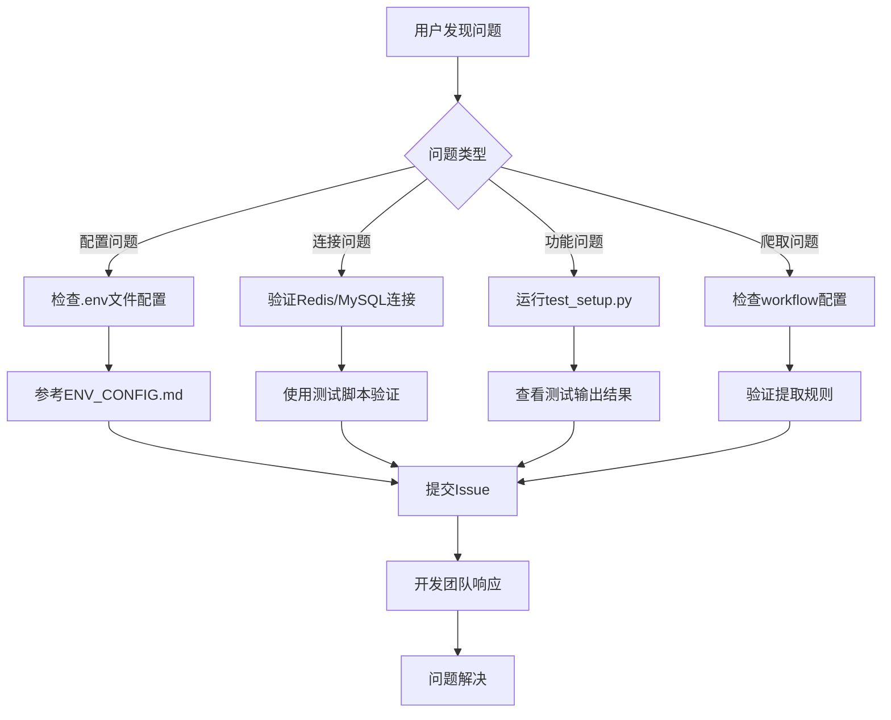

# 联系方式

<cite>
**本文档引用的文件**   
- [README.md](file://README.md#L450-L453)
- [TEST_API_README.md](file://TEST_API_README.md#L256-L261)
</cite>

## 目录
1. [联系方式概述](#联系方式概述)
2. [问题反馈渠道](#问题反馈渠道)
3. [技术支持流程](#技术支持流程)
4. [开发团队联系方式](#开发团队联系方式)

## 联系方式概述

本项目提供了明确的联系方式，以便用户在使用过程中遇到问题或有建议时能够及时反馈。项目采用现代化的协作方式，通过代码托管平台的Issue系统进行问题跟踪和功能建议收集。

项目文档中明确指出，用户可以通过提交Issue的方式来报告问题或提出建议。这种基于代码托管平台的沟通方式确保了所有反馈都能被有效记录、跟踪和处理，同时也便于社区成员参与讨论和贡献解决方案。

**Section sources**
- [README.md](file://README.md#L450-L453)

## 问题反馈渠道

项目的主要问题反馈渠道是通过GitHub的Issue系统。用户被明确指引"如有问题或建议，请提交 Issue"。这种集中式的反馈机制有以下优势：

- **可追溯性**：每个问题都有唯一的标识，便于跟踪处理进度
- **公开透明**：所有讨论对社区成员可见，避免重复提问
- **协作性**：支持多方参与讨论，共同解决问题
- **知识积累**：已解决的问题形成知识库，供后续用户参考

除了Issue系统，项目还提供了测试API服务，用户可以通过API接口进行功能测试和调试。测试服务的使用流程包括启动测试服务、后端服务和前端界面，通过前端配置爬虫并点击测试按钮来验证功能。

**Section sources**
- [README.md](file://README.md#L450-L453)
- [TEST_API_README.md](file://TEST_API_README.md#L256-L261)

## 技术支持流程

项目提供了清晰的技术支持流程，帮助用户快速解决问题。技术支持流程包括以下几个步骤：

1. **环境测试**：运行`test_setup.py`脚本验证环境配置，自动检查依赖包、Redis连接、MySQL连接等
2. **手动测试**：提供详细的命令行测试步骤，包括Redis连接测试、MySQL连接测试和配置加载测试
3. **任务推送测试**：通过`config_request_producer.py`脚本推送初始请求，并检查Redis队列状态
4. **爬虫运行测试**：启动`fetch_spider`或`requests_worker`进行实际爬取测试
5. **结果验证**：检查MySQL数据库中的`articles`表或Redis成功队列中的数据

对于分布式部署，项目还提供了监控队列状态的方法，包括查看待处理任务数、成功队列任务数和去重集合大小。

**Diagram sources**
- [README.md](file://README.md#L249-L258)
- [TEST_API_README.md](file://TEST_API_README.md#L256-L261)

## 开发团队联系方式

虽然项目文档中没有提供传统的联系方式如电子邮件或电话，但通过代码托管平台的Issue系统，用户可以直接与开发团队进行沟通。开发团队通过以下方式提供支持：

- **文档支持**：提供详细的README文档、配置说明和测试指南
- **代码示例**：提供`demo.json`配置示例和各种测试脚本
- **自动化测试**：提供`test_setup.py`等测试脚本帮助用户验证环境
- **快速启动**：提供`quick_start.sh`和`quick_start.bat`脚本简化部署过程

开发团队鼓励用户通过Issue系统提交问题，这种方式不仅能够确保问题得到及时处理，还能为项目积累宝贵的技术文档和常见问题解答。

**Section sources**
- [README.md](file://README.md#L450-L453)
- [TEST_API_README.md](file://TEST_API_README.md#L256-L261)