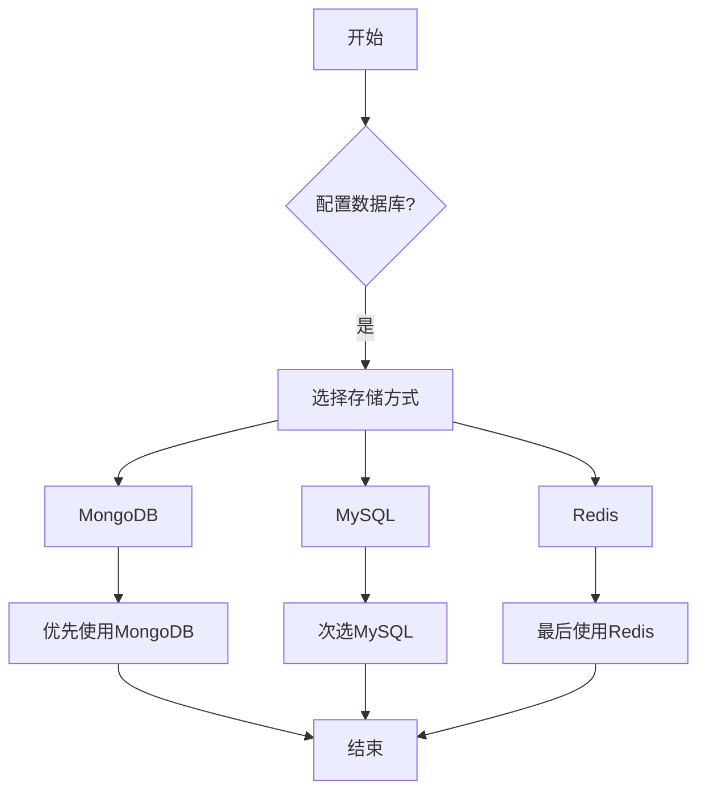

# 许可证

<cite>
**本文档引用的文件**   
- [README.md](file://README.md#L446-L449)
- [ENV_CONFIG.md](file://ENV_CONFIG.md#L338-L342)
</cite>

## 目录
1. [许可证概述](#许可证概述)
2. [架构与组件关系](#架构与组件关系)
3. [配置选项](#配置选项)
4. [使用模式](#使用模式)
5. [数据存储优先级](#数据存储优先级)

## 许可证概述

本项目采用 MIT 许可证，允许用户在遵守许可证条款的前提下自由使用、复制、修改、合并、发布、分发、再许可和销售软件及其副本。MIT 许可证是一种宽松的开源许可证，适用于个人和商业用途。

MIT 许可证的核心条款包括：
- 授予使用、复制、修改、合并、发布、分发、再许可和销售软件的权限
- 要求在软件和相关文档中包含原始版权声明和许可声明
- 不提供任何明示或暗示的担保
- 限制责任范围，开发者不对因使用软件而产生的任何损害负责

**Section sources**
- [README.md](file://README.md#L446-L449)

## 架构与组件关系

本项目的许可证信息主要体现在项目的开源属性和使用条款上。项目架构围绕分布式爬虫系统设计，支持多种数据库存储方式（MySQL 和 MongoDB），并通过 Redis 实现任务队列管理。许可证的选择影响了项目的使用范围和分发方式。

项目的关键组件包括：
- **Scrapy-Redis**：用于实现分布式爬虫架构
- **MySQL**：用于结构化数据存储
- **MongoDB**：用于非结构化数据存储
- **Redis**：用于任务队列和去重过滤

这些组件共同构成了一个高效、可扩展的爬虫系统，而 MIT 许可证确保了该系统的开放性和可访问性。

**Section sources**
- [README.md](file://README.md#L1-L454)
- [ENV_CONFIG.md](file://ENV_CONFIG.md#L1-L375)

## 配置选项

项目通过 `.env` 文件进行配置管理，支持环境变量覆盖配置项。配置优先级为：系统环境变量 > `.env` 文件 > 代码默认值。主要配置项包括数据库连接、Redis 连接、代理设置等。

对于许可证相关的配置，项目本身不涉及特定的许可证密钥或验证机制，而是通过开源许可证的形式对外提供使用权限。用户只需遵守 MIT 许可证的条款即可合法使用本项目。

**Section sources**
- [ENV_CONFIG.md](file://ENV_CONFIG.md#L204-L307)

## 使用模式

本项目的使用模式主要包括两种：
1. **配置驱动爬虫**：通过 `demo.json` 配置文件驱动爬虫任务，适用于静态任务配置。
2. **全链路 Redis 模式**：利用 Redis 作为任务队列，实现动态任务调度和分布式爬取。

无论采用哪种模式，用户都必须遵守 MIT 许可证的规定，确保在使用过程中保留原始版权声明和许可声明。

**Section sources**
- [README.md](file://README.md#L138-L199)

## 数据存储优先级

项目支持多种数据存储方式，并定义了明确的存储优先级：
- **MongoDB > MySQL > Redis 队列**
  - 如果配置了 MongoDB 且连接成功，优先使用 MongoDB 存储数据
  - 如果没有 MongoDB 但有 MySQL，使用 MySQL 存储数据
  - 如果两者均未配置，数据将存储在 Redis 队列中

这种优先级设计确保了数据的持久性和可靠性，同时也体现了项目对不同存储需求的灵活性支持。MIT 许可证允许用户根据自身需求选择合适的存储方案，而不受限制。

**Diagram sources**
- [ENV_CONFIG.md](file://ENV_CONFIG.md#L338-L342)
- [pipelines.py](file://crawler/pipelines.py#L8-L14)

**Section sources**
- [ENV_CONFIG.md](file://ENV_CONFIG.md#L338-L342)
- [pipelines.py](file://crawler/pipelines.py#L7-L105)