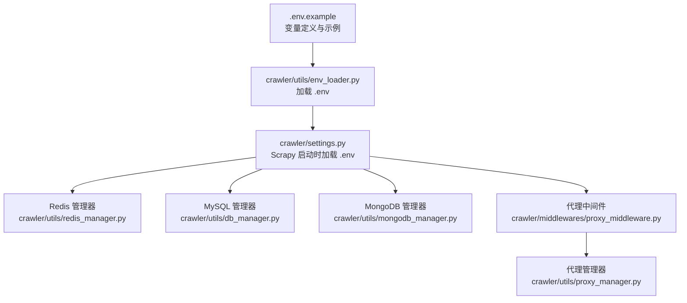
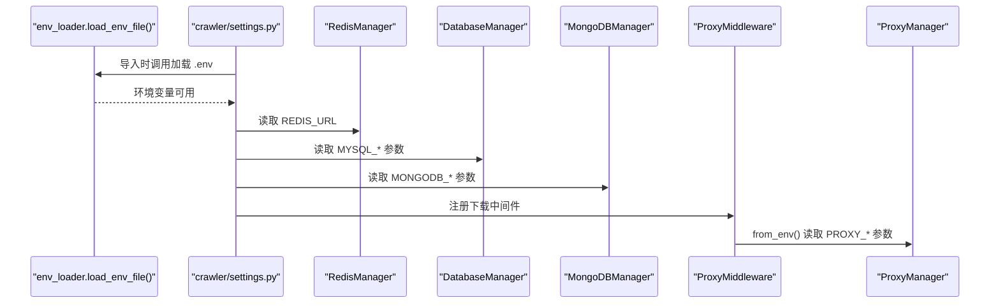
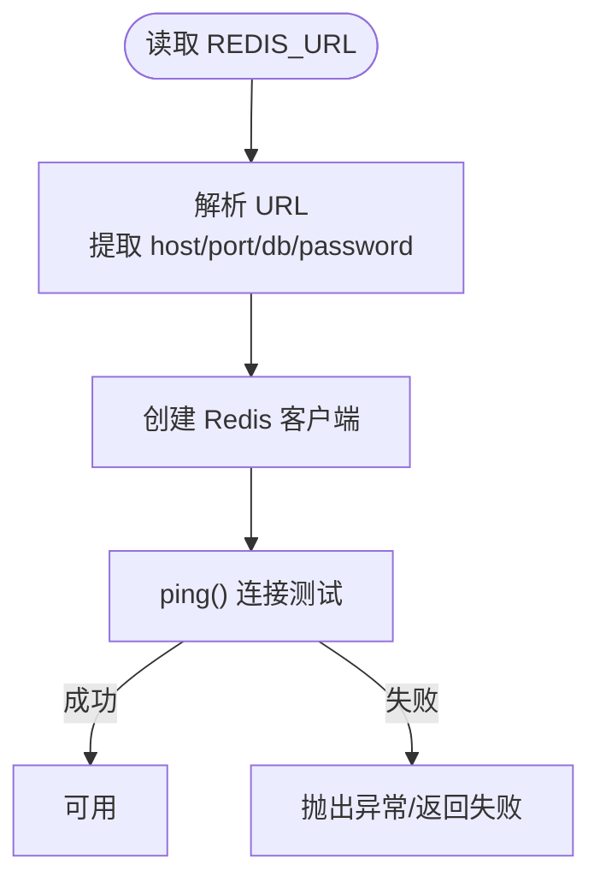
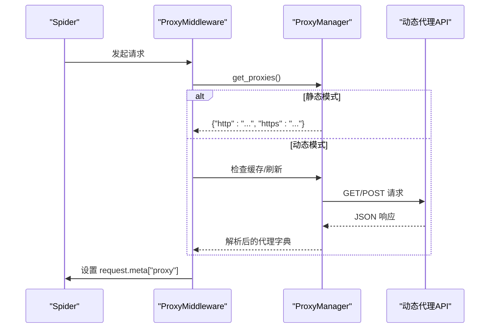
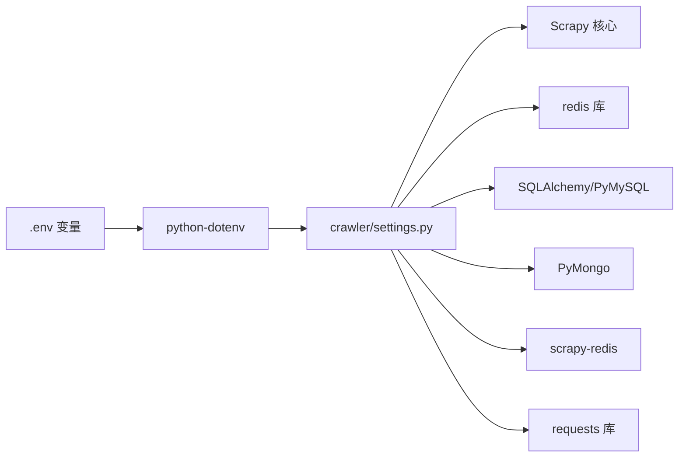

# .env环境变量配置

<cite>
**本文引用的文件**
- [.env.example](file://.env.example)
- [ENV_CONFIG.md](file://ENV_CONFIG.md)
- [crawler/utils/env_loader.py](file://crawler/utils/env_loader.py)
- [crawler/settings.py](file://crawler/settings.py)
- [crawler/utils/redis_manager.py](file://crawler/utils/redis_manager.py)
- [crawler/utils/db_manager.py](file://crawler/utils/db_manager.py)
- [crawler/utils/mongodb_manager.py](file://crawler/utils/mongodb_manager.py)
- [crawler/utils/proxy_manager.py](file://crawler/utils/proxy_manager.py)
- [crawler/middlewares/proxy_middleware.py](file://crawler/middlewares/proxy_middleware.py)
- [test_env.py](file://test_env.py)
- [requirements.txt](file://requirements.txt)
</cite>

## 目录
1. [简介](#简介)
2. [项目结构](#项目结构)
3. [.env变量总览与作用范围](#env变量总览与作用范围)
4. [架构与加载流程](#架构与加载流程)
5. [详细组件与变量解析](#详细组件与变量解析)
6. [依赖关系分析](#依赖关系分析)
7. [性能与可靠性考量](#性能与可靠性考量)
8. [故障排查指南](#故障排查指南)
9. [结论](#结论)
10. [附录：配置示例与最佳实践](#附录配置示例与最佳实践)

## 简介
本文件围绕项目中的 .env 环境变量配置进行全面说明，重点阐述其在系统中的角色、加载机制与对爬虫行为的影响。内容涵盖数据库连接（MySQL/MongoDB）、Redis 配置、代理设置（静态/动态）、日志级别、Scrapy 与 Scrapy-Redis 集成的关键配置项，以及常见错误与排查方法。同时给出开发、测试与生产环境的差异建议与安全实践。

## 项目结构
- .env.example 提供完整变量清单与注释，便于复制为 .env 并按需修改。
- crawler/utils/env_loader.py 负责从 .env 文件加载配置，支持调试输出与自动定位项目根目录。
- crawler/settings.py 在 Scrapy 启动时加载 .env，并将变量映射到 Scrapy 配置（如 SCHEDULER、REDIS_URL、LOG_LEVEL 等）。
- 各工具模块（Redis、MySQL、MongoDB、代理）均从环境变量读取配置，形成统一的配置来源。



图表来源
- [.env.example](file://.env.example#L1-L84)
- [crawler/utils/env_loader.py](file://crawler/utils/env_loader.py#L1-L63)
- [crawler/settings.py](file://crawler/settings.py#L1-L54)
- [crawler/utils/redis_manager.py](file://crawler/utils/redis_manager.py#L1-L345)
- [crawler/utils/db_manager.py](file://crawler/utils/db_manager.py#L1-L618)
- [crawler/utils/mongodb_manager.py](file://crawler/utils/mongodb_manager.py#L1-L323)
- [crawler/middlewares/proxy_middleware.py](file://crawler/middlewares/proxy_middleware.py#L1-L69)
- [crawler/utils/proxy_manager.py](file://crawler/utils/proxy_manager.py#L1-L239)

章节来源
- [crawler/utils/env_loader.py](file://crawler/utils/env_loader.py#L1-L63)
- [crawler/settings.py](file://crawler/settings.py#L1-L54)

## .env变量总览与作用范围
以下变量在 .env 中定义，用于控制数据库、Redis、代理、日志级别、队列键、请求工作线程等行为。具体说明与示例请参阅 .env.example 与 ENV_CONFIG.md。

- 数据库类型与存储优先级
  - ARTICLE_DB_TYPE：选择数据存储类型（mysql/mongodb），影响后端与爆虫数据存储优先级（MongoDB > MySQL > Redis）。
- Redis
  - REDIS_URL：Redis 连接 URL，支持密码与用户名组合，格式见 .env.example。
- MySQL
  - MYSQL_HOST、MYSQL_PORT、MYSQL_USER、MYSQL_PASSWORD、MYSQL_DB、MYSQL_CHARSET、MYSQL_POOL_SIZE、MYSQL_POOL_MAX_OVERFLOW。
- MongoDB
  - MONGODB_URI、MONGODB_DB、MONGODB_COLLECTION。
- Scrapy
  - CONFIG_PATH：配置文件路径（JSON），用于运行参数覆盖。
  - LOG_LEVEL：日志级别。
- 队列键
  - SCRAPY_START_KEY、SUCCESS_QUEUE_KEY、SUCCESS_ITEM_KEY、SUCCESS_ERROR_KEY。
- requests_worker（可选）
  - REQUESTS_TIMEOUT、REQUESTS_MAX_RETRIES、REQUESTS_RETRY_DELAY、REQUESTS_SLEEP。
- 测试接口服务
  - TEST_API_PORT、TEST_API_HOST、TEST_API_DEBUG。
- 代理
  - PROXY_MODE：static/dynamic。
  - HTTP_PROXY、HTTPS_PROXY、SOCKS_PROXY：固定代理配置。
  - DYNAMIC_PROXY_API、DYNAMIC_PROXY_API_METHOD、DYNAMIC_PROXY_API_HEADERS、DYNAMIC_PROXY_REFRESH_INTERVAL：动态代理配置。

章节来源
- [.env.example](file://.env.example#L1-L84)
- [ENV_CONFIG.md](file://ENV_CONFIG.md#L1-L375)

## 架构与加载流程
- .env 加载时机
  - crawler/utils/env_loader.py 在模块导入时自动调用 load_env_file()，尝试在项目根目录查找 .env 并通过 python-dotenv 加载。
  - crawler/settings.py 在导入时调用 load_env_file()，确保 Scrapy 启动前环境变量已就绪。
- 变量传播路径
  - Scrapy settings 通过 os.getenv 读取 .env 中的变量，如 REDIS_URL、LOG_LEVEL、MYSQL_* 等。
  - 各业务模块（Redis/MySQL/MongoDB/代理）也直接从 os.getenv 读取对应变量，形成统一配置来源。
- 关键集成点
  - Scrapy-Redis：SCHEDULER、SCHEDULER_QUEUE_CLASS、SCHEDULER_PERSIST、DUPEFILTER_CLASS 等在 settings 中配置，配合 REDIS_URL 使用。



图表来源
- [crawler/utils/env_loader.py](file://crawler/utils/env_loader.py#L1-L63)
- [crawler/settings.py](file://crawler/settings.py#L1-L54)
- [crawler/utils/redis_manager.py](file://crawler/utils/redis_manager.py#L1-L345)
- [crawler/utils/db_manager.py](file://crawler/utils/db_manager.py#L1-L618)
- [crawler/utils/mongodb_manager.py](file://crawler/utils/mongodb_manager.py#L1-L323)
- [crawler/middlewares/proxy_middleware.py](file://crawler/middlewares/proxy_middleware.py#L1-L69)
- [crawler/utils/proxy_manager.py](file://crawler/utils/proxy_manager.py#L1-L239)

章节来源
- [crawler/utils/env_loader.py](file://crawler/utils/env_loader.py#L1-L63)
- [crawler/settings.py](file://crawler/settings.py#L1-L54)

## 详细组件与变量解析

### 数据库配置（MySQL/MongoDB）
- 选择与优先级
  - 通过 ARTICLE_DB_TYPE 控制存储类型；后端与爆虫数据存储优先级为 MongoDB > MySQL > Redis。
- MySQL
  - 通过 os.getenv 读取 MYSQL_* 变量，DatabaseManager 基于这些变量创建 SQLAlchemy 引擎，支持连接池与预检测。
  - 注意：当 MYSQL_PASSWORD 包含特殊字符时，需使用引号包裹或进行 URL 编码（视场景而定）。
- MongoDB
  - 通过 os.getenv 读取 MONGODB_URI、MONGODB_DB、MONGODB_COLLECTION，MongoDBManager 使用 Pymongo 连接并提供基础 CRUD 能力。
  - 注意：URI 中的密码同样需要 URL 编码，或使用标准连接串格式。

```mermaid
classDiagram
class DatabaseManager {
+engine
+is_connected
+test_connection()
+execute_query(query, params)
+save_article(...)
+get_articles_by_task_id(...)
+from_env()
}
class MongoDBManager {
+client
+db
+collection
+test_connection()
+save_article(...)
+get_articles_by_task_id(...)
+from_env()
}
DatabaseManager <.. MongoDBManager : "存储优先级 : MongoDB > MySQL"
```

图表来源
- [crawler/utils/db_manager.py](file://crawler/utils/db_manager.py#L1-L618)
- [crawler/utils/mongodb_manager.py](file://crawler/utils/mongodb_manager.py#L1-L323)

章节来源
- [ENV_CONFIG.md](file://ENV_CONFIG.md#L1-L375)
- [crawler/utils/db_manager.py](file://crawler/utils/db_manager.py#L1-L618)
- [crawler/utils/mongodb_manager.py](file://crawler/utils/mongodb_manager.py#L1-L323)

### Redis 配置与队列键
- 连接
  - REDIS_URL 由 settings 读取并传递给 RedisManager；RedisManager 支持从 URL 解析主机、端口、数据库与密码，并提供连接测试、阻塞弹出、列表操作等。
- 队列键
  - SCRAPY_START_KEY、SUCCESS_QUEUE_KEY、SUCCESS_ITEM_KEY、SUCCESS_ERROR_KEY 用于定义爬虫任务与结果在 Redis 中的键空间，便于分布式调度与结果收集。



图表来源
- [crawler/utils/redis_manager.py](file://crawler/utils/redis_manager.py#L1-L345)
- [crawler/settings.py](file://crawler/settings.py#L1-L54)

章节来源
- [.env.example](file://.env.example#L1-L84)
- [crawler/utils/redis_manager.py](file://crawler/utils/redis_manager.py#L1-L345)
- [crawler/settings.py](file://crawler/settings.py#L1-L54)

### 代理配置（静态/动态）
- 模式选择
  - PROXY_MODE=static 或 dynamic。
- 固定代理
  - HTTP_PROXY、HTTPS_PROXY、SOCKS_PROXY；SOCKS 会覆盖 HTTP/HTTPS。
- 动态代理
  - DYNAMIC_PROXY_API、DYNAMIC_PROXY_API_METHOD（GET/POST）、DYNAMIC_PROXY_API_HEADERS（JSON 字符串）、DYNAMIC_PROXY_REFRESH_INTERVAL（秒，0 表示每次刷新）。
- Scrapy 集成
  - ProxyMiddleware 在请求阶段根据代理管理器提供的代理字典设置 request.meta["proxy"]，优先使用 https，否则回退 http；若配置 SOCKS 则统一应用。



图表来源
- [crawler/middlewares/proxy_middleware.py](file://crawler/middlewares/proxy_middleware.py#L1-L69)
- [crawler/utils/proxy_manager.py](file://crawler/utils/proxy_manager.py#L1-L239)

章节来源
- [.env.example](file://.env.example#L1-L84)
- [ENV_CONFIG.md](file://ENV_CONFIG.md#L1-L375)
- [crawler/middlewares/proxy_middleware.py](file://crawler/middlewares/proxy_middleware.py#L1-L69)
- [crawler/utils/proxy_manager.py](file://crawler/utils/proxy_manager.py#L1-L239)

### 日志级别与配置文件路径
- LOG_LEVEL：控制 Scrapy 日志级别（INFO/DEBUG/WARNING 等）。
- CONFIG_PATH：允许通过外部 JSON 配置文件覆盖运行参数（如并发、延迟等）。

章节来源
- [.env.example](file://.env.example#L1-L84)
- [crawler/settings.py](file://crawler/settings.py#L1-L54)

### Scrapy 与 Scrapy-Redis 集成
- 关键配置项
  - SCHEDULER：使用 scrapy_redis 的 Scheduler。
  - SCHEDULER_QUEUE_CLASS：队列实现（FifoQueue）。
  - SCHEDULER_PERSIST：持久化队列。
  - DUPEFILTER_CLASS：可设为空实现以允许重复 URL 进入队列（或使用 RFPDupeFilter 实现去重）。
  - REDIS_URL：与上文一致。
- 影响
  - 以上配置使爬虫具备分布式调度能力，任务与去重状态由 Redis 维护，适合多进程/多机器部署。

章节来源
- [crawler/settings.py](file://crawler/settings.py#L1-L54)

## 依赖关系分析
- python-dotenv
  - 用于加载 .env 文件，requirements 中声明。
- Scrapy 与 Scrapy-Redis
  - settings 中引入 SCHEDULER、DUPEFILTER_CLASS 等，依赖 scrapy-redis。
- 数据库与缓存
  - MySQL 使用 SQLAlchemy + PyMySQL；MongoDB 使用 PyMongo；Redis 使用 redis 库。
- 代理
  - requests 用于动态代理 API 调用；Scrapy 的 meta["proxy"] 用于请求代理。



图表来源
- [requirements.txt](file://requirements.txt#L1-L17)
- [crawler/settings.py](file://crawler/settings.py#L1-L54)

章节来源
- [requirements.txt](file://requirements.txt#L1-L17)
- [crawler/settings.py](file://crawler/settings.py#L1-L54)

## 性能与可靠性考量
- 连接池与超时
  - MySQL：pool_size、max_overflow、pool_pre_ping、pool_recycle 等参数提升稳定性与性能。
  - MongoDB：connectTimeoutMS、serverSelectionTimeoutMS 控制连接与服务器选择超时。
  - Redis：RedisManager 提供 ping 测试与连接复用。
- 代理刷新策略
  - 动态代理支持缓存与刷新间隔，降低频繁请求代理 API 的开销。
- 去重策略
  - 通过 DUPEFILTER_CLASS 控制 URL 去重行为，结合链接/内容哈希减少重复入库。
- 日志级别
  - LOG_LEVEL 控制输出量，生产环境建议 INFO 或更高，避免过多 IO。

[本节为通用指导，无需列出章节来源]

## 故障排查指南
- Redis 连接失败
  - 现象：连接 ping 失败、认证失败、URL 格式错误。
  - 排查：使用 test_env.py 验证 .env 是否加载、REDIS_URL 格式与密码是否正确；确认 Redis 服务可达与密码配置。
- MySQL 密码特殊字符导致连接失败
  - 现象：连接报错或认证失败。
  - 排查：按 ENV_CONFIG.md 的说明，对 MYSQL_PASSWORD 使用引号包裹或进行 URL 编码；确认字符集与端口。
- MongoDB 密码特殊字符导致连接失败
  - 现象：连接失败或认证失败。
  - 排查：按 ENV_CONFIG.md 的说明，对 MONGODB_URI 中的密码进行 URL 编码；确认数据库名与集合名。
- 代理不生效
  - 现象：请求未走代理或代理不可用。
  - 排查：确认 PROXY_MODE、HTTP_PROXY/HTTPS_PROXY/SOCKS_PROXY 配置；动态代理需检查 DYNAMIC_PROXY_API、METHOD、HEADERS 与刷新间隔；查看中间件日志。
- 任务重复或去重异常
  - 现象：相同 URL 多次进入队列或重复入库。
  - 排查：检查 DUPEFILTER_CLASS 设置；确认链接/内容哈希逻辑是否正常；核对去重键（如 link_hash）生成。
- 数据存储优先级问题
  - 现象：期望使用某数据库但实际未生效。
  - 排查：确认 ARTICLE_DB_TYPE 与数据库配置是否齐全；优先级为 MongoDB > MySQL > Redis。

章节来源
- [test_env.py](file://test_env.py#L1-L113)
- [ENV_CONFIG.md](file://ENV_CONFIG.md#L1-L375)
- [crawler/utils/redis_manager.py](file://crawler/utils/redis_manager.py#L1-L345)
- [crawler/utils/db_manager.py](file://crawler/utils/db_manager.py#L1-L618)
- [crawler/utils/mongodb_manager.py](file://crawler/utils/mongodb_manager.py#L1-L323)
- [crawler/utils/proxy_manager.py](file://crawler/utils/proxy_manager.py#L1-L239)
- [crawler/middlewares/proxy_middleware.py](file://crawler/middlewares/proxy_middleware.py#L1-L69)

## 结论
.env 是本项目统一的配置入口，贯穿数据库、缓存、代理、日志与 Scrapy-Redis 集成等核心环节。通过 python-dotenv 与 settings 的配合，变量在启动阶段即注入到各模块，确保行为一致且可维护。建议在不同环境采用差异化配置，并遵循安全与可审计原则（如最小权限、URL 编码、文件权限与密钥管理）。

[本节为总结性内容，无需列出章节来源]

## 附录：配置示例与最佳实践
- 开发环境
  - 使用本地 Redis 与 MySQL；开启 DEBUG_ENV_LOAD 输出；LOG_LEVEL 设为 DEBUG；代理可暂时关闭或使用本地代理。
- 测试环境
  - 使用独立 Redis/MongoDB；开启连接测试脚本；验证队列键命名与去重策略。
- 生产环境
  - 使用系统环境变量或密钥管理服务；严格限制 .env 文件权限；对密码进行 URL 编码；启用持久化与连接池优化；监控日志与代理可用性。
- 安全建议
  - 不提交 .env 至版本控制；使用强密码并定期轮换；对敏感字段进行脱敏输出；生产环境优先使用系统环境变量。

章节来源
- [.env.example](file://.env.example#L1-L84)
- [ENV_CONFIG.md](file://ENV_CONFIG.md#L1-L375)
- [crawler/utils/env_loader.py](file://crawler/utils/env_loader.py#L1-L63)
- [crawler/settings.py](file://crawler/settings.py#L1-L54)