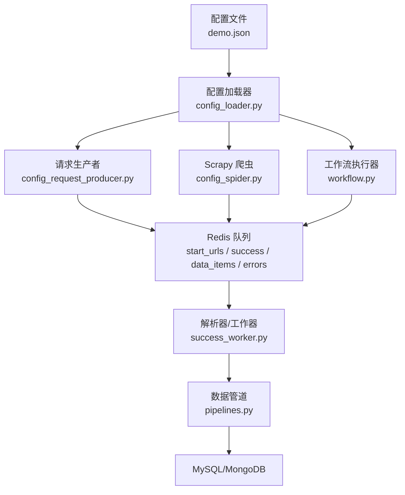
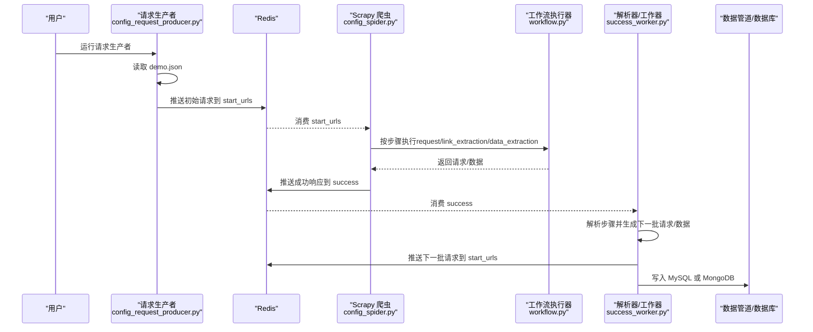
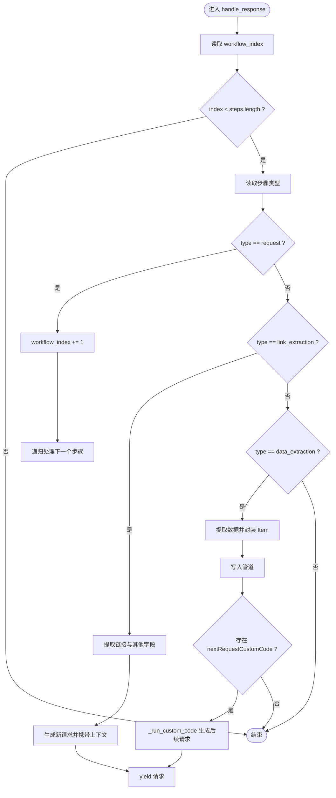
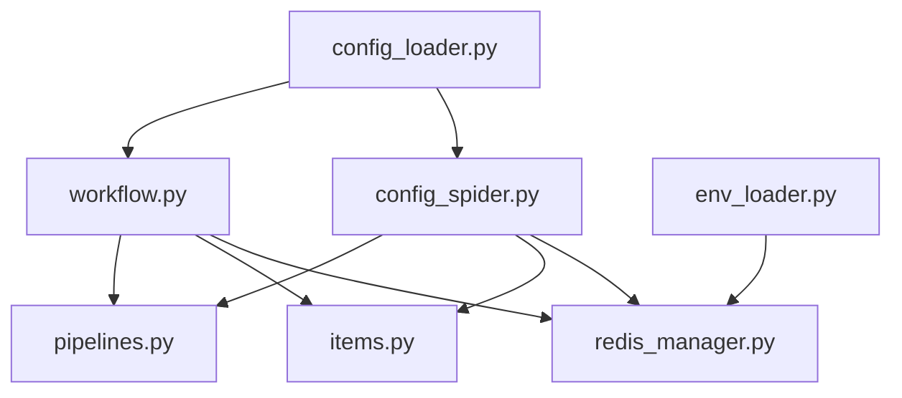

# JSON任务配置文件结构

<cite>
**本文引用的文件**
- [demo.json](file://demo.json)
- [config_spider.py](file://crawler/spiders/config_spider.py)
- [config_loader.py](file://crawler/utils/config_loader.py)
- [workflow.py](file://crawler/utils/workflow.py)
- [config_request_producer.py](file://config_request_producer.py)
- [success_worker.py](file://success_worker.py)
- [items.py](file://crawler/items.py)
- [pipelines.py](file://crawler/pipelines.py)
- [env_loader.py](file://crawler/utils/env_loader.py)
- [redis_manager.py](file://crawler/utils/redis_manager.py)
- [README.md](file://README.md)
</cite>

## 目录
1. [简介](#简介)
2. [项目结构](#项目结构)
3. [核心组件](#核心组件)
4. [架构总览](#架构总览)
5. [详细组件分析](#详细组件分析)
6. [依赖关系分析](#依赖关系分析)
7. [性能考量](#性能考量)
8. [故障排查指南](#故障排查指南)
9. [结论](#结论)
10. [附录](#附录)

## 简介
本文件围绕 JSON 任务配置文件（如 demo.json）展开，系统性阐述其作为驱动爬虫工作流的核心机制。重点解释配置文件中各字段的含义与作用：taskInfo.id、taskInfo.baseUrl、taskInfo.concurrency、taskInfo.requestInterval、workflowSteps 等；说明如何通过 config_spider.py 解析配置并生成初始请求，以及 config_loader.py 如何验证与加载结构化数据。同时提供多种实际用例，覆盖列表页-详情页抓取、API 分页请求、动态表单提交等典型场景；解释工作流步骤（workflow）如何根据配置执行链式处理，并支持自定义处理器扩展。最后给出常见错误配置示例与修复建议，强调配置驱动架构带来的灵活性与可维护性优势。

## 项目结构
本项目采用“配置驱动 + 分布式队列”的架构设计：
- 配置文件 demo.json 定义任务基本信息与工作流步骤；
- config_loader.py 负责加载与校验配置；
- config_spider.py 作为 Scrapy 爬虫，按配置生成初始请求并执行工作流；
- success_worker.py 作为独立进程，消费成功队列并推进工作流；
- config_request_producer.py 将 demo.json 转换为初始请求并推送到 Redis；
- Redis 作为跨进程通信的中间件，承载请求队列、成功队列与结果队列；
- pipelines.py 将最终数据持久化到 MySQL 或 MongoDB。

图表来源
- [demo.json](file://demo.json#L1-L181)
- [config_loader.py](file://crawler/utils/config_loader.py#L1-L16)
- [config_spider.py](file://crawler/spiders/config_spider.py#L1-L325)
- [workflow.py](file://crawler/utils/workflow.py#L1-L157)
- [config_request_producer.py](file://config_request_producer.py#L1-L77)
- [success_worker.py](file://success_worker.py#L1-L363)
- [pipelines.py](file://crawler/pipelines.py#L1-L105)

章节来源
- [README.md](file://README.md#L137-L202)

## 核心组件
- 配置加载器（config_loader.py）：读取 JSON 配置，校验必需字段 taskInfo 与 workflowSteps，抛出明确异常。
- Scrapy 爬虫（config_spider.py）：从配置生成初始请求，按步骤类型执行链式处理，支持自定义代码扩展。
- 工作流执行器（workflow.py）：在纯 Python 环境中复用与 Scrapy 相同的工作流逻辑，便于独立解析。
- 请求生产者（config_request_producer.py）：将 demo.json 转换为初始请求负载，推送到 Redis。
- 解析器/工作器（success_worker.py）：消费成功队列，按步骤推进，支持自定义代码生成后续请求。
- 数据管道（pipelines.py）：优先写入 MongoDB，否则写入 MySQL，均不可用则跳过保存。
- 环境加载（env_loader.py）、Redis 管理（redis_manager.py）：统一加载 .env 配置与 Redis 连接。

章节来源
- [config_loader.py](file://crawler/utils/config_loader.py#L1-L16)
- [config_spider.py](file://crawler/spiders/config_spider.py#L1-L325)
- [workflow.py](file://crawler/utils/workflow.py#L1-L157)
- [config_request_producer.py](file://config_request_producer.py#L1-L77)
- [success_worker.py](file://success_worker.py#L1-L363)
- [pipelines.py](file://crawler/pipelines.py#L1-L105)
- [env_loader.py](file://crawler/utils/env_loader.py#L1-L63)
- [redis_manager.py](file://crawler/utils/redis_manager.py#L1-L345)

## 架构总览
配置驱动的爬虫工作流分为两条主线：
- Scrapy 主线：config_spider.py 读取配置，生成初始请求，按 workflowSteps 顺序执行 request/link_extraction/data_extraction，必要时调用自定义代码生成后续请求。
- 独立解析主线：success_worker.py 从 Redis 成功队列消费响应，按相同工作流逻辑推进，支持将数据写入数据库或继续生成请求。

图表来源
- [config_request_producer.py](file://config_request_producer.py#L1-L77)
- [config_spider.py](file://crawler/spiders/config_spider.py#L1-L325)
- [workflow.py](file://crawler/utils/workflow.py#L1-L157)
- [success_worker.py](file://success_worker.py#L1-L363)
- [pipelines.py](file://crawler/pipelines.py#L1-L105)

## 详细组件分析

### 配置文件字段详解（demo.json）
- taskInfo
  - id：任务标识，贯穿整个工作流，用于数据项与上下文关联。
  - name：任务名称，便于日志与监控识别。
  - baseUrl：初始请求的基础 URL，若 request 步骤未显式提供 url，则使用此处。
  - concurrency：并发数，影响 Scrapy 的 CONCURRENT_REQUESTS。
  - requestInterval：请求间隔（秒），影响 DOWNLOAD_DELAY。
  - 其他字段如 status、description、crawlStartAt、crawledCount、updatedAt 为任务状态与描述信息。
- workflowSteps：工作流步骤数组，按序执行，支持以下类型：
  - request：发起 HTTP 请求，支持 method、headers、params 等配置。
  - link_extraction：提取链接与其他字段，支持 XPath/CSS 表达式、去重、最大链接数等。
  - data_extraction：提取结构化数据，支持多字段、多值提取，支持 nextRequestCustomCode 生成后续请求。

章节来源
- [demo.json](file://demo.json#L1-L181)
- [README.md](file://README.md#L394-L407)

### 配置加载与校验（config_loader.py）
- 负责读取 JSON 文件并校验必需字段：
  - 若配置文件不存在，抛出 FileNotFoundError；
  - 若缺少 taskInfo 或 workflowSteps，抛出 ValueError。
- 该校验确保后续工作流执行的安全性与一致性。

章节来源
- [config_loader.py](file://crawler/utils/config_loader.py#L1-L16)

### Scrapy 爬虫（config_spider.py）解析与执行
- 初始化阶段
  - 从命令行参数或环境变量读取 CONFIG_PATH，默认 demo.json；
  - 调用 load_config 加载配置，提取 taskInfo 与 workflowSteps；
  - 根据 taskInfo.concurrency 与 taskInfo.requestInterval 覆盖 Scrapy 设置。
- 初始请求生成
  - 若未通过 Redis 提供启动 URL，使用 taskInfo.baseUrl 生成初始请求；
  - request 步骤支持 headersMode 与 headersJson，自动解析 JSON 头部。
- 工作流执行
  - handle_response 根据 workflow_index 选择当前步骤类型：
    - request：直接推进到下一步；
    - link_extraction：提取链接与其他字段，生成新请求并携带上下文；
    - data_extraction：提取数据，封装 ArticleItem，写入管道；若存在 nextRequestCustomCode，执行自定义代码生成后续请求。
  - _extract 支持 XPath/CSS，多值提取返回列表，单值提取返回字符串；
  - _run_custom_code 通过安全沙箱执行自定义代码，要求导出 process_request 可调用函数，返回一组请求负载。

图表来源
- [config_spider.py](file://crawler/spiders/config_spider.py#L63-L188)
- [config_spider.py](file://crawler/spiders/config_spider.py#L190-L325)

章节来源
- [config_spider.py](file://crawler/spiders/config_spider.py#L1-L325)

### 独立工作流执行器（workflow.py）
- 与 Scrapy 版本共享相同的工作流逻辑，便于在非 Scrapy 环境中复用：
  - initial_requests：从 taskInfo.baseUrl 与 request 步骤头部生成初始请求；
  - handle_response：按步骤类型推进；
  - _handle_link_extraction/_handle_data_extraction：提取链接/字段、生成请求或产出数据；
  - _run_custom_code：执行自定义代码生成请求；
  - _parse_headers：从 request 步骤解析 JSON 头部。

章节来源
- [workflow.py](file://crawler/utils/workflow.py#L1-L157)

### 请求生产者（config_request_producer.py）
- 从 demo.json 读取配置，校验第一个步骤必须为 request；
- 从 request.config 中解析 headersMode 与 headersJson；
- 生成初始请求负载（包含 url、method、headers、meta、dont_filter），推送到 Redis 的 start_urls；
- 使用 RedisManager.from_env 连接 Redis，支持 .env 中 REDIS_URL 配置。

章节来源
- [config_request_producer.py](file://config_request_producer.py#L1-L77)
- [redis_manager.py](file://crawler/utils/redis_manager.py#L1-L345)
- [env_loader.py](file://crawler/utils/env_loader.py#L1-L63)

### 解析器/工作器（success_worker.py）
- 从 Redis 成功队列 success 消费响应，构造 selector 与上下文；
- 按步骤推进：request 直接前进；link_extraction 提取链接并推送下一批请求；data_extraction 提取数据并写入数据库或 Redis；
- 支持自定义代码生成后续请求；
- 数据持久化优先 MongoDB，其次 MySQL，均不可用则写入 Redis data_items。

章节来源
- [success_worker.py](file://success_worker.py#L1-L363)

### 数据项与管道（items.py、pipelines.py）
- ArticleItem：包含 task_id、title、link、content、source_url、extra 等字段；
- MySQLStorePipeline：优先写入 MongoDB，否则写入 MySQL，均不可用则跳过保存。

章节来源
- [items.py](file://crawler/items.py#L1-L12)
- [pipelines.py](file://crawler/pipelines.py#L1-L105)

## 依赖关系分析
- 配置驱动：config_spider.py 与 workflow.py 均依赖 demo.json 的结构；
- 环境与连接：env_loader.py 统一加载 .env；redis_manager.py 提供 Redis 连接与操作；
- 数据持久化：pipelines.py 依赖数据库管理器（MySQL/MongoDB）。

图表来源
- [config_loader.py](file://crawler/utils/config_loader.py#L1-L16)
- [config_spider.py](file://crawler/spiders/config_spider.py#L1-L325)
- [workflow.py](file://crawler/utils/workflow.py#L1-L157)
- [redis_manager.py](file://crawler/utils/redis_manager.py#L1-L345)
- [env_loader.py](file://crawler/utils/env_loader.py#L1-L63)
- [items.py](file://crawler/items.py#L1-L12)
- [pipelines.py](file://crawler/pipelines.py#L1-L105)

## 性能考量
- 并发与延迟：通过 taskInfo.concurrency 与 taskInfo.requestInterval 控制 Scrapy 的并发与请求间隔，避免触发目标站点限流。
- 编码处理：config_spider.py 与 workflow.py 均支持自动编码检测与手动指定编码，减少乱码导致的解析失败。
- 链式处理：link_extraction 与 data_extraction 的组合可显著降低网络往返次数，提升吞吐量。
- 自定义代码：nextRequestCustomCode 可在数据提取后立即生成后续请求，缩短等待时间。

[本节为通用指导，无需列出具体文件来源]

## 故障排查指南
- 配置文件缺失或格式错误
  - 现象：加载配置时报错，提示文件不存在或缺少必需字段；
  - 处理：确认 CONFIG_PATH 指向正确的 demo.json，确保包含 taskInfo 与 workflowSteps。
- URL 格式错误
  - 现象：初始请求或链接提取后生成的绝对 URL 无效；
  - 处理：检查 request.config.url 或 taskInfo.baseUrl；确保 link_extraction 的表达式返回有效链接。
- XPath/CSS 语法问题
  - 现象：提取结果为空或异常；
  - 处理：在浏览器开发者工具中验证表达式；确保 extractType 与表达式一致。
- 回调函数未定义
  - 现象：自定义代码未生效；
  - 处理：确保自定义代码导出 process_request 函数并返回请求列表。
- Redis 连接失败
  - 现象：请求生产者或解析器无法连接 Redis；
  - 处理：检查 .env 中 REDIS_URL 格式与认证信息；使用 redis-cli ping 验证连通性。
- 数据未保存
  - 现象：数据库中无数据；
  - 处理：确认 MySQL/MongoDB 连接配置；检查 pipelines 配置与表结构。

章节来源
- [config_loader.py](file://crawler/utils/config_loader.py#L1-L16)
- [config_spider.py](file://crawler/spiders/config_spider.py#L190-L325)
- [success_worker.py](file://success_worker.py#L1-L363)
- [README.md](file://README.md#L408-L433)

## 结论
JSON 任务配置文件以声明式的方式定义了完整的爬虫工作流，结合 Scrapy 与独立解析器，实现了高度灵活且可维护的分布式抓取体系。通过标准化的字段与步骤类型，用户可以在不修改代码的情况下快速适配不同站点与业务场景；自定义代码扩展进一步增强了应对复杂需求的能力。配合 Redis 队列与数据库管道，系统具备良好的可扩展性与稳定性。

[本节为总结性内容，无需列出具体文件来源]

## 附录

### 实际用例与配置模式
- 列表页-详情页抓取
  - 步骤序列：request → link_extraction（提取详情页链接）→ data_extraction（提取详情页字段）；
  - 关键点：link_extraction 的 fieldName 包含 link 字段，data_extraction 的字段与页面结构一致。
- API 分页请求
  - 步骤序列：request（第一页）→ data_extraction（提取分页信息/令牌）→ nextRequestCustomCode（生成下一页请求）→ 重复直到结束；
  - 关键点：自定义代码根据上一页提取的分页参数生成下一页 URL。
- 动态表单提交
  - 步骤序列：request（登录页）→ data_extraction（提取表单字段/令牌）→ nextRequestCustomCode（构造 POST 请求）→ data_extraction（提取结果）；
  - 关键点：自定义代码组装 headers、body，并设置回调继续推进。

[本节为概念性说明，无需列出具体文件来源]

### 字段与步骤类型对照
- taskInfo
  - id：任务标识
  - name：任务名称
  - baseUrl：初始请求基础 URL
  - concurrency：并发数
  - requestInterval：请求间隔
- workflowSteps
  - type：request/link_extraction/data_extraction
  - config：request 步骤的 url/method/headers/params；link_extraction 的 linkExtractionRules；data_extraction 的 extractionRules；均可包含 nextRequestCustomCode

章节来源
- [demo.json](file://demo.json#L1-L181)
- [README.md](file://README.md#L394-L407)