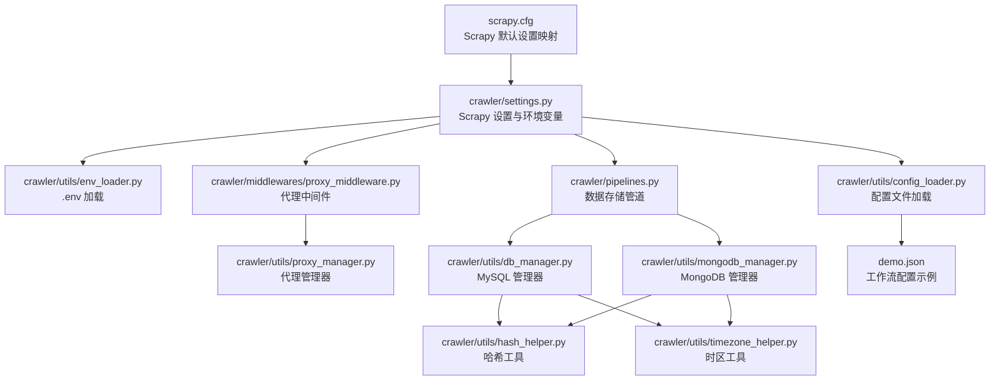
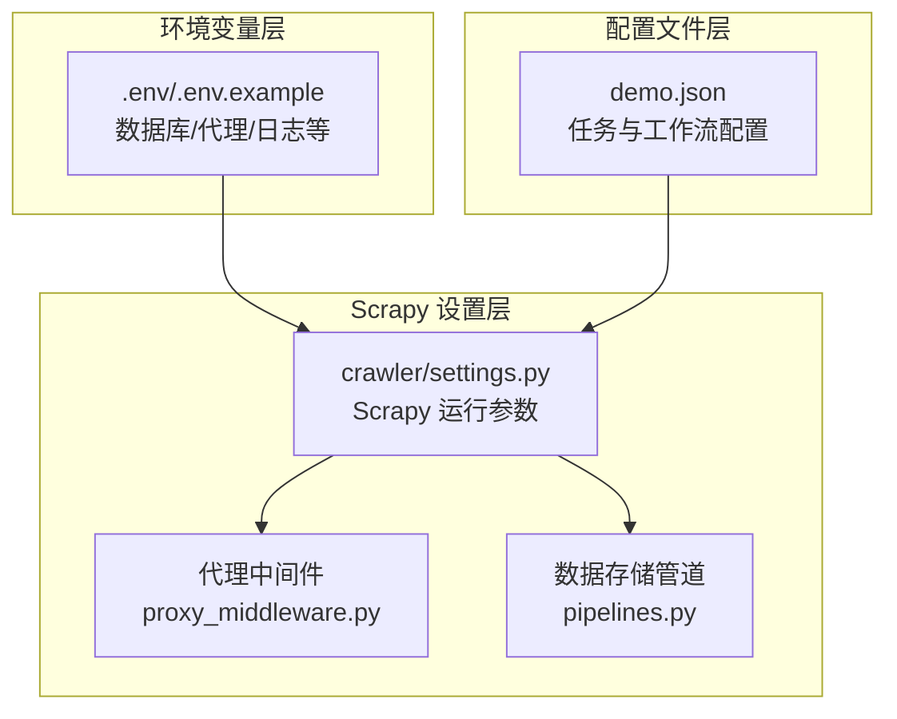
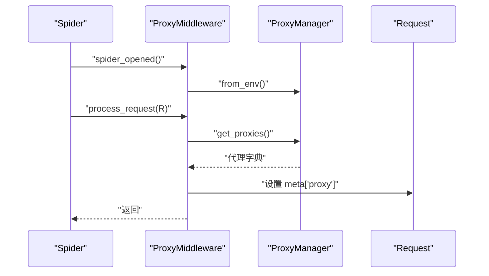
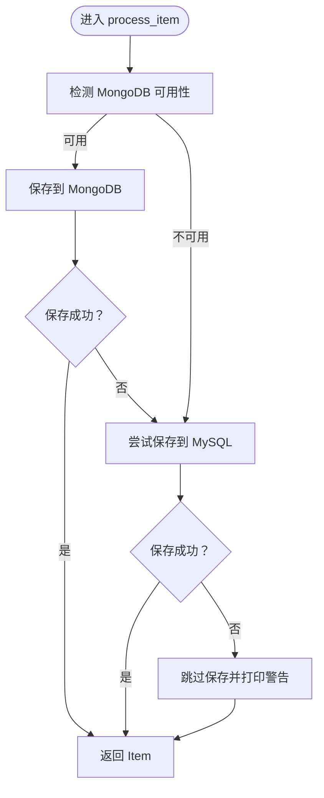
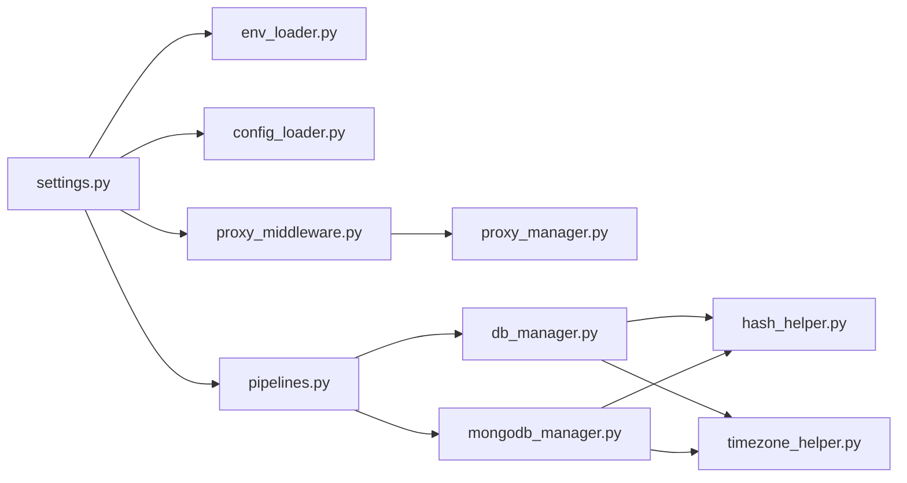

# 配置说明

<cite>
**本文引用的文件**
- [crawler/settings.py](file://crawler/settings.py)
- [scrapy.cfg](file://scrapy.cfg)
- [crawler/utils/env_loader.py](file://crawler/utils/env_loader.py)
- [ENV_CONFIG.md](file://ENV_CONFIG.md)
- [crawler/utils/config_loader.py](file://crawler/utils/config_loader.py)
- [demo.json](file://demo.json)
- [crawler/middlewares/proxy_middleware.py](file://crawler/middlewares/proxy_middleware.py)
- [crawler/utils/proxy_manager.py](file://crawler/utils/proxy_manager.py)
- [crawler/pipelines.py](file://crawler/pipelines.py)
- [crawler/utils/db_manager.py](file://crawler/utils/db_manager.py)
- [crawler/utils/mongodb_manager.py](file://crawler/utils/mongodb_manager.py)
- [crawler/utils/hash_helper.py](file://crawler/utils/hash_helper.py)
- [crawler/utils/timezone_helper.py](file://crawler/utils/timezone_helper.py)
</cite>

## 目录
1. [简介](#简介)
2. [项目结构](#项目结构)
3. [核心组件](#核心组件)
4. [架构总览](#架构总览)
5. [详细组件分析](#详细组件分析)
6. [依赖关系分析](#依赖关系分析)
7. [性能考量](#性能考量)
8. [故障排查指南](#故障排查指南)
9. [结论](#结论)
10. [附录](#附录)

## 简介
本节聚焦于“配置说明”，旨在解释配置的目的、架构以及与系统其他组件的关系。文档记录实现细节、配置选项与使用模式，并以仓库内实际代码为依据，采用一致的术语。同时提供常见用例与流程图，帮助读者快速理解如何在不同场景下正确配置与使用。

## 项目结构
围绕配置相关的关键文件分布如下：
- Scrapy 设置与入口：settings.py、scrapy.cfg
- 环境变量加载：env_loader.py
- 配置文件加载：config_loader.py
- 代理中间件与代理管理器：proxy_middleware.py、proxy_manager.py
- 数据存储管道与数据库管理：pipelines.py、db_manager.py、mongodb_manager.py
- 辅助工具：hash_helper.py、timezone_helper.py
- 示例配置：demo.json
- 环境变量配置指南：ENV_CONFIG.md

图表来源
- [scrapy.cfg](file://scrapy.cfg#L1-L8)
- [crawler/settings.py](file://crawler/settings.py#L1-L54)
- [crawler/utils/env_loader.py](file://crawler/utils/env_loader.py#L1-L63)
- [crawler/utils/config_loader.py](file://crawler/utils/config_loader.py#L1-L16)
- [crawler/middlewares/proxy_middleware.py](file://crawler/middlewares/proxy_middleware.py#L1-L69)
- [crawler/utils/proxy_manager.py](file://crawler/utils/proxy_manager.py#L1-L239)
- [crawler/pipelines.py](file://crawler/pipelines.py#L1-L105)
- [crawler/utils/db_manager.py](file://crawler/utils/db_manager.py#L1-L618)
- [crawler/utils/mongodb_manager.py](file://crawler/utils/mongodb_manager.py#L1-L323)
- [crawler/utils/hash_helper.py](file://crawler/utils/hash_helper.py#L1-L66)
- [crawler/utils/timezone_helper.py](file://crawler/utils/timezone_helper.py#L1-L67)
- [demo.json](file://demo.json#L1-L181)

章节来源
- [scrapy.cfg](file://scrapy.cfg#L1-L8)
- [crawler/settings.py](file://crawler/settings.py#L1-L54)

## 核心组件
- Scrapy 设置与环境变量
  - 通过 settings.py 统一定义 Scrapy 运行参数、调度器、去重策略、下载延迟、日志级别、Redis 连接、MySQL 连接参数、下载中间件与管道等。
  - 通过 env_loader.py 在模块导入时自动加载 .env 文件，使环境变量生效。
- 配置文件加载
  - config_loader.py 提供从 JSON 文件加载配置的能力，校验必需字段（taskInfo、workflowSteps）。
- 代理系统
  - proxy_middleware.py 作为 Scrapy 中间件，在请求阶段注入代理；proxy_manager.py 从环境变量解析代理模式与参数，支持固定代理与动态代理。
- 数据存储与去重
  - pipelines.py 作为数据存储管道，优先使用 MongoDB，其次使用 MySQL；db_manager.py 与 mongodb_manager.py 分别封装 MySQL 与 MongoDB 的连接与操作；hash_helper.py 提供去重所需的哈希计算；timezone_helper.py 提供时间戳生成。
- 示例与指南
  - demo.json 展示了工作流配置的典型结构；ENV_CONFIG.md 提供完整的环境变量配置说明与最佳实践。

章节来源
- [crawler/settings.py](file://crawler/settings.py#L1-L54)
- [crawler/utils/env_loader.py](file://crawler/utils/env_loader.py#L1-L63)
- [crawler/utils/config_loader.py](file://crawler/utils/config_loader.py#L1-L16)
- [crawler/middlewares/proxy_middleware.py](file://crawler/middlewares/proxy_middleware.py#L1-L69)
- [crawler/utils/proxy_manager.py](file://crawler/utils/proxy_manager.py#L1-L239)
- [crawler/pipelines.py](file://crawler/pipelines.py#L1-L105)
- [crawler/utils/db_manager.py](file://crawler/utils/db_manager.py#L1-L618)
- [crawler/utils/mongodb_manager.py](file://crawler/utils/mongodb_manager.py#L1-L323)
- [crawler/utils/hash_helper.py](file://crawler/utils/hash_helper.py#L1-L66)
- [crawler/utils/timezone_helper.py](file://crawler/utils/timezone_helper.py#L1-L67)
- [demo.json](file://demo.json#L1-L181)
- [ENV_CONFIG.md](file://ENV_CONFIG.md#L1-L375)

## 架构总览
配置体系围绕“环境变量 + 配置文件 + Scrapy 设置”的分层设计展开：
- 环境变量层：通过 .env 文件与系统环境变量提供数据库、代理、日志等基础配置。
- 配置文件层：通过 JSON 配置文件描述任务与工作流步骤，供上游流程使用。
- Scrapy 设置层：将环境变量与配置文件整合为 Scrapy 的运行参数，驱动调度器、中间件与管道。

图表来源
- [crawler/utils/env_loader.py](file://crawler/utils/env_loader.py#L1-L63)
- [ENV_CONFIG.md](file://ENV_CONFIG.md#L1-L375)
- [crawler/utils/config_loader.py](file://crawler/utils/config_loader.py#L1-L16)
- [demo.json](file://demo.json#L1-L181)
- [crawler/settings.py](file://crawler/settings.py#L1-L54)
- [crawler/middlewares/proxy_middleware.py](file://crawler/middlewares/proxy_middleware.py#L1-L69)
- [crawler/pipelines.py](file://crawler/pipelines.py#L1-L105)

## 详细组件分析

### Scrapy 设置与环境变量加载
- 目的
  - 将环境变量与配置文件整合为 Scrapy 的运行参数，确保调度器、中间件、管道、日志与数据库连接按预期工作。
- 关键点
  - 调度器与队列：使用 scrapy_redis 的 Scheduler 与 FIFO 队列，持久化开启；去重策略通过 DUPEFILTER_CLASS 控制。
  - 数据库参数：MySQL 主机、端口、用户、密码、库名、字符集、连接池大小与溢出数均来自环境变量。
  - 日志级别与配置文件路径：日志级别与 CONFIG_PATH 由环境变量决定。
  - 下载中间件与管道：注册代理中间件与 MySQL 存储管道。
- 与环境变量的关系
  - settings.py 通过 env_loader.py 在导入时加载 .env，随后读取环境变量作为默认值。
- 常见用例
  - 开发环境：使用本地 Redis 与 MySQL，开启持久化与去重策略调整。
  - 生产环境：通过系统环境变量注入数据库与代理配置，减少代码改动。

章节来源
- [crawler/settings.py](file://crawler/settings.py#L1-L54)
- [crawler/utils/env_loader.py](file://crawler/utils/env_loader.py#L1-L63)

### 配置文件加载（JSON）
- 目的
  - 从 JSON 文件加载任务与工作流配置，校验必需字段，为上游流程提供结构化输入。
- 关键点
  - 校验规则：必须包含 taskInfo 与 workflowSteps。
  - 返回结构：返回包含任务信息与步骤数组的字典。
- 使用模式
  - 通过 CONFIG_PATH 环境变量指定 JSON 文件路径，默认指向 demo.json。
  - 在上游流程中调用 load_config，解析后按步骤执行请求、链接提取与数据提取。

章节来源
- [crawler/utils/config_loader.py](file://crawler/utils/config_loader.py#L1-L16)
- [crawler/settings.py](file://crawler/settings.py#L51-L53)
- [demo.json](file://demo.json#L1-L181)

### 代理系统（中间件 + 管理器）
- 目的
  - 在请求阶段为 Scrapy 注入代理，支持固定代理与动态代理两种模式。
- 关键点
  - 中间件：ProxyMiddleware 在 spider_opened 时初始化 ProxyManager，并在 process_request 中根据代理管理器返回的代理字典设置 request.meta["proxy"]。
  - 管理器：ProxyManager.from_env 从环境变量读取代理模式与参数；支持静态代理（HTTP/HTTPS/SOCKS5）与动态代理（GET/POST，支持 JSON 响应格式解析）。
- 与配置的关系
  - 代理模式与参数来源于环境变量（PROXY_MODE、HTTP_PROXY、HTTPS_PROXY、SOCKS_PROXY、DYNAMIC_PROXY_API、DYNAMIC_PROXY_API_METHOD、DYNAMIC_PROXY_API_HEADERS、DYNAMIC_PROXY_REFRESH_INTERVAL）。
- 常见用例
  - 固定代理：在静态模式下直接使用 HTTP/HTTPS/SOCKS5 代理。
  - 动态代理：定时从 API 获取代理，支持多格式响应解析与缓存。

图表来源
- [crawler/middlewares/proxy_middleware.py](file://crawler/middlewares/proxy_middleware.py#L1-L69)
- [crawler/utils/proxy_manager.py](file://crawler/utils/proxy_manager.py#L1-L239)

章节来源
- [crawler/middlewares/proxy_middleware.py](file://crawler/middlewares/proxy_middleware.py#L1-L69)
- [crawler/utils/proxy_manager.py](file://crawler/utils/proxy_manager.py#L1-L239)
- [ENV_CONFIG.md](file://ENV_CONFIG.md#L1-L375)

### 数据存储管道与数据库管理
- 目的
  - 在数据产出后，优先保存到 MongoDB，其次保存到 MySQL；若两者均不可用则跳过保存。
- 关键点
  - 管道：MySQLStorePipeline 在 process_item 中优先尝试 MongoDB，失败回退 MySQL；若均不可用则打印警告。
  - MongoDB：MongoDBManager.from_env 从环境变量读取 MONGODB_URI、MONGODB_DB、MONGODB_COLLECTION 并提供连接测试与文档保存。
  - MySQL：DatabaseManager.from_settings 从 settings 读取 MYSQL_* 参数，创建 SQLAlchemy 引擎并提供连接测试与文章保存。
  - 去重：使用 HashHelper 的 MD5（链接）与 SHA256（内容）进行去重判断。
  - 时间：使用 TimezoneHelper 生成统一时间戳。
- 常见用例
  - MongoDB 优先：当配置 MONGODB_URI/MONGODB_DB 时，优先保存到 MongoDB。
  - MySQL 回退：当 MongoDB 不可用时，保存到 MySQL。
  - 无数据库：当两者均不可用时，数据仅停留在内存或队列中。

图表来源
- [crawler/pipelines.py](file://crawler/pipelines.py#L1-L105)
- [crawler/utils/mongodb_manager.py](file://crawler/utils/mongodb_manager.py#L1-L323)
- [crawler/utils/db_manager.py](file://crawler/utils/db_manager.py#L1-L618)
- [crawler/utils/hash_helper.py](file://crawler/utils/hash_helper.py#L1-L66)
- [crawler/utils/timezone_helper.py](file://crawler/utils/timezone_helper.py#L1-L67)

章节来源
- [crawler/pipelines.py](file://crawler/pipelines.py#L1-L105)
- [crawler/utils/mongodb_manager.py](file://crawler/utils/mongodb_manager.py#L1-L323)
- [crawler/utils/db_manager.py](file://crawler/utils/db_manager.py#L1-L618)
- [crawler/utils/hash_helper.py](file://crawler/utils/hash_helper.py#L1-L66)
- [crawler/utils/timezone_helper.py](file://crawler/utils/timezone_helper.py#L1-L67)

### 环境变量配置指南（ENV_CONFIG.md）
- 目的
  - 提供完整的环境变量配置说明，涵盖数据库类型切换、密码处理、代理配置、安全建议与常见问题。
- 关键点
  - 数据库类型：通过 ARTICLE_DB_TYPE 切换 MySQL/MongoDB，切换后需重启服务。
  - 密码处理：Redis/MongoDB/MySQL 密码的 URL 编码与引号包裹规则。
  - 代理模式：固定代理与动态代理的配置项与响应格式。
  - 优先级：MongoDB > MySQL > Redis 队列。
- 使用模式
  - 在 .env 或系统环境变量中设置对应键值，确保程序启动时被 env_loader 加载。

章节来源
- [ENV_CONFIG.md](file://ENV_CONFIG.md#L1-L375)
- [crawler/utils/env_loader.py](file://crawler/utils/env_loader.py#L1-L63)

## 依赖关系分析
- 组件耦合
  - settings.py 依赖 env_loader.py 以加载 .env；依赖 config_loader.py 读取 JSON 配置；注册代理中间件与 MySQL 存储管道。
  - 代理中间件依赖代理管理器；代理管理器依赖环境变量。
  - 数据存储管道依赖 MongoDB 与 MySQL 管理器；两者均依赖哈希与时间工具。
- 外部依赖
  - Scrapy、scrapy-redis、pymysql/sqlalchemy、pymongo、requests。
- 潜在循环依赖
  - 未发现直接循环依赖；各模块职责清晰，通过 settings.py 作为装配点。

图表来源
- [crawler/settings.py](file://crawler/settings.py#L1-L54)
- [crawler/utils/env_loader.py](file://crawler/utils/env_loader.py#L1-L63)
- [crawler/utils/config_loader.py](file://crawler/utils/config_loader.py#L1-L16)
- [crawler/middlewares/proxy_middleware.py](file://crawler/middlewares/proxy_middleware.py#L1-L69)
- [crawler/utils/proxy_manager.py](file://crawler/utils/proxy_manager.py#L1-L239)
- [crawler/pipelines.py](file://crawler/pipelines.py#L1-L105)
- [crawler/utils/db_manager.py](file://crawler/utils/db_manager.py#L1-L618)
- [crawler/utils/mongodb_manager.py](file://crawler/utils/mongodb_manager.py#L1-L323)
- [crawler/utils/hash_helper.py](file://crawler/utils/hash_helper.py#L1-L66)
- [crawler/utils/timezone_helper.py](file://crawler/utils/timezone_helper.py#L1-L67)

章节来源
- [crawler/settings.py](file://crawler/settings.py#L1-L54)
- [crawler/utils/env_loader.py](file://crawler/utils/env_loader.py#L1-L63)
- [crawler/utils/config_loader.py](file://crawler/utils/config_loader.py#L1-L16)
- [crawler/middlewares/proxy_middleware.py](file://crawler/middlewares/proxy_middleware.py#L1-L69)
- [crawler/utils/proxy_manager.py](file://crawler/utils/proxy_manager.py#L1-L239)
- [crawler/pipelines.py](file://crawler/pipelines.py#L1-L105)
- [crawler/utils/db_manager.py](file://crawler/utils/db_manager.py#L1-L618)
- [crawler/utils/mongodb_manager.py](file://crawler/utils/mongodb_manager.py#L1-L323)
- [crawler/utils/hash_helper.py](file://crawler/utils/hash_helper.py#L1-L66)
- [crawler/utils/timezone_helper.py](file://crawler/utils/timezone_helper.py#L1-L67)

## 性能考量
- 连接池与并发
  - MySQL 连接池大小与溢出数由环境变量控制，合理设置可提升高并发下的吞吐能力。
- 去重与索引
  - 哈希去重减少重复入库，建议在数据库侧为 link_hash/content_hash 建立索引以优化查询。
- 代理稳定性
  - 动态代理的刷新间隔与缓存策略影响请求稳定性；建议根据代理池质量设置合理的刷新间隔。
- 日志级别
  - 适当降低日志级别可减少 I/O 开销，提高吞吐。

## 故障排查指南
- 环境变量未生效
  - 确认 .env 文件存在且路径正确；检查 env_loader 是否成功加载。
- 数据库连接失败
  - 检查 MySQL/MongoDB 的连接参数与网络连通性；使用管道中的连接测试逻辑定位问题。
- 代理不生效
  - 确认 PROXY_MODE 设置正确；静态代理需配置 HTTP/HTTPS/SOCKS；动态代理需检查 API 地址、方法与响应格式。
- 配置文件缺失
  - 确认 CONFIG_PATH 指向的 JSON 文件存在且包含必需字段。
- 密码特殊字符
  - 参考 ENV_CONFIG.md 的处理建议，对 Redis/MongoDB/MySQL 密码进行 URL 编码或引号包裹。

章节来源
- [crawler/utils/env_loader.py](file://crawler/utils/env_loader.py#L1-L63)
- [crawler/pipelines.py](file://crawler/pipelines.py#L1-L105)
- [crawler/utils/db_manager.py](file://crawler/utils/db_manager.py#L1-L618)
- [crawler/utils/mongodb_manager.py](file://crawler/utils/mongodb_manager.py#L1-L323)
- [crawler/utils/proxy_manager.py](file://crawler/utils/proxy_manager.py#L1-L239)
- [crawler/utils/config_loader.py](file://crawler/utils/config_loader.py#L1-L16)
- [ENV_CONFIG.md](file://ENV_CONFIG.md#L1-L375)

## 结论
本节系统梳理了配置体系的设计与实现：通过 .env 与系统环境变量提供基础配置，通过 JSON 配置文件描述任务与工作流，再由 Scrapy 设置整合为运行参数。代理系统与数据存储管道分别在请求阶段与产出阶段提供灵活的配置能力。遵循 ENV_CONFIG.md 的最佳实践，可在不同环境下稳定地完成抓取与存储任务。

## 附录
- 常用配置键（节选）
  - 数据库与连接：REDIS_URL、MYSQL_HOST、MYSQL_PORT、MYSQL_USER、MYSQL_PASSWORD、MYSQL_DB、MYSQL_CHARSET、MYSQL_POOL_SIZE、MYSQL_POOL_MAX_OVERFLOW、MONGODB_URI、MONGODB_DB、MONGODB_COLLECTION
  - 代理：PROXY_MODE、HTTP_PROXY、HTTPS_PROXY、SOCKS_PROXY、DYNAMIC_PROXY_API、DYNAMIC_PROXY_API_METHOD、DYNAMIC_PROXY_API_HEADERS、DYNAMIC_PROXY_REFRESH_INTERVAL
  - 日志与配置：LOG_LEVEL、CONFIG_PATH
- 示例参考
  - demo.json 展示了任务与工作流的基本结构，可据此扩展自定义工作流。

章节来源
- [crawler/settings.py](file://crawler/settings.py#L1-L54)
- [ENV_CONFIG.md](file://ENV_CONFIG.md#L1-L375)
- [demo.json](file://demo.json#L1-L181)