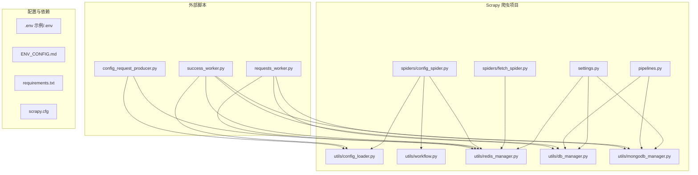
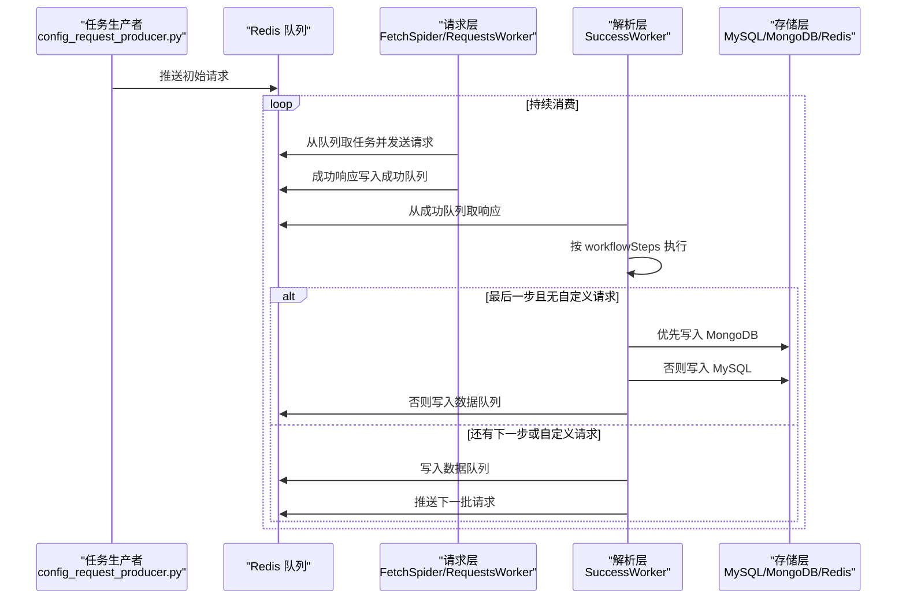
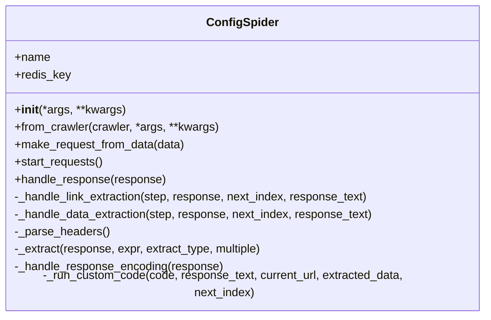
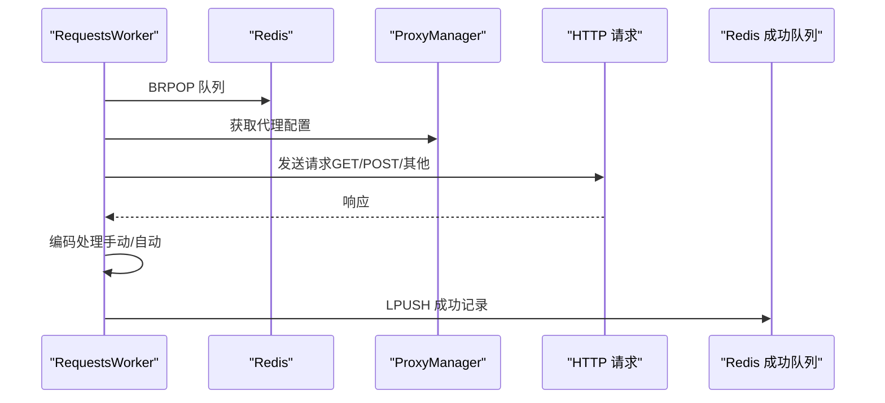
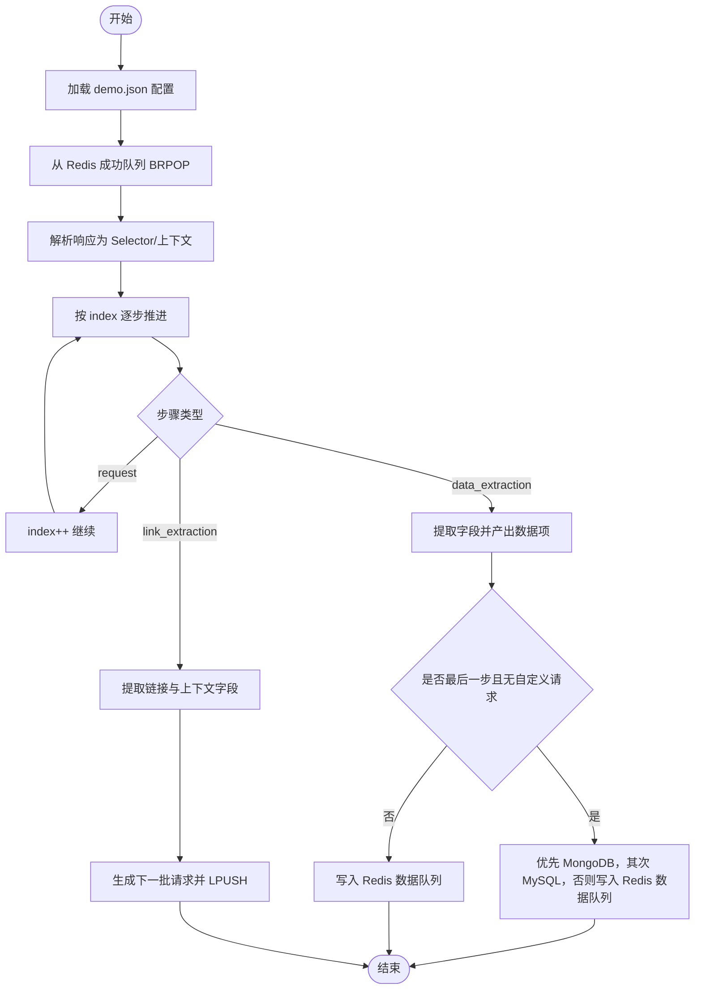
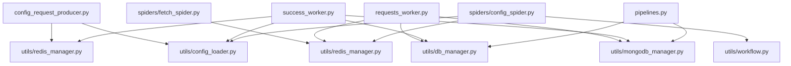

# 项目概述

<cite>
**本文引用的文件**
- [README.md](file://README.md)
- [ENV_CONFIG.md](file://ENV_CONFIG.md)
- [requirements.txt](file://requirements.txt)
- [crawler/settings.py](file://crawler/settings.py)
- [crawler/pipelines.py](file://crawler/pipelines.py)
- [crawler/spiders/config_spider.py](file://crawler/spiders/config_spider.py)
- [crawler/spiders/fetch_spider.py](file://crawler/spiders/fetch_spider.py)
- [crawler/utils/config_loader.py](file://crawler/utils/config_loader.py)
- [crawler/utils/workflow.py](file://crawler/utils/workflow.py)
- [crawler/utils/redis_manager.py](file://crawler/utils/redis_manager.py)
- [crawler/utils/db_manager.py](file://crawler/utils/db_manager.py)
- [crawler/utils/mongodb_manager.py](file://crawler/utils/mongodb_manager.py)
- [config_request_producer.py](file://config_request_producer.py)
- [requests_worker.py](file://requests_worker.py)
- [success_worker.py](file://success_worker.py)
</cite>

## 目录
1. [简介](#简介)
2. [项目结构](#项目结构)
3. [核心组件](#核心组件)
4. [架构总览](#架构总览)
5. [详细组件分析](#详细组件分析)
6. [依赖关系分析](#依赖关系分析)
7. [性能考量](#性能考量)
8. [故障排查指南](#故障排查指南)
9. [结论](#结论)
10. [附录](#附录)

## 简介
本项目是一个基于 Scrapy-Redis 的分布式爬虫系统，支持从配置文件或 MySQL 任务表读取任务，将数据保存到 MySQL 或 MongoDB。系统采用“请求层 + 解析层 + 存储层”的解耦设计，请求层负责从 Redis 消费任务并发送 HTTP 请求，解析层根据配置文件的 workflowSteps 顺序执行请求、链接提取、数据提取等步骤，存储层优先写入 MongoDB，其次写入 MySQL，最后才回退到 Redis 队列。

系统提供两种使用模式：
- 配置驱动爬虫：直接使用 Scrapy 的 RedisSpider，按 demo.json 的 workflowSteps 在爬虫内部完成解析与存储。
- 全链路 Redis：请求由 Scrapy 或 requests_worker 发送，成功结果写入 Redis 成功队列，success_worker 从 Redis 消费并按步骤推进，最终产出数据或继续生成下一批请求。

## 项目结构
项目采用“Scrapy 项目 + 外部脚本 + 工具模块”的组织方式：
- crawler：Scrapy 爬虫项目，包含 Spider、Item、Pipeline、Settings 以及工具模块
- 外部脚本：config_request_producer.py、requests_worker.py、success_worker.py 等，负责任务推送、请求发送、工作流解析与数据落库
- 配置与依赖：.env 示例、ENV_CONFIG.md、requirements.txt、scrapy.cfg 等

**图示来源**
- [crawler/settings.py](file://crawler/settings.py#L1-L54)
- [crawler/spiders/config_spider.py](file://crawler/spiders/config_spider.py#L1-L325)
- [crawler/spiders/fetch_spider.py](file://crawler/spiders/fetch_spider.py#L1-L100)
- [crawler/pipelines.py](file://crawler/pipelines.py#L1-L105)
- [crawler/utils/config_loader.py](file://crawler/utils/config_loader.py#L1-L16)
- [crawler/utils/workflow.py](file://crawler/utils/workflow.py#L1-L157)
- [crawler/utils/redis_manager.py](file://crawler/utils/redis_manager.py#L1-L345)
- [crawler/utils/db_manager.py](file://crawler/utils/db_manager.py#L1-L618)
- [crawler/utils/mongodb_manager.py](file://crawler/utils/mongodb_manager.py#L1-L323)
- [config_request_producer.py](file://config_request_producer.py#L1-L77)
- [requests_worker.py](file://requests_worker.py#L1-L327)
- [success_worker.py](file://success_worker.py#L1-L363)

**章节来源**
- [README.md](file://README.md#L1-L200)
- [requirements.txt](file://requirements.txt#L1-L17)

## 核心组件
- 配置驱动爬虫（ConfigSpider）：从 demo.json 读取任务与工作流，按步骤在爬虫内完成请求、链接提取、数据提取与存储。
- 请求爬虫（FetchSpider）：从 Redis 消费任务，发送 HTTP 请求，将响应写回 Redis 成功队列，不做解析。
- 请求工作器（RequestsWorker）：使用 requests 库替代 Scrapy 发送请求，功能与 FetchSpider 一致，适合轻量场景。
- 成功队列解析器（SuccessWorker）：从 Redis 成功队列消费响应，按 workflowSteps 推进，生成下一批请求或产出数据并持久化。
- 配置加载器（ConfigLoader）：校验并加载 demo.json 配置。
- 工作流执行器（WorkflowRunner）：通用的工作流执行逻辑，供爬虫与解析器复用。
- Redis 管理器（RedisManager）：统一管理 Redis 连接与队列操作。
- 数据库管理器（DatabaseManager）：统一管理 MySQL 连接与文章表写入。
- MongoDB 管理器（MongoDBManager）：统一管理 MongoDB 连接与集合写入。
- 管道（MySQLStorePipeline）：按优先级将数据写入 MongoDB 或 MySQL，否则写入 Redis 队列。

**章节来源**
- [crawler/spiders/config_spider.py](file://crawler/spiders/config_spider.py#L1-L325)
- [crawler/spiders/fetch_spider.py](file://crawler/spiders/fetch_spider.py#L1-L100)
- [requests_worker.py](file://requests_worker.py#L1-L327)
- [success_worker.py](file://success_worker.py#L1-L363)
- [crawler/utils/config_loader.py](file://crawler/utils/config_loader.py#L1-L16)
- [crawler/utils/workflow.py](file://crawler/utils/workflow.py#L1-L157)
- [crawler/utils/redis_manager.py](file://crawler/utils/redis_manager.py#L1-L345)
- [crawler/utils/db_manager.py](file://crawler/utils/db_manager.py#L1-L618)
- [crawler/utils/mongodb_manager.py](file://crawler/utils/mongodb_manager.py#L1-L323)
- [crawler/pipelines.py](file://crawler/pipelines.py#L1-L105)

## 架构总览
系统采用“请求层 + 解析层 + 存储层”三层协作：
- 请求层：FetchSpider 或 RequestsWorker 将 HTTP 请求结果写入 Redis 成功队列
- 解析层：SuccessWorker 从成功队列消费，按 workflowSteps 执行 request/link_extraction/data_extraction，必要时生成下一批请求
- 存储层：MySQLStorePipeline 优先写入 MongoDB，其次写入 MySQL，最后回退到 Redis 队列

**图示来源**
- [config_request_producer.py](file://config_request_producer.py#L1-L77)
- [crawler/spiders/fetch_spider.py](file://crawler/spiders/fetch_spider.py#L1-L100)
- [requests_worker.py](file://requests_worker.py#L1-L327)
- [success_worker.py](file://success_worker.py#L1-L363)
- [crawler/pipelines.py](file://crawler/pipelines.py#L1-L105)

## 详细组件分析

### 配置驱动爬虫（ConfigSpider）
- 职责：从 demo.json 读取任务与工作流，按步骤在爬虫内完成请求、链接提取、数据提取与存储
- 关键点：
  - 从命令行或环境变量读取 CONFIG_PATH
  - 从 demo.json 读取 taskInfo 与 workflowSteps
  - 根据 request 步骤的 headersMode/headersJson 设置请求头
  - 自动处理响应编码，支持手动编码与自动检测
  - 支持自定义代码生成下一批请求
- 公共接口：
  - 类名：ConfigSpider
  - 关键方法：make_request_from_data、start_requests、handle_response、_handle_link_extraction、_handle_data_extraction、_extract、_handle_response_encoding、_run_custom_code

**图示来源**
- [crawler/spiders/config_spider.py](file://crawler/spiders/config_spider.py#L1-L325)

**章节来源**
- [crawler/spiders/config_spider.py](file://crawler/spiders/config_spider.py#L1-L325)
- [crawler/utils/config_loader.py](file://crawler/utils/config_loader.py#L1-L16)
- [crawler/utils/workflow.py](file://crawler/utils/workflow.py#L1-L157)

### 请求爬虫（FetchSpider）与请求工作器（RequestsWorker）
- FetchSpider：继承 RedisSpider，从 Redis 队列消费任务，发送请求并将响应写回 Redis 成功队列
- RequestsWorker：独立脚本，使用 requests 库发送请求，功能与 FetchSpider 一致，支持代理、重试、编码处理与 Redis 操作
- 公共接口：
  - FetchSpider：make_request_from_data、parse
  - RequestsWorker：__init__、run_forever、_process_request、close

**图示来源**
- [crawler/spiders/fetch_spider.py](file://crawler/spiders/fetch_spider.py#L1-L100)
- [requests_worker.py](file://requests_worker.py#L1-L327)
- [crawler/utils/redis_manager.py](file://crawler/utils/redis_manager.py#L1-L345)

**章节来源**
- [crawler/spiders/fetch_spider.py](file://crawler/spiders/fetch_spider.py#L1-L100)
- [requests_worker.py](file://requests_worker.py#L1-L327)

### 成功队列解析器（SuccessWorker）
- 职责：从 Redis 成功队列消费响应，按 workflowSteps 执行 request/link_extraction/data_extraction，必要时生成下一批请求或产出数据
- 关键点：
  - 从 demo.json 读取配置，解析 headersMode/headersJson 作为默认请求头
  - 链接提取：按规则提取链接与上下文字段，生成下一批请求
  - 数据提取：按规则提取字段，产出数据项
  - 存储策略：优先 MongoDB，其次 MySQL，否则写入 Redis 数据队列
  - 自定义代码：支持 nextRequestCustomCode 生成额外请求
- 公共接口：
  - 类名：WorkflowProcessor
  - 关键方法：run_forever、process_record、_advance、_handle_link_extraction、_handle_data_extraction、_extract、_save_to_database、_save_to_mongodb、_run_custom_code

**图示来源**
- [success_worker.py](file://success_worker.py#L1-L363)
- [crawler/utils/config_loader.py](file://crawler/utils/config_loader.py#L1-L16)

**章节来源**
- [success_worker.py](file://success_worker.py#L1-L363)

### 配置加载器（ConfigLoader）与工作流执行器（WorkflowRunner）
- ConfigLoader：校验并加载 demo.json，确保包含 taskInfo 与 workflowSteps
- WorkflowRunner：通用工作流执行器，提供 initial_requests、handle_response、_handle_link_extraction、_handle_data_extraction、_extract、_run_custom_code 等

**章节来源**
- [crawler/utils/config_loader.py](file://crawler/utils/config_loader.py#L1-L16)
- [crawler/utils/workflow.py](file://crawler/utils/workflow.py#L1-L157)

### Redis 管理器（RedisManager）、数据库管理器（DatabaseManager）、MongoDB 管理器（MongoDBManager）
- RedisManager：统一管理 Redis 连接、队列操作（LPUSH/RPUSH/BRPOP/LLEN/EXISTS 等），支持从 URL/环境变量初始化，提供连接测试与脱敏日志
- DatabaseManager：统一管理 MySQL 连接与文章表写入，支持去重（基于链接哈希与内容哈希），提供查询、统计、删除等常用操作
- MongoDBManager：统一管理 MongoDB 连接与集合写入，支持去重（基于链接哈希与内容哈希），提供查询、统计、删除等常用操作

**章节来源**
- [crawler/utils/redis_manager.py](file://crawler/utils/redis_manager.py#L1-L345)
- [crawler/utils/db_manager.py](file://crawler/utils/db_manager.py#L1-L618)
- [crawler/utils/mongodb_manager.py](file://crawler/utils/mongodb_manager.py#L1-L323)

### 管道（MySQLStorePipeline）
- 职责：按优先级将数据写入 MongoDB 或 MySQL，否则写入 Redis 队列
- 关键点：初始化时尝试连接 MongoDB 与 MySQL，若都不可用则跳过保存；process_item 依次尝试 MongoDB、MySQL，失败时记录日志

**章节来源**
- [crawler/pipelines.py](file://crawler/pipelines.py#L1-L105)

## 依赖关系分析
- 外部依赖：Scrapy、Scrapy-Redis、Redis、MySQL（PyMySQL/SQLAlchemy）、MongoDB（PyMongo）、requests、BeautifulSoup4、pymongo、fastapi、uvicorn、pydantic、chardet 等
- 内部依赖：各组件通过 utils 模块共享 Redis、数据库、配置、编码等能力

**图示来源**
- [config_request_producer.py](file://config_request_producer.py#L1-L77)
- [crawler/spiders/fetch_spider.py](file://crawler/spiders/fetch_spider.py#L1-L100)
- [requests_worker.py](file://requests_worker.py#L1-L327)
- [success_worker.py](file://success_worker.py#L1-L363)
- [crawler/spiders/config_spider.py](file://crawler/spiders/config_spider.py#L1-L325)
- [crawler/pipelines.py](file://crawler/pipelines.py#L1-L105)
- [crawler/utils/config_loader.py](file://crawler/utils/config_loader.py#L1-L16)
- [crawler/utils/workflow.py](file://crawler/utils/workflow.py#L1-L157)
- [crawler/utils/redis_manager.py](file://crawler/utils/redis_manager.py#L1-L345)
- [crawler/utils/db_manager.py](file://crawler/utils/db_manager.py#L1-L618)
- [crawler/utils/mongodb_manager.py](file://crawler/utils/mongodb_manager.py#L1-L323)

**章节来源**
- [requirements.txt](file://requirements.txt#L1-L17)

## 性能考量
- 并发与延迟：可通过 demo.json 的 taskInfo.concurrency 与 requestInterval 控制并发与请求间隔，Scrapy Settings 中也提供默认值
- 连接池：MySQL 使用 SQLAlchemy 连接池，可配置 pool_size 与 max_overflow
- 编码处理：自动检测与手动指定编码相结合，减少乱码导致的解析失败
- 代理：支持静态与动态代理，动态代理可配置刷新间隔，降低封禁风险
- 队列监控：通过 Redis 队列长度监控任务积压情况，及时调整并发与速率

[本节为通用指导，无需列出具体文件来源]

## 故障排查指南
- Redis 连接失败：检查 REDIS_URL 格式与密码，确认 .env 文件或系统环境变量
- MySQL 连接失败：检查主机、端口、用户、密码、数据库名与字符集，确认连接池配置
- 爬虫不工作：确认 Redis 队列中有任务，查看日志级别，检查配置文件格式
- 数据未保存：检查 ITEM_PIPELINES 配置，确认 MongoDB 与 MySQL 可用性，查看错误队列

**章节来源**
- [README.md](file://README.md#L408-L454)
- [ENV_CONFIG.md](file://ENV_CONFIG.md#L327-L375)

## 结论
本项目通过“请求层 + 解析层 + 存储层”的解耦设计，提供了灵活的分布式爬虫方案。既可直接在 Scrapy 内部完成解析与存储，也可将解析与存储解耦到外部脚本，便于横向扩展与定制。通过统一的配置文件与工具模块，系统具备良好的可维护性与可扩展性。

[本节为总结性内容，无需列出具体文件来源]

## 附录

### 常见用例
- 使用配置驱动爬虫：读取 demo.json，按 workflowSteps 在爬虫内完成解析与存储
- 使用全链路 Redis：config_request_producer 推送初始请求，FetchSpider 或 RequestsWorker 发送请求，SuccessWorker 解析并持久化
- 仅请求模式：不解析内容，直接保存响应到 Redis，后续由 SuccessWorker 处理

**章节来源**
- [README.md](file://README.md#L136-L203)

### 配置项与参数
- 环境变量（优先级：系统环境变量 > .env > 默认值）
  - Redis：REDIS_URL
  - MySQL：MYSQL_HOST、MYSQL_PORT、MYSQL_USER、MYSQL_PASSWORD、MYSQL_DB、MYSQL_CHARSET、MYSQL_POOL_SIZE、MYSQL_POOL_MAX_OVERFLOW
  - 日志：LOG_LEVEL
  - 队列键：SCRAPY_START_KEY、SUCCESS_QUEUE_KEY、SUCCESS_ITEM_KEY、SUCCESS_ERROR_KEY
  - 配置文件：CONFIG_PATH
  - 请求工作器：REQUESTS_TIMEOUT、REQUESTS_MAX_RETRIES、REQUESTS_RETRY_DELAY、REQUESTS_SLEEP
  - 数据库类型：ARTICLE_DB_TYPE（mysql/mongodb）
  - MongoDB：MONGODB_URI、MONGODB_DB、MONGODB_COLLECTION
  - 代理：PROXY_MODE、HTTP_PROXY、HTTPS_PROXY、SOCKS_PROXY、DYNAMIC_PROXY_API、DYNAMIC_PROXY_API_METHOD、DYNAMIC_PROXY_REFRESH_INTERVAL

**章节来源**
- [README.md](file://README.md#L203-L233)
- [ENV_CONFIG.md](file://ENV_CONFIG.md#L1-L375)